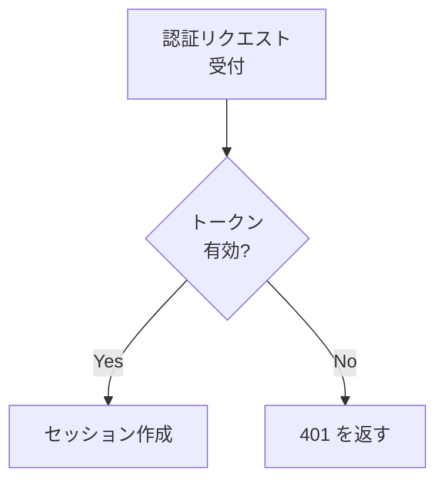
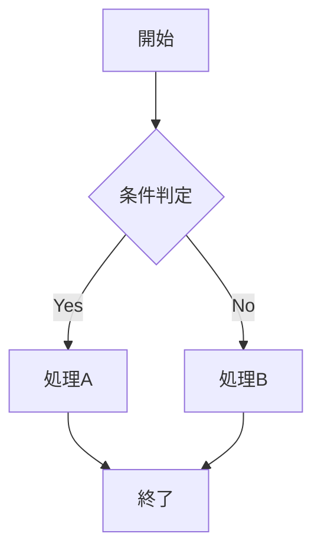
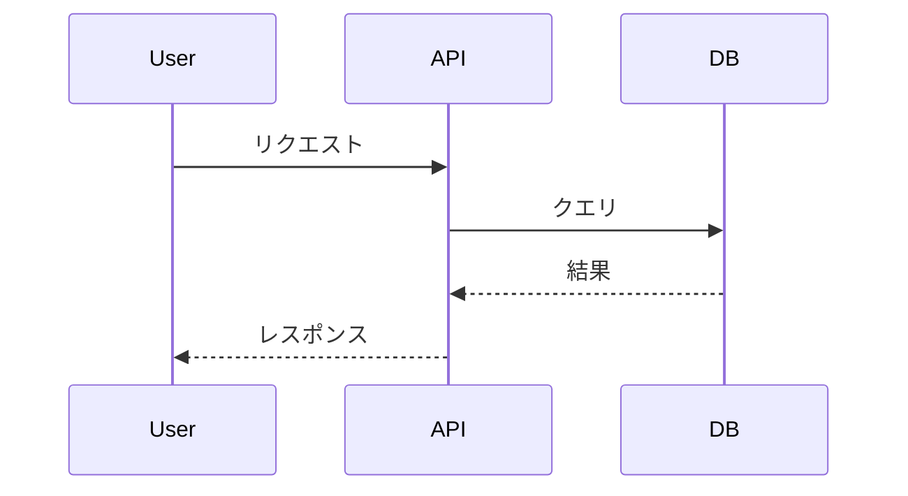
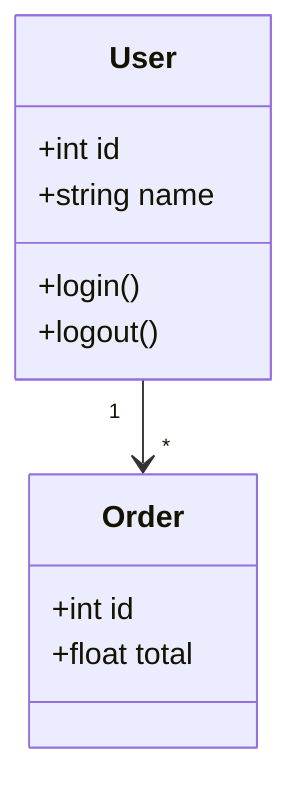
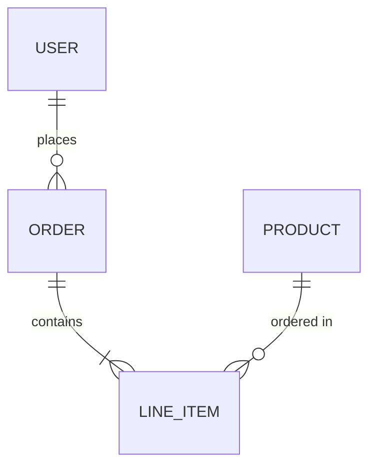
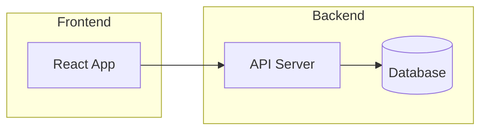
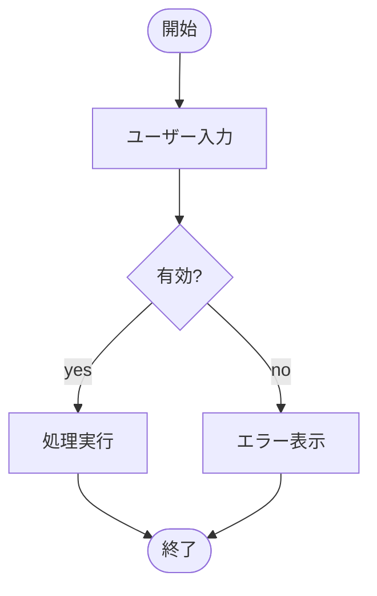
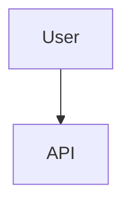

# 図表作成ガイド

## 使ってよい形式

GitHub がコードフェンスから直接レンダリングする形式だけを使う。図のソースが本文に残るため、
差分でレビューでき、図と記述の乖離にも気づける。

| 用途 | 書き方 |
|---|---|
| フロー / シーケンス / ER / 状態遷移 / クラス | ` ```mermaid ` |
| 数式 | ` ```math ` または `$…$` / `$$…$$`（MathJax） |
| 地図 | ` ```geojson ` / ` ```topojson ` |
| 3Dモデル | ` ```stl `（ASCII STL） |

## mermaid 記法

### 横幅と文字サイズ

mermaid は図の自然幅が本文幅を超えると、図全体を縮小して収める。文字も一緒に縮むため、横に長い図は文字が読めなくなる。縦に長い図は縮小されないので、文字サイズに影響しない。

**横方向に並べる要素は3個までとする。**

日本語ラベル（6文字程度）のノードは1個あたり約215px を消費する。本文幅と実効文字サイズの関係は以下（本文16px 基準の実測値）。

| 横方向のノード数 | 図の自然幅 | GitHub（本文890px） | Notion（本文708px） |
|---|---|---|---|
| 3個 | 611px | 16px | 16px |
| 4個 | 826px | 16px | 13.7px |
| 5個 | 1041px | 13.7px | 10.9px |
| 6個 | 1255px | 11.3px | 9.0px |
| 7個 | 1470px | 9.7px | 7.7px |

GitHub は5個から、Notion は4個から縮小が始まる。Notion に貼る前提の文書では**3個**を上限とする。

縮小はノード数ではなく**幅**で決まるため、ラベルが長いほど早く限界が来る。`[Step1]` のような短いラベルなら1個あたり約152px で、GitHub なら6個まで等倍を保てる。

超える場合の対処:

| 対処 | 方法 |
|------|------|
| 向きを変える | `graph LR` をやめて `graph TD`（縦方向）にする。縦方向は何段あっても文字が縮まない |
| ラベルを短くする | ノード幅はラベル文字数で決まる。`<br/>` で改行して幅を抑える |
| 図を分割する | 1つの図に詰め込まず、関心事ごとに複数の図へ分ける |



シーケンス図は participant 数が横幅を決め、1個あたり約200px を消費する。**GitHub で4個、Notion で3個**を上限とし、超えるならフェーズごとに図を分割する。

### フローチャート



### シーケンス図



### クラス図



### ER図



### コンポーネント図

`subgraph` でグループを表現する。



### アクティビティ図



## その他の GitHub ネイティブ形式

コードフェンスから直接レンダリングされる。図のソースが本文に残るのでレビューできる。

### 数式（MathJax）

ブロックは ` ```math ` または `$$…$$`、インラインは `$…$`。

```math
\sigma = \sqrt{\frac{1}{N}\sum_{i=1}^{N}(x_i - \mu)^2}
```

### 地図

` ```geojson ` / ` ```topojson ` でインタラクティブな地図になる。

### 3Dモデル

` ```stl ` に ASCII STL を書くと、回転・ズームできるビューアになる。

## 使わないもの

| | 理由 |
|---|---|
| plantUML | GitHub がレンダリングしない。外部レンダリングサーバの画像 URL に依存し、図のソースが差分に残らない |
| HTML | GitHub 上ではソース表示になりレビューできない |
| インライン `<svg>` | レンダラに除去され、図が消える |

mermaid で表現しきれない自由レイアウトの図に限り、SVG をコミットして `` で参照する。インラインでなくなるため、図と記述の乖離に気づけない点を承知の上で使う。

## ASCII 許可例（ツリーのみ）

ディレクトリ構造はASCIIで表現可能:

```
project/
├── src/
│   ├── components/
│   └── utils/
├── tests/
└── docs/
```

## よくある間違い

### 避けるべき: ASCII ARTで図を描く

```
    ┌─────────┐
    │  User   │
    └────┬────┘
         │
    ┌────▼────┐
    │   API   │
    └─────────┘
```

上記のような図は **mermaid** で描いてください:



### 避けるべき: 順序prefixなしで分割

```
docs/
├── introduction.md  ← NG: prefixがない
├── setup.md
└── usage.md
```

正しい方法:

```
docs/
├── 01-introduction.md  ← OK
├── 02-setup.md
└── 03-usage.md
```

## ベストプラクティス

| DO | DON'T |
|----|-------|
| mermaid で図を描く | ASCII ARTで図を描く / plantUML を使う |
| 横方向は3個まで（`graph TD` で縦に伸ばす） | 横に長い図にして文字を潰す |
| 図はインラインで書く | 外部サービスの画像URLを貼る |
| 300行以内に収める | 1000行超の巨大ファイル |
| 順序prefixで分割 | prefixなしで分割 |
| 2桁パディング（01-, 02-） | 1桁（1-, 2-） |
