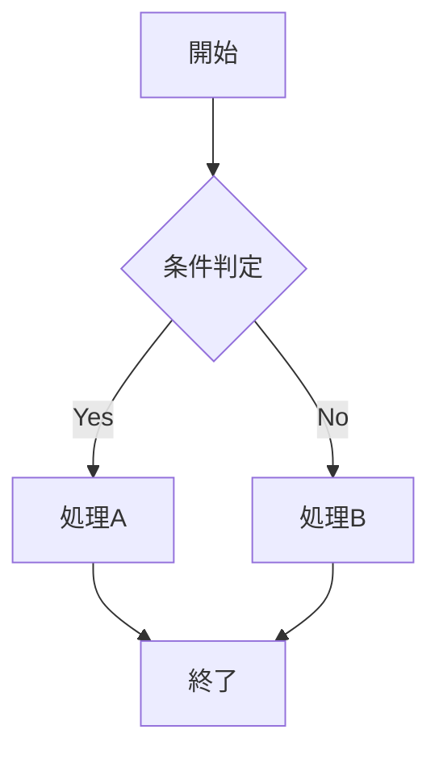
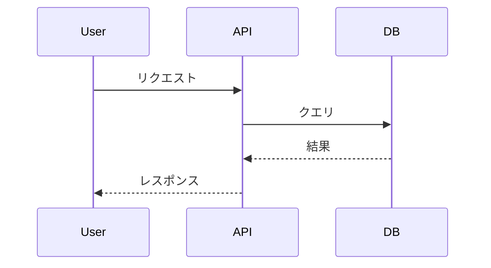
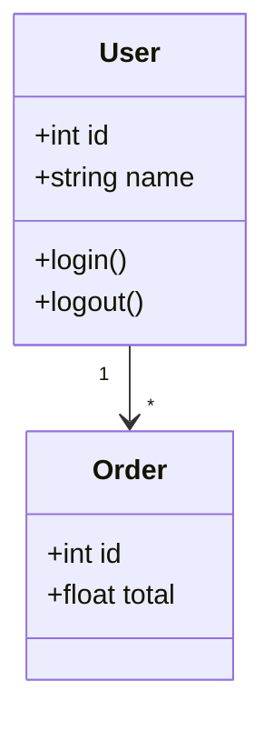
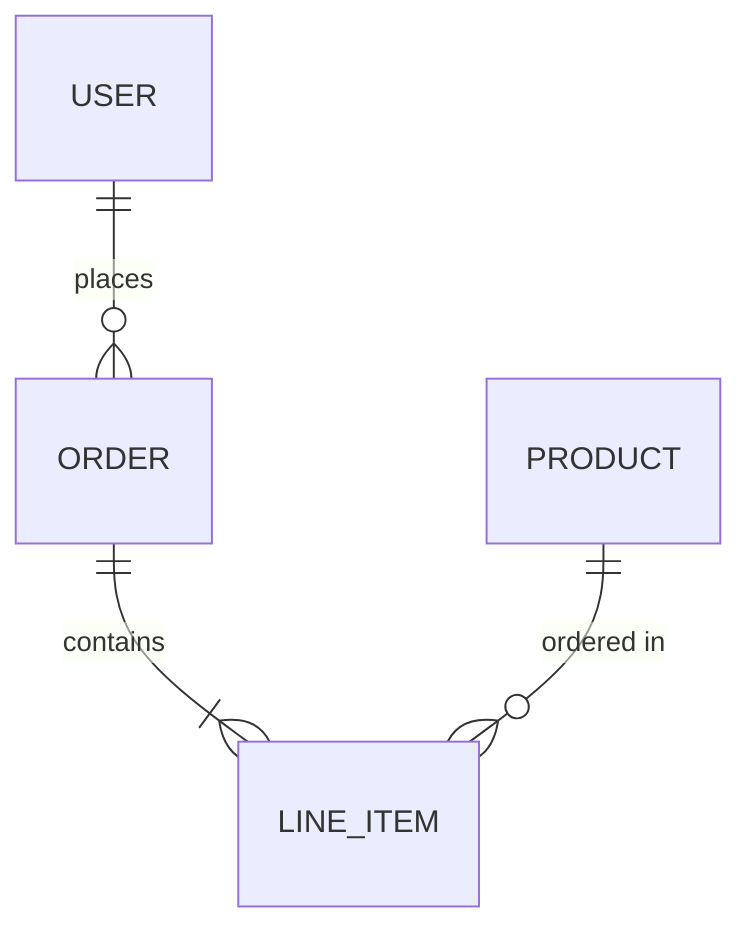
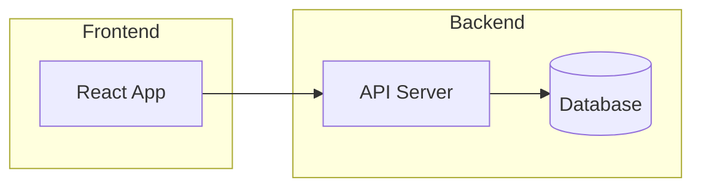
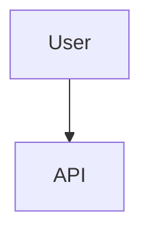

# 図表作成ガイド

## mermaid 記法

### フローチャート



### シーケンス図



### クラス図



### ER図



### コンポーネント図

`subgraph` でグループを表現する。



### アクティビティ図


## その他の GitHub ネイティブ形式

コードフェンスから直接レンダリングされる。図のソースが本文に残るのでレビューできる。

### 数式（MathJax）

ブロックは ` ```math ` または `$$…$$`、インラインは `$…$`。

```math
\sigma = \sqrt{\frac{1}{N}\sum_{i=1}^{N}(x_i - \mu)^2}
```

### 地図

` ```geojson ` / ` ```topojson ` でインタラクティブな地図になる。

### 3Dモデル

` ```stl ` に ASCII STL を書くと、回転・ズームできるビューアになる。

## 使わないもの

| | 理由 |
|---|---|
| plantUML | GitHub がレンダリングしない。外部レンダリングサーバの画像 URL に依存し、図のソースが差分に残らない |
| HTML | GitHub 上ではソース表示になりレビューできない |
| インライン `<svg>` | レンダラに除去され、図が消える |

mermaid で表現しきれない自由レイアウトの図に限り、SVG をコミットして `` で参照する。インラインでなくなるため、図と記述の乖離に気づけない点を承知の上で使う。

## ASCII 許可例（ツリーのみ）

ディレクトリ構造はASCIIで表現可能:

```
project/
├── src/
│   ├── components/
│   └── utils/
├── tests/
└── docs/
```

## よくある間違い

### 避けるべき: ASCII ARTで図を描く

```
    ┌─────────┐
    │  User   │
    └────┬────┘
         │
    ┌────▼────┐
    │   API   │
    └─────────┘
```

上記のような図は **mermaid** で描いてください:



### 避けるべき: 順序prefixなしで分割

```
docs/
├── introduction.md  ← NG: prefixがない
├── setup.md
└── usage.md
```

正しい方法:

```
docs/
├── 01-introduction.md  ← OK
├── 02-setup.md
└── 03-usage.md
```

## ベストプラクティス

| DO | DON'T |
|----|-------|
| mermaid で図を描く | ASCII ARTで図を描く / plantUML を使う |
| 図はインラインで書く | 外部サービスの画像URLを貼る |
| 300行以内に収める | 1000行超の巨大ファイル |
| 順序prefixで分割 | prefixなしで分割 |
| 2桁パディング（01-, 02-） | 1桁（1-, 2-） |
