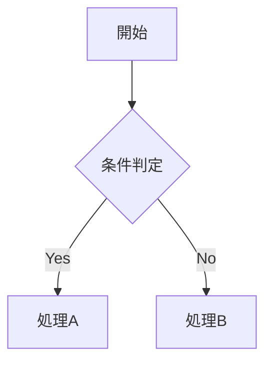

# Markdown Writing Skill

読み手は**その場の会話・コードベース・検討過程を知らない第三者**（社外・レビュアー・将来の担当者）である、という前提で書く。

適用対象: 仕様書 / 設計書 / README / OpenAPI 説明 / PR タイトル・本文 / コミットメッセージ / 調査レポート / 実装プラン / レビューコメント。

## 重要ルール

### 1. 説明文に内部識別子・略語を持ち込まない

**テーブル名・カラム名・クラス名などの内部識別子や、その場で作った略語を、説明文の主語・目的語に使わない。**

「何のために」「何をやったか」を説明する文でこれらを使うと、読み手が識別子の意味を知っている前提になり、**書いた側は説明した気になり、読み手には何も伝わらない**。

| | 例 |
|---|---|
| ❌ Bad | `user_subscriptions` の `plan_id` を更新し、us と sp を再生成する |
| ✅ Good | 利用者の契約プランを変更し、請求明細を作り直す |
| ❌ Bad | lcr がないと provisional に fallback する |
| ✅ Good | 計算結果の控えが無い場合は、現在のマスタ値を参照する |

**識別子を書いてよい場所**（むしろ書くべき）:

- コードブロック・差分・スキーマ定義・SQL
- 「どこを直したか」の指し示し（`app/Services/Foo.php:120` / 変更ファイル一覧）
- 調査レポートのエビデンスブロック（クエリと実行結果）
- 用語を導入する目的で、業務用語に括弧書きで添える場合

**やること**:

- 説明は業務用語・日本語で書き、識別子は必要なら括弧で添える（例: 「請求明細（`billing_details`）」）
- 同じ文書で識別子を繰り返し使うなら、冒頭に**用語の対応表**を置き、本文は業務用語で通す
- 略語は初出で正式名称を併記する。会話中に作ったローカル略称は文書に持ち込まない
- プロジェクトに用語集（`terminology` skill、`docs/` の用語定義、UI ラベルの翻訳ファイル等）があれば、そこの表記に合わせる

### 2. 検討過程の痕跡を残さない

作成者とその場の相談相手（AI との対話含む）だけに通じるラベルや言い回しは、第三者には意味不明なので本文に書かない。

- 検討時の選択肢ラベル（「案A / 案B」「Option A」「パターン1」などの符丁）
- 「今回の相談で」「壁打ちの結果」「先ほど決めた」など会話由来の指示語
- 不採用にした代替案との比較を、比較のためだけに残すこと

**やること**: 決まった内容を、ラベルなしで断定形で書く。「なぜそうするか」は理由として本質的なものだけを一般的な言葉で残す。

### 3. 変更履歴を本文に残さない

指摘を受けて直した場合でも、**修正の経緯そのもの**を本文に含めない。

- 「以前は X だったが、指摘を受けて Y に変更した」式の記述
- 「〜という誤りがあったため修正」「レビュー対応で追加」などの由来説明
- 却下された案の残骸

**やること**: 現時点で正しい確定情報だけを書く。変更理由・経緯はコミットメッセージ / PR 説明 / レビュー返信に置く（git 履歴に残るので本文で二重に持たない）。

- **stale 化防止**: 「以前は〜」式の履歴は、さらに変更が入ると二重に古くなる
- **責務分離**: 「何が正か」は文書、「なぜ変えたか」は git / PR

### 4. 否定的な結論にはエビデンスを添える

「存在しない」「呼ばれていない」「データがない」「影響がない」といった**否定的な結論**は、読み手が最も検証しづらく、外れたときの被害が大きい。**必ず実行結果を根拠として添える。**

| 主張 | 添えるエビデンス |
|---|---|
| カラム / テーブルが存在しない | スキーマ照会の実行結果 |
| データが存在しない | 件数クエリの実行結果 |
| どこからも呼ばれていない | 検索コマンドと結果（呼び出し元を辿った経路） |
| 影響範囲がない | 洗い出した対象の一覧と、それぞれの判定 |

やってはいけないこと:

- コードを読んだだけで「無い」と断定する
- エビデンスなしで残課題の優先度を下げる
- 一部だけ見て「他にはない」と判断する

確認しきれなかったことは、**「未確認・残リスク」として明示的に残す**。書かずに省くと「確認済み」と読まれる。

### 5. 個人情報・機密情報を書かない

文書・PR 本文・コミットメッセージ・添付ファイルに、実在の個人を特定できる情報や認証情報を含めない。コミットメッセージとマージ済み PR 本文は**後から消しにくく、履歴に残る**。

- 氏名（フルネーム）/ 電話番号 / メールアドレス / 住所 / 生年月日
- 個体を特定できる番号（車台番号、シリアル、口座番号など）
- 認証情報・トークン・接続文字列
- エクスポートしたままの実データ（CSV / XLSX / スクリーンショット）

**やること**: 主キー・管理番号・記号（「対象A」「①」）で参照する。実データが必要なら社内アクセス制限のある場所に置き、文書には URL とサマリだけ書く。

### 6. 図表作成ルール

**図はインラインで書く。** GitHub がコードフェンスから直接レンダリングする形式だけを使う。図のソースが本文に残るため、差分でレビューでき、図と記述の乖離にも気づける。

| 用途 | 書き方 |
|---|---|
| フロー / シーケンス / ER / 状態遷移 / クラス | ` ```mermaid ` |
| 数式 | ` ```math ` または `$…$` / `$$…$$`（MathJax） |
| 地図 | ` ```geojson ` / ` ```topojson ` |
| 3Dモデル | ` ```stl `（ASCII STL） |



- 状態の対比（修正前 vs 後 / 期待 vs 実態 / 環境 A vs B）や定義の列挙は、図ではなく Markdown の**表**
- **ディレクトリツリーは ASCII でよい**（`├──` / `└──` の罫線）。テキストのまま貼れて差分も追いやすく、図に置き換える利点がない
- それ以外を ASCII ART で描かない

```
src/
├── handlers/
│   └── webhook.ts
└── index.ts
```

**使わないもの**:

- **HTML** — GitHub 上ではソース表示になりレビューできない
- **plantUML** — GitHub はレンダリングしない。外部レンダリングサーバの画像 URL に依存することになり、図のソースが差分に残らない
- **インライン `<svg>`** — レンダラに除去される

mermaid で表現しきれない自由レイアウトの図がどうしても要る場合に限り、SVG をコミットして `` で参照する。インラインではなくなるため、図と記述の乖離に気づけない点を承知の上で使う。

### 7. 文書の長さと分割ルール

| 行数 | 対応 |
|---------|-----|
| ~300行 | そのまま |
| 301~500行 | 内容によっては単一ファイルのままでよい（下記の判断基準） |
| 501行以上 | セクションごとに分割 |

300行を超えても、**分割すると読み手の理解が落ちる**場合は単一ファイルのままにする。

- 通しで読んで初めて意味が通る一連の説明（手順書、設計の導出過程）
- 分量の大半が表・コードブロックで、文章としての密度が低い
- 相互参照が多く、分割すると行ったり来たりが増える

逆に、独立して読める単位が明確にあるなら300行以下でも分割してよい。

**分割時のファイル名**: 順序prefix（01-, 02-, ...）+ ケバブケース

```
docs/feature-guide/
├── 01-introduction.md
├── 02-installation.md
└── 03-usage.md
```

## 書き終えたらセルフチェック

**識別子と略語の混入**（説明文の中に裸で出ていないか。コードブロック内のヒットは無視してよい）:

```bash
grep -nE '[a-z]+_[a-z0-9_]{2,}' <対象ファイル>
```

**検討痕跡・変更履歴の混入**（プロジェクトやその場の符丁に応じて語を足す）:

```bash
grep -nE '案 ?[A-Z]|Option ?[A-Z]|パターン[0-9]|今回|壁打ち|以前は|当初は|に変更|指摘を受け|レビュー対応|誤りのため' <対象ファイル>
```

ヒットしたら、業務用語での説明・最終確定形の記述に置き換える。

## チェックリスト

- [ ] 説明文がテーブル名 / カラム名 / ローカル略語ではなく業務用語で書かれている
- [ ] 略語は初出で正式名称を併記している
- [ ] 検討過程のラベル（案A / Option A 等）と会話由来の指示語が残っていない
- [ ] 「以前は〜だったが変更した」式の経緯が本文に残っていない
- [ ] 否定的な結論に実行結果のエビデンスが添えられている
- [ ] 未確認事項が「残リスク」として明示されている
- [ ] 個人情報・認証情報・実データが含まれていない
- [ ] 図はインライン（mermaid / math / geojson / stl）で書いている（ディレクトリツリーはASCIIでよい）
- [ ] plantUML / HTML / インライン`<svg>` を使っていない
- [ ] ファイル長は300行以内（301~500行は内容次第で可、501行以上は分割）
- [ ] 分割時は順序prefix使用（01-, 02-, ...）

## 詳細ガイド

| ファイル | 内容 |
|---------|------|
| `01-diagram-guide.md` | mermaid 記法、その他の GitHub ネイティブ形式、よくある間違い |

## 関連リソース

- [Mermaid公式ドキュメント](https://mermaid.js.org/)
- [GitHub: Creating diagrams](https://docs.github.com/en/get-started/writing-on-github/working-with-advanced-formatting/creating-diagrams)
- [GitHub: Writing mathematical expressions](https://docs.github.com/en/get-started/writing-on-github/working-with-advanced-formatting/writing-mathematical-expressions)
