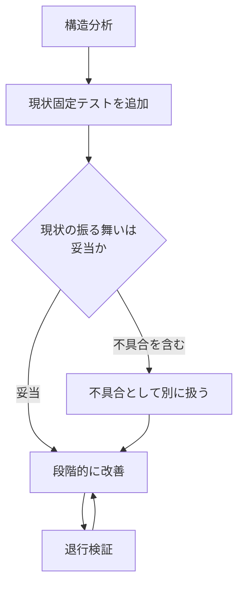

# 安全な構造改善

**テストがなければ、それは構造改善ではなく単なる編集である。** 振る舞いが変わっていない
ことを示す手段がない書き換えは、この Skill の対象外として扱う。

この工程は**レビューと同じく、実装のあとに必ず通す**。動くコードが出た時点では整理が済んで
いないことを前提に置き、**今回の変更が触れた範囲に見つけたスメルは直す**。見送るのは
[references/code-smells.md](references/code-smells.md) の「スメルに手を付けない場合」に
当てはまるときだけで、そのときは理由を残す。

## 最初に決める 2 つのこと

### 1. 機能変更と構造改善を混ぜない

同じ差分に両方を入れると、レビュアーは「意図した振る舞いの変更」と「構造改善の事故」を
区別できない。

```text
❌ 機能追加と同時に周辺を整理した 1 つのコミット
✅ コミット A: 構造改善（振る舞い不変。既存テストが通る）
   コミット B: 機能追加（新しいテストが増える）
```

順序は **構造改善 → 機能変更** を既定とする。先に整理すると機能変更の差分が小さくなる。
ただし整理の必要性が機能変更を通して初めて分かった場合は、機能変更を先に通し、構造改善を
別の差分に切り出してもよい。

### 2. テストの有無で手順を分ける

| 状況 | 進め方 |
| --- | --- |
| 対象コードに振る舞いを担保するテストがある | 下の「テストがある場合」 |
| テストがない・少ない・実装詳細に結合している | 下の「テストが乏しい既存コード」 |

判定は行数ではなく **これから変える経路がテストで通っているか**で行う。カバレッジの
数値ではなく、実際にその関数を通すテストがあるかを確認する。

## テストがある場合

1. **変更前に既存テストを実行する。** ここで落ちているものがあれば、先に報告する
2. スメルを 1 つ選ぶ（一覧は [references/code-smells.md](references/code-smells.md)）
3. 対応する手法を選ぶ（[references/refactoring-catalog.md](references/refactoring-catalog.md)。
   スメル一覧で ★ が付いた手法はカタログに項目がなく、一覧の記述だけで進めてよい）。
   分岐・反復・定数を**何にどう置き換えるか**は
   [references/data-representation.md](references/data-representation.md) で決める
4. **1 手だけ適用する**
5. テストを実行する。落ちたら直前の 1 手を戻す
6. 通ったらコミットする（1 手 = 1 コミットを既定とする）
7. 2 へ戻る

一度に複数のスメルへ手を入れない。落ちたときに原因を切り分けられなくなる。

## テストが乏しい既存コード

振る舞いを変えないことを示す手段がないため、**先に手段を作る**。



### 1. 構造分析

変更対象の入口・出口・依存を洗い出す。この段階ではコードを直さない。

| 調べること | 目的 |
| --- | --- |
| 公開されている入口（呼び出し元） | 固定すべき振る舞いの範囲 |
| 外部への副作用（DB・ファイル・通信・時刻） | テストで置き換える対象 |
| 分岐の条件 | 固定テストで通すべき経路 |
| 呼び出し元の数 | 改善の影響範囲 |

### 2. 現状固定テストを追加する

手順は [references/characterization-tests.md](references/characterization-tests.md)。
**現状の出力を正解として記録する**テストであり、正しさを主張しない点が通常のテストと違う。

### 3. 現状の振る舞いが妥当かを判断する

固定テストを書くと、既存の不具合が「正解」として固定されることがある。気づいた時点で
次のどちらかにする。

- **不具合として別に扱う**（固定テストにコメントで印を付け、修正は別の変更で行う）
- 直ちに直す必要がある場合は、構造改善を止めて `problem-solving` へ移る

構造改善のついでに振る舞いを直さない。直すなら、そのための差分を分ける。

### 4. 段階的に改善する

小さな安全な状態を積み上げる。1 手ごとに固定テストを実行し、通った状態でコミットする。
途中で止めても壊れていない状態を保つ。

### 5. 退行検証

改善が一段落したら、固定テストに加えて次を確認する。

- 対象の入口を通る既存テスト（あれば）
- 公開インタフェースの入出力が変わっていないこと
- 性能が明らかに悪化していないこと（ループの入れ替えや呼び出し回数の増加）

## 途中で止める条件

次のいずれかに当てはまったら、そこで止めて報告する。

- 固定テストが書けない（副作用が分離できない、実行に外部環境が要る）
- 1 手で終わらず、テストを通すために本番コードの分岐を足す必要が出た
- 改善の途中で仕様の不明点が出た（`requirements-design` へ戻る）
- 差分が依頼範囲を超えて広がった

止めたときは「どこまで安全な状態か」を明示する。中途半端な状態を「あとで直す」前提で
残さない。

## 差分の切り方

| 内容 | 分け方 |
| --- | --- |
| 改名・移動のみ | 単独の差分にする（レビューが機械的に済む） |
| 抽出・分割 | 1 手ごとにコミット |
| 依存の向きの変更 | 単独の差分。影響範囲を本文に書く |
| 機能変更 | 別のコミット、望ましくは別の PR |

改名と中身の変更を同じコミットに入れると、差分が全書き換えとして表示され、レビューが
成立しない。

## 参照

- [references/code-smells.md](references/code-smells.md) — 構造改善の起点になる兆候
- [references/refactoring-catalog.md](references/refactoring-catalog.md) — 手法と適用条件
- [references/data-representation.md](references/data-representation.md) — 分岐・反復・定数を何にどう置き換えるか
- 言語ごとの手段 — **対象の言語のファイルだけを読む**
  - [references/lang-python.md](references/lang-python.md)
  - [references/lang-javascript.md](references/lang-javascript.md)
  - [references/lang-typescript.md](references/lang-typescript.md)
  - [references/lang-php.md](references/lang-php.md)
  - 一覧にない言語は、`data-representation.md` の判定表から自分で対応付ける
- [references/characterization-tests.md](references/characterization-tests.md) — 現状固定テストの作り方
