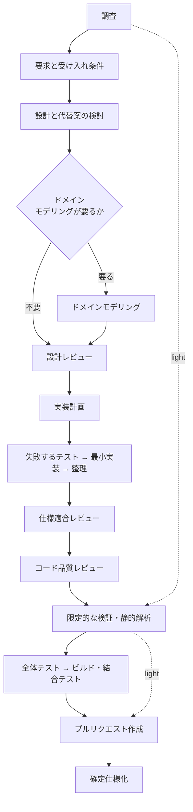

# 開発ワークフローの振り分け

変更内容を 4 つのモードへ分類し、必要な工程だけを起動する。**全変更にフル工程を課さない。**

**判定基準を持つのはこの Skill だけである。** 他の Skill とエージェント定義は判定結果を
受け取る側に徹する。同じ基準を複数箇所へ書くと、モードを追加・変更したときに片方だけが
古くなる。

## 判定の手順

### 1. 変更対象を確認する

```bash
git status --short
git diff --stat            # 変更済みなら
```

依頼文だけで判定しない。**実際に触るファイルと、触る理由**で決める。

### 2. 上から順に条件を判定する

最初に該当したモードを採る。複数に当てはまる場合は**上のモードが勝つ**。

| 順 | モード | 該当条件（いずれか 1 つで該当） |
| --- | --- | --- |
| 1 | `architecture` | 公開インタフェース（API・イベント・コマンド）の追加・変更・削除 / 既存データの移行を伴うスキーマ変更（列の削除・改名・型変更など） / 認証・認可の変更 / 複数モジュールにまたがる変更 / 重要なドメインルールの追加・変更 |
| 2 | `legacy-refactor` | 振る舞いを変えず構造を変える変更で、対象にテストがない・少ない |
| 3 | `standard` | 振る舞いの追加・変更、バグ修正 / 振る舞いを変えない構造変更で、対象にテストが十分にある |
| 4 | `light` | 文言・書式・コメント・ドキュメント・静的な設定値のみで、振る舞いが変わらない |

スキーマ変更のうち、既存データの移行が不要な追加（インデックスの追加、既定値付き
NULL 許容列の追加）は `standard` として扱う。判定に迷う場合と境界事例は
[references/workflow-modes.md](references/workflow-modes.md) を参照する。

### 3. 判定結果を出力する

呼び出し側（エージェント・他の Skill・利用者）が**判定結果だけを受け取れる形式**で返す。

```text
mode: standard
根拠: 注文確定の振る舞いを変更する。公開 API とスキーマは変えない
必須工程: requirements-design → implementation-plan → tdd-cycle → safe-refactoring（必要な場合）
  → pr-review → quality-gates → plan-to-spec（仕様が変わった場合）
```

判定基準の本文を出力へ貼らない。呼び出し側が基準を写し取ると、この Skill が唯一の
置き場所である前提が崩れる。

## モードと必須工程

| モード | 対象 | 必須工程 |
| --- | --- | --- |
| `light` | 文言、ドキュメント、設定、振る舞いを変えない局所変更 | 成功条件の確認、対象範囲の確定、限定的な検証と静的解析 |
| `standard` | 一般的な機能追加・バグ修正、テストが十分にある構造改善 | 仕様、計画、テスト駆動、小規模な整理、レビュー、全体検証 |
| `architecture` | 公開インタフェース、移行を伴うスキーマ変更、認証、複数モジュール、重要なドメイン変更 | ドメインモデリング、設計判断の記録、設計レビュー、テスト駆動、契約テストと結合テスト、相互レビュー |
| `legacy-refactor` | テストが少ない既存コードの振る舞い維持型改善 | 構造分析、現状固定テスト、段階的改善、退行検証 |

## モードごとに起動する Skill

| 工程 | `light` | `standard` | `architecture` | `legacy-refactor` |
| --- | --- | --- | --- | --- |
| 要求と受け入れ条件 | — | `requirements-design` | `requirements-design` | — |
| 設計 | — | — | 設計レビュー（Release 2 で有効化） | — |
| 計画 | — | `implementation-plan` | `implementation-plan` | `implementation-plan` |
| 実装 | 直接編集 | `tdd-cycle` | `tdd-cycle` | `safe-refactoring` |
| 構造改善 | — | `safe-refactoring`（必要な場合） | `safe-refactoring`（必要な場合） | `safe-refactoring` |
| レビュー | — | `pr-review` | `cross-review` | `pr-review` |
| 完了判定 | `quality-gates` | `quality-gates` | `quality-gates` | `quality-gates` |
| 確定仕様化 | — | `plan-to-spec`（仕様が変わった場合） | `plan-to-spec` | — |

レビュー段階は**明示的に呼ぶ**。自然文で「レビューして」と依頼すると、Claude Code では
組み込みの `code-review` が起動して判定の投稿経路が変わる。

## 標準フロー



`light` モードは破線の経路（A → K → L）のみを通る。**N の全体テストと結合テストは通らない**
（K は変更箇所を 1 度実行する限定的な検証と静的解析だけを指す）。

## `architecture` モードの現状

設計品質の 3 Skill（設計レビュー、ドメインモデリング、クラス設計）は**まだ導入されていない**。
そのため現時点の `architecture` モードは、次のように縮退した形で動く。

| 工程 | 現状 |
| --- | --- |
| ドメインモデリング | 専用 Skill なし。用語・不変条件を `requirements-design` の仕様へ書く |
| 設計判断の記録 | `implementation-plan` に代替案と採否の理由を書く |
| 設計レビュー | 専用 Skill なし。実装前に `cross-review` 相当の観点で自己点検する |
| 契約・結合テスト | `tdd-cycle` の階層の使い分けに従う |
| 相互レビュー | `cross-review` |

3 Skill の導入後にこの節を差し替える。**判定基準の側は変更しない**（モードの定義は今回
確定させ、振り分け先だけを後から埋める）。

## 途中でモードが変わったとき

判定はやり直してよい。ただし**上げる方向のみ**を既定とする。

| 状況 | 対応 |
| --- | --- |
| `light` のつもりが振る舞いを変えると分かった | `standard` へ上げ、受け入れ条件を作り直す |
| `standard` の途中でスキーマ変更が必要になった | `architecture` へ上げる。ここまでの差分を分ける |
| 工程が重いのでモードを下げたい | 下げない。重い理由が条件に該当しているため |

モードを下げたい場合は、**変更そのものを分割する**。振る舞いを変えない部分を先に `light`
として出し、残りを本来のモードで進める。

## 参照

- [references/workflow-modes.md](references/workflow-modes.md) — 判定の境界事例とモード別の詳細
