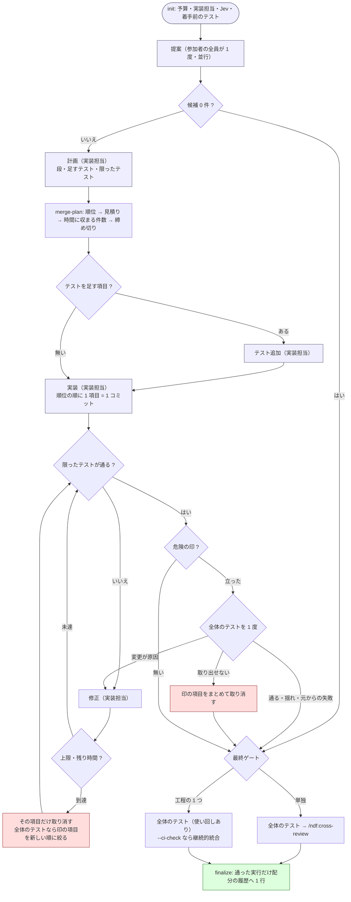

# 多ランタイム・リファクタリング（想定最大時間に収める 1 回の計画実行）

**参加者の全員が 1 度だけ多面的に提案し、選ばれた 1 者が想定最大時間に収まる分を
計画・テスト追加・実装・検証する。** ラウンドを上限まで回す形はとらない（#933）。
所要の上限は `--budget-minutes`（既定 30 分）で利用者が決める。

`refactoring` Skill は「テストで守りながら 1 手ずつ直す」手順を持つが、
**何を直すかの発見**と**直した結果の検証**を持たない。この Skill がその 2 つを補う。
実装を担う側は `refactoring` を手順として読む。

**工程表では `standard` と `legacy-refactor` の構造改善がこの Skill を指す。**
前提を満たせないときの退避先は `development-workflow` の
`references/workflow-modes.md`「構造改善の退避先」にある。

- [docs/01-state-and-propose.md](docs/01-state-and-propose.md) — 初期化・再開・提案
- [docs/02-plan-and-implement.md](docs/02-plan-and-implement.md) — 計画・テスト追加・実装
- [docs/03-review-viewpoints.md](docs/03-review-viewpoints.md) — 最終ゲートの `cross-review` へ渡す観点
- [docs/04-verify-and-report.md](docs/04-verify-and-report.md) — 検証/修正・危険の印・最終ゲート・配分テーブル・報告
- [scripts/refactor.py](scripts/refactor.py) — 状態管理（uv 自己完結、標準ライブラリのみ）
- [scripts/prepare-worktrees.sh](scripts/prepare-worktrees.sh) — 作業ディレクトリ準備と Skill 配置
- [scripts/launch-cli.sh](scripts/launch-cli.sh) — フェーズごとのプロンプト組み立てと CLI 起動
- 監視と CLI 起動の実体は `../../scripts/lib/`（プラグインルート直下の収束ループ共通層）

## この Skill で使う語

| 語 | 意味 |
| --- | --- |
| 想定最大時間 | `--budget-minutes`。計画はこの中に収まるように立てる。**時間に関わる数値はすべてここから逆算する**（段の上限・テスト 1 回の上限・無音の打ち切り） |
| フェーズ | 提案・計画・テスト追加・実装・検証/修正の 5 つ。**それぞれ 1 回だけ**行う（検証と修正の繰り返しを除く） |
| 実装担当 | 計画以降の 4 フェーズを通して担う 1 ランタイム |
| 候補 | 提案を鍵（`path` + `symbol` + `smell`）でまとめたもの。計画へ渡す |
| 改善項目 | 計画が採った候補。`I-001` の形の ID を持ち、**1 改善項目 = 1 コミット**（テストを足す項目は 2 コミット） |
| 配分テーブル | 種類（`test` / `structure/<手法>` / `verify` / `fix`）ごとの 1 件あたりの所要。履歴の直近 10 回から計画のたびに集計する |
| 限ったテスト | 項目が触った箇所に限ったテスト。計画の `test_targets` から進行側が組み立てる |
| 危険の印 | 限ったテストでは覆えない変更（D1〜D5）。立ったら全体のテストを 1 度だけ走らせる |

**「バッチ」「パッチ」の語は使わない。** 読み手が別の意味で知っている語である。

## 設計方針

| 観点 | 方針 |
| --- | --- |
| 参加者 | **全員 CLI プロセス。** 提案は参加者の全員、計画以降は実装担当 1 者。ホストと同じランタイムでも別プロセスで起動する |
| 実装担当 | **名指し（`--implementer`）→ ホスト（参加者にいれば）→ 参加者の先頭。** 輪番は持たない。再開しても変わらない |
| 時間 | 計画の時点で「想定最大時間 − 経過 − 控え」に収まる件数だけを採る。実装の途中は**項目ごとの着手の締め切り**で止める。**段の上限・テスト 1 回の上限・直しの打ち切りは予算から算術で出し、計画の終わりまでに状態ファイルと改修計画へ書き出す。** 監視はその段の終わり + 余裕で CLI を止め、修正は回数でなく締め切りまで試みる（式は [docs/02 の「締め切り」](docs/02-plan-and-implement.md#締め切り)） |
| 検証の単位 | **項目。** HEAD で項目ごとの限ったテストを走らせる。全体のテストは危険の印が立ったときに 1 度だけ。落ちたら落ちたテストだけを走らせ直して揺れ・元からの失敗を除き、変更が原因なら締め切りまで直し、直らなければ印の項目を新しい順に絞って取り消す |
| 収束しない項目 | **項目の単位で取り消す。** 同じファイルの隣接行を触る項目どうしは git で分離できないため、取り消しを広げる |
| 見積り | 配分テーブル。所要は**進行側の時計とコミットの時刻**で測り、担当の申告を使わない |
| 判断 | Jev（公開リポジトリで鍵があるとき）に段・同じ変更か・D5 を**計画の段で**問い、確信度が足りなければ実装担当の答えを使う。**計画の後で LLM が動くのは作業の CLI（テストの追加・実装・直し）だけ**で、取り消し・見送り・絞り込み・揺れの判定・次の試行に進むかはスクリプトが決める。機械で決まらないテストの差分はレビューへ引き継ぐ |
| 範囲の扱い | `--scope` は**検証にも効く**。範囲外を触ったコミットの項目は取り消す。**テストの置き場所を含めないと `init` が止める** |
| 公開の責務 | **進行側だけが push する。** 生成物の同期は `--sync-command` として push の直前に進行側が行う |
| 検証の情報源 | **git と実際のテスト実行。** 結果ファイルの申告は検証に使わない |
| 外へ出す文章 | 項目は **`<ファイル>#<シンボル>` を併記**し、取り消しは**件数だけ**述べ、改修計画は**生の URL**で書く |
| 最終ゲート | `--ci-check` があれば継続的統合、無ければ全体のテスト。単独起動はその後に `cross-review` |
| 状態の永続化 | `<work>/.cross_refactoring/cross-refactoring-rf<番号>-state.json`（版 2）。中断・再開可能 |

**push が credential helper の不全で落ちたときは、進行側が退避して 1 度だけやり直す**
（#524）。退避の値は共通層（`<プラグインルート>/scripts/lib/git-credential.sh`）が持つ。

## 引数

| 引数 | 意味 | 既定 |
| --- | --- | --- |
| `[PR番号]` | 対象の Pull Request | 必須 |
| `--scope PATH...` | 対象範囲。**提案が無制限に広がらないよう必須。** 検証にも効くので、現状固定テストの置き場所も含める | 必須 |
| `--budget-minutes N` | 想定最大時間（分）。1 以上の整数でなければ `init` が止める（終了コード 4） | `30` |
| `--implementer NAME` | 計画以降を担う 1 者。参加者に無ければ `init` が止める | ホスト → 先頭 |
| `--host claude\|codex\|agy\|kiro` | ホストの明示指定。未指定時は環境変数から推定（agy は推定できないため明示する） | 推定 |
| `--exclude NAMES` | 参加者から外す者（カンマ区切り・繰り返し可）。再開で `none` を渡すと空へ戻す | なし |
| `--include NAMES` | 参加者に足す者（例: `--include agy`） | なし |
| `--require-all` | 確認を通らない者が 1 者でもいれば中断する（終了コード 4） | 外して続ける |
| `--model RT=MODEL` | ランタイムごとのモデル。繰り返し指定できる | CLI の既定 |
| `--baseline-test CMD` | 着手前・危険の印・最終ゲートで実行する全体のテスト | 必須 |
| `--round-test CMD` | 範囲のテスト。項目ごとの限ったテストを組み立てる元で、組み立てられない項目はそのまま走らせる。**`--baseline-test` の実行器が `pytest` / `python -m pytest` / `jest` / `vitest` でなければ必須** | `--baseline-test` から組み立てる |
| `--ci-check NAME` | 最終ゲートで手元のテストの代わりに見る検査の名前（排他） | なし |
| `--workflow-step` | `development-workflow` の 1 工程として起動したことを伝える。`cross-review` を省く | 単独起動 |
| `--severity-threshold LEVEL` | この重要度未満は `threshold` で見送る | `minor` |
| `--sync-command CMD` | 生成物を同期するコマンド。push の直前に進行側が実行する | なし |
| `--plan-file PATH` | 改修計画を**ファイル**へ書き出す先（対象リポジトリからの相対）。空文字なら記録しない | PR のコメント 1 件 |

**廃止した引数**: `--max-test-rounds` / `--max-outer-rounds` / `--max-items-per-round` と、
`--max-fix-rounds` / `--test-timeout`（決定 24。修正は締め切りまで、テストの上限は予算から
導く）は、渡すと廃止を知らせる 1 行を出して**値を使わずに続ける**。次の版で外す。

```text
/ndf:cross-refactoring 130 --scope src/services tests/services --round-test "pytest tests/services -q" --baseline-test "pytest -q"
/ndf:cross-refactoring 130 --scope src tests --baseline-test "pytest -q" --budget-minutes 30
/ndf:cross-refactoring 130 --scope src tests --baseline-test "pytest -q" --implementer codex --sync-command "make generate"
/ndf:cross-refactoring 130 --scope src tests --baseline-test "pytest -q" --include agy --exclude kiro
```

**モデルを比べたいなら `--model <ランタイム>=<name>` を参加者の全員に指定する。**
実際に動いたモデルを取得できるのは claude だけで、残る者は指定値で代用する。

## 担当の決め方

| 役割 | 決め方 | ホストごとの既定 |
| --- | --- | --- |
| 提案（参加者） | 既定（codex / kiro とホスト）＋ `--include` − `--exclude`。確認を通らない者は外す | claude: claude / codex / kiro、codex: codex / kiro、agy: codex / agy / kiro、kiro: codex / kiro |
| 計画・テスト追加・実装・修正・最終ゲートの修正 | `--implementer` → ホスト（参加者にいれば）→ 参加者の先頭 | 多くはホスト |

- **agy は既定に入らない**（#664）。戻すときは `--include agy` を渡す
- **確認を通らない者は外して続ける。** 全員が揃わないなら始めたくないときは `--require-all`
- **再開で参加者を作り直し、実装担当が外れたら**、計画の前なら決め方を当て直し、計画の後なら止める

## 前提

- `gh` CLI が認証済みで、`jq` と `uv`（または Python 3.10 以上）が使える
- 参加者の CLI がログイン済みである。`init` が認証状態を確認し、通らない者を外して続ける
  （確認コマンドは claude: `claude auth status` / codex: `codex login status` / agy: `agy models` /
  kiro: `kiro-cli whoami`。誤検知するときは `NDF_SKIP_AUTH_CHECK=1`）
- 対象の Pull Request が Draft で開いている（未作成なら `/ndf:pr` で先に作る）
- 本番コードの差分がある。起動の前に `assess` で飛ばしてよいかを見る。**終了コード 3 なら
  起動しない**（2 は判定できなかったことを示し、飛ばしてよいとは読まない）

```bash
SCRIPTS="<この Skill のディレクトリ>/scripts"
python3 "$SCRIPTS/refactor.py" assess --base origin/develop; echo "exit=$?"
```

- Jev を使うには、環境変数 `AI_GATEWAY_API_KEY` があり、対象が公開リポジトリであること。
  `NDF_JEV=0` で使わない。使えなければ実装担当が同じ判断をする（止まらない）

## 全体フロー



**駆動の繰り返しは検証と修正の 1 つだけである。** 見送った提案は理由（`budget` / `rank` /
`duplicate` / `vocabulary` / `threshold` / `no_target` / `test_failed` / `not_done`）と
ともに改修計画に残る。

## 実行

進行全体を 1 本の bash で駆動する。参加者が全て CLI なので、途中でホストへ戻る必要がない
（単独起動の終わりの `cross-review` を除く）。

```bash
# この Skill のディレクトリを決める。候補を順に試し、最初に当たったものを絶対パスで採る。
# Claude Code は SKILL.md 内の ${CLAUDE_PLUGIN_ROOT} をプラグインルートの絶対パスへ置き換えて
# から渡す。シングルクォートで囲むのは、置き換えられなかったときにシェルへ展開させないため
# である。Codex と Kiro CLI は置き換えないため、**この bash を実行する前に
# `<この Skill のディレクトリ>` をランタイムから渡された実際のパスへ置き換えること**。
# 置き換えないまま実行しても、その候補が外れるだけで別の場所を読むことはない。
SKILL_NAME=cross-refactoring
PLUGIN_ROOT='${CLAUDE_PLUGIN_ROOT}'
case "$PLUGIN_ROOT" in '$'*) PLUGIN_ROOT= ;; esac
SKILL_DIR=
for candidate in \
  ${PLUGIN_ROOT:+"$PLUGIN_ROOT/skills/$SKILL_NAME"} \
  "<この Skill のディレクトリ>" \
  ".kiro/skills/$SKILL_NAME" \
  "$HOME/.kiro/skills/$SKILL_NAME"
do
  [ -d "$candidate/scripts" ] || continue
  SKILL_DIR="$(cd "$candidate" && pwd)"
  break
done
[ -n "$SKILL_DIR" ] || { echo "この Skill のディレクトリを解決できない" >&2; exit 1; }
SCRIPTS="$SKILL_DIR/scripts"
# 収束ループの共通層はプラグインルート直下にある。`..` は文字列のまま渡してカーネルに
# 解決させるため、Kiro CLI が `.kiro/skills/` へ張ったリンクからでも実体側へ届く。
LIB="$SKILL_DIR/../../scripts/lib"

# **中断（終了コード 4）は握り潰さない。** 取り消しに失敗した状態を「項目 0 件」と
# 同じ扱いにすると、検証を通っていない変更を Pull Request に残したまま先へ進む。
rf() {
  "$SCRIPTS/refactor.py" "$@"; local rc=$?
  if [ $rc -eq 4 ]; then
    echo "❌ cross-refactoring を中断しました（refactor.py $1）" >&2
    exit 4
  fi
  return $rc
}

# 出力を `eval` する呼び出しは**別の関数にする**。`eval "$(rf ...)"` と書くと `rf` は
# コマンド置換のサブシェルで動くため、`exit 4` はサブシェルしか終わらせない。
rf_eval() {
  local out rc
  out=$("$SCRIPTS/refactor.py" "$@"); rc=$?
  if [ $rc -eq 4 ]; then
    echo "❌ cross-refactoring を中断しました（refactor.py $1）" >&2
    exit 4
  fi
  eval "$out"
  return $rc
}

rf_eval init "$PR" --scope $SCOPE \
        --baseline-test "$BASELINE" ${ROUND_TEST:+--round-test "$ROUND_TEST"} \
        ${BUDGET:+--budget-minutes "$BUDGET"} ${IMPLEMENTER:+--implementer "$IMPLEMENTER"} \
        ${HOST:+--host "$HOST"} ${EXCLUDE:+--exclude "$EXCLUDE"} ${INCLUDE:+--include "$INCLUDE"} \
        ${REQUIRE_ALL:+--require-all} \
        ${CI_CHECK:+--ci-check "$CI_CHECK"} ${WORKFLOW_STEP:+--workflow-step} \
        ${SEVERITY:+--severity-threshold "$SEVERITY"} \
        ${SYNC_COMMAND:+--sync-command "$SYNC_COMMAND"} ${PLAN_FILE+--plan-file "$PLAN_FILE"} \
        $MODEL_ARGS
export CROSS_REFACTORING_TMP_DIR="$TMP_DIR"
"$SCRIPTS/prepare-worktrees.sh" "$ID"

# **終わったフェーズを飛ばす**（AC24）。`PHASE` は init が返す再開の地点である。
todo() {
  local p
  for p in propose plan add-tests implement verify final done; do
    [ "$p" = "$PHASE" ] && return 0
    [ "$p" = "$1" ] && return 1
  done
}
# 実装担当 1 者のフェーズを起動して待つ。上限は start-phase が状態ファイルの上限の表から
# 返す（PHASE_TIMEOUT = その段の終わりまでの残り + 余裕）。無音の許容も同じ値にする（決定 24）。
impl_phase() {
  rf_eval start-phase "$ID" "$1"
  "$SCRIPTS/launch-cli.sh" "$IMPL" "$1" "$ID"
  "$LIB/monitor.py" "$ID" --agents "$IMPL" --tmp-dir "$TMP_DIR" \
      --stem-template "{agent}-$1-rf$ID" --phase "$1" \
      ${PHASE_TIMEOUT:+--timeout "$PHASE_TIMEOUT" --stall-timeout "$PHASE_TIMEOUT"}
}

GO_FINAL=
if todo propose; then
  "$SCRIPTS/prepare-worktrees.sh" "$ID" sync "$(git -C "$WORK" rev-parse HEAD)"
  rf_eval start-phase "$ID" propose
  for a in $RUNTIMES; do "$SCRIPTS/launch-cli.sh" "$a" propose "$ID"; done
  "$LIB/monitor.py" "$ID" --agents "$RUNTIMES_CSV" --tmp-dir "$TMP_DIR" \
      --stem-template "{agent}-propose-rf$ID" --phase propose \
      ${PHASE_TIMEOUT:+--timeout "$PHASE_TIMEOUT" --stall-timeout "$PHASE_TIMEOUT"}
  rf merge-proposals "$ID" || GO_FINAL=1          # 2 = 候補 0 件
fi
if [ -z "$GO_FINAL" ]; then
  todo plan && impl_phase plan
  rf_eval merge-plan "$ID" || GO_FINAL=1           # TESTS_NEEDED。2 = 項目 0 件
fi
if [ -z "$GO_FINAL" ] && [ "$TESTS_NEEDED" = 1 ] && todo add-tests; then
  impl_phase add-tests
  rf merge-tests "$ID" || GO_FINAL=1              # 2 = 残る項目 0 件
fi
if [ -z "$GO_FINAL" ]; then
  todo implement && impl_phase implement
  rf merge-implement "$ID" || GO_FINAL=1           # 2 = 残る項目 0 件
fi
while [ -z "$GO_FINAL" ]; do                        # 検証と修正の繰り返し（唯一の繰り返し）
  rf_eval verify "$ID"                             # VERIFY=done|fix。締め切りは verify が時計で見る
  [ "$VERIFY" = fix ] || break
  impl_phase fix
  rf merge-fix "$ID"
done

# 最終ゲート。**起動のされ方で判定の相手が変わる**（docs/04）。
while :; do
  rf_eval final-gate "$ID"; gate=$?                # FINAL_GATE=...
  case $gate in
    0) break ;;
    1) echo "⚠ 最終ゲートが通らないまま修正を打ち切りました（1 度直した後に想定最大時間の終わりを過ぎた）" >&2; break ;;
    2) rf_eval start-phase "$ID" final-fix
       "$SCRIPTS/launch-cli.sh" "$FINAL_FIX_IMPL" final-fix "$ID"
       "$LIB/monitor.py" "$ID" --agents "$FINAL_FIX_IMPL" --tmp-dir "$TMP_DIR" \
           --stem-template "{agent}-final-fix" --phase final-fix \
           ${PHASE_TIMEOUT:+--timeout "$PHASE_TIMEOUT" --stall-timeout "$PHASE_TIMEOUT"}
       rf merge-final-fix "$ID" ;;
    *) exit $gate ;;
  esac
done
# 工程の 1 つとして起動したとき: ここで履歴へ追記する（最終ゲートが通った実行だけ）
[ "$FINAL_GATE" = cross-review ] || rf finalize "$ID"
```

**`FINAL_GATE=cross-review` のとき（単独起動）は、続けて `/ndf:cross-review <PR>` を実行し、
その最終ステータスを渡して `finalize` を呼ぶ。** 手順は
[docs/04-verify-and-report.md](docs/04-verify-and-report.md) の「単独起動の終わり」にある。
その後 Draft を解除し、`refactor.py report "$ID"` の出力を報告する。

### 終了コード

| コード | 意味 | 進行 |
| --- | --- | --- |
| 0 | 正常 | 続ける |
| 1 | 最終ゲートの修正の上限（`final-gate`） | 報告へ抜ける |
| 2 | 判定の結果（候補 0 件 / 残る項目 0 件 / 最終ゲートの失敗） | 各コマンドの表に従う |
| **4** | **中断**（予算の指定の誤り・`--round-test` が要る・旧い状態ファイル・取り消しの失敗・範囲を確定できない など） | **進行ごと止める** |

## アンチパターン

| してはいけないこと | なぜ |
| --- | --- |
| ホストのサブエージェントで実装する | ホストの作業文脈に差分が載り、提案した者と実装する者の独立性が崩れる |
| `launch-cli.sh` に「ホストなら起動しない」分岐を入れる | ホストは実装担当として起動しうる。分岐はランタイム名だけで行う |
| `--scope` を省く / テストの置き場所を入れない | 提案が発散する。足したテストが範囲外になる。**`init` が止める** |
| 実装担当に生成物を同期させる・push させる | 範囲外の変更が生まれる。検証を通る前に公開される |
| 監視の上限を表の固定値のまま使う・LLM の申告で締め切りを守らせる | 予算の外まで走る。**上限はその段の終わり + 余裕で、スクリプトが時計で止める。** 止めたときの半端な変更は取り込みが捨て、コミット済みの項目は締め切りで判定する |
| 計画の後に判断のために LLM を呼ぶ（Jev・判定の CLI） | 計画で見積もった時間の外で所要が伸び、結果が再現しない。判断は計画で済ませ、後はスクリプトの規則で決める |
| 検証の中で全体のテストを 2 回以上走らせる | 「原則実施しない」が崩れる。走らせ直すのは落ちたテストだけで、取り消した後の HEAD は最終ゲートが確かめる |
| 結果ファイルの申告（所要・コミット）を材料にする | JSON を書き換えるだけで通る検査になる。対応は `Item-Id`、所要は時計とコミットの時刻 |
| 改修計画の URL を Markdown のリンクで書く | 読み手の画面から URL を取り出せない。**生の URL で書く** |
| 取り消した項目の内訳を Pull Request の文章へ並べる | 同じ一覧が 2 か所になり、片方だけが古くなる |
| `git push --force` / `--no-verify` を使う | 他者の作業を消す。検証を飛ばす |
| 提案フェーズでコードを直す | 提案は読むだけ。直すのは実装担当 1 者に集約する |

## 完了報告

`refactor.py report "$ID"` が次を出す（AC26）。

- フェーズごとの所要と、想定最大時間との差（`cross-review` を除く）
- 改善項目の表（**`<ファイル>#<シンボル>`**・兆候・手法・段・見積り・状態・危険の印・修正の回数）
- 採用・取り消し・見送りの件数と、**見送りの理由別の件数**。内訳は**改修計画の生の URL**
- 着手前の全体のテストの結果（通過か失敗・秒・HEAD）と、検証の中で全体のテストを走らせたか、走らせた理由（印）、落ちたときの見分け（揺れ・元からの失敗・変更が原因）と結末
- 判断に Jev を使ったか（使わなかった理由・呼び出しの失敗の数）
- 最終ゲートの結果（`cross-review` の収束、または全体のテスト／継続的統合の合否）
- 監視が段の上限で CLI を止めた段と、固定のまま残した値（OS の後始末と通信の待ち）
