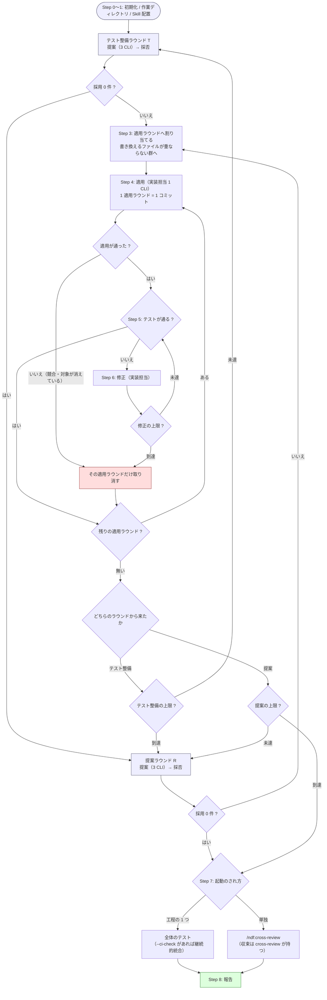

# 多ランタイム・リファクタリング収束ループ

**発見・適用・検証を別々のランタイムへ分担させ、新しい提案が出なくなるまで回す。**
`/ndf:cross-review` がレビューを収束させるのと同じ発想で、リファクタリングを収束させる。
**検証はテストが行う**（Step 5 でレビュー CLI は起動しない）。

`refactoring` Skill は「テストで守りながら 1 手ずつ直す」手順を持つが、
**何を直すかの発見**と**直した結果の他者検証**を持たない。この Skill がその 2 つを補う。
適用を担う側は `refactoring` を手順として読む。

**工程表では `standard` と `legacy-refactor` の構造改善がこの Skill を指す。**
前提を満たせないときの退避先は `development-workflow` の
`references/workflow-modes.md`「構造改善の退避先」にある。

詳細は `docs/` に、コマンドは `scripts/` に分けている。

- [docs/01-state-and-propose.md](docs/01-state-and-propose.md) — Step 0〜3（初期化 / Skill 配置 / 提案 / マージ）
- [docs/02-apply-and-review.md](docs/02-apply-and-review.md) — Step 4〜5（適用 / 検証）
- [docs/03-review-viewpoints.md](docs/03-review-viewpoints.md) — Step 7 の `cross-review` へ渡すレビュー観点
- [docs/04-fix-and-report.md](docs/04-fix-and-report.md) — Step 6〜8（修正 / 見送り / 最終ゲート / 報告）
- [scripts/refactor.py](scripts/refactor.py) — 状態管理（uv 自己完結、標準ライブラリのみ）
- [scripts/prepare-worktrees.sh](scripts/prepare-worktrees.sh) — 作業ディレクトリ準備と Skill 配置
- [scripts/launch-cli.sh](scripts/launch-cli.sh) — フェーズごとのプロンプト組み立てと CLI 起動
- 監視と CLI 起動の実体は `../../scripts/lib/`（プラグインルート直下の収束ループ共通層）

## この Skill で使う語

**階層はすべて「ラウンド」で表す。** 4 つは同じ形（提案 → 採否 → 適用ラウンド →
検証 → 修正ラウンド）を持つため、読み手が覚える形は 1 つで済む。**何の単位かと、
どの上限が掛かるかは 4 つとも違う。**

| 語 | 何の単位か | 上限を決めるもの |
| --- | --- | --- |
| テスト整備ラウンド | **足すべきテストを集める。** 3 者が提案し、採否を決める | `--max-test-rounds`（既定 2） |
| 提案ラウンド | **構造改善の提案を集める。** 3 者が提案し、採否を決める | `--max-outer-rounds`（既定 3） |
| 適用ラウンド | **同時に適用して検証する。** 書き換えるファイルが重ならない項目だけを含む。**上の 2 つのラウンドが共有する** | 別に置かない（`--max-items-per-round` が実質の上限） |
| 修正ラウンド | **検証の失敗を直す。上の 2 つのラウンドが共有する** | `--max-fix-rounds`（既定 3） |
| 改善項目 | 構造改善の提案の 1 件。`<ファイル>#<シンボル>` と兆候で識別する | — |
| テスト項目 | テスト整備の提案の 1 件。固定する入口（`target`）と経路の種類（`case`）で識別する | — |

**「バッチ」「パッチ」の語は使わない。** 読み手が別の意味で知っている語である。

**適用ラウンドに別の上限を置かない。** 採用件数の上限が既に群の数を切っている。
上限を 2 つ置くと、どちらで止まったのかを読み解く必要が出る。

## 設計方針

| 観点 | 方針 |
| --- | --- |
| 参加者 | **全員 CLI プロセス。** ホストのサブエージェント機能は使わない。ホストと同じランタイムが実装担当のラウンドでも別プロセスで起動する |
| 役割の分離 | 提案は**ホストを除く 3 者**、適用は**参加する 4 者すべて**。両者は重なるが一致しない |
| 検証の単位 | **適用ラウンド（群）に対して 1 回。** 判定は `--baseline-test` の合否で決まり、レビュー CLI は起動しない |
| 収束しない項目 | **捨てる。** リファクタリングは任意の作業なので、揉める提案を Pull Request に残さない |
| コミットの単位 | **1 適用ラウンド = 1 コミット。** テストも適用ラウンドの単位で 1 回だけ求める |
| 改修計画 | **Pull Request のコメント 1 件へ残す。** 理由と手順は提案の時点でしか残らない。ラウンドが進むたびに同じコメントを編集する。URL は永続で、マージの後も開ける。`--plan-file` を明示したときだけファイルにする |
| 取り消しの単位 | **適用ラウンドごと。** 群の範囲を新しい順に全て戻す。既に検証を通った群は Pull Request に残る。**群の中は 1 コミットなので、1 件の失敗が群の全件を巻き込む** |
| 範囲の扱い | `--scope` は**検証にも効く**。範囲外を触ったコミットを含む項目は失敗になる。**テストの置き場所を含めないと `init` が止める** |
| 公開の責務 | **進行側だけが、検証を通した後に push する。** 実装担当は push しない。生成物の同期は `--sync-command` として push の直前に進行側が実行する |
| 検証の情報源 | **git と実際のテスト実行。** 結果ファイルの申告は検証に使わない（書き換えるだけで通る検査にしない） |
| 外へ出す文章 | 項目は **`<ファイル>#<シンボル>` を併記**し、取り消しは**件数だけ**述べ（内訳は改修計画へ譲る）、改修計画は**生の URL**で書く |
| 最終ゲート | **起動のされ方で変わる。** 単独なら `cross-review`、`development-workflow` の工程なら全体のテスト（`--ci-check` があれば継続的統合の結果） |
| 状態の永続化 | `<work>/.cross_refactoring/cross-refactoring-rf<番号>-state.json` に集約。中断・再開可能 |
| 計測 | 起動時にモデルを固定し、コミットのトレーラーとレビューコメントへ実行主体を残す |

## 引数

| 引数 | 意味 | 既定 |
| --- | --- | --- |
| `[PR番号]` | 対象の Pull Request | 必須 |
| `--scope PATH...` | 対象範囲。**提案が無制限に広がらないよう必須。** 検証にも効くので、現状固定テストの置き場所も含める | 必須 |
| `--host claude\|codex\|agy\|kiro` | ホストの明示指定。未指定時は環境変数から推定（agy は推定できないため明示する） | 推定 |
| `--model RT=MODEL` | ランタイムごとのモデル。繰り返し指定できる | CLI の既定 |
| `--baseline-test CMD` | 着手前と各コミットで実行するテスト。**振る舞い不変を示す手段が無い書き換えは構造改善ではないため必須** | 必須 |
| `--max-test-rounds N` | **テスト整備ラウンド**の上限。到達したら採用が残っていても提案ラウンドへ進む | `2` |
| `--max-outer-rounds N` | **提案ラウンド**の上限。切るのは提案の回数であって、適用できる件数ではない | `3` |
| `--max-fix-rounds N` | **1 つの適用ラウンドあたり**の修正ラウンドの上限 | `3` |
| `--max-items-per-round N` | **1 つの提案ラウンド／テスト整備ラウンド**の採用上限 | `5` |
| `--ci-check NAME` | 最終ゲートで手元のテストの代わりに見る検査の名前。**指定すると手元のテストは実行しない**（排他） | なし |
| `--workflow-step` | `development-workflow` の 1 工程として起動したことを伝える。**Step 7 の `cross-review` を省き、全体のテストで判定する** | 単独起動 |
| `--severity-threshold LEVEL` | この重要度未満は採用しない | `minor` |
| `--test-timeout SEC` | テスト 1 回あたりの上限秒数。超えたら失敗として扱う | `900` |
| `--sync-command CMD` | 生成物を同期するコマンド。**push の直前**に進行側が実行し、差分があれば進行側のコミットとして積む | なし |
| `--plan-file PATH` | 改修計画を**ファイル**へ書き出す先（**対象リポジトリからの相対パス**）。空文字を渡すと記録しない | Pull Request のコメント 1 件 |

```text
/ndf:cross-refactoring 130 --scope src/services tests/services --baseline-test "pytest -q"
/ndf:cross-refactoring 130 --scope src --baseline-test "pytest -q" --sync-command "make generate"
/ndf:cross-refactoring 130 --scope src --model codex=gpt-5.5 --model claude=opus-5
/ndf:cross-refactoring 130 --scope src --host codex --max-outer-rounds 1
```

**モデルを比べたいなら `--model <ランタイム>=<name>` を 4 つとも指定する。**
実際に動いたモデルを取得できるのは claude だけで、残る 3 者は指定値で代用する。
指定が無いラウンドは何が動いたか分からないため、集計から分離される
（kiro の既定 `auto` も同じ扱いになる）。

## 担当の決め方

ホストセッションは**進行の制御に徹し、提案とレビューには参加しない**。
ただし**適用だけはホストと同じランタイムも担当しうる**。その場合も CLI プロセスとして
起動するため、ホストセッションの作業文脈からは切り離されている。

| 母集合 | 定義 | 中身 |
| --- | --- | --- |
| 提案（`runtimes`） | 全ランタイム − ホスト | 常に 3 者 |
| 適用（`impl_capable`） | 全ランタイム | 常に claude / codex / agy / kiro |

- **適用から外す者はいない。** 4 者はいずれも NDF の配布先で、適用で読ませる
  `refactoring` / `tdd-cycle` / `quality-gates` を配っている
- **ホストは適用にだけ参加する。** 提案から外れているので、
  「実装した者と提案した者が同一モデルにならない」構造は保たれる
- **適用担当は適用ラウンドごとに輪番を進める。** 1 つの提案ラウンドが複数の群を
  持てば、その分だけ輪番も進む。**`--max-outer-rounds` が切るのは提案の回数だけ**で、
  輪番の 1 周とは対応しない

割り当ては `refactor.py start-round` が返し、状態ファイルへ記録する。**再開しても変わらない。**

## 前提

- `gh` CLI が認証済みで、`jq` と `uv`（または Python 3.10 以上）が使える
- 参加する CLI が**すべてログイン済み**である。`init` が認証状態を確認し、1 つでも
  未認証なら中断する（未認証の CLI は起動から 15 秒で終わり、結果を残さないまま
  担当から脱落するため、確認しないと参加者が欠けた構成のまま進行する）

  | ランタイム | 確認コマンド |
  | --- | --- |
  | claude | `claude auth status` |
  | codex | `codex login status` |
  | agy | `agy models` |
  | kiro | `kiro-cli whoami` |

  確認コマンドは CLI の版で変わりうる。誤検知するときは `NDF_SKIP_AUTH_CHECK=1` で
  飛ばせる（飛ばしたことは出力に残る）

- ホストごとに次の CLI が使える（不足していると初期化時に失敗する）

  | ホスト | 必要な CLI |
  | --- | --- |
  | Claude Code | `codex` / `agy` / `kiro-cli` |
  | Codex | `claude` / `agy` / `kiro-cli` |
  | agy | `claude` / `codex` / `kiro-cli` |
  | Kiro CLI | `claude` / `codex` / `agy` |

  適用にはホスト自身も参加するため、ホストのコマンドも起動できる必要がある。
  **agy がホストのときは `--host agy` を明示する**（環境変数からは推定しない）

- 対象の Pull Request が Draft で開いている（未作成なら `/ndf:pr` で先に作る）

## 全体フロー

**ラウンドは 4 層である。** テスト整備ラウンドと提案ラウンドは、集める提案の中身が
違うだけで、その先（適用ラウンド → 検証 → 修正ラウンド）はそのまま共有する。



**適用ラウンドと修正ラウンドは 1 組しかない。** 2 つのラウンドが共有するため、
Step 4 以降の手順は種類によらず同じである。どちらを開くかは状態の `round_kind` が
持ち、切り替えるのは `advance` である。

**終了条件は収束と上限の 2 つである。** 採用が 0 件にならなくても、テスト整備
ラウンドが `--max-test-rounds` に達したら提案ラウンドへ進み、提案ラウンドが
`--max-outer-rounds` に達したら最終ゲートへ抜ける。**上限で抜けたことは報告に残る**
（収束して終わったのか、歯止めで止まったのかを読み分けるため）。

## 実行

進行全体を 1 本の bash で駆動する。参加者が全て CLI なので、途中でホストへ戻る必要がない。

```bash
# この Skill のディレクトリを決める。候補を順に試し、最初に当たったものを絶対パスで採る。
# Claude Code は SKILL.md 内の ${CLAUDE_PLUGIN_ROOT} をプラグインルートの絶対パスへ置き換えて
# から渡す。シングルクォートで囲むのは、置き換えられなかったときにシェルへ展開させないため
# である（未定義の変数を読まないので `set -u` でも落ちない）。Codex と Kiro CLI は置き換えず、
# プラグインルートを示す環境変数も置かない（Codex は実測、Kiro CLI は未確認）。置き換えない
# runtime では、
# **この bash を実行する前に `<この Skill のディレクトリ>` をランタイムから渡された実際の
# パスへ置き換えること**。置き換えないまま実行しても、その候補が外れるだけで別の場所を
# 読むことはない。Kiro CLI は installer が `.kiro/skills/` へ symlink を張るため、置き換え
# なくてもその位置で当たる。
SKILL_NAME=cross-refactoring
PLUGIN_ROOT='${CLAUDE_PLUGIN_ROOT}'
case "$PLUGIN_ROOT" in '$'*) PLUGIN_ROOT= ;; esac
SKILL_DIR=
# 明示的に渡されたディレクトリを `.kiro` より先に見る。逆にすると、Kiro の設定を持つ
# リポジトリで Codex や Claude Code を動かしたときに別 runtime の Skill を選ぶ。
for candidate in \
  ${PLUGIN_ROOT:+"$PLUGIN_ROOT/skills/$SKILL_NAME"} \
  "<この Skill のディレクトリ>" \
  ".kiro/skills/$SKILL_NAME" \
  "$HOME/.kiro/skills/$SKILL_NAME"
do
  [ -d "$candidate/scripts" ] || continue
  # 相対パスのまま持ち回ると、この後 worktree へ移ったときに外れる。ここで絶対パスにする。
  SKILL_DIR="$(cd "$candidate" && pwd)"
  break
done
[ -n "$SKILL_DIR" ] || { echo "この Skill のディレクトリを解決できない" >&2; exit 1; }
SCRIPTS="$SKILL_DIR/scripts"
# 収束ループの共通層はプラグインルート直下にある。`..` は文字列のまま渡してカーネルに
# 解決させるため、Kiro CLI が `.kiro/skills/` へ張ったリンクからでも実体側へ届く。
LIB="$SKILL_DIR/../../scripts/lib"

# **中断（終了コード 4）は握り潰さない。** 取り消しに失敗した状態を「全件失敗」と
# 同じ扱いにすると、検証を通っていない変更を Pull Request に残したまま次の提案が
# 始まる。判定に使う終了コードだけを呼び出し側へ返し、それ以外は進行ごと止める。
rf() {
  "$SCRIPTS/refactor.py" "$@"; local rc=$?
  if [ $rc -eq 4 ]; then
    echo "❌ cross-refactoring を中断しました（refactor.py $1）" >&2
    exit 4
  fi
  return $rc
}

# 出力を `eval` する呼び出しは**別の関数にする**。`eval "$(rf ...)"` と書くと `rf` は
# コマンド置換のサブシェルで動くため、`exit 4` はサブシェルしか終わらせない。
# 外側の `eval` は空文字を評価して成功し、**中断したはずの進行がそのまま続く**。
# 出力と終了コードを親シェルで受け取ってから判定する。
rf_eval() {
  local out rc
  out=$("$SCRIPTS/refactor.py" "$@"); rc=$?
  if [ $rc -eq 4 ]; then
    echo "❌ cross-refactoring を中断しました（refactor.py $1）" >&2
    exit 4
  fi
  eval "$out"
  return $rc
}

rf_eval init "$PR" --scope $SCOPE \
        --baseline-test "$BASELINE" ${HOST:+--host "$HOST"} \
        --max-test-rounds "$MAX_TEST" --max-outer-rounds "$MAX_OUTER" \
        --max-fix-rounds "$MAX_FIX" --max-items-per-round "$MAX_ITEMS" \
        ${CI_CHECK:+--ci-check "$CI_CHECK"} ${WORKFLOW_STEP:+--workflow-step} \
        $MODEL_ARGS
export CROSS_REFACTORING_TMP_DIR="$TMP_DIR"
"$SCRIPTS/prepare-worktrees.sh" "$ID"

# **1 つの繰り返しがテスト整備ラウンドと提案ラウンドの両方を回す。** どちらを開くかは
# `start-round` が `ROUND_KIND` として返し、提案に使う雛形は `PROPOSE_PHASE` が持つ。
# 切り替えの判定は `advance` が行うので、この繰り返しは種類で分岐しない。
while :; do
  rf_eval start-round "$ID" || break          # 終了コード 1 = 繰り返し終了
  # **提案の直前に読み取り用を同期する。** 前ラウンドの取り消しで HEAD が進んで
  # いるため、同期しないと**消えたコードに対する提案**が返る（実測: 取り消しで
  # 消えた関数へ 2 件）。HEAD が変わっていなければ何も起きない。
  "$SCRIPTS/prepare-worktrees.sh" "$ID" sync "$(git -C "$WORK" rev-parse HEAD)"
  for a in $RUNTIMES; do
    "$SCRIPTS/launch-cli.sh" "$a" "$PROPOSE_PHASE" "$ID" "$ROUND"
  done
  # 提案の所要は参加ランタイムと回線状況で振れる（実測 90〜285 秒）。既定の
  # 打ち切りに任せず、明示する。**結果ファイルの名前は種類で変えない**ので、
  # 監視の雛形はテスト整備ラウンドでもそのまま使える。
  "$LIB/monitor.py" "$ID" --agents "$RUNTIMES_CSV" --tmp-dir "$TMP_DIR" \
      --stem-template "{agent}-propose-rf{id}-r$ROUND" --timeout 900
  # 終了コード 2 = 構造改善の採用 0 件（繰り返しを終える）。テスト整備の採用 0 件は
  # 終了ではないので 0 が返り、切り替えは `advance` が決める
  rf merge-proposals "$ID" || break
  while :; do                                 # 適用ラウンドの繰り返し
    # 群と実装担当は状態が決める。輪番は群ごとに進む
    rf_eval next-apply-round "$ID" "$ROUND" || break   # 終了コード 1 = 群が尽きた
    "$SCRIPTS/launch-cli.sh" "$IMPL" apply "$ID" "$ROUND"
    "$LIB/monitor.py" "$ID" --agents "$IMPL" --tmp-dir "$TMP_DIR" \
        --stem-template "{agent}-apply-r$ROUND" --timeout 3600
    # 終了コード 2 = 適用が通らずこの群を取り消した。修正ラウンドは回さない
    rf merge-apply "$ID" "$ROUND" || continue

    while :; do                               # 検証と修正の繰り返し
      rf verify-round "$ID" "$ROUND" && break # テストが通った
      if rf should-abandon "$ID" "$ROUND"; then
        rf abandon-items "$ID" "$ROUND"; break
      fi
      "$SCRIPTS/launch-cli.sh" "$IMPL" fix "$ID" "$ROUND"
      "$LIB/monitor.py" "$ID" --agents "$IMPL" --tmp-dir "$TMP_DIR" \
          --stem-template "{agent}-fix-r$ROUND"
      rf merge-fix "$ID" "$ROUND"
    done
    # 次の群と、次のラウンドの提案に備えて読み取り用を同期する
    "$SCRIPTS/prepare-worktrees.sh" "$ID" sync "$(git -C "$WORK" rev-parse HEAD)"
  done
  rf advance "$ID" || break
done

# Step 7: 最終ゲート。**起動のされ方で判定の相手が変わる。**
#
# **修正の起動と取り込みは適用ラウンドのものを使い回さない。** 落ちているのは全体の
# テストで、どの改善項目にも提案ラウンドにも属さない。担当（`FINAL_FIX_IMPL`）と
# 範囲の起点は `final-gate` が記録して返す。
while :; do
  rf_eval final-gate "$ID"; gate=$?            # FINAL_GATE=... を返す
  case $gate in
    0) break ;;                                # 通過（または cross-review を実行する）
    1) echo "⚠ 最終ゲートが通らないまま修正の上限に達しました" >&2; break ;;
    2) "$SCRIPTS/launch-cli.sh" "$FINAL_FIX_IMPL" final-fix "$ID"
       "$LIB/monitor.py" "$ID" --agents "$FINAL_FIX_IMPL" --tmp-dir "$TMP_DIR" \
           --stem-template "{agent}-final-fix"
       rf merge-final-fix "$ID" ;;
    *) exit $gate ;;
  esac
done
# FINAL_GATE=cross-review のときだけ、続けて /ndf:cross-review "$PR" を実行する。

# 生成物の同期は `--sync-command` として push の直前に進行側が実行済み。
# 改修計画のコメントも同じ経路で更新済み。ここで追加の作業は要らない。
```

### 終了コード

| コード | 意味 | 進行 |
| --- | --- | --- |
| 0 | 正常 | 続ける |
| 1 | 繰り返しの終了（`start-round` / `advance`） | 抜ける |
| 2 | 判定の結果（採用 0 件 / 適用ラウンドの取り消し / テストの失敗 など） | 各コマンドの表に従う |
| **4** | **中断**（取り消しの失敗、認証切れ、範囲を確定できない、`--scope` にテストの置き場所が無いなど） | **進行ごと止める** |

出力を `eval` する呼び出し（`init` / `start-round` / `next-apply-round` / `final-gate`）は
`rf_eval` を使う。
`eval "$(rf ...)"` と書くと `rf` はコマンド置換のサブシェルで動くため、`exit 4` は
サブシェルしか終わらせず、外側の `eval` は空文字を評価して成功する。
**中断したはずの進行がそのまま続く**ので、出力と終了コードは親シェルで受け取る。

**Step 7 は起動のされ方で分かれる。** `final-gate` が `FINAL_GATE=cross-review` を
返したとき（単独起動）だけ、続けて `/ndf:cross-review <PR>` を実行する。検証はラウンド
単位なので、**ラウンドを跨いだ整合はここで見る**。渡す観点の定型は
[docs/04-fix-and-report.md](docs/04-fix-and-report.md) の Step 7 にある。収束したら
Draft を解除し、`refactor.py report "$ID" --metrics` の出力を報告する。

状態ファイルに全ての状態が入るため、どこで落ちても同じコマンド列を叩き直せば再開できる。

## アンチパターン

| してはいけないこと | なぜ |
| --- | --- |
| ホストのサブエージェントで適用する | ホストの作業文脈に差分が載り、提案した者と実装する者の独立性が崩れる |
| `launch-cli.sh` に「ホストなら起動しない」分岐を入れる | ホストは適用担当として起動しうる。分岐はランタイム名だけで行う |
| `--scope` を省く | 提案が発散し、Pull Request が肥大する。**必須なので `init` が受け付けない** |
| `--scope` にテストの置き場所を入れない | テスト整備ラウンドが足すテストが範囲外になる。**`init` が止める**（案内だけでは同じ失敗を繰り返す） |
| 実装担当に生成物を同期させる | 範囲外の変更が生まれ、範囲の検査で全件失敗する。同期は `--sync-command` で進行側が行う |
| 実装担当に push させる | 検証を通る前に公開され、取り消しの反映漏れが Pull Request に残る |
| 生成物を同期するリポジトリで `--sync-command` を省く | pre-push の検査で**あらゆる push が落ちる**。実装担当が同期に手を出し、範囲違反で全件失敗する |
| 取り消しの失敗を「全件失敗」として次のラウンドへ進む | 検証を通っていない変更が Pull Request に残る。終了コード 4 は必ず進行ごと止める |
| `--dry-run` の出力を実行結果と混同する | 確認用なので git も状態ファイルも触らない。進行は 1 歩も進まない |
| 1 つの適用ラウンドを複数のコミットへ刻む | 取り消しの単位（適用ラウンド）とコミットの単位が食い違う。適用結果の検証で全件失敗になる |
| 書き換えるファイルが重なる項目を同じ適用ラウンドへ入れる | 群の中を 1 コミットにできない。割り当ては `merge-proposals` が `path` だけで決める |
| Step 5 でレビュー CLI を起動する | 判定はテストが行う。レビューは Step 7 か工程表の「レビュー」が 1 度だけ掛ける |
| 実装担当に手ごとのテストを義務づける | 進行側も検証で回すため、テストの実行回数が膨らむ（実測 44 手で 88 回） |
| 改修計画を状態ファイルにだけ残す | 状態ファイルは差分から除外される。Pull Request を読む側からは、なぜ直したのかも、どう直す計画だったのかも見えない |
| 改修計画の URL を Markdown のリンクで書く | 読み手の画面から URL を取り出せない。**生の URL で書く** |
| 取り消した項目の内訳を Pull Request の文章へ並べる | 同じ一覧が 2 か所になり、片方だけが古くなる。件数だけ述べ、内訳は改修計画へ譲る |
| 結果ファイルの申告を検証の材料にする | 実装担当は報告する側。JSON を書き換えるだけで通る検査は機械検証ではない |
| `git push --force` / `--no-verify` を使う | 他者の作業を消す。検証を飛ばす |
| 実装担当のコミットでフックの通し方を決めない | 生成物の同期を検査するリポジトリでは、同期の禁止と両立せずコミットを作れなくなる。迂回してよい手段を 1 つ定める |
| 提案にホストを混ぜる | 提案した者と進行する者が同一の文脈になる。初期化時に検査して失敗させている |
| kiro を既定モデルのまま計測する | `auto` は実際に選ばれたモデルを取得できない |
| 提案フェーズでコードを直す | 提案は読むだけ。直すのは実装担当 1 者に集約する |

## 完了報告

- ラウンド表（種類・実装担当とそのモデル、採用・適用・見送り・修正の件数）
- 改善項目の表（**`<ファイル>#<シンボル>`**・兆候・手法・提案元・状態・コミット数）
- 見送った提案の**件数**と、**改修計画の生の URL**（内訳は改修計画にある）
- **上限で抜けたのか収束して終わったのか**（終了理由とテスト整備の終わり方）
- `--metrics` の集計と、**比較として読むときの限界**
- 最終ゲートの結果（`cross-review` の収束、または全体のテスト／継続的統合の合否）
