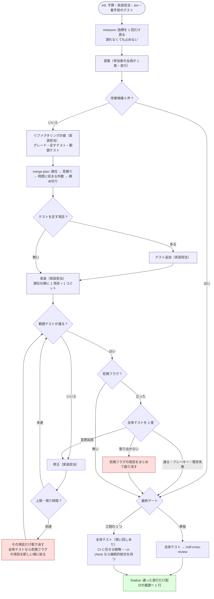

# 多ランタイム・リファクタリング（想定最大時間に収める 1 回のリファクタリング計画の実行）

**参加者の全員が 1 度だけ多面的に提案し、選ばれた 1 者が想定最大時間に収まる分を
リファクタリング計画・テスト追加・実装・検証する。** 所要の上限は `--budget-minutes`（既定 30 分）で利用者が決める。

`refactoring` Skill は「テストで守りながら 1 手ずつ直す」手順を持つが、
**何を直すかの発見**と**直した結果の検証**を持たない。この Skill がその 2 つを補う。
実装を担う側は `refactoring` を手順として読む。

**工程表では `standard` と `legacy-refactor` のリファクタリングがこの Skill を指す。**
前提を満たせないときの退避先は `development-workflow` の
`references/workflow-modes.md`「リファクタリングの退避先」にある。

- [docs/01-state-and-propose.md](docs/01-state-and-propose.md) — 初期化・再開・提案
- [docs/02-plan-and-implement.md](docs/02-plan-and-implement.md) — リファクタリング計画・テスト追加・実装
- [docs/03-review-viewpoints.md](docs/03-review-viewpoints.md) — 最終ゲートの `cross-review` へ渡す観点
- [docs/04-verify-and-report.md](docs/04-verify-and-report.md) — 検証/修正・危険フラグ・最終ゲート・配分テーブル・報告
- [scripts/refactor.py](scripts/refactor.py) — 状態管理（uv 自己完結、標準ライブラリのみ）
- [scripts/prepare-worktrees.sh](scripts/prepare-worktrees.sh) — 作業ディレクトリ準備と Skill 配置
- [scripts/launch-cli.sh](scripts/launch-cli.sh) — 手順ごとのプロンプト組み立てと CLI 起動
- 監視と CLI 起動の実体は `../../scripts/lib/`（プラグインルート直下の収束ループの共通ライブラリ）

## この Skill で使う語

| 語 | 意味 |
| --- | --- |
| 想定最大時間 | `--budget-minutes`。リファクタリング計画はこの中に収まるように立てる。**時間に関わる数値はすべてここから逆算する**（手順の上限・テスト 1 回の上限・無音の打ち切り） |
| 手順 | 提案・リファクタリング計画・テスト追加・実装・検証/修正の 5 つ。**それぞれ 1 回だけ**行う（検証と修正の繰り返しを除く） |
| 実装担当 | リファクタリング計画以降の 4 つの手順を通して担う 1 ランタイム |
| 改善候補 | 提案を鍵（`path` + `symbol` + `smell`）で集約したもの。リファクタリング計画へ渡す |
| 改善項目 | リファクタリング計画が採った改善候補。`I-001` の形の ID を持ち、**1 改善項目 = 1 コミット**（テストを足す項目は 2 コミット） |
| グレード | 改善候補ごとに付ける適用の価値（`tier`: high / medium / low）。Jev か実装担当が付け、改善項目の順位の最初の鍵にする |
| 配分テーブル | 種類（`test` / `structure/<手法>` / `verify` / `fix`）ごとの 1 件あたりの所要。履歴の直近 10 回からリファクタリング計画のたびに集計する |
| テストの戦略 | 範囲テストの走らせ方・全体テストの置き場（手元か CI か）・落ちたテストの見分け方の組。`local-full` / `local-scoped-ci-whole` / `round-only`。宣言（`.ndf/project.json` の `test.strategy`）か、同じ関数が所要から導く |
| 範囲テスト | 項目が触った箇所に限って走らせるテスト。宣言の `scope_command`（`{paths}` の雛形）に、テストの suite はリファクタリング計画の `test_targets` を、静的解析の suite は項目のコミットが変えたファイルを入れてオーケストレーターが組み立て、シェルで走らせる |
| suite の種別 | 宣言の suite がテスト（`test`）か静的解析（`lint`。整形の検査を含む）か。書かなければテスト。テスト整備ラウンドと `--scope` のテストの置き場所の検査はテストの suite があるときだけ行い、静的解析の全体テストはどの戦略でも着手前と最終ゲートで手元で走らせる |
| 起動の失敗 | テストのコマンドを起動できない（終了コード 126 / 127）こと。落ちたとは扱わず、その時点で項目を取り消さずに中断（終了コード 4）し、報告にコマンドと理由を書く |
| 危険フラグ | 範囲テストでは覆えない変更（D1〜D5）。立ったら全体テストを 1 度だけ走らせる（全体テストを CI に任せる戦略では最終ゲートへ寄せる）。全体テストを走らせる理由であって、失敗の原因を指さない |
| 原因の項目 | 全体テストで変更起因として落ちたテストを、その変更で落とした改善項目。落ちたテストの出力に現れるパス（`path`）か、項目を外した走らせ直し（`isolate`）で決め、決まらなければ `undetermined`。修正と取り消しはこの項目へ向く |
| 打ち切りの後の取り消し | 工程の 1 つとして起動したとき、最終ゲート修正を打ち切った後に原因の項目を 1 件ずつ取り消す（項目ごとの取り消し）か、リファクタリング計画の起点の木へ戻すコミットを積む（起点への戻し）処理 |
| フレーキー / 既存失敗 / 変更起因 | 全体テスト（着手前・危険フラグ・最終ゲート）で落ちたテストの 3 つの分類。ID は JUnit XML から読み、落ちたファイルだけを HEAD と着手前の HEAD で走らせ直して分ける |
| リファクタリング計画 | 採る改善項目と、見送った提案とその理由を決める手順と、その出力（PR のコメントか `--plan-file`） |
| バッファ | リファクタリング計画の見積りで、想定最大時間から経過を引いた後に差し引いておく時間（危険フラグと最終ゲートの全体テスト・修正 1 回・最終ゲート修正 1 回） |

**「バッチ」「パッチ」の語は使わない。** 読み手が別の意味で知っている語である。

## 設計方針

参加者・実装担当・時間・検証の単位・取り消し・見積り・判断・範囲・公開の責務・最終ゲートの方針は
[references/design-principles.md](references/design-principles.md) にある。

## 引数

| 引数 | 意味 | 既定 |
| --- | --- | --- |
| `[PR番号]` | 対象の Pull Request | 必須 |
| `--scope PATH...` | 対象範囲。**提案が無制限に広がらないよう必須。** 検証にも効くので、現状固定テストの置き場所も含める | 必須 |
| `--budget-minutes N` | 想定最大時間（分）。1 以上の整数でなければ `init` が止める（終了コード 4） | `30` |
| `--implementer NAME` | リファクタリング計画以降を担う 1 者。参加者に無ければ `init` が止める | ホスト → 先頭 |
| `--host claude\|codex\|agy\|kiro` | ホストの明示指定。未指定時は環境変数から推定（agy は推定できないため明示する） | 推定 |
| `--exclude NAMES` | 参加者から外す者（カンマ区切り・繰り返し可）。再開で `none` を渡すと空へ戻す | なし |
| `--include NAMES` | 参加者に足す者（例: `--include agy`） | なし |
| `--require-all` | 確認を通らない者が 1 者でもいれば中断する（終了コード 4） | 外して続ける |
| `--model RT=MODEL` | ランタイムごとのモデル。繰り返し指定できる | CLI の既定 |
| `--baseline-test CMD` | 全体テスト。`{paths}` を含めば範囲テストの雛形（全体は宣言の同じ種別の `command`、無ければテストは `{paths}` を `.` にしたもの、静的解析は `{paths}` を `--scope` で埋めたもの）、含まなければ全体テストとしてそのまま走らせる（戦略は `round-only`）。文字列の中身は解析しない | 宣言の `test` を読む |
| `--round-test CMD` | ラウンドテスト。`{paths}` を含めば範囲テストの雛形、含まなければ項目ごとにそのまま走らせる（戦略は `round-only`）。宣言に `test` が無いときの逃げ道 | なし |
| `--test-kind test\|lint` | `--baseline-test` と `--round-test` の雛形の種別（`lint` = 静的解析）。雛形の語から種別を推測しない | `test` |
| `--ci-check NAME` | 最終ゲートで待つチェックの名前。宣言の `test.ci.check` より先に効き、`limits.ci_wait_timeout` まで待つ | 宣言の `test.ci.check` |
| `--workflow-step` | `development-workflow` の 1 工程として起動したことを伝える。`cross-review` を省く | 単独起動 |
| `--severity-threshold LEVEL` | この重要度未満は `threshold` で見送る | `minor` |
| `--sync-command CMD` | 生成物を同期するコマンド。push の直前にオーケストレーターが実行する | なし |
| `--plan-file PATH` | リファクタリング計画を**ファイル**へ書き出す先（対象リポジトリからの相対）。空文字なら記録しない | PR のコメント 1 件 |
| `--no-code-metrics` | 提案の前に指標を測らない。言語ごとのツールの置き換えは引数でなく `.ndf/code-metrics.json` で行う（[docs/01](docs/01-state-and-propose.md) の「指標の測定」） | 測る |

**値を使わない引数**: `--max-test-rounds` / `--max-outer-rounds` / `--max-items-per-round` /
`--max-fix-rounds` / `--test-timeout` は、渡すと使わないことを知らせる 1 行を出して**値を使わずに続ける**。
回数と所要は `--budget-minutes` が決める（修正は締め切りまで試み、テスト 1 回の上限は想定最大時間から導く）。

```text
/ndf:cross-refactoring 130 --scope src/services tests/services
/ndf:cross-refactoring 130 --scope src tests --budget-minutes 30
/ndf:cross-refactoring 130 --scope src tests --implementer codex --sync-command "make generate"
/ndf:cross-refactoring 130 --scope src tests --include agy --exclude kiro
/ndf:cross-refactoring 130 --scope src tests --round-test "make test-unit"   # 宣言に test が無いリポジトリ
```

**テストの走らせ方は宣言（`.ndf/project.json` の `test`）の戦略で決まる**（[docs/01](docs/01-state-and-propose.md) の「テストの戦略」）。
`init` は `STRATEGY` / `STRATEGY_SOURCE` を返し、コマンドの文字列を解析しない。

**継続的統合のジョブのうち宣言に無いものは、`init` が知らせる（止めない）**。宣言の `ci.provider` が `github-actions` のとき、
作業ディレクトリの `.github/workflows/` のジョブを、suite の `ci_jobs` と `test.ci_exempt` に照らす。どちらにも無いジョブは
手元の検証で走らないため、識別子（`<ワークフローのパス>#<job id>`）を挙げて状態ファイルの `ci_coverage` にも残す。
手元で同じ検査を走らせる suite の `ci_jobs` に書くか、走らせない理由を添えて `test.ci_exempt`（`{"job", "reason"}`）に書く。
識別子から `#<job id>` を省くと、そのファイルのジョブすべてを指す。照合は文字列の一致だけで、glob は使わない。

**実際に動いたモデルは、`--model` を指定しなくても claude と codex なら記録される**。
claude は出力の `modelUsage`、codex はセッションの記録（`$CODEX_HOME/sessions`）から取り、状態ファイルの
`implementer_model.observed` に入れる。取れなければ取れなかった理由を `implementer_model.unobserved` に残す。
agy と kiro は取れないため、モデルを比べたいなら `--model agy=<name>` / `--model kiro=<name>` を指定する
（指定値で代用して集計に入れる）。指定も実測値も無い実行は、集計から分離される。

## 担当の決め方

**提案する参加者は、cross-review と同じく claude / codex / kiro と、この Skill を動かしているランタイム（ホスト）である。**
ホストは claude / codex / kiro のどれかなら 3 者、agy なら 4 者になる。選び方は共通ライブラリ
（`scripts/lib/assignment.py` の `default_pool`）が 2 つの Skill で 1 つだけ持つ。

- **ホストも別の CLI プロセスとして起動する。** ホストの会話の文脈を持ち込まずに、独立した提案を 1 つ得られる
- **agy はホストのときだけ入る。** 起動の失敗と所要が最も多いためである。足すときは `--include agy`、外すときは `--exclude kiro` のように名指しする
- **リポジトリの `.ndf/runtimes.json` の宣言の外のランタイムは参加させない**。参加者プールを宣言の `allowed` で絞り、宣言の外を `--include` / `--implementer` で渡すと作業ディレクトリを用意する前に止まる
- **起動の前に各 CLI のログイン状態を確かめ**（コマンドは「前提」の節）、ログインしていない者を外して続ける。全員が揃わなければ止めたいときは `--require-all`

**リファクタリング計画・テスト追加・実装・修正・最終ゲート修正は、実装担当 1 者が通す。** 実装担当は
`--implementer` → ホスト（参加者にいれば）→ 参加者の先頭の順で決まり、多くはホストになる。

- **再開で参加者を作り直し、実装担当が外れたら**、リファクタリング計画の前なら決め方を当て直し、リファクタリング計画の後なら止める

## 前提

- `gh` CLI が認証済みで、`jq` と `uv`（または Python 3.10 以上）が使える
- 参加者の CLI がログイン済みである。`init` が認証状態を確認し、通らない者を外して続ける
  （確認コマンドは claude: `claude auth status` / codex: `codex login status` / agy: `agy models` /
  kiro: `kiro-cli whoami`。誤検知するときは `NDF_SKIP_AUTH_CHECK=1`）
- 対象の Pull Request が Draft で開いている（未作成なら `/ndf:pr` で先に作る）
- プロダクションコードの差分がある。起動の前に Skill のディレクトリで `assess` を打ち、飛ばしてよいかを見る。**終了コード 3 なら
  起動しない**（2 は判定できなかったことを示し、飛ばしてよいとは読まない）

```bash
BASE="<開発の起点>"   # worktree-setup.sh check の「開発の起点:」の行の名前
python3 scripts/refactor.py assess --base "origin/$BASE"; echo "exit=$?"
```

- Jev を使うには、環境変数 `AI_GATEWAY_API_KEY` があり、対象が公開リポジトリであること。
  `NDF_JEV=0` で使わない。使えなければ実装担当が同じ判断をする（止まらない）

## 全体フロー


```mermaid
flowchart TD
    Init([init: 予算・実装担当・Jev・着手前のテスト]):::phase --> M
    M["measure: 指標を 1 回だけ測る<br/>測れなくても止めない"] --> P
    P["提案（参加者の全員が 1 度・並行）"]:::phase --> MP{"改善候補 0 件 ?"}
    MP -->|はい| Gate
    MP -->|いいえ| Plan["リファクタリング計画（実装担当）<br/>グレード・足すテスト・範囲テスト"]:::phase
    Plan --> Sel["merge-plan: 順位 → 見積り → 時間に収まる件数 → 締め切り"]
    Sel --> T{"テストを足す項目 ?"}
    T -->|ある| AT["テスト追加（実装担当）"]:::phase --> Impl
    T -->|無い| Impl["実装（実装担当）<br/>順位の順に 1 項目 = 1 コミット"]:::phase
    Impl --> V{"範囲テストが通る ?"}
    V -->|いいえ| Fix["修正（実装担当）"] --> Cap{"上限・残り時間 ?"}
    Cap -->|未達| V
    Cap -->|到達| Drop["その項目だけ取り消す<br/>全体テストなら危険フラグの項目を新しい順に絞る"]:::stop --> V
    V -->|はい| D{"危険フラグ ?"}
    D -->|立った| W{"全体テストを 1 度"}
    W -->|通る・フレーキー・既存失敗| Gate
    W -->|変更起因| Fix
    W -->|取り出せない| DropAll["危険フラグの項目をまとめて取り消す"]:::stop --> Gate
    D -->|無い| Gate{"最終ゲート"}
    Gate -->|単独| CR["全体テスト → /ndf:cross-review"]
    Gate -->|工程の 1 つ| Whole["全体テスト（使い回しあり）<br/>CI に任せる戦略・--ci-check なら継続的統合を待つ"]
    CR --> Fin["finalize: 通った実行だけ配分の履歴へ 1 行"]:::ok
    Whole --> Fin

    classDef phase fill:#eef,stroke:#557
    classDef ok fill:#dfd,stroke:#383
    classDef stop fill:#fdd,stroke:#933
```

**駆動の繰り返しは検証と修正の 1 つだけである。** 見送った提案は理由（`budget` / `rank` /
`duplicate` / `vocabulary` / `threshold` / `no_target` / `test_failed` / `not_done`）と
ともにリファクタリング計画に残る。

## 実行

メインが決めるのは `--scope` / `--sync-command`（宣言に `test` が無ければ `--round-test`）である。決めたら Skill の
ディレクトリで次の 1 行を打ち、最後の行の結果 JSON の `status` と終了コードを見る。

```bash
python3 scripts/drive.py <PR> --scope <範囲...> [「引数」の表のうち値のあるもの]
```

待ちはコマンドの中で行う。Claude Code では `run_in_background` で起動し、完了通知を 1 回受ける。Codex / Kiro /
agy では共通ライブラリの `scripts/lib/bg-wait.sh` で背景に起動し、区切った待ちを 124 が返るあいだ**別の呼び出しとして**
打ち直す。終わると駆動の出力の全体を出し、駆動の終了コードで終わる。

```bash
RC="${TMPDIR:-/tmp}/cross-refactoring-drive-pr<PR>.rc"
bash ../../scripts/lib/bg-wait.sh run "$RC" -- python3 scripts/drive.py <PR> --scope <範囲...> [上と同じ引数]
bash ../../scripts/lib/bg-wait.sh wait "$RC"   # 1 回 540 秒以内。124 = まだ終わっていない
```

待ち方の規約は [waiting.md](../development-workflow/references/waiting.md)、待ちから戻った後に同じ応答で次の手順へ
進む規則は [agent-layers.md](../development-workflow/references/agent-layers.md) の supervisor の規則にある。
参加者が全て CLI なので、止まるのは単独起動の最終ゲートだけである。JSON の形と終了コードの表は共通ライブラリの
`scripts/lib/drive_pause.py` にあり、cross-review の駆動と同じ表を使う。

| 終了コード（`items[0].pause`） | 止まった地点 | すること |
| --- | --- | --- |
| 0 | finalize まで終わった | `items[0].report`（`refactor.py report` の出力）と `metrics` を「完了報告」へ写す |
| 23（`cross-review`） | 単独起動の最終ゲート | `prompt_file` を読み、`items[0].command`（cross-review の駆動）を回して `result_file` へ最終ステータスを書く。同じコマンドを打ち直し、続けて Draft を解除する |
| 1 | 中断（`metrics.exit` に元の終了コード。4 = 予算の指定の誤り・`--round-test` が要る・旧い状態ファイル・取り消しの失敗・同じファイルまで広げても積み直せない・打ち切りの後の取り消しで起点へ戻した後でも最終ゲートが落ちた・push の直前に残すコミットでないもの（見放した担当の残留コミットなど）がある・範囲を確定できない など。最終ゲートを経ずに終わった実行もここで、`metrics.adopted` は 0・`metrics.unconfirmed` に残った項目の数） | `summary` を報告して止まる。**握り潰さない**（検証を通っていない変更が残る） |

再開は同じコマンドを打ち直すだけである。進みは耐久の記録（既定の置き場は `~/.local/state/ndf/dbos/refactor-<鍵>.sqlite` ）が持ち、
記録のある手順は流し直さない。`metrics` は状態ファイルから数えた件数（`items` / `adopted` / `reverted` /
`deferred` / `fix_rounds` / `final_gate` / `review_status`）と、最終ゲートを経ていない実行の `unconfirmed`、手元の HEAD が
公開した地点より進んでいるかの `unpublished`（真偽。判定できなければ `null`）である。

### リファクタリング計画のコメントを書き直す時点

駆動は done・中断・最終ゲートの止まり（23）の各出口で、結果 JSON を組む前に `refactor.py plan-comment <PR>` を 1 度だけ
打ち、Pull Request のリファクタリング計画のコメントを書き直す。push が落ちた実行でもコメントができ、公開の行に落ちた理由と
未公開の改善項目があることが載る。コメントの件数（採用・未確認・取り消し・見送り）は結果 JSON の `metrics` と同じ集計から出る。
投稿に失敗しても駆動の結果と終了コードは変わらない。リファクタリング計画ができる前に止まった実行と、置き場所が
`--plan-file` か「記録しない」の実行ではコメントを作らない。

駆動が終わった後に項目のコミットを `git revert` で取り消して push したとき（プランの外の取り消し）は、次の 1 行を打つ。
origin の head ブランチの `This reverts commit <SHA>` を読み、実装コミットが取り消されたままの項目を「取り消し」に、
取り消しが取り消された項目を元の状態へ戻してから書き直す。状態ファイルは環境変数・現在地に無ければ既定の worktree の置き場から探す。

```bash
python3 scripts/refactor.py plan-comment <PR> --scan-reverts
```

| 終了コード | 意味 |
| --- | --- |
| 0 | 書き直した・書く対象が無い（`PLAN_COMMENT=skipped`） |
| 1 | 投稿・編集に失敗した（`PLAN_COMMENT=failed`） |
| 4 | 状態ファイルが無い・origin を取り込めない（コメントも状態も変えない） |

最終ゲートの判定の相手は起動のされ方で変わる（[docs/04-verify-and-report.md](docs/04-verify-and-report.md)）。
`--workflow-step` なら全体テスト（CI に任せる戦略か `--ci-check` なら継続的統合）で判定して finalize まで進み、単独起動なら
cross-review の最終ステータスを受けてから finalize を呼ぶ。最終ゲート修正を打ち切ったとき、`--workflow-step` なら打ち切りの後の
取り消しで全体テストが通る状態へ戻して確かめ直し、単独起動なら取り消さずに失敗として報告する。

## アンチパターン

| してはいけないこと | なぜ |
| --- | --- |
| ホストのサブエージェントで実装する | ホストの作業文脈に差分が載り、提案した者と実装する者の独立性が崩れる |
| `launch-cli.sh` に「ホストなら起動しない」分岐を入れる | ホストは実装担当として起動しうる。分岐はランタイム名だけで行う |
| `--scope` を省く / テストの置き場所を入れない | 提案が発散する。足したテストが範囲外になる。**`init` が止める** |
| 実装担当に生成物を同期させる・push させる | 範囲外の変更が生まれる。検証を通る前に公開される |
| 監視の上限を表の固定値のまま使う・LLM の申告で締め切りを守らせる | 予算の外まで走る。**上限はその手順の終わり + 余裕で、スクリプトが時計で止める。** 止めたときの半端な変更はマージ処理が捨て、コミット済みの項目は締め切りで判定する |
| リファクタリング計画の後に判断のために LLM を呼ぶ（Jev・判定の CLI） | リファクタリング計画で見積もった時間の外で所要が伸び、結果が再現しない。判断はリファクタリング計画で済ませ、後はスクリプトの規則で決める |
| 検証の中で全体テストを 2 回以上走らせる | 走らせるたびに全体テストの所要が加わり、リファクタリング計画の見積りから外れる。走らせ直すのは落ちたテストだけで、取り消した後の HEAD は最終ゲートが確かめる |
| 結果ファイルの申告（所要・コミット）を材料にする | JSON を書き換えるだけで通るチェックになる。対応は `Item-Id`、所要は時計とコミットの時刻 |
| リファクタリング計画の URL を Markdown のリンクで書く | 読み手の画面から URL を取り出せない。**生の URL で書く** |
| 取り消した項目の内訳を Pull Request の文章へ並べる | 同じ一覧が 2 か所になり、片方だけが古くなる |
| `git push --force` / `--no-verify` を使う | 他者の作業を消す。検証を飛ばす |
| 提案手順でコードを直す | 提案は読むだけ。直すのは実装担当 1 者に集約する |

## 完了報告

`refactor.py report "$ID"` が次を出す。

- 手順ごとの所要と、想定最大時間との差（`cross-review` を除く）
- 改善項目の表（**`<ファイル>#<シンボル>`**・兆候・手法・グレード・見積り・状態・危険フラグ・修正の回数）
- 採用・未確認・取り消し・見送りの件数（リファクタリング計画のコメントと同じ集計）と、**見送りの理由別の件数**。内訳は**リファクタリング計画の生の URL**
- 着手前の全体テストの結果（通過か失敗・秒・HEAD）と、検証の中で全体テストを走らせたか、走らせた理由（危険フラグ）、落ちたときの見分け（フレーキー・既存失敗・変更起因）とその結果
- 判断に Jev を使ったか（使わなかった理由・呼び出しの失敗の数）
- 最終ゲートの結果（`cross-review` の収束、または全体テスト／継続的統合の合否）
- 監視が手順の上限で CLI を止めた手順と、固定のまま残した値（OS の後始末と通信の待ち）
- 指標の測定（言語・ツール・版・ランナー・所要秒と、測れなかった言語と理由の識別子）。リファクタリング計画と同じ表
