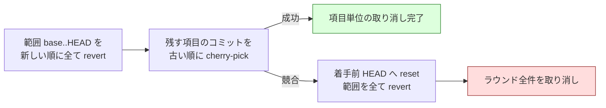

# Step 4〜8: 適用・レビュー・見送り・報告

[← SKILL.md](../SKILL.md)

## Step 4: 適用

```bash
"$SCRIPTS/launch-cli.sh" "$IMPL" apply "$ID" "$ROUND"
"$LIB/monitor.py" "$ID" --agents "$IMPL" --tmp-dir "$TMP_DIR" \
    --stem-template "{agent}-apply-r$ROUND" --timeout 3600
"$SCRIPTS/refactor.py" merge-apply "$ID" "$ROUND"   # 2 = 全件失敗 / 4 = 中断
```

終了コード 2 と 4 を**必ず区別する**。同じ扱いにすると、取り消しに失敗した状態を
「全件失敗」として次の提案ラウンドへ進み、検証を通っていない変更が Pull Request に
残ったまま新しい提案が始まる（実測）。

実装担当を**1 ラウンド 1 回**起動し、採用した改善項目を優先度順に**直列適用**させる。
並列適用はしない（同一ブランチへの同時コミットは競合とレビュー単位の曖昧化を招く）。

作業ディレクトリは `work/` に固定する。適用は常にここでだけ行う。

### 振る舞い不変の担保

プロンプトは `refactoring` Skill の手順をそのまま踏ませるが、**読ませても従うとは
限らない**。そこで `merge-apply` が次を機械的に検証し、満たさない適用結果は失敗として扱う。

**検証の材料は結果ファイルの申告ではなく、git と実際のテスト実行から取る。**
実装担当は自分の成果を報告する側なので、JSON の値をそのまま検査に使うと
「値を書き換えるだけで通る検査」になり、機械検証と呼べない。結果ファイルから使うのは
**どのコミットがどの項目のものか**という対応付けだけである。

| 検証 | 情報源 | 方法 |
| --- | --- | --- |
| 着手前にテストが成功している | 初期化時の実行 | `baseline_test` が `green` でなければ適用に着手せず全項目を `blocked` にする。`red` だけでなく「確認していない」も通さない |
| コミットが実在する | `git rev-list base..head` | 申告された SHA がこのラウンドの範囲にあることを確かめる。実体が無ければ失敗 |
| 範囲のコミットが全て割り当て済み | 同上 | どの項目にも紐づかないコミットが 1 件でもあれば**ラウンドごと取り消す** |
| 実行主体の明記 | `git log -1 --format=%(trailers:only,unfold)` | 4 つのトレーラーが揃っている。**JSON の `trailers` は読まない** |
| 各コミットでテストが成功している | 実際の実行 | コミットを取り出して着手前と同じテストを走らせる。**JSON の `test_status` は読まない**。`--test-timeout`（既定 900 秒）を超えたら失敗 |
| テストが無い経路は先に現状固定テスト | `git show --name-only` | `test_gap` が真の項目は、先頭コミットがテストの置き場所を触っている |
| 項目の分離 | git のトレーラー | 各コミットの `Item-Id` がその項目と一致する。複数の項目を 1 コミットにまとめたら失敗 |
| コミットの粒度 | 申告されたコミットの実数 | 1 改善項目 = 1 コミット。`test_gap` が真の項目だけ 2 コミット |
| 差分予算 | `git show --numstat` | 実差分の合計が `estimated_diff_lines` の 2 倍（抽出系の手法は 3 倍）を超えたら失敗（範囲の逸脱） |
| 対象範囲の遵守 | `git show --name-only` | 触ったファイルが全て `--scope` の中にある。1 つでも外なら失敗 |
| 機能変更の混入なし | — | 機械判定は不可能。レビュー観点に委ねる |

#### 抽出系の手法は差分予算の倍率を上げる

**新しい定義を作って呼び出し側を書き換える手法は、見積より実差分が膨らむ。** 抽出した
本体に加えて、呼び出し側の書き換え・import の追加・引数の受け渡しが固定費として乗る。
提案の時点ではこの固定費が見えにくく、見積は本体の行数へ寄る。

実測で予算超過として落ちた 4 件はいずれも `long_method` の抽出だった。

| 試行 | 実差分 | 見積 | 倍率 |
| --- | ---: | ---: | ---: |
| 4 回目 | 265 行 | 120 行 | 2.21 |
| 4 回目 | 183 行 | 90 行 | 2.03 |
| 5 回目 | 277 行 | 120 行 | 2.31 |
| 5 回目 | 113 行 | 50 行 | 2.26 |

いずれも範囲の逸脱ではなく、倍率 2 の予算をわずかに超えただけである。適用そのものは
成立していたのに、ラウンドの成果を捨てていた。

そこで**抽出系の手法だけ倍率を 3 にする**。全体を広げると、範囲外を触った変更まで
通ってしまう。範囲外の 3 系統を触った実測例は見積の 4 倍まで膨らんでいたので、
抽出系を 3 にしても逸脱は取り逃がさない。

| 倍率 | 手法 |
| --- | --- |
| 3 | `extract_method` / `extract_strategy` / `introduce_parameter_object` / `introduce_value_object` / `split_into_pipeline` / `move_responsibility` / `consolidate_duplication` |
| 2 | 上記以外 |

あわせて提案プロンプトの見積の指示に、呼び出し側の書き換え・import・`test_gap` が
真のときの現状固定テストを数えることを明記した。倍率だけを広げると、見積が
楽観側へ倒れたぶんまで通してしまう。

#### 1 改善項目 = 1 コミットにする

**手順を 1 手ずつ進めることと、その途中経過を履歴に残すことは別である。** 手順は
順に適用してよいが、残すのは項目単位の 1 コミットだけにする。

刻んだままだと 3 つの読みにくさが出る。

| 影響 | 内容 |
| --- | --- |
| 履歴 | Pull Request を読む側が、改善項目と履歴を 1 対 1 で辿れない |
| 取り消し | 範囲を戻して積み直すコミットが、刻んだ件数に比例して増える |
| 検証 | コミットごとにテストを実行するため、実行回数も比例して増える |

実測では採用 12 件に対して適用が 34 コミット、取り消しと積み直しで 25 コミットだった。

**テストの回数も項目の単位に合わせる。** 進行側は申告されたコミットごとにテストを
実行するので、実装担当にも手ごとの実行を義務づけると、同じテストが手数の 2 倍だけ
走る。実測では 44 手に対して 88 回（1 回 26 秒として約 38 分）だった。

| 誰が | いつ | 6 回目の実測 | 項目単位にした後 |
| --- | --- | ---: | ---: |
| 実装担当 | コミットの前に 1 回 | 44 | 14 |
| 進行側 | 申告されたコミットごと | 44 | 14 |

実装担当が途中で確かめる分には止めない。求めるのは**コミットの前に通っていること**
だけで、そこは進行側が実際に実行して確かめる。

例外は現状固定テストが要る項目（`test_gap` が真）だけで、「テスト → 実装」の
2 コミットを許す。1 つに混ぜると、テストが先行したことを履歴から確かめられない。

プロンプトは、途中で刻みたいときの戻し方も渡す。**その項目に着手する前の HEAD**を
控えておき、最後に `git reset --soft` で 1 コミットへまとめる。控えた地点より前へ
戻すと他の項目のコミットを巻き込むため、起点は項目の着手前に固定する。

#### 改修計画を差分へ残す

**なぜ直すのか（理由）とどう直すのか（手順）は、提案の時点でしか残らない。**
状態ファイルには入っているが、そのディレクトリは差分から除外されるため、
Pull Request を読む側からは見えない。

そこで `--plan-file`（既定 `issues/refactoring-plan-rf<PR>.md`）へ書き出す。

- 内容は**状態から決まる**。状態が動いていなければ差分は出ないので、公開のたびに
  書き出しても余計なコミットは積まれない
- 取り消した項目も残す。同じ提案が次のラウンドで来たときの判断材料になる
- 公開は生成物の同期と**同じコミット**に乗せる。分けると進行側のコミットが
  公開のたびに 2 つずつ積まれる
- 空文字を渡すと記録しない。差分へ入れたくないリポジトリのための逃げ道である
- **絶対パスと親へ抜ける経路は受け取った時点で拒む**（終了コード 4）。進行側は利用者の
  リポジトリを触るため、作業ディレクトリの外へ書き出す余地を残さない。あわせて
  `./issues/plan.md` のような表記も正規化する。git が返すパスと形が違うと、公開の
  コミットメッセージが取り違えられる

#### 範囲の指定は検証にも効かせる

`--scope` を必須にした目的は**提案の発散と変更の肥大を防ぐ**ことなので、指定を検証へ
反映しないと目的を果たせない。実測では、編集元から配布物を生成する規約に従った結果として
範囲外の 3 系統が変更され、差分が 4 倍に膨らんで差分予算を超えた。実装担当の判断自体は
リポジトリの規約に沿っており、**規約と範囲の指定が衝突していた**のが原因である。

そこで責務を分ける。

| 誰が | 何を |
| --- | --- |
| 実装担当 | `--scope` の中だけを変更する。生成物の同期もしないし、**push もしない** |
| 進行側 | 検証を通した後に公開する。`--sync-command` を **push の直前**に実行する |

#### 公開するのは進行側だけである

**実装担当に push させない。** 検証を通る前に変更が Pull Request へ現れると、
取り消しの反映が漏れたときにそのまま残る。`merge-apply` と `merge-fix` は、
検証が済んでから進行側として push する。

生成物の同期も同じ経路に乗せる。`--sync-command` を指定すると、**push の直前**に
進行側が実行し、差分があれば**どの改善項目にも属さないコミット**として積む。

| 案 | 結果（実測） |
| --- | --- |
| 同期しない | 同期を検査する pre-push で**あらゆる push が落ちる**。取り消しを反映できない |
| 実装担当に同期させる | 範囲外の変更になり、**採用 5 件が全件失敗**した |
| **進行側が push の直前に同期する** | 採用 |

同期コミットは取り消しでは積み直されないが、次の push で作り直されるため失われても
問題にならない。同期に失敗したら**中断する**（終了コード 4）。同期できない状態を
公開すると、利用者のリポジトリの検査を壊したまま進むことになる。

**同期の前に作業ツリーが綺麗であることを求める。** 汚れたまま同期すると、同期が
作った差分と元からあった差分を区別できない。区別しようと `git status` の状態コードを
比べても足りず、次の 2 つを取りこぼす。

| 取りこぼし | 何が起きるか |
| --- | --- |
| 元から ` M` のファイルを同期がさらに書き換える | 状態コードが変わらず検知できない。その変更がコミットされず **push がまた落ちる** |
| 同期の前から index に staged された変更がある | `git commit` は index を丸ごと含めるため、`git add` の対象を絞っても**検証を受けない変更が公開される** |

無視されたファイルは判定に現れない。生成物やキャッシュを `.gitignore` へ入れてあれば
止まらない。制御用ディレクトリ（状態ファイル・結果・ログ）も判定から外す。

**同期が途中で失敗したら、作った差分を捨ててから中断する。** 残すと次の実行は
清浄性の検査で必ず止まり、`pending_push` の再試行が永久に進まない。着手前が
綺麗だったことは確認済みなので、そこにある変更は全て同期が作ったものだと分かる。
無視されたファイルは消さない（`git clean` に `-x` を付けない）。

判定は**前方一致だけ**で行い、除外規則は持たない。規則を書けるようにすると、
規則を 1 行足すだけで範囲の検査を骨抜きにできる。

そのため **`--scope` には現状固定テストの置き場所も含める**。含めないと、
`test_gap` が真の項目で「テストを先に足せ」と「範囲外を触るな」が両立しなくなり、
その項目は必ず失敗する。

```bash
# ❌ テストの置き場所が入っていない
--scope src/services

# ✅ 直す対象とテストの置き場所を両方入れる
--scope src/services tests/services
```

テストの実行はコミットごとに `git checkout --detach <sha>` して行い、終わったら
必ず元のブランチへ戻す。1 ラウンドの採用上限があるため実行回数は数回に収まり、
CLI の起動コストに比べれば無視できる。

テストは**新しいプロセスグループ**で起動し、打ち切るときは**グループごと**止める。
`shell=True` のまま待ち時間だけ設けても、終了するのはシェルだけで pytest などの
子プロセスは走り続ける。残ったプロセスは同じ作業ディレクトリを書き換え続けるため、
直後の `git checkout` と競合する。

止まったかの判定は、親の終了ではなく**グループの存否**（`killpg(pgid, 0)`）で行う。
親シェルが終わっても、SIGTERM を無視する子はグループに残るためで、猶予を過ぎたら
必ず SIGKILL をグループへ送る。出力を読むパイプは**先に閉じる**。開いたままだと、
パイプを継承した子が残っている限り EOF が来ず、後始末の待ちで止まる。

#### 範囲の起点はオーケストレータが決める

`base..head` の起点は `merge-proposals` が記録した `apply_base_sha`（提案が終わった
時点の HEAD）である。**実装担当の申告は使わない。** 申告に委ねると、欠落や不正の
ときに範囲を確定できず、検査が素通りして過去の任意のコミットが実在扱いになる。

範囲を確定できなかったときは**失敗させる**（全項目を `blocked`）。何も検証できない
まま通すより、止まる方がよい。

#### 割り当てのないコミットを残さない

範囲のコミットは全て、いずれかの改善項目に割り当てられていなければならない。
申告から漏れたコミットは、テストもトレーラーも差分予算も検査されないまま
Pull Request に残る。**都合の悪い変更を申告しないだけで検査を回避できてしまう。**

1 件でも漏れがあれば、どのコミットが安全かを決められないため、**範囲全体を
新しい順に取り消してラウンドごと失敗させる**。

割り当て先として数えるのは、**そのラウンドの改善項目 ID だけ**である。架空の
項目 ID への割り当てを数に入れると、割り当て済みに見えるのに項目別の検証には
入らず、そのまま残せてしまう。ラウンドに無い ID の申告があった時点で失敗させる。

**1 コミットの所有項目は 1 つだけ**でなければならない。複数の項目が同じコミットを
申告したまま進むと、片方が失敗して取り消したときにもう片方は成功のまま残り、
状態ファイルと実際の差分が食い違う。重複を見つけた時点で失敗させる。

#### 叩き直しても同じ判定を返す

進行はどこで止まっても叩き直せることが前提なので、**取り込み済みなら前回と同じ
判定と終了コードを返す**。再実行すると、前回作った取り消しコミットが「未割当」と
判定され、成功した項目まで巻き込んでラウンド全体を取り消してしまう。

| コマンド | 二重処理を防ぐ鍵 |
| --- | --- |
| `merge-proposals` | `proposal_keys` が既にあるか |
| `merge-apply` | `apply.merged_at` が既にあるか |
| `merge-fix` | 試行番号（`judge-review` が進める）と結果ファイルの内容の組 |
| `judge-review` | 修正の世代（`fix_rounds`）とレビュー結果の内容の組 |
| `abandon-items` | `abandoned` が既にあるか |

#### 結果ファイルの形が崩れていても落ちない

相手は LLM なので、`commits` が配列でない・要素が辞書でない・`sha` が文字列でない
といった崩れ方をする。結果ファイルを読む箇所は**型を確かめてから使い**、取り出せた
ものだけを扱う。落ちると進行が止まるだけで、何の検証にもならない。

**1 件の失敗でラウンドを止めない。** 失敗した項目だけを見送りにして、残りは採用する。
全件失敗のときだけ終了コード 2 を返し、次の提案ラウンドへ進む。

#### 判定はその都度記録する

**項目ごとの判定が出るたびに状態ファイルへ保存する。** まとめて最後に保存すると、
取り消しの途中で中断したときに適用の記録が一切残らない。実測では 14 件の適用コミットと
3 件の取り消しコミットが実在するのに、状態ファイルは全項目 `pending` / コミット 0 件の
ままだった。**どのコミットが検証を通ったのかを状態から復元できず、同じ手順を叩き直しても
再開できない。** 再開可能性は収束ループの前提なので、ここが崩れると復帰手段が無くなる。

記録先は `rounds[].apply_progress`（項目 ID / 判定 / 理由 / コミット）である。

#### 取り消しは判定が出そろってからまとめて行う

**失敗した項目のコミットを Pull Request に残さない。** 公開は進行側が検証の後に行うので、
検証で落ちた項目はそもそも公開されない。ただし取り消しはローカルの履歴にも必要である
（残すとレビュー対象と以後のラウンドに混入する）。何が消えるかを先に見たいときは
`--dry-run` を付ける。

取り消した項目は**「対象外」として記録する**（`deferred_items`）。記録しないと同じ提案が
次のラウンドで再び採用され、同じ理由で失敗する。実測では 3 ランタイム全員から再提案され、
合意数が最大になって最優先で採用された。

ただし**項目ごとにその場で戻してはならない**。詳細は
[取り消しは巻き戻して積み直す](#取り消しは巻き戻して積み直す)を参照する。

**取り消しへ着手する前に `pending_push` を立てる。** 取り消しは済んだのに push できずに
終わると、Pull Request 側には未検証の差分が残るのに、次の実行は処理済みガードで
素通りしてしまう。印があれば、次の実行が判定より先に再送信する。

### 実装担当のコミットはフックの検査を通さなくてよい

**生成物の同期を pre-commit で検査するリポジトリでは、そのままだとコミットを作れない。**
実装担当は範囲内だけを変更するので生成物は必ず古くなり、同期は禁じられている。

公開は進行側が検証を通してから行うため、**実装担当のコミット時点で生成物が古いのは
設計どおり**である。そこで、フックが原因でコミットできないときは
`git -c core.hooksPath=/dev/null commit ...` で**そのコミットだけ**フックを外させる。

- 禁止は `--no-verify` だけを名指しにしない。手段の名前で書き分けると、同じことが
  別の名前で起こる。実測では、同じ実装担当が適用フェーズではフックを迂回し、
  修正フェーズでは迂回せず 0 コミットで終えた
- **直した内容は必ずコミットさせる。** 作業ツリーに置いたまま終えると、検証を
  受けていない変更として `merge-apply` / `merge-fix` が捨てる

### 取り込みの前に置き土産を捨てる

`merge-apply` と `merge-fix` は、実装担当が残した未コミットの変更を捨ててから
結果を読む。コミットされなかった変更はどの検証も受けておらず、公開する道が無い。

残したまま進むと、push の直前の清浄性の検査で中断する。実測では、修正フェーズで
コミットを作れなかった実装担当が直しかけの差分を置いたまま終え、続く `merge-fix` が
「修正 0 件」として先へ進むこともできなくなった。

制御用ディレクトリ（状態・結果・ログ）は無視の設定で守られており、消えない。

### コミットトレーラーの形式

適用と修正のコミットメッセージ本文の末尾に、**git のトレーラー形式**で実行主体を残す。

```text
Refactor: extract_method — src/foo/bar.py#BarService.handle

（変更の説明）

Item-Id: R1-003
Round: 1
Impl-Runtime: codex
Impl-Model: gpt-5.5
```

トレーラー形式にするのは
`git log --format='%(trailers:key=Impl-Model,valueonly)'` で**集計できる**ためである。
自由文で「codex が実装」と書かせると集計に使えない。プロンプトに書くだけでは守られない
ので、`merge-apply` が有無を検証する。

`Impl-Model` には**実際に使ったモデル名**を書かせる。既定モデルで走った場合は
`default` として報告時に区別する。

## Step 5: レビュー

```bash
for r in $REVIEWERS; do
  "$SCRIPTS/launch-cli.sh" "$r" review "$ID" "$ROUND"
done
"$LIB/monitor.py" "$ID" --agents "$REVIEWERS_CSV" --tmp-dir "$TMP_DIR" \
    --stem-template "{agent}-review-r$ROUND"
"$SCRIPTS/refactor.py" judge-review "$ID" "$ROUND"
```

レビュー担当 2 者を並列起動し、**ラウンドの差分全体**に対して 1 回レビューさせる。
指摘は AI 自身が `gh api` でインラインコメントとして直接投稿する。

### なぜラウンド単位か

改善項目ごとにレビュー収束を回すと、CLI の起動回数が**採用件数に比例**して膨らむ。
採用 5 件・各項目で修正 1 回とすると、

| レビューの単位 | 内訳 | 起動回数 |
| --- | --- | --- |
| 改善項目ごと | 提案 3 + 5 ×（適用 1 + レビュー 2 + 修正 1 + 再レビュー 2） | 33 |
| **提案ラウンドごと** | 提案 3 + 適用 1 + レビュー 2 + 修正 1 + 再レビュー 2 | **9** |

claude が参加する構成では実際のリファクタリング 1 件で 1.42 ドルの実測があり、
項目ごとのレビューは運用コストに耐えない。

代わりに失うものは 3 つあり、それぞれ埋め合わせている。

| 失うもの | 埋め合わせ |
| --- | --- |
| 項目ごとに実装者が入れ替わらない | 輪番の単位がラウンドなので、重ねれば実装者は分散する |
| 指摘がどの項目に対するものか曖昧になる | 指摘に改善項目 ID を**必須**とし、未知の ID と欠落は差し戻す |
| 1 件の失敗がラウンド全体を巻き込む | 項目ごとに 1 コミットを保ち、**取り消しは項目単位**で行う |

### 判定

| 終了コード | 意味 | 次にすること |
| --- | --- | --- |
| 0 | 2 者とも `APPROVE` | ラウンドを完了し、次の提案ラウンドへ |
| 2 | 1 者でも `REQUEST_CHANGES` | 修正へ（上限に達していれば見送りへ） |
| 3 | 形式が不正 | **差し戻して再レビュー** |
| 4 | レビュー結果が無い / 投稿できていない | **進行を中断する** |

判定は `APPROVE` と `REQUEST_CHANGES` の 2 値である。投稿の event はこれとは別物で、
自分の Pull Request のときだけ `COMMENT` へ倒す（`docs/03-review-viewpoints.md` を参照）。
リファクタリングは必須の作業ではないため、疑義が残るなら通さない側に倒す。

### 投稿されたことを確かめる

投稿は AI 自身が `gh api` で行うため、失敗しても結果ファイルの判定だけは残る。
そのまま採ると、実装担当が読むべき指摘が Pull Request に無いまま収束する。

`judge-review` は結果ファイルの `review_url` を必須とし、URL から識別子を取り出して
`repos/<repo>/pulls/<PR>/reviews/<id>` の存在を確かめる。

| 結果ファイルの申告 | GitHub 側 | 扱い |
| --- | --- | --- |
| `post_error` あり | 見に行かない | 投稿できていない。差し戻す |
| `review_url` なし | 見に行かない | 投稿できていない。差し戻す |
| `review_url` あり | ある | 採用する |
| `review_url` あり | 無い | 差し戻す |
| `review_url` あり | 取得できない | 申告を採用し、確認できなかったことを出力へ残す |

**「無い」と「取得できない」を区別する。** 取得の失敗で止めると、GitHub 側の一時的な
不調で進行が進まなくなる。

差し戻しは 1 回までとし、2 回続けて形式が不正なら変更要求として扱う。
形式を満たせないランタイムでループが止まらなくなるのを防ぐためで、このとき紐づけ先が
決まらないので取り消しはラウンド全件が対象になる。

**結果が無いことと、形が違うことは分ける。** 上限に達したとき、結果ファイルを
残さなかった、または投稿できなかったレビュー担当がいれば変更要求にせず中断する。
どちらもレビュー担当の側で起きたことで、実装担当が直せる指摘ではない。
変更要求へ落とすと、直しようのない指摘を渡された実装担当が空回りし、承認済みの
項目まで見送りへ進む。状態は残るので、原因を直して同じコマンド列を叩き直せば再開できる。

### レビューコメントの署名形式

先頭に人が読む形と集計用の印を両方入れる。

```text
## 🤖 cross-refactoring | round 1 | Reviewer: agy / default | REQUEST_CHANGES
<!-- cross-refactoring reviewer=agy model=default round=1 -->
```

インラインコメントの本文冒頭には **`Item-Id: R1-001`** を必ず書かせる。
ラウンド全体に対する指摘は `item_id` を **`null` と明示**させる。

## Step 6: 修正と見送り

```bash
if "$SCRIPTS/refactor.py" should-abandon "$ID" "$ROUND"; then
  "$SCRIPTS/refactor.py" abandon-items "$ID" "$ROUND"
else
  "$SCRIPTS/launch-cli.sh" "$IMPL" fix "$ID" "$ROUND"
  "$LIB/monitor.py" "$ID" --agents "$IMPL" --tmp-dir "$TMP_DIR" \
      --stem-template "{agent}-fix-r$ROUND"
  "$SCRIPTS/refactor.py" merge-fix "$ID" "$ROUND"
  # 修正後の状態を再レビューさせる
  "$SCRIPTS/prepare-worktrees.sh" "$ID" sync "$(git -C "$WORK" rev-parse HEAD)"
fi
```

**修正のたびに読み取り用の作業ディレクトリを同期する。** レビュー担当は自分の
作業ディレクトリを見るため、同期しないと 2 回目のレビューが**修正前の差分**を
評価してしまう。適用の直後だけでなく、修正の直後にも必要である。

指摘の修正は**実装担当が行う**。レビュー担当に直させるとレビューの独立性が失われる。
ラウンドの未解決指摘をまとめて修正させ、返信と解決まで実行させる。

### 修正コミットも適用と同じ基準で見る

`merge-fix` は修正コミットにも `Item-Id` / `Round` / `Impl-Runtime` / `Impl-Model` と
テストの成功を要求する。判定の材料は適用と同じく **git と実際のテスト実行**から取る。

範囲の起点は `judge-review` が変更要求を返したときの HEAD（`fix_base_sha`）である。
適用と同じく**オーケストレータが記録する**。確定できないときは修正を採らない。
`judge-review` は同時に試行番号（`fix_attempts`）も進める。修正は同じラウンドで
何度も回るため、**叩き直しと次のラウンドを区別する識別子**が要る。内容だけを鍵に
すると、次のラウンドが同じ JSON を返したときに過去と衝突して進めなくなる。

適用と同じく、**範囲のコミットは全て申告されていること**も求める。申告から漏れた
修正コミットは検証を受けないまま Pull Request に残るため、漏れがあればその修正
ラウンドの範囲を取り消す。

**基準を満たさないコミットが 1 件でもあれば、修正ラウンドの範囲ごと取り消す。**
状態へ記録しないだけでは、未検証の変更が Pull Request に残り続ける（見送りの
対象にもならない）。どのコミットが安全かは決められないので、未申告コミットと
同じ扱いにする。適用側だけ厳しくして修正側を素通しにすると、「レビュー指摘への
対応」という名目で手順を外れた変更が入り、そのまま収束済みになる。

取り消したときは解決の申告も一切採らない。**記録は取り消しが起きないと確定して
から行う。** 先に記録すると、取り消し済みのコミットが状態ファイルに残り、後の
見送り処理が同じコミットをもう一度取り消そうとして落ちる。

解決済みにならなかった項目は、修正ラウンドの上限に達した時点で取り消される。

### 解決の申告は突き合わせる

`merge-fix` は結果ファイルの `resolved_thread_ids` を**そのまま信じない**。
GitHub の `reviewThreads` から `isResolved` を取得し、**両方が解決と言っている
スレッドだけ**を解決済みにする。自己申告だけで足りるなら、解決 API に失敗した場合や
実行しなかった場合でも未解決の指摘が取り消し対象から外れてしまう。

GitHub 側を取得できなかったときは、申告を採用せず**未解決のまま**扱う。
「取得できなかった」と「解決済みが 0 件」を混同しないためで、判断がつかないなら
通さない側に倒すという方針と揃えている。

### 見送りは改善項目の単位

修正ラウンドが上限に達したら、**未解決の指摘が紐づく改善項目だけ**を取り消す。
指摘の無い項目と解決済みの項目は Pull Request に残す。

- 取り消しは**範囲を新しい順に全て戻してから、残す項目を積み直す**（次節）
- 取り消しに失敗したら、**着手前の HEAD まで戻してから**中断する。先行して成功した
  取り消しだけが履歴に残ると、再実行で不整合になって進めなくなる。中断は
  **終了コード 4** で表し、「全件失敗」（2）と区別する
- **保存してから push する。** 逆順にすると、push の失敗時に取り消しはローカルへ
  残るのに起点の更新が保存されず、叩き直しで二重に取り消してしまう
- push の前に `pending_push` を立て、成功したら消す。失敗したまま終わっても、
  次の実行が**処理済みの判定より先に**再試行する。印が無いと、取り消しがローカル
  だけに留まったまま処理済みガードで素通りし、Pull Request へ反映されない
- `git push --force` は使わない
- **取り消しは冪等にする。** 取り消し済みの項目には `reverted` を立て、叩き直しても
  もう一度 `git revert` を掛けない。既に戻したコミットへ掛けると必ず失敗し、
  そこから先へ進めなくなる。範囲ごと取り消したときは**起点を取り消し後の HEAD へ
  進める**ので、再実行しても範囲が空になる
- ID が `null` の未解決指摘が 1 件でもあれば、そのラウンドで適用した項目を全件取り消す

**収束しない改善項目は捨てる**のが `cross-review` との重要な差である。レビュー指摘の
修正は必須だが、リファクタリングは任意の作業なので、揉める提案を Pull Request に
残さない方が安全である。

### 取り消しは巻き戻して積み直す

**項目のコミットだけを新しい順に戻す方法では足りない。** その並べ替えは同じ項目に属する
コミットの中でしか働かず、取り消し対象より新しい**別項目**のコミットが同じ箇所を触って
いると必ず競合する。実測では、採用した 5 件のうち 4 件が同一ファイルの隣接領域を変更して
おり、取り消しが競合して進行が止まった。

```text
❌ R1-002 のコミット ea3209c を取り消せませんでした: error: could not revert ea3209c...
```

そこで次の順で行う。



- 範囲全体を新しい順にたどる取り消しは**履歴の逆再生**なので競合しない。競合するのは
  「一部のコミットだけを飛ばして戻す」ときである
- 積み直しの対象は**残す項目に属するコミットだけ**。過去の取り消しコミットのように
  どの項目にも属さないものは積み直さない
- **積み直しで SHA が変わる。** 状態ファイルの `items[].commits` を新しい SHA へ
  更新する。更新しないと、次の取り消しが履歴に無い SHA を指す
- `git push --force` は使わない。履歴の書き換えではなく、**revert と cherry-pick による
  前進だけ**で行う

#### 隣接する変更は分離できない

**項目単位で取り消せるのは、項目どうしの変更が独立しているときだけである。**
取り消す側と残す側が同一ファイルの隣接行を触っていると、積み直しの
`git cherry-pick` も競合する。取り消した側の行が消えることで、残す側のパッチが
前提にしている文脈も消えるためで、これは git だけでは決められない。

| 位置関係 | 結果 |
| --- | --- |
| 別ファイル | 項目単位 |
| 同一ファイルの離れた行 | 項目単位 |
| 同一ファイルの隣接行 | **ラウンド全件へ退避** |

退避したときは着手前の状態まで戻し、ラウンドの全項目を見送る。半端な履歴を残すより、
決定的な状態へ落とす方が安全である。退避したことは `rounds[].drops[].mode` に
`round` として残るので、頻度は報告から読める。

実測（Pull Request #118）では採用 5 件のうち 4 件が同一ファイルの隣接領域を変更して
いた。**この構成では退避が普通に起こる**と見込んでおく。項目単位を保ちたいなら、
`--max-items-per-round` を下げるか、`--scope` を狭めて 1 ラウンドで同じファイルの
近い場所を複数触らせないようにする。

範囲の起点を記録していない状態ファイル（旧版）では積み直せないため、従来どおり
項目のコミットだけを新しい順に戻す。この経路では取り消し自体が競合しうる。

## Step 7: 提案ラウンドの収束と最終ゲート

```bash
"$SCRIPTS/refactor.py" advance "$ID"   # 終了コード 1 = 終了
```

終了条件は 3 つ。

| 条件 | 記録される理由 |
| --- | --- |
| 採用 0 件 | `no_more_proposals` |
| `--max-outer-rounds` 到達 | `max_outer_rounds` |
| 前ラウンドとの提案重複率が 70% 以上 | `duplicate_proposals` |

重複率は `path` + `symbol` + `smell` の集合比較で求める。同じ提案が毎ラウンド出続けて
終わらない状態を検知するためである。

**ここで追加の同期は要らない。** 生成物の同期は `--sync-command` として
各 push の直前に済んでいる（Step 4 の「公開するのは進行側だけである」を参照）。
手で同期すると、検証を受けていない差分を作ることになる。

続けて **`/ndf:cross-review <PR>`** で Pull Request 全体を承認収束にかける。
レビューはラウンド単位なので、**ラウンドを跨いだ整合はここで見る**。

## Step 8: 報告

```bash
"$SCRIPTS/refactor.py" report "$ID" --metrics
```

`--metrics` は状態ファイルに既に記録されている値だけを集計する。**新しい計測の仕組みは
作らない。**

| 役割 | 指標 |
| --- | --- |
| 実装担当 | 担当ラウンド数 / 適用成功した項目数 / 見送った項目数 / **初回レビューで承認を得た率** / 平均修正ラウンド数 / 差分予算の超過率 / テスト失敗の発生率 / 所要時間 |
| レビュー担当 | レビュー回数 / 指摘件数 / **指摘が修正に至った率** / もう 1 人との判定一致率 / 所要時間 |

### 集計の読み方

集計は**ランタイムとモデルの組**で行う。kiro は claude 系も gpt 系も提供するため、
**実行環境（ハーネス）とモデルは独立に選べる**。ランタイムだけでまとめると、差が
ハーネス由来かモデル由来か切り分けられない。

| 比べたいもの | 揃えるもの | 例 |
| --- | --- | --- |
| モデルの差 | ランタイムを固定 | kiro の claude-opus-5 と kiro の gpt-5.6-sol |
| ハーネスの差 | モデルを固定 | kiro の claude-opus-5 と claude の opus-5 |

### 比較の限界

**この数値は厳密なベンチマークではない。** 報告には必ず次を添える（`format_report` が
自動で出す）。

- **改善項目の難易度が揃わない。** 輪番はラウンド単位なので、たまたま重い項目群を引いた
  ランタイムは不利になる。ラウンド数が少ないほど差は偶然に支配される
- **提案と適用の相性がある。** 自分が提案した項目を自分が適用するラウンドでは有利になりうる
- **レビュー担当の厳しさは指標に直結する。** 指摘件数は「優秀」とも「過剰」とも読めるため、
  指摘が修正に至った率と併せて見る
- **ハーネスとモデルが交絡する。** ランタイムを跨いだ比較は、モデルを揃えない限り
  「どちらのモデルが優秀か」の答えにならない
- **kiro の既定 `auto` は比較に使えない。** ラウンドごとに違うモデルが動きうる

公平に比べたいなら、**同じ対象・同じ範囲で `--model` だけ変えて複数回走らせる**のが
最も素直な方法である。1 回の実行内での比較は参考値にとどまる。
