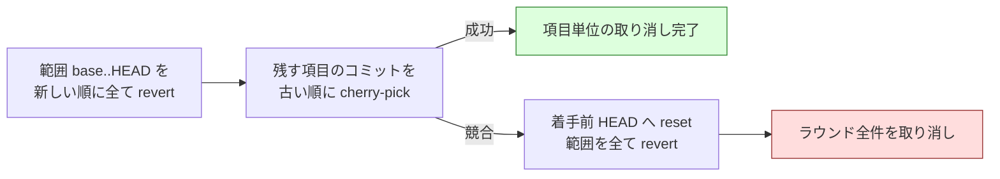

# Step 6〜8: 修正・見送り・最終ゲート・報告

[← SKILL.md](../SKILL.md) / [← Step 4〜5](02-apply-and-review.md)

## Step 6: 修正と見送り

```bash
if "$SCRIPTS/refactor.py" should-abandon "$ID" "$ROUND"; then
  "$SCRIPTS/refactor.py" abandon-items "$ID" "$ROUND"
else
  "$SCRIPTS/launch-cli.sh" "$IMPL" fix "$ID" "$ROUND"
  "$LIB/monitor.py" "$ID" --agents "$IMPL" --tmp-dir "$TMP_DIR" \
      --stem-template "{agent}-fix-r$ROUND"
  "$SCRIPTS/refactor.py" merge-fix "$ID" "$ROUND"
  # 修正後の状態を次の提案へ届ける
  "$SCRIPTS/prepare-worktrees.sh" "$ID" sync "$(git -C "$WORK" rev-parse HEAD)"
fi
```

**修正のたびに読み取り用の作業ディレクトリを同期する。** 提案の担当は自分の
作業ディレクトリを見るため、同期しないと次のラウンドが**修正前のコード**に対して
提案してしまう。適用の直後だけでなく、修正の直後にも必要である。

**直すのはテストの失敗である**（#436 決定 3）。判定は適用ラウンド（群）の単位で
出るため、**どの項目が落としたのかは特定しない。** 修正は**実装担当が行う**
（その群を適用した者が、適用後のコードを持っている）。

**`--max-fix-rounds` は 1 つの適用ラウンドあたりの上限である。** 数え直しは
`next-apply-round` が群を開くときに行う。

### 修正コミットも適用と同じ基準で見る

`merge-fix` は修正コミットにも `Item-Id` / `Round` / `Impl-Runtime` / `Impl-Model` と
テストの成功を要求する。判定の材料は適用と同じく **git と実際のテスト実行**から取る。

範囲の起点は `verify-round` がテストの失敗を返したときの HEAD（`fix_base_sha`）で
ある。適用と同じく**オーケストレータが記録する**。確定できないときは修正を採らない。
`verify-round` は同時に試行番号（`fix_attempts`）も進める。修正は同じ群で何度も
回るため、**叩き直しと次のラウンドを区別する識別子**が要る。内容だけを鍵に
すると、次のラウンドが同じ JSON を返したときに過去と衝突して進めなくなる。

適用と同じく、**範囲のコミットは全て申告されていること**も求める。申告から漏れた
修正コミットは検証を受けないまま Pull Request に残るため、漏れがあればその修正
ラウンドの範囲を取り消す。

**基準を満たさないコミットが 1 件でもあれば、修正ラウンドの範囲ごと取り消す。**
状態へ記録しないだけでは、未検証の変更が Pull Request に残り続ける（見送りの
対象にもならない）。どのコミットが安全かは決められないので、未申告コミットと
同じ扱いにする。適用側だけ厳しくして修正側を素通しにすると、「テストの失敗への
対応」という名目で手順を外れた変更が入り、そのまま収束済みになる。

取り消したときは解決の申告も一切採らない。**記録は取り消しが起きないと確定して
から行う。** 先に記録すると、取り消し済みのコミットが状態ファイルに残り、後の
見送り処理が同じコミットをもう一度取り消そうとして落ちる。

テストが通らないままの群は、修正ラウンドの上限に達した時点で取り消される。

### 解決の申告は突き合わせる

**Pull Request にレビュースレッドが付いているときだけ働く。** Step 5 の検証は
レビューを起動しないため、通常は対象が無い。Step 7 の `cross-review` や人が付けた
指摘に対応したときに効く。

`merge-fix` は結果ファイルの `resolved_thread_ids` を**そのまま信じない**。
GitHub の `reviewThreads` から `isResolved` を取得し、**両方が解決と言っている
スレッドだけ**を解決済みにする。自己申告だけで足りるなら、解決 API に失敗した場合や
実行しなかった場合でも未解決の指摘が取り消し対象から外れてしまう。

GitHub 側を取得できなかったときは、申告を採用せず**未解決のまま**扱う。
「取得できなかった」と「解決済みが 0 件」を混同しないためで、判断がつかないなら
通さない側に倒すという方針と揃えている。

### 見送りは適用ラウンドの単位

修正ラウンドが上限に達したら、**その適用ラウンド（群）を取り消す**（#436 決定 2）。
**他の群には及ばない。** 既に検証を通った群は Pull Request に残る。

**群の中は 1 コミットなので、1 件の失敗が群の全件を巻き込む。** 仕様の限界である。
分離を細かくしたい利用者は `--max-items-per-round` を下げる。

**外へ出す文章には件数だけを書く**（#436 決定 6-b）。内訳は改修計画へ譲る。
同じ一覧を 2 か所に置くと、片方だけが古くなる。

- 取り消しは**範囲を新しい順に全て戻してから、残す項目を積み直す**（次節）
- 取り消しに失敗したら、**着手前の HEAD まで戻してから**中断する。先行して成功した
  取り消しだけが履歴に残ると、再実行で不整合になって進めなくなる。中断は
  **終了コード 4** で表し、「全件失敗」（2）と区別する
- **保存してから push する。** 逆順にすると、push の失敗時に取り消しはローカルへ
  残るのに起点の更新が保存されず、叩き直しで二重に取り消してしまう
- push の前に `pending_push` を立て、成功したら消す。失敗したまま終わっても、
  次の実行が**処理済みの判定より先に**再試行する。印が無いと、取り消しがローカル
  だけに留まったまま処理済みガードで素通りし、Pull Request へ反映されない
- `git push --force` は使わない
- **取り消しは冪等にする。** 取り消し済みの項目には `reverted` を立て、叩き直しても
  もう一度 `git revert` を掛けない。既に戻したコミットへ掛けると必ず失敗し、
  そこから先へ進めなくなる。範囲ごと取り消したときは**起点を取り消し後の HEAD へ
  進める**ので、再実行しても範囲が空になる

**収束しない改善項目は捨てる**のが `cross-review` との重要な差である。レビュー指摘の
修正は必須だが、リファクタリングは任意の作業なので、テストを通せない提案を
Pull Request に残さない方が安全である。

### 取り消しは巻き戻して積み直す

**項目のコミットだけを新しい順に戻す方法では足りない。** その並べ替えは同じ項目に属する
コミットの中でしか働かず、取り消し対象より新しい**別項目**のコミットが同じ箇所を触って
いると必ず競合する。実測では、採用した 5 件のうち 4 件が同一ファイルの隣接領域を変更して
おり、取り消しが競合して進行が止まった。

```text
❌ R1-002 のコミット ea3209c を取り消せませんでした: error: could not revert ea3209c...
```

そこで次の順で行う。



- 範囲全体を新しい順にたどる取り消しは**履歴の逆再生**なので競合しない。競合するのは
  「一部のコミットだけを飛ばして戻す」ときである
- 積み直しの対象は**残す項目に属するコミットだけ**。過去の取り消しコミットのように
  どの項目にも属さないものは積み直さない
- **積み直しで SHA が変わる。** 状態ファイルの `items[].commits` を新しい SHA へ
  更新する。更新しないと、次の取り消しが履歴に無い SHA を指す
- `git push --force` は使わない。履歴の書き換えではなく、**revert と cherry-pick による
  前進だけ**で行う

#### 隣接する変更は分離できない

**項目単位で取り消せるのは、項目どうしの変更が独立しているときだけである。**
取り消す側と残す側が同一ファイルの隣接行を触っていると、積み直しの
`git cherry-pick` も競合する。取り消した側の行が消えることで、残す側のパッチが
前提にしている文脈も消えるためで、これは git だけでは決められない。

| 位置関係 | 結果 |
| --- | --- |
| 別ファイル | 項目単位 |
| 同一ファイルの離れた行 | 項目単位 |
| 同一ファイルの隣接行 | **ラウンド全件へ退避** |

退避したときは着手前の状態まで戻し、ラウンドの全項目を見送る。半端な履歴を残すより、
決定的な状態へ落とす方が安全である。退避したことは `rounds[].drops[].mode` に
`round` として残るので、頻度は報告から読める。

実測（Pull Request #118）では採用 5 件のうち 4 件が同一ファイルの隣接領域を変更して
いた。**この構成では退避が普通に起こる**と見込んでおく。項目単位を保ちたいなら、
`--max-items-per-round` を下げるか、`--scope` を狭めて 1 ラウンドで同じファイルの
近い場所を複数触らせないようにする。

範囲の起点を記録していない状態ファイル（旧版）では積み直せないため、従来どおり
項目のコミットだけを新しい順に戻す。この経路では取り消し自体が競合しうる。

## Step 7: ラウンドの収束と最終ゲート

```bash
"$SCRIPTS/refactor.py" advance "$ID"   # 終了コード 1 = 終了
```

`advance` は**ラウンドの繰り返しを続けるか**と、**テスト整備ラウンドから提案
ラウンドへ切り替えるか**の 2 つを決める。判定を 1 か所へ置き、ラウンドを開く側
（`start-round`）は宣言に従うだけにする。

終了条件は 3 つ。

| 条件 | 記録される理由 |
| --- | --- |
| 採用 0 件 | `no_more_proposals` |
| `--max-outer-rounds` 到達 | `max_outer_rounds` |
| 前ラウンドとの提案重複率が 70% 以上 | `duplicate_proposals` |

重複率は鍵の集合比較で求める（改善項目は `path` + `symbol` + `smell`、テスト項目は
`target` + `case`）。同じ提案が毎ラウンド出続けて終わらない状態を検知するためである。
**比べるのは同じ種類のラウンドどうしである。** 鍵の形が違うため、テスト整備ラウンドを
相手にすると重なりが常に 0 になり、判定が働かない。

`advance` は**テスト整備ラウンドから提案ラウンドへの切り替え**も決める。切り替えの
理由は `test_rounds_final` に残る（`no_more_test_proposals` か `max_test_rounds`）。
**テスト整備の側で進行を終わらせない。**

**ここで追加の同期は要らない。** 生成物の同期は `--sync-command` として
各 push の直前に済んでいる（Step 4 の「公開するのは進行側だけである」を参照）。
手で同期すると、検証を受けていない差分を作ることになる。

### 最終ゲートは起動のされ方で変わる

```bash
"$SCRIPTS/refactor.py" final-gate "$ID"   # FINAL_GATE=... を返す
```

| 起動のされ方 | 最終ゲート | 見分け方 |
| --- | --- | --- |
| `development-workflow` の 1 工程 | `cross-review` を省き、**全体のテスト**で判定 | `init` に `--workflow-step` |
| 単独 | `cross-review` を実行 | 既定 |

**引数で受け取る**（決定 7）。環境変数や控えの読み取りは、起動元が違っても同じ値に
なりうる。呼ぶ側が明示する形にすれば、判定が 1 か所で済む。

| 終了コード | 意味 | 進行 |
| --- | --- | --- |
| 0 | 通過した（`FINAL_GATE=cross-review` なら続けて `cross-review` を実行する） | 次へ |
| 2 | 落ちた | 修正ラウンドを回して `final-gate` をやり直す |
| 1 | 修正の上限に達した | **取り消さず**、失敗として報告する |

**`--ci-check` の扱いは排他である。** 指定があれば手元のテストを実行せず継続的統合の
成功だけで判定し、無ければ手元のテストだけで判定する。**採った側が失敗した・結果を
得られないときは通過させない**（fail-closed）。

- 読むのは `check-runs` の 1 回だけ。**`status` は使わない**（GitHub Actions は
  検査ジョブを記録し commit の状態を記録しないため、常に `pending` を返す）
- 名前が一致する検査が 1 件も無いときも通過させない。**別の検査の成功で通さない**
- **「どちらか一方が通れば通過」とはしない。** OR で採ると、手元のテストの失敗を
  継続的統合の成功が覆す

**継続的統合で代替できるのは Step 7 だけである。** Step 5 は手元の未 push のコミットを
検証するため、継続的統合の結果がそもそも無い。

**Step 7 は push 済みの地点である。** 上限に達しても取り消さない。取り消しの判断は
Pull Request の読み手が持つため、失敗として報告に書く。

### 最終ゲートの修正は適用ラウンドの修正と別物である

```bash
"$SCRIPTS/launch-cli.sh" "$FINAL_FIX_IMPL" final-fix "$ID"   # 担当は final-gate が返す
"$SCRIPTS/refactor.py" merge-final-fix "$ID"                 # 取り込みも専用
```

**`fix` フェーズと `merge-fix` は使い回せない。** どちらも適用ラウンド（群）の控えを
読み、範囲の起点・担当・改善項目の 3 つをそこから取る。最終ゲートが直すのは**全体の
テストの失敗**で、そのどれも持たない。流用すると次の 3 つが起きる。

| 流用したときに起きること | なぜ |
| --- | --- |
| 「起点 None」で止まり、修正を 1 件も取り込めない | 最後の群が検証を通っていれば `fix_base_sha` が無い |
| 正常なコミットまで取り消される | 古い起点が残っていると、そこから HEAD までが範囲になる。検証を通った群のコミットが未申告と判定される |
| トレーラーが揃わず全件が不正になる | `Item-Id` を要求するが、最終ゲートの修正は改善項目に属さない |

そのため `final-gate` は落ちるときに**担当と範囲の起点を記録して返す**。

| 返す値 | 何に使うか |
| --- | --- |
| `FINAL_GATE=failing` | 修正ラウンドへ入る合図 |
| `FINAL_FIX_IMPL` | 修正を起動する担当。**最初に落ちたときだけ輪番を 1 つ進め、以後は同じ担当が続ける** |
| `FINAL_FIX_ROUND` | 何回目の修正か |

起点（`final_gate.fix_base_sha`）は落ちた時点の HEAD である。`merge-final-fix` は
その範囲だけを見る。

**求めるトレーラーは 2 つである**（`Impl-Runtime` / `Impl-Model`）。`Item-Id` と
`Round` は書かせない。実在しない番号を実装担当が作ることになるためである。

**コミットごとのテストの合否は見ない。** `--ci-check` を指定した実行では手元の
テストを 1 度も走らせないと決めてあるので、ここでコミットごとに走らせるとその排他を
この経路だけが破る。合否は直後の `final-gate` が採った側で 1 度だけ見る。

**申告から漏れたコミットと範囲外を触ったコミットは、この修正の範囲ごと取り消す。**
「上限に達しても取り消さない」のは*採用した改善項目*の話であって、検証を受けていない
修正コミットは別である。取り消せば HEAD は最終ゲートが見た地点へ戻る。

### テストで見つからない誤りは誰が拾うか

Step 5 をテストへ置き換え、Step 7 を条件付きで省くと、実行の流れからレビューが
2 か所とも消えうる。**答えは起動のされ方で分かれる。**

| 起動のされ方 | 誰が拾うか |
| --- | --- |
| 単独 | **Step 7 の `cross-review`。** 省略しない |
| `development-workflow` の 1 工程 | **工程表の「レビュー」。** この Skill の後に `pr` → `cross-review` が続く |

**この Skill の中へ軽量なレビューを足さない。** 工程として起動したときに Step 7 を
省くのは、**同じ差分を 2 度レビューしないため**である。v10.5.1 で `light` も
`cross-review` を通すと決めたため、モードによらずレビューは必ず 1 度掛かる。

### 単独起動のときの `cross-review`

**`/ndf:cross-review <PR>`** で Pull Request 全体を承認収束にかける。
検証はラウンド単位なので、**ラウンドを跨いだ整合はここで見る**。

**ラウンド内で見た観点を渡し直さない。** その項目が振る舞いを変えていないかは
Step 5 のテストが済ませている。同じ観点を後段へ渡すと、収束した判断をもう一度
やり直すことになる。次の定型を `--focus` で渡す。

```bash
/ndf:cross-review "$PR" --focus "ラウンドを跨いだ整合を見る。個々の改善項目の妥当性はラウンド内で判定済みのため対象外とする。複数ラウンドで触った箇所の重複・打ち消し・命名の揺れ、取り消した項目の残骸、生成物と配布物の同期を確かめる"
```

**Step 5 をテストへ置き換えたことで失う検出も、ここで補う。** テストが通ることは
振る舞いが変わっていないことの証拠だが、構造そのものの良し悪しは測れない。

## Step 8: 報告

```bash
"$SCRIPTS/refactor.py" report "$ID" --metrics
```

`--metrics` は状態ファイルに既に記録されている値だけを集計する。**新しい計測の仕組みは
作らない。**

| 役割 | 指標 |
| --- | --- |
| 実装担当 | 担当ラウンド数 / 適用成功した項目数 / 見送った項目数 / 平均修正ラウンド数 / 差分予算の超過率 / テスト失敗の発生率 / 所要時間 |
| 提案の担当 | 提案件数 / 採用された率 / 他者と合意した率 / 所要時間 |

### 報告も外へ出す文章である

| 規約 | 報告での書き方 |
| --- | --- |
| 項目の指し方 | 改善項目の表は **`<ファイル>#<シンボル>`** を持つ（項目 ID だけでは何を直したか分からない） |
| 取り消した項目 | **件数だけ**述べる。「見送った提案」の節は件数と改修計画の参照だけを持つ |
| 改修計画 | **生の URL**を見出しの直後と見送りの節へ入れる |
| 終わり方 | **上限で抜けたのか収束して終わったのか**を書く（`final` と `test_rounds_final`） |

### 集計の読み方

集計は**ランタイムとモデルの組**で行う。kiro は claude 系も gpt 系も提供するため、
**実行環境（ハーネス）とモデルは独立に選べる**。ランタイムだけでまとめると、差が
ハーネス由来かモデル由来か切り分けられない。

| 比べたいもの | 揃えるもの | 例 |
| --- | --- | --- |
| モデルの差 | ランタイムを固定 | kiro の claude-opus-5 と kiro の gpt-5.6-sol |
| ハーネスの差 | モデルを固定 | kiro の claude-opus-5 と claude の opus-5 |

### 比較の限界

**この数値は厳密なベンチマークではない。** 報告には必ず次を添える（`format_report` が
自動で出す）。

- **改善項目の難易度が揃わない。** 輪番はラウンド単位なので、たまたま重い項目群を引いた
  ランタイムは不利になる。ラウンド数が少ないほど差は偶然に支配される
- **提案と適用の相性がある。** 自分が提案した項目を自分が適用するラウンドでは有利になりうる
- **ハーネスとモデルが交絡する。** ランタイムを跨いだ比較は、モデルを揃えない限り
  「どちらのモデルが優秀か」の答えにならない
- **kiro の既定 `auto` は比較に使えない。** ラウンドごとに違うモデルが動きうる

公平に比べたいなら、**同じ対象・同じ範囲で `--model` だけ変えて複数回走らせる**のが
最も素直な方法である。1 回の実行内での比較は参考値にとどまる。
