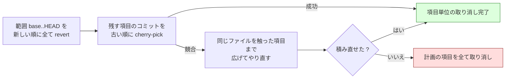

# 検証/修正・最終ゲート・配分テーブル・報告

[← SKILL.md](../SKILL.md)

## 検証と修正

```bash
while :; do
  rf_eval verify "$ID"             # VERIFY=done|fix
  [ "$VERIFY" = fix ] || break
  rf_eval start-phase "$ID" fix
  "$SCRIPTS/launch-cli.sh" "$IMPL" fix "$ID"
  "$LIB/monitor.py" "$ID" --agents "$IMPL" --tmp-dir "$TMP_DIR" \
      --stem-template "{agent}-fix-rf$ID" --phase fix \
      --timeout "$PHASE_TIMEOUT" --stall-timeout "$PHASE_TIMEOUT"
  rf merge-fix "$ID"
done
```

**駆動の繰り返しはこの 1 つだけである。** `verify` は次の順で進む。

1. 実装済みの項目ごとに、**HEAD で限ったテスト**を走らせる。語の並びが同じ項目どうしは
   1 回だけ走らせて結果を共有する。出力は `<TMP_DIR>/verify-<項目>.log` に残り、修正の
   雛形へ渡る
2. 修正に使える残り時間（開始 + 想定最大時間 − 全体のテスト 2 回分の控え − 最終ゲートの修正の控え `final_fix` − 今）が控えの
   `fix` に足りなければ、落ちた項目を**取り消す**。**回数の上限は持たない**（決定 23）。
   1 回の修正 = 実装担当の 1 起動で、次の試行の前にここで時計を見る。修正の監視の上限は
   直しの試行の打ち切りまでの残り + 余裕（`start-phase fix` の `PHASE_TIMEOUT`）
   - **同じ語の並びを共有した項目は、新しい項目から 1 件ずつ取り消し、そのたびに共有した
     コマンドを走らせ直し、通った時点で止める**（AC15）。通る前に取り消した項目だけが
     取り消しになり、古い項目のコミットは残る。走らせ直すのは限ったテストである
3. 落ちた項目が残れば `VERIFY=fix` を返す。修正は落ちた項目のすべてを対象に 1 回起動し、
   修正の回数も対象の項目に同じだけ数える
4. 落ちた項目が無くなったら危険の印を判定する（下の節）。印が 1 つでもあり、まだ走らせて
   いなければ**全体のテストを 1 度だけ**走らせる
5. 全体のテストが落ちたら、**落ちたテストだけ**を走らせ直して見分ける（決定 22）。全体の
   テストは検証の中で走らせ直さない
   - 出力（pytest の要約の `FAILED` / `ERROR` の行）から落ちたテストの ID を取り出し、
     今の HEAD で走らせ直す。通れば**揺れ**
   - まだ落ちるものを着手前の HEAD（`init` が残した SHA）で走らせる。作業ディレクトリは
     動かさず、一時の detach の作業ツリーで走らせて消す。落ちれば**元からの失敗**
   - 揺れと元からの失敗は取り消さず、`whole_test` に分類して残す
   - 残り（**変更が原因**）は、2 と同じ締め切りの内なら印の項目を修正へ回す
     （`VERIFY=fix`）。修正担当には落ちたテストだけを走らせ直すコマンドとその出力を渡し、
     次の `verify` は落ちたテストだけを走らせ直す。通れば残す
   - 締め切りまでに通らなければ、印の項目を**新しい順に 1 件ずつ**取り消し、
     落ちたテストが通った時点で止める（2 と同じ形）。取り消した後の HEAD は最終ゲートが
     全体のテストで確かめる
   - **落ちたテストを取り出せない**（実行器が pytest でない・要約の行が無い・打ち切り）
     ときは、見分けずに印の項目をまとめて取り消し（決定 15 の扱い）、理由を残す
6. 公開して `VERIFY=done` を返す

**継続的統合では代替しない。** 検証が見るのは手元の未 push のコミットである。代替できる
のは push の後の最終ゲートだけである（`--ci-check`）。

### 修正の取り込み（`merge-fix`）

修正の起点（落ちたときの HEAD）から HEAD までのコミットを `Item-Id` で読み、修正の対象の
項目のものだけを受け取る。**1 件でも手順を外れたら修正の範囲ごと取り消す**（対象でない
`Item-Id`・トレーラーの欠け・範囲の外・期待値の変更）。どのコミットが安全かを決められない
ためである。**どちらの場合も修正の回数は数える**（報告に出す）。往復を止めるのは回数では
なく締め切りである（2）。修正の所要は `start-phase fix` からの時計で測り、配分テーブルの `fix` に使う。

**取り込んでいない修正があるまま `verify` を呼ぶと、先に取り込む。** 修正の後に落ちて
再開したとき、修正のコミットが項目に結ばれないまま HEAD に残るのを防ぐ。

### 危険の印

| 印 | 条件 | 見るもの |
| --- | --- | --- |
| D1 | 項目のコミットが、項目の `path` と `tests` 以外のファイルを触った | `git show --name-only` |
| D2 | ファイルを消した・名前を変えた | `git diff-tree --name-status -M` の `D` / `R` |
| D3 | 触った本番のファイルが `--scope` の外のコードから参照されている | `git grep -lE`（下の注） |
| D4 | 限ったテストが触った本番のファイルを覆うと示せない | 限ったテストのファイルに、拡張子を除いたファイル名と `symbol` の名前のどちらも現れない |
| D5 | 公開の入出力が変わりうる | Jev（確信度 0.7 以上で真）。使えなければ実装担当の `risk` |

- **D3** は `--scope` の外の**コードのファイルだけ**を、モジュールの参照の形で探す。探す語は
  触ったファイルの末尾の 2 区切り（`refactor_lib/plan.py` なら `refactor_lib/plan`・
  `refactor_lib\.plan`・`refactor_lib import .*\bplan\b`）と、修飾名の `symbol` の全体である。
  直下のファイルは行頭の `import <語幹>` / `from <語幹>`。パッケージの入口（`__init__.py` /
  `index.*` / `mod.rs` など）は探さずに立てる。**当たらないときは立てない**。動的な読み込みの
  見落としは残る危険として受け入れ、最終ゲートが拾う（決定 20）
- **D4** の「限ったテストのファイル」は、`test_targets` から組み立てた項目では対象のパス、
  `--round-test` をそのまま使う項目では、その対象の語の配下の追跡されたファイルである。
  対象の語が無い（`make test` など）ときは示せないので立てる（決定 21）
- **D5 の `risk` は印を立てる側にだけ使う。** 申告で検証を減らさない
- **D5 は計画の段で問い、検証は `items[].public_io` を読むだけである**（決定 25）。Jev へ送るのは
  提案のフィールド（手法・理由・手順）だけで、差分の本文・ファイルの本文・テストの出力は送らない
- 印は項目ごとに `items[].danger`、全体として走らせた理由は `whole_test.flags` に残る

### 取り消しは巻き戻して積み直す

**項目のコミットだけを新しい順に戻す方法では足りない。** その並べ替えは同じ項目に属する
コミットの中でしか働かず、取り消し対象より新しい**別項目**のコミットが同じ箇所を触って
いると必ず競合する。実測では、採用した 5 件のうち 4 件が同一ファイルの隣接領域を変更して
おり、取り消しが競合して進行が止まった。

```text
❌ I-002 のコミット ea3209c を取り消せませんでした: error: could not revert ea3209c...
```

そこで次の順で行う。



- 範囲全体を新しい順にたどる取り消しは**履歴の逆再生**なので競合しない。競合するのは
  「一部のコミットだけを飛ばして戻す」ときである
- 積み直しの対象は**残す項目に属するコミットだけ**。過去の取り消しコミットのように
  どの項目にも属さないものは積み直さない
- **積み直しで SHA が変わる。** 状態ファイルの `items[].commits` を新しい SHA へ
  更新する。更新しないと、次の取り消しが履歴に無い SHA を指す
- `git push --force` は使わない。履歴の書き換えではなく、**revert と cherry-pick による
  前進だけ**で行う

#### 隣接する変更は分離できない

**項目単位で取り消せるのは、項目どうしの変更が独立しているときだけである。**
取り消す側と残す側が同一ファイルの隣接行を触っていると、積み直しの
`git cherry-pick` も競合する。取り消した側の行が消えることで、残す側のパッチが
前提にしている文脈も消えるためで、これは git だけでは決められない。

| 位置関係 | 結果 |
| --- | --- |
| 別ファイル | 項目単位 |
| 同一ファイルの離れた行 | 項目単位 |
| 同一ファイルの隣接行 | **同じファイルを触った項目まで広げる**（`widened`）。それでも積み直せなければ**全件**（`all`） |

1 回目の競合で全件を捨てず、同じファイルを触った項目までを取り消しへ広げて 1 度だけ
やり直す（実装計画 I6）。広げても積み直せなければ、計画の項目をすべて取り消す。半端な
履歴を残すより、決定的な状態へ落とす方が安全である。どの段で終わったかは状態の
`drops[].mode`（`item` / `widened` / `all`）に残り、巻き込まれた項目の
`failure_reason` にもその旨が残る。

実測（Pull Request #118）では採用 5 件のうち 4 件が同一ファイルの隣接領域を変更して
いた。**この構成では広げる取り消しが普通に起こる**と見込んでおく。

**中断しても再開できる。** 取り消しの前に `pending_drop` と `pending_push` を立てて保存し、
終わったら印を消す。印が残ったまま再開したら、取り込みと検証の入口で同じ取り消しを
やり直す（範囲全体の逆再生なので、やり直しても同じ木になる）。

## 最終ゲート

```bash
"$SCRIPTS/refactor.py" final-gate "$ID"   # FINAL_GATE=... を返す
```

| 起動のされ方 | 最終ゲート | 検証の中の全体のテストとの関係 |
| --- | --- | --- |
| `--ci-check` あり（単独・工程の 1 つ） | 継続的統合の結果 | 取り消した後の HEAD も継続的統合が確かめる |
| 工程の 1 つ・`--ci-check` なし | 全体のテスト | **検証の中で走って通り（取り消しが無く）、その後に HEAD が 1 つも進んでいなければ走らせずに通す** |
| 単独・`--ci-check` なし | 全体のテストを 1 度 → 通れば `cross-review` | 同上（使い回せれば走らせない） |

生成物の同期のコミットが積まれていれば HEAD は進んでいるので走らせる。危険の印の全体の
テストが落ちて項目を取り消したとき（`whole_test.reverted`）は**必ず走らせる**。最終ゲートの
全体のテストの所要は `final_gate.whole_test_seconds` に残り、履歴の `whole_test.final` になる。

| 終了コード | 意味 | 進行 |
| --- | --- | --- |
| 0 | 通過した（`FINAL_GATE=cross-review` なら続けて `cross-review` を実行する） | 次へ |
| 2 | 落ちた | 最終ゲートの修正を回して `final-gate` をやり直す |
| 1 | 修正を打ち切った（想定最大時間の終わり・起動し直しても解けない結末） | **取り消さず**、失敗として報告する |

**`--ci-check` の扱いは排他である。** 指定があれば手元のテストを実行せず継続的統合の
成功だけで判定し、無ければ手元のテストだけで判定する。**採った側が失敗した・結果を
得られないときは通過させない**（fail-closed）。

- 読むのは `check-runs` の 1 回だけ。**`status` は使わない**（GitHub Actions は
  検査ジョブを記録し commit の状態を記録しないため、常に `pending` を返す）
- 名前が一致する検査が 1 件も無いときも通過させない。**別の検査の成功で通さない**
- **「どちらか一方が通れば通過」とはしない。** OR で採ると、手元のテストの失敗を
  継続的統合の成功が覆す

**最終ゲートの修正は想定最大時間の終わり（`開始 + B`）で打ち切る**（決定 23。回数の上限は
持たない。利用上限のように起動し直しても解けない結末でも打ち切る）。**ただし 1 回目は時計で
打ち切らない**（決定 26）。修正 1 回分の控え（`final_fix`）を計画の時点で予算から差し引いて
あり、予算を使い切った後に落ちても必ず 1 度は直しを試みる。1 回目の監視の上限は残りと控えの
長い方 + 余裕である。
**最終ゲートは push 済みの地点である。** 打ち切っても取り消さない。取り消しの判断は
Pull Request の読み手が持つため、失敗として報告に書く。

### 最終ゲートの修正は項目の修正と別物である

```bash
rf_eval start-phase "$ID" final-fix                        # PHASE_TIMEOUT = 想定最大時間の終わりまでの残り + 余裕
"$SCRIPTS/launch-cli.sh" "$FINAL_FIX_IMPL" final-fix "$ID"   # 担当は final-gate が返す
"$LIB/monitor.py" "$ID" --agents "$FINAL_FIX_IMPL" --tmp-dir "$TMP_DIR" \
    --stem-template "{agent}-final-fix" --phase final-fix \
    --timeout "$PHASE_TIMEOUT" --stall-timeout "$PHASE_TIMEOUT"
"$SCRIPTS/refactor.py" merge-final-fix "$ID"                 # 2 = 結果なし / 範囲が確定しない
```

**`fix` フェーズと `merge-fix` は使い回せない。** どちらも落ちた項目の控えを読み、
`Item-Id` で修正を項目へ結ぶ。最終ゲートが直すのは**全体のテストの失敗**で、どの項目にも
属さない。流用すると、`Item-Id` の無い修正が全件不正として取り消される。

そのため `final-gate` は落ちるときに**担当と範囲の起点を記録して返す**。

| 返す値 | 何に使うか |
| --- | --- |
| `FINAL_GATE=failing` | 最終ゲートの修正へ入る合図 |
| `FINAL_FIX_IMPL` | 修正を起動する担当。**実装担当**（輪番は無い） |
| `FINAL_FIX_ROUND` | 何回目の修正か |

起点（`final_gate.fix_base_sha`）は落ちた時点の HEAD である。`merge-final-fix` は
その範囲だけを見る。

**求めるトレーラーは 2 つである**（`Impl-Runtime` / `Impl-Model`）。`Item-Id` は
書かせない。実在しない番号を実装担当が作ることになるためである。

**コミットごとのテストの合否は見ない。** `--ci-check` を指定した実行では手元の
テストを 1 度も走らせないと決めてあるので、ここでコミットごとに走らせるとその排他を
この経路だけが破る。合否は直後の `final-gate` が採った側で 1 度だけ見る。

**申告から漏れたコミットと範囲外を触ったコミットは、この修正の範囲ごと取り消す。**
「打ち切っても取り消さない」のは*採用した改善項目*の話であって、検証を受けていない
修正コミットは別である。取り消せば HEAD は最終ゲートが見た地点へ戻る。

**修正の担当が結果を残さなかったときも同じ手順を通る。** 取り消して起点を取り消し後の
先端へ進め、最終ゲートの記録の `failed_attempts[]` へ 1 件（工程 `final-fix`）を残し、
終了コード 2 で最終ゲートへ判定を戻す。取り消さずに抜けると、次の最終ゲートがその
コミットを含む先端でテストし、落ちれば起点をそこへ置き直すため、未検証の差分が
Pull Request に残る。**修正の回数はここでは進めない。** 進めるのは次の最終ゲート
である。ただし**起動し直しても解けない結末（利用上限）では打ち切りの印（`no_relaunch`）を
立てる**。次の最終ゲートは、テストが落ちれば終了コード 1（取り消さず報告）で終わる。

### テストで見つからない誤りは誰が拾うか

検証をテストで行い、最終ゲートの `cross-review` を条件付きで省くと、実行の流れからレビューが
2 か所とも消えうる。**答えは起動のされ方で分かれる。**

| 起動のされ方 | 誰が拾うか |
| --- | --- |
| 単独 | **最終ゲートの `cross-review`。** 省略しない |
| `development-workflow` の 1 工程 | **工程表の「実装レビュー」。** この Skill の後に `pr` → `cross-review` が続く |

**この Skill の中へ軽量なレビューを足さない。** 工程として起動したときに `cross-review` を
省くのは、**同じ差分を 2 度レビューしないため**である。v10.5.1 で `light` も
`cross-review` を通すと決めたため、モードによらずレビューは必ず 1 度掛かる。

### 単独起動の終わり

**`FINAL_GATE=cross-review` のときは `/ndf:cross-review <PR>` で Pull Request 全体を承認収束に
かける。** 項目の妥当性は限ったテストで判定済みのため、**項目をまたいだ整合**を見させる。

```bash
/ndf:cross-review "$PR" --focus "項目をまたいだ整合を見る。個々の改善項目の妥当性は限ったテストで判定済みのため対象外とする。複数の項目で触った箇所の重複・打ち消し・命名の揺れ、取り消した項目の残骸、生成物と配布物の同期を確かめる"
```

**cross-review が終わったら、その最終ステータスを渡して `finalize` を呼ぶ。** 読むのは
cross-review の状態ファイルで、`state.py report` の Markdown は読まない。最終スイープが
修正のコミットを作った実行は、最後の HEAD が承認されていないため `approved` を渡さない。

```bash
CR_STATE="<cross-review の作業ツリー>/.cross_review/cross-review-pr$PR-state.json"
REVIEW_STATUS=$(jq -r 'if .final == "approved" and (.sweep.verified == true)
    and ((.sweep.remaining_open // 0) == 0) and (.sweep.commit == null)
  then "approved" else (.final // "unknown") end' "$CR_STATE")
"$SCRIPTS/refactor.py" finalize "$ID" --review-status "$REVIEW_STATUS"
```

## 配分テーブル

**配分テーブルは保存しない。** 計画のたびに、利用者の手元の履歴から集計する（決定 7）。

- 履歴の置き場所: `<metrics>/<owner>--<repo>/cross-refactoring-allocation.jsonl`。
  根は実行の要約と同じ（`NDF_METRICS_DIR` → `$XDG_STATE_HOME/ndf/metrics` →
  `~/.local/state/ndf/metrics`）。`NDF_METRICS=0` でも書く（計画の材料であって計測ではない）
- 1 実行 = 1 行。**最終ゲートが通った実行だけ**を追記する（単独起動は `cross-review` が
  `approved` のときだけ）。中断した実行と、最終ゲートが通らなかった実行は追記しない

| 種類 | 1 件あたりの値 | 足りないときの代わり |
| --- | --- | --- |
| `test` | その種類を含む直近 10 行の Σ秒 ÷ Σ件数 | 初期値 |
| `structure/<手法>` | 同上 | `structure/*` をまとめた値 → 初期値 |
| `verify` | 直近 10 行の Σ秒 ÷ Σ検証した改善項目 | 初期値 |
| `fix` | 直近 10 行の Σ秒 ÷ Σ起動 | 初期値 |

初期値は `data/allocation-defaults.json` にあり、出所（#917 の記録の URL）と式を持つ。
**担当の申告ではなく適用の CLI の実測の秒を件数で割った値**である（決定 9）。履歴が
無い・読めないときは初期値で計画し、1 行知らせる（`plan.table_source` が `defaults`）。

## 報告

```bash
"$SCRIPTS/refactor.py" report "$ID"            # --metrics で種類別の件数と所要も出す
```

報告はフェーズ別の所要・想定最大時間との差（`cross-review` を除く）・改善項目の表・
採用と取り消しと見送りの件数（**見送りの理由別**）・着手前の全体のテストの結果（基準。
改修計画にも載る）・検証の中の全体のテストと落ちたときの見分けと結末・Jev の使用・
最終ゲートの結果を持つ。最後の行に実行の要約の置き場所を出す。

### 改修計画は Pull Request のコメントに残す

**なぜ直すのか（理由）とどう直すのか（手順）は、提案の時点でしか残らない。**
状態ファイルには入っているが、そのディレクトリは差分から除外されるため、
Pull Request を読む側からは見えない。

**改修計画は実行の記録であって、リポジトリの知識ではない**（#436 決定 6）。既定の
置き場所は**対象の Pull Request のコメント 1 件**で、公開のたびに**同じ
コメントを編集する**。

| 置き場所 | URL の安定 | 差分に混ざるか | 更新の手数 |
| --- | --- | --- | --- |
| **Pull Request のコメント 1 件**（既定） | **永続** | 混ざらない | 編集 1 回 |
| ファイル（`--plan-file`） | `<ref>` に依存。ブランチが消えると切れる | **混ざる** | コミットと push |

- 内容は**状態から決まる**。同じ状態からは同じ本文が出る
- **見送った提案と取り消した項目の内訳を持つのは改修計画だけである。** 他の文章は件数だけ述べる。見送りは理由（8 つ）と補足を、取り消した項目は「取り消した理由」を持つ
- 本文の先頭に印（`<!-- cross-refactoring plan rf<ID> -->`）を置く。状態ファイルの
  控えが失われても、印で同じコメントを引き当てられる。**引き当てられないと、
  公開のたびに新しいコメントが積まれる**
- **投稿に失敗しても進行は止めない。** 記録が残らないことと、変更が検証を通って
  いないことは別である。失敗したことは出力に残る

**`--plan-file` は残す。** 明示したときだけファイルにする。この経路では公開を
生成物の同期と**同じコミット**に乗せる（分けると進行側のコミットが公開のたびに
2 つずつ積まれる）。空文字を渡すと記録しない。

**絶対パスと親へ抜ける経路は受け取った時点で拒む**（終了コード 4）。進行側は利用者の
リポジトリを触るため、作業ディレクトリの外へ書き出す余地を残さない。あわせて
`./issues/plan.md` のような表記も正規化する。git が返すパスと形が違うと、公開の
コミットメッセージが取り違えられる。

### 報告も外へ出す文章である

| 規約 | 報告での書き方 |
| --- | --- |
| 項目の指し方 | 改善項目の表は **`<ファイル>#<シンボル>`** を持つ（項目 ID だけでは何を直したか分からない） |
| 取り消した項目・見送った提案 | **件数だけ**述べる。内訳は改修計画にある |
| 改修計画 | **生の URL**を見出しの直後と見送りの節へ入れる |
