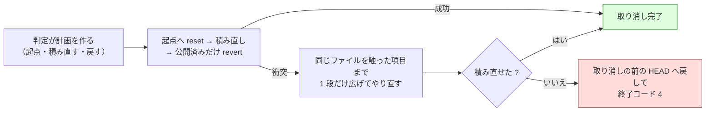

# 検証/修正・最終ゲート・配分テーブル・報告

[← SKILL.md](../SKILL.md)

## 検証と修正

```bash
while :; do
  rf_eval verify "$ID"             # VERIFY=done|fix
  [ "$VERIFY" = fix ] || break
  rf_eval start-phase "$ID" fix
  "$SCRIPTS/launch-cli.sh" "$IMPL" fix "$ID"
  "$LIB/monitor.py" "$ID" --agents "$IMPL" --tmp-dir "$TMP_DIR" \
      --stem-template "{agent}-fix-rf$ID" --phase fix \
      --timeout "$PHASE_TIMEOUT" --stall-timeout "$PHASE_TIMEOUT"
  rf merge-fix "$ID"
done
```

**駆動の繰り返しはこの 1 つだけである。** `verify` は次の順で進む。

1. 実装済みの項目ごとに、**HEAD で範囲テスト**（テストの種別の `scope_commands` と、項目のコミットが変えたファイルに
   かける静的解析）を走らせる。コマンドの並びが同じ項目どうしは 1 回だけ走らせて結果を共有する。出力は
   `<TMP_DIR>/verify-<項目>.log` に残り、修正の雛形へ渡る。起動の失敗なら、その項目の状態を変えずに中断する
2. 修正に使える残り時間（開始 + 想定最大時間 − 全体テスト 2 回分のバッファ − 最終ゲート修正のバッファ `final_fix` − 今）がバッファの
   `fix` に足りなければ、落ちた項目を**取り消す**。**回数の上限は持たない**（決定 23）。
   1 回の修正 = 実装担当の 1 起動で、次の試行の前にここで時計を見る。修正の監視の上限は
   直しの試行の打ち切りまでの残り + 余裕（`start-phase fix` の `PHASE_TIMEOUT`）
   - **同じ範囲テストを共有した項目は、新しい項目から 1 件ずつ取り消し、そのたびに共有した
     コマンドを走らせ直し、通った時点で止める**（AC15）。通る前に取り消した項目だけが
     取り消しになり、古い項目のコミットは残る。走らせ直すのは範囲テストである
3. 落ちた項目が残れば `VERIFY=fix` を返す。修正は落ちた項目のすべてを対象に 1 回起動し、
   修正の回数も対象の項目に同じだけ数える
4. 落ちた項目が無くなったら危険フラグを判定する（下の節）。危険フラグが 1 つでもあり、まだ走らせて
   いなければ**全体テストを 1 度だけ**走らせる
5. 全体テストが落ちたら、**落ちたテストだけ**を走らせ直して見分ける（決定 22）。全体の
   テストは検証の中で走らせ直さない
   - 出力（pytest の要約の `FAILED` / `ERROR` の行）から落ちたテストの ID を取り出し、
     今の HEAD で走らせ直す。通れば**フレーキー**
   - まだ落ちるもののうち、`init` の既存失敗（`baseline_test.existing_failures`）に無い ID を着手前の HEAD
     （`init` が残した SHA）で走らせる。作業ディレクトリは動かさず、一時の detach の worktree で走らせて消す。
     落ちれば**既存失敗**
   - フレーキーと既存失敗は取り消さず、`whole_test` に分類して残す
   - 残り（**変更起因**）があれば、**原因の項目**（その失敗を起こした改善項目）を決める（`culprit.judge`。#1649）。
     危険フラグは全体テストを走らせる理由であって、失敗の原因を指さない。候補は取り消されていないすべての改善項目で、
     修正担当の申告は使わない。決めた結果は `whole_test.culprit`（`culprits`・`basis`・`evidence`・`order`・`seconds`）に残る

     | 手がかり（`basis`） | 決め方 |
     | --- | --- |
     | `path` | 落ちたテストの JUnit の本文（`message` と本文）に、項目のコミットが変えたファイルのパスが現れる。落ちたテスト自身のファイルは数えない |
     | `isolate` | 1 で決まらない ID について、項目を新しい順に 1 件ずつ同じ worktree で `git revert --no-commit` して外し、残った ID のファイルだけを走らせ直す。通るようになった項目が原因。HEAD は動かさず、1 件ごとに `reset --hard HEAD` と `clean -fd` で戻す |
     | `undetermined` | どちらでも決まらない ID が残った（組み合わせで落ちる・走らせ直しが締め切りに収まらない） |

     原因を決める走らせ直しの時間は 2 の締め切りの内に数え、過ぎたら次の候補へ進まない
   - 原因が決まり（`path` / `isolate`）、2 と同じ締め切りの内なら、原因の項目だけを修正へ回す（`VERIFY=fix`）。
     修正担当には落ちたテストだけを走らせ直すコマンドとその出力を渡し、次の `verify` は落ちたテストだけを走らせ直す。通れば残す
   - 締め切りまでに通らないか、原因が決まらない（`undetermined`。修正へ回さない）ときは、原因の項目を新しい順に 1 件ずつ取り消し、
     落ちたテストが通った時点で止める。原因の項目を取り消し尽くしても通らなければ、残りの項目を新しい順に続けて取り消す
     （原因が決まらないときは全項目が新しい順に並ぶ）。原因でない項目は、通った時点で残る。取り消した後の HEAD は最終ゲートが
     全体テストで確かめる
   - 落ちたテストの ID は suite の `junit`（JUnit XML）からだけ読む（`file::classname::name`。絶対パスは追跡ファイルの
     末尾の一致で相対へ直す）。走らせ直すのは落ちたファイルの単位で、雛形の `{paths}` へ入れる
   - **JUnit を読めない**（`junit` の宣言が無い・打ち切り）ときは、`whole_test.fallback_reason` に理由を書いて
     全体を 1 度走らせ直す。通ればフレーキー（残す）。落ちれば、着手前が green なら変更起因として、走らせ直しのログに現れる
     パスだけで原因の項目を決めて直しに回す（項目を外す走らせ直しは全体テストになり締め切りに収まらないため行わず、
     決まらなければ `undetermined`）。着手前も red なら見分けられないので危険フラグの項目をまとめて取り消す（`reverted_all`）
   - **全体テストを CI に任せる戦略（`local-scoped-ci-whole`）では走らせない。** 立った危険フラグと項目を
     `whole_test.deferred` に書き、最終ゲートの 1 回へ寄せる（項目ごとに CI を回すと待ちが積み上がる）
6. 最終ゲートへ入る時点の公開（`publish.enter_final_gate`）をして `VERIFY=done` を返す。これが実行で最初の push になる

**継続的統合では代替しない。** 検証が見るのは手元の未 push のコミットである。代替できる
のは push の後の最終ゲートだけである。

### 修正のマージ処理（`merge-fix`）

修正の起点（落ちたときの HEAD）から HEAD までのコミットを `Item-Id` で読み、修正の対象の
項目のものだけを受け取る。**1 件でも手順を外れたら修正の範囲ごと取り消す**（対象でない
`Item-Id`・トレーラーの欠け・範囲の外・期待値の変更）。どのコミットが安全かを決められない
ためである。**どちらの場合も修正の回数は数える**（報告に出す）。往復を止めるのは回数では
なく締め切りである（2）。修正の所要は `start-phase fix` からの時計で測り、配分テーブルの `fix` に使う。

**マージ処理を済ませていない修正があるまま `verify` を呼ぶと、先にマージ処理を行う。** 修正の後に落ちて
再開したとき、修正のコミットが項目に結ばれないまま HEAD に残るのを防ぐ。

### 危険フラグ

| 危険フラグ | 条件 | 見るもの |
| --- | --- | --- |
| D1 | 項目のコミットが、項目の `path` と `tests` 以外のファイルを触った | `git show --name-only` |
| D2 | ファイルを消した・名前を変えた | `git diff-tree --name-status -M` の `D` / `R` |
| D3 | 触ったプロダクションコードのファイルが `--scope` の外のコードから参照されている | `git grep -lE`（下の注） |
| D4 | 範囲テストが触ったプロダクションコードのファイルを覆うと示せない | 範囲テストのファイルに、拡張子を除いたファイル名と `symbol` の名前のどちらも現れない |
| D5 | 公開の入出力が変わりうる | Jev（確信度 0.7 以上で真）。使えなければ実装担当の `risk` |

- **D3** は `--scope` の外の**コードのファイルだけ**を、モジュールの参照の形で探す。探す語は
  触ったファイルの末尾の 2 区切り（`refactor_lib/plan.py` なら `refactor_lib/plan`・
  `refactor_lib\.plan`・`refactor_lib\\plan`（PHP の名前空間）・`refactor_lib::plan`（Rust のパス）・
  `refactor_lib import .*\bplan\b`）と、修飾名の `symbol` の全体である。言語の表は持たない。
  直下のファイルは行頭の `import <語幹>` / `from <語幹>`。パッケージの入口（`__init__.py` /
  `index.*` / `mod.rs` など）は探さずに立てる。**当たらないときは立てない**。動的な読み込みの
  見落としは残る危険として受け入れ、最終ゲートが拾う（決定 20）
- **D4** の「範囲テストのファイル」は、`test_targets` から組み立てた項目では対象のパス、
  ラウンドテストをそのまま使う項目では `--scope` のテストの置き場所の配下の追跡されたファイルである。
  コマンドの語からは読まない（`docker compose exec -T app ...` の `app` を起点と読み違えるため）。
  置き場所に追跡ファイルが無いときは示せないので立てる（決定 21）
- **D5 の `risk` は危険フラグを立てる側にだけ使う。** 申告で検証を減らさない
- **D5 はリファクタリング計画の手順で問い、検証は `items[].public_io` を読むだけである**（決定 25）。Jev へ送るのは
  提案のフィールド（手法・理由・手順）だけで、差分の本文・ファイルの本文・テストの出力は送らない
- 危険フラグは項目ごとに `items[].danger`、全体として走らせた理由は `whole_test.flags` に残る

### 取り消しは起点へ戻して積み直す

**どのコミットを消し・積み直し・戻すかは、取り消しの判定（`refactor_lib/ledger.py`）が 1 か所で決める。**
取り消しの 4 つの経路（`undo.drop`・`intake.discard_unverified`・`converge._apply_fix_result`・最終ゲート修正の
マージ処理）と push の直前の照合が、同じ判定を呼ぶ。git を書き換えるのは `undo.py` だけである。

| コミット | 未公開（公開した地点より後） | 公開済み |
| --- | --- | --- |
| 取り消す改善項目のもの・どの記録にも無いもの（`stray`） | 積み直しの起点へ `reset --hard` して外す | 取り消す改善項目のものだけを新しい順に `git revert` |
| 残すコミット（取り消されていない改善項目・受け入れた最終ゲート修正・台帳のオーケストレーターのコミット） | 起点の後にあれば古い順に `cherry-pick` し直す | 触らない |

公開した地点は、オーケストレーターが最後に push した HEAD（まだ push していなければ `plan.base_sha`）である。
**最終ゲートより前には push しないため、それまでの取り消しは `git revert` を 1 度も打たない。** 前の取り消しの
積み直しは「残すコミット」として置き換わるだけなので、取り消しを何度くり返してもコミット数は伸びない。
積み直しの起点は、未公開の範囲で最も古い「消すコミット」の親である。


```mermaid
flowchart LR
    A["判定が計画を作る<br/>（起点・積み直す・戻す）"] --> B["起点へ reset → 積み直し<br/>→ 公開済みだけ revert"]
    B -->|成功| C["取り消し完了"]:::ok
    B -->|衝突| D["同じファイルを触った項目まで<br/>1 段だけ広げてやり直す"] --> F{"積み直せた ?"}
    F -->|はい| C
    F -->|いいえ| E["取り消しの前の HEAD へ戻して<br/>終了コード 4"]:::stop

    classDef ok fill:#dfd,stroke:#383
    classDef stop fill:#fdd,stroke:#933
```

- **積み直しで SHA が変わる。** 項目のコミットに加えて、起点より後を指す保存済みの地点（`phases.*.base_sha`・
  `fix.base_sha`・`final_gate.fix_base_sha`・`final_gate.fix_commits`・`ledger.orchestrator_commits`）も書き直す。
  書き直さないと、次の取り消しとマージ処理が履歴に無い SHA を指す
- `reset --hard` は push していない手元のコミットにだけ掛かる。push 済みの履歴は書き換えず、`git push --force` は使わない

#### 隣接する変更は分離できない

**項目単位で取り消せるのは、項目どうしの変更が独立しているときだけである。**
取り消す側と残す側が同一ファイルの隣接行を触っていると、積み直しの
`git cherry-pick` が衝突する。取り消した側の行が消えることで、残す側のパッチが
前提にしている文脈も消えるためで、これは git だけでは決められない。

| 位置関係 | 結果 |
| --- | --- |
| 別ファイル | 項目単位（`item`） |
| 同一ファイルの離れた行 | 項目単位（`item`） |
| 同一ファイルの隣接行 | **同じファイルを触った項目まで広げる**（`widened`） |
| 広げても衝突が残る | 取り消しの前の HEAD へ戻して終了コード 4 |

広げる基準のファイルは、消す・戻すコミット（取り消す項目と `stray`）が触ったファイルである。広げるのは 1 段だけで、
足した項目のコミットからさらには広げない。**別のファイルだけを触った項目は巻き込まない。**
どの手順で終わったかは `drops[].mode`（`item` / `widened` / `skip`）に、
起点と件数は `drops[].origin`・`removed`・`replayed`・`reverted` に残り、巻き込まれた項目の `failure_reason` にもその旨が残る。
旧い版の記録にある `mode: all` と `reverted_commits` は読めるまま残す。

実測（Pull Request #118）では採用 5 件のうち 4 件が同一ファイルの隣接領域を変更して
いた。**この構成では広げる取り消しが普通に起こる**と見込んでおく。

**中断しても再開できる。** 取り消しの前に、取り消しの前の HEAD を `pending_drop.before` に保存し、記録を終えたら消す。
残ったまま再開したら、マージ処理と検証の入口でその HEAD へ戻してから計画を作り直す。計画は状態ファイルと HEAD だけから
決まるので、やり直しても同じ結果になる。

### 公開は最終ゲートへ入る時点から

**最終ゲートより前には push しない。** 取り消し・マージ処理・結果なしの起動を閉じる処理は push を伴わない。
最初の push は検証の終わり（`verify`）か最終ゲートの入口（`final-gate`。残る項目が 0 件で検証を通らずに来た実行）で
行う（`publish.enter_final_gate`）。最終ゲートの後の push（`recheck`・`merge-final-fix`・結果なしの最終ゲート修正を閉じた後）は
最終ゲートが push 済みの地点を判定するために残す。最終ゲートへ入る前（`phase` が `final` / `done` でない）に公開の入口が
呼ばれたら、呼び出し元の誤りとして終了コード 4 で止まる。

**push の直前に、送るコミット（origin の head から HEAD まで）がすべて残すコミットかを照らす**（`ledger.unpublishable`）。
見放した担当の残留コミットのように記録に無いコミットがあれば、push せずに終了コード 4 で止まり、そのコミットの SHA・
`Item-Id`・件名を 1 行ずつ出す。残すかは状態ファイルに記録した SHA の一致だけで決め、担当が書けるトレーラーでは決めない。
同期と改修計画の記録のコミットは、作った直後に台帳（`ledger.orchestrator_commits`）へ記録する。

**最終ゲートを経ずに終わった実行は、残った改善項目を「採用」と表さない。** `refactor.py report` は「採用: 未確定」と書き、
drive は `stopped`（`metrics.exit` に最終ゲートの終了コード・`metrics.adopted` は 0・`metrics.unconfirmed` に残った項目の数）で終える。

## 最終ゲート

```bash
"$SCRIPTS/refactor.py" final-gate "$ID"   # FINAL_GATE=... を返す
```

| 全体テストの置き場（戦略） | 最終ゲート | 検証の中の全体テストとの関係 |
| --- | --- | --- |
| CI（`local-scoped-ci-whole`、または `--ci-check`） | push 済みの HEAD のチェック（`--ci-check` → 宣言の `test.ci.check` → `ci.required_checks` のすべて）を `limits.ci_wait_timeout` まで待つ | 取り消した後の HEAD も継続的統合が確かめる |
| 手元・工程の 1 つ | 全体テスト（戦略のテストの種別の suite の `command`） | **検証の中で走って通り（取り消しが無く）、その後に HEAD が 1 つも進んでいなければ走らせずに通す** |
| 手元・単独 | 全体テストを 1 度 → 通れば `cross-review` | 同上（使い回せれば走らせない） |

生成物の同期のコミットが積まれていれば HEAD は進んでいるので走らせる。危険フラグの全体の
テストが落ちて項目を取り消したとき（`whole_test.reverted`）は**必ず走らせる**。最終ゲートの
全体テストの所要は `final_gate.whole_test_seconds` に残り、履歴の `whole_test.final` になる。

**落ちたら見分ける。** 手元なら suite の `junit`、CI なら落ちたチェックの run の成果物（`test.ci.junit_artifacts` の glob、
無ければ解析と同じ名前の規則）の JUnit から落ちた ID を読み、検証の中と同じくフレーキー・既存失敗・変更起因に分ける
（`final_gate.triage`）。**変更起因が無ければ通す**（既存失敗とフレーキーだけ）。変更起因があれば最終ゲート修正へ回す。
検証で最終ゲートへ寄せた危険フラグの全体テスト（`whole_test.deferred`）は、単独で起動して修正を打ち切った時点で変更起因が
残っていれば、検証の中と同じ決め方で原因の項目を決め（`final_gate.culprit`。締め切りは `limits.stop_revert_end_at`）、その順に
1 件ずつ取り消して変更起因のファイルを手元で走らせ直し、通った時点で止めて push し、次の最終ゲートが確かめ直す。

**静的解析の全体テストは、どの戦略でも、使い回しがあっても手元で走らせる**（記録は `final_gate.checks[]` の
`mode: lint` と `final_gate.lint`）。落ちた suite は着手前の suite ごとの成否（`baseline_test.suites`）で分ける。

| 着手前 | suite の `scope_command` | 判定 |
| --- | --- | --- |
| green | — | 変更起因。最終ゲート修正へ回す |
| red | ある | 着手前の HEAD からの変更したファイルに絞った範囲テストが通れば既存失敗、落ちれば変更起因 |
| red | 無い | 既存失敗として判定から外し、報告に「着手前から落ちていたため判定から外した」と出す |

テストか静的解析のコマンドを起動できなければ、最終ゲートは判定せずに中断（終了コード 4）し、`launch_failure` を残す。

| 終了コード | 意味 | 進行 |
| --- | --- | --- |
| 0 | 通過した（`FINAL_GATE=cross-review` なら続けて `cross-review` を実行する） | 次へ |
| 2 | 落ちた（`FINAL_GATE=failing`）・取り消した後の確かめ直し（`FINAL_GATE=recheck`） | 最終ゲート修正を回すか、修正せずに `final-gate` をやり直す |
| 1 | 単独で起動して修正を打ち切った（想定最大時間の終わり・起動し直しても解けない起動結果）。工程の 1 つとして起動したときは返さない | **取り消さず**、失敗として報告する |
| 4 | 判断できない（CI が上限までに終わらない・照会できない・待つチェックの名前が無い・テストのコマンドの起動の失敗・案 B の後でも落ちた・案 B のコミットを作れない） | 待った秒か起動できなかったコマンドと理由を出して止まる |

**CI と手元は排他である。** CI で見る実行は手元のテストの種別の全体テストを実行せず継続的統合の結論だけで判定し、手元で見る実行は
手元のテストだけで判定する（静的解析はどちらでも手元で走らせる）。**採った側が失敗した・結果を得られないときは通過させない**（fail-closed）。

- 読むのは `check-runs` だけ。**`status` は使わない**（GitHub Actions は
  チェックジョブを記録し commit の状態を記録しないため、常に `pending` を返す）。`pending` の間は
  `lib/waits.py` の `wait_until` で間隔を伸ばしながら待つ
- 同名のチェックは名前ごとの最新の実行（`completed_at` と `started_at` の新しい方）で判定する。
  別の実行で成功したチェックの、前の実行の失敗は数えない（畳み方は共通ライブラリの `gh_parts` が持つ）
- 名前が一致するチェックが 1 件も無いときも通過させない。**別のチェックの成功で通さない**
- **「どちらか一方が通れば通過」とはしない。** OR で採ると、手元のテストの失敗を
  継続的統合の成功が覆す

**最終ゲート修正は想定最大時間の終わり（`開始 + B`）で打ち切る**（決定 23。回数の上限は
持たない。利用上限のように起動し直しても解けない起動結果でも打ち切る）。**ただし 1 回目は時計で
打ち切らない**（決定 26）。修正 1 回分のバッファ（`final_fix`）をリファクタリング計画の時点で予算から差し引いて
あり、予算を使い切った後に落ちても必ず 1 度は直しを試みる。1 回目の監視の上限は残りとバッファの
長い方 + 余裕である。
打ち切った後の扱いは起動のされ方で分かれる（#1669）。

| 起動のされ方 | 打ち切った後 | なぜ |
| --- | --- | --- |
| 単独 | **取り消さない**（最終ゲートへ寄せた危険フラグの全体テストの取り消しを除く）。失敗として報告に書き、終了コード 1 | 最終ゲートは push 済みの地点で、読み手（人）が Pull Request を見て取り消すかを決められる |
| 工程の 1 つ（`--workflow-step`） | **打ち切りの後の取り消し**（`stop_revert`）で、全体テストが通る状態へ戻してから確かめ直す（`FINAL_GATE=recheck`） | 読み手はプランと conductor で、判断の材料（どの項目が落ちたテストに関わるか）はスクリプトの手元にある。止まるとスプリントのブランチが壊れたまま残る |

### 打ち切りの後の取り消し（工程の 1 つとして起動したとき）

案 A と案 B を、1 回の実行でそれぞれ 1 度だけ使う。

| 案 | すること | 次へ進むとき |
| --- | --- | --- |
| A | 最終ゲートの見分け（`final_gate.triage`）の変更起因で原因の項目を決め（検証の中と同じ `culprit.judge`）、その順に `undo.drop` で 1 件ずつ取り消して変更起因のファイルを手元で走らせ直す。通った時点で止める | 積み直しが衝突した・候補を取り消し尽くしても通らない・締め切り（`limits.stop_revert_end_at`）を過ぎた・走らせ直す語が無い（変更起因を挙げられない） → 案 B |
| B | リファクタリング計画の起点（`plan.base_sha`）の木へ worktree と index を合わせ（`git read-tree -u --reset`）、コミットを 1 本積む。台帳にはオーケストレーターのコミットとして記録し、残った項目をすべて取り消した記録にする。計画の記録と生成物は次の push の同期が積み直す | コミットを作れない → 終了コード 4 |

どちらも push 済みの履歴を書き換えない（`git revert`・未公開のコミットの積み直し・新しいコミットだけ。強制 push はしない）。
積んだ後は push し、起点（`final_gate.fix_base_sha`）を取り消した後の HEAD へ置き直して `FINAL_GATE=recheck`（終了コード 2）を返す。
確かめ直しの最終ゲートが通れば完了で、採用は残った項目の数になる。**案 B の後の最終ゲートでも落ちたら、取り消しを重ねずに
終了コード 4 で止まる**（着手前の木でも落ちるのは変更起因ではないか揺れである）。案 A の後に落ちたら案 B へ進む。

案 A の締め切りは `limits.stop_revert_end_at = final_end_at + 0.20·B`（既定の 30 分で 6 分）で、計画の上限の表に載る。
記録は `final_gate.stop_revert`（`plan`・`reverted`・`fallback_reason`・`base_sha`・`commit`・`end_at`・`at`）と、取り消した項目の
`failure_reason` に残り、報告に出る。

### 最終ゲート修正は項目の修正と別物である

```bash
rf_eval start-phase "$ID" final-fix                        # PHASE_TIMEOUT = 想定最大時間の終わりまでの残り + 余裕
"$SCRIPTS/launch-cli.sh" "$FINAL_FIX_IMPL" final-fix "$ID"   # 担当は final-gate が返す
"$LIB/monitor.py" "$ID" --agents "$FINAL_FIX_IMPL" --tmp-dir "$TMP_DIR" \
    --stem-template "{agent}-final-fix" --phase final-fix \
    --timeout "$PHASE_TIMEOUT" --stall-timeout "$PHASE_TIMEOUT"
"$SCRIPTS/refactor.py" merge-final-fix "$ID"                 # 2 = 結果なし / 範囲が確定しない
```

**`fix` 手順と `merge-fix` は使い回せない。** どちらも落ちた項目の記録を読み、
`Item-Id` で修正を項目へ結ぶ。最終ゲートが直すのは**全体テストの失敗**で、どの項目にも
属さない。流用すると、`Item-Id` の無い修正が全件不正として取り消される。

そのため `final-gate` は落ちるときに**担当と範囲の起点を記録して返す**。

| 返す値 | 何に使うか |
| --- | --- |
| `FINAL_GATE=failing` | 最終ゲート修正へ入ることを示す |
| `FINAL_GATE=recheck` | 原因の項目を取り消した（寄せた危険フラグの全体テストか、打ち切りの後の取り消し）だけで、修正の依頼ではない。駆動は修正の CLI を起動せずに `final-gate` を打ち直す。起点は取り消し後の HEAD へ置き直す |
| `FINAL_FIX_IMPL` | 修正を起動する担当。**実装担当**（輪番は無い） |
| `FINAL_FIX_ROUND` | 何回目の修正か |

起点（`final_gate.fix_base_sha`）は落ちた時点の HEAD である。`merge-final-fix` は
その範囲だけを見る。

**求めるトレーラーは 2 つである**（`Impl-Runtime` / `Impl-Model`）。`Item-Id` は
書かせない。実在しない番号を実装担当が作ることになるためである。

**コミットごとのテストの合否は見ない。** CI で見る実行では手元の
テストを 1 度も走らせないと決めてあるので、ここでコミットごとに走らせるとその排他を
この経路だけが破る。合否は直後の `final-gate` が採った側で 1 度だけ見る。

**申告から漏れたコミットと範囲外を触ったコミットは、この修正の範囲ごと取り消す。**
単独の起動の「打ち切っても取り消さない」のは*採用した改善項目*の話であって、検証を受けていない
修正コミットは別である。取り消せば HEAD は最終ゲートが見た地点へ戻る。

**修正担当が結果を残さなかったときも同じ手順を通る。** 取り消して起点を取り消し後の
先端へ進め、最終ゲートの記録の `failed_attempts[]` へ 1 件（工程 `final-fix`）を残し、
終了コード 2 で最終ゲートへ判定を戻す。取り消さずに抜けると、次の最終ゲートがその
コミットを含む先端でテストし、落ちれば起点をそこへ置き直すため、未検証の差分が
Pull Request に残る。**修正の回数はここでは進めない。** 進めるのは次の最終ゲート
である。ただし**起動し直しても解けない起動結果（利用上限）では打ち切りのフラグ（`no_relaunch`）を
立てる**。次の最終ゲートは、テストが落ちれば打ち切りとして扱う（単独は終了コード 1、工程の 1 つは打ち切りの後の取り消し）。

### テストで見つからない誤りは誰が拾うか

検証をテストで行い、最終ゲートの `cross-review` を条件付きで省くと、実行の流れからレビューが
2 か所とも消えうる。**答えは起動のされ方で分かれる。**

| 起動のされ方 | 誰が拾うか |
| --- | --- |
| 単独 | **最終ゲートの `cross-review`。** 省略しない |
| `development-workflow` の 1 工程 | **工程表の「コードレビュー」。** この Skill の後に `pr` → `cross-review` が続く |

**この Skill の中へ軽量なレビューを足さない。** 工程として起動したときに `cross-review` を
省くのは、**同じ差分を 2 度レビューしないため**である。v10.5.1 で `light` も
`cross-review` を通すと決めたため、モードによらずレビューは必ず 1 度掛かる。

### 単独起動の終わり

**`FINAL_GATE=cross-review` のときは `/ndf:cross-review <PR>` で Pull Request 全体を承認収束に
かける。** 項目の妥当性は範囲テストで判定済みのため、**項目をまたいだ整合**を見させる。

```bash
/ndf:cross-review "$PR" --focus "項目をまたいだ整合を見る。個々の改善項目の妥当性は範囲テストで判定済みのため対象外とする。複数の項目で触った箇所の重複・打ち消し・命名の揺れ、取り消した項目の残骸、生成物と配布物の同期を確かめる"
```

**cross-review が終わったら、その最終ステータスを渡して `finalize` を呼ぶ。** 読むのは
cross-review の状態ファイルで、`state.py report` の Markdown は読まない。`final` が `approved` で、最終スイープが
検証済み（`sweep.verified`）・残り 0・修正のコミット無し（`sweep.commit` が null）のときだけ `approved` を渡す。
`final` が `approved` でもそれ以外なら `unverified`（最後の HEAD は承認されていない）、他は `final` の値を渡す。
cross-review の駆動は、この値を結果の `metrics.review_status` に載せる。

`drive.py` はこの地点で `pause: cross-review` を返して止まる。結果ファイルへ `{"review_status": "<値>"}` を書いて
打ち直すと、`finalize <ID> --review-status <値>` を呼んで終わる。

## 配分テーブル

**配分テーブルは保存しない。** リファクタリング計画のたびに、利用者の手元の履歴から集計する（決定 7）。

- 履歴の置き場所: `<metrics>/<owner>--<repo>/cross-refactoring-allocation.jsonl`。
  根は実行の要約と同じ（`NDF_METRICS_DIR` → `$XDG_STATE_HOME/ndf/metrics` →
  `~/.local/state/ndf/metrics`）。`NDF_METRICS=0` でも書く（リファクタリング計画の材料として扱い、計測の設定に従わない）
- 1 実行 = 1 行。**最終ゲートが通った実行だけ**を追記する（単独起動は `cross-review` が
  `approved` のときだけ）。中断した実行と、最終ゲートが通らなかった実行は追記しない

| 種類 | 1 件あたりの値 | 足りないときの代わり |
| --- | --- | --- |
| `test` | その種類を含む直近 10 行の Σ秒 ÷ Σ件数 | 初期値 |
| `structure/<手法>` | 同上 | `structure/*` をまとめた値 → 初期値 |
| `verify` | 直近 10 行の Σ秒 ÷ Σ検証した改善項目 | 初期値 |
| `fix` | 直近 10 行の Σ秒 ÷ Σ起動 | 初期値 |

初期値は `data/allocation-defaults.json` にあり、出所（#917 の記録の URL）と式を持つ。
**担当の申告ではなく適用の CLI の実測の秒を件数で割った値**である（決定 9）。履歴が
無い・読めないときは初期値でリファクタリング計画し、1 行知らせる（`plan.table_source` が `defaults`）。

## 報告

```bash
"$SCRIPTS/refactor.py" report "$ID"            # --metrics で種類別の件数と所要も出す
```

報告は手順別の所要・想定最大時間との差（`cross-review` を除く）・改善項目の表・
採用と取り消しと見送りの件数（**見送りの理由別**）・着手前の全体テストの結果（基準。
リファクタリング計画にも載る）・検証の中の全体テストと落ちたときの見分けとその結果・Jev の使用・
最終ゲートの結果・指標の測定（言語・ツール・版・ランナー・所要秒と、測れなかった言語と理由の識別子）を持つ。
指標の測定の表はリファクタリング計画と同じ行である（組み立ては `codemetrics_view.record_lines` の 1 か所）。
最後の行に実行の要約の置き場所を出す。

### リファクタリング計画は Pull Request のコメントに残す

**なぜ直すのか（理由）とどう直すのか（手順）は、提案の時点でしか残らない。**
状態ファイルには入っているが、そのディレクトリは差分から除外されるため、
Pull Request を読む側からは見えない。

**リファクタリング計画は実行の記録であり、リポジトリの知識には含めない**。既定の
置き場所は**対象の Pull Request のコメント 1 件**で、公開のたびに**同じ
コメントを編集する**。

| 置き場所 | URL の安定 | 差分に混ざるか | 更新の手数 |
| --- | --- | --- | --- |
| **Pull Request のコメント 1 件**（既定） | **永続** | 混ざらない | 編集 1 回 |
| ファイル（`--plan-file`） | `<ref>` に依存。ブランチが消えると切れる | **混ざる** | コミットと push |

- 内容は**状態から決まる**。同じ状態からは同じ本文が出る
- **見送った提案と取り消した項目の内訳を持つのはリファクタリング計画だけである。** 他の文章は件数だけ述べる。見送りは理由（8 つ）と補足を、取り消した項目は「取り消した理由」を持つ
- 本文の先頭に目印（`<!-- cross-refactoring plan rf<ID> -->`）を置く。状態ファイルの
  記録が失われても、目印で同じコメントを引き当てられる。**引き当てられないと、
  公開のたびに新しいコメントが積まれる**
- **投稿に失敗しても進行は止めない。** 記録が残らないことと、変更が検証を通って
  いないことは別である。失敗したことは出力に残る

**`--plan-file` は残す。** 明示したときだけファイルにする。この経路では公開を
生成物の同期と**同じコミット**に乗せる（分けるとオーケストレーターのコミットが公開のたびに
2 つずつ積まれる）。空文字を渡すと記録しない。

**絶対パスと親へ抜ける経路は受け取った時点で拒む**（終了コード 4）。オーケストレーターは利用者の
リポジトリを触るため、作業ディレクトリの外へ書き出す余地を残さない。あわせて
`./issues/plan.md` のような表記も正規化する。git が返すパスと形が違うと、公開の
コミットメッセージが取り違えられる。

### 報告も外へ出す文章である

| 規約 | 報告での書き方 |
| --- | --- |
| 項目の指し方 | 改善項目の表は **`<ファイル>#<シンボル>`** を持つ（項目 ID だけでは何を直したか分からない） |
| 取り消した項目・見送った提案 | **件数だけ**述べる。内訳はリファクタリング計画にある |
| リファクタリング計画 | **生の URL**を見出しの直後と見送りの節へ入れる |
