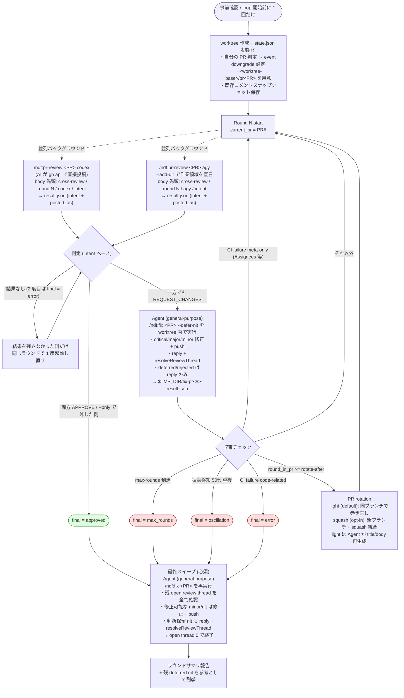

# クロスレビュー収束ループ

PR を**ホストを除く 3 者から選んだ 2 者**にレビューさせ、**新しい指摘が出なくなるまで**
`/ndf:pr-review` と `/ndf:fix` を自動で回す。

母集合は「全ランタイム − ホスト」で、担当はラウンドごとの輪番で決まる（`cross-refactoring`
と同じ決め方で、実装は共通層の `lib/assignment.py` にある）。**ホストを名指しで固定しない**
のは、固定するとホストが `codex` か `agy` のときに自分自身をレビュワーへ含めるためである。

/goalの引数として呼ばれた場合は、新しい指摘が出なくなるまで/cross-reviewを繰り返す。
  * 担当のいずれかが不具合などで実行できなくなった場合は異常終了とする
   * /goalで呼ばれた場合はPR ローテーションは実施しなくてよい。
   * 振動検知した場合はAIが判断して正しい状態を決める。

詳細手順は `docs/` 配下に、主要コマンドは `scripts/` 配下に分割している:

- [docs/01-state-and-review.md](docs/01-state-and-review.md) — Step 0〜4 (state init / round / 並列レビュー / 判定 / 振動検知)
- [docs/02-fix-and-rotation.md](docs/02-fix-and-rotation.md) — Step 5〜8 (サブエージェント修正 / PR ローテーション / 終了処理)
- [docs/03-review-output.md](docs/03-review-output.md) — レビュー出力の制約 / CI failure の分類 / アンチパターン / monitor.py の誤検知
- [docs/04-contracts.md](docs/04-contracts.md) — 状態ファイルの形式と AI への入出力の契約（手順の途中では読まない）
- [docs/05-pool-and-convergence.md](docs/05-pool-and-convergence.md) — 誰がレビューし、いつ止めるか（母集合・担当の輪番・認証・終了基準の 3 層）
- [scripts/state.py](scripts/state.py) — state.json 操作（uv 自己完結スクリプト、stdlib のみ）
- [scripts/launch-reviewer.sh](scripts/launch-reviewer.sh) — レビュワー起動の入口（4 ランタイム共通）。`launch-codex.sh` / `launch-agy.sh` はここへの薄い委譲
- [scripts/monitor.py](scripts/monitor.py) — codex/agy プロセス多軸監視 (sentinel / pidfile / 早期エラー / stall / hard timeout / result.json)
- [scripts/wait-review.sh](scripts/wait-review.sh) — `monitor.py` の薄ラッパ（互換用）
- [scripts/rotate-pr.sh](scripts/rotate-pr.sh) — PR ローテーション

メインセッションからは `$SCRIPTS/state.py <subcommand>` 形式で呼ぶだけで、
state.json の読み書きや AI launcher 起動・完了待ちは全て委譲される。

## 設計方針

長丁場が予想されるため **メインセッションの context 消費を最小化** する:

| 観点 | 方針 |
|---|---|
| レビュー投稿 | **AI 自身が `gh api` で PR に直接投稿**。メインはペイロードを保持しない |
| 投稿の確認 | **申告されたコメント数を GitHub 側と突き合わせる**。投稿が届いていなければ中断する（取得できない場合は申告を採用） |
| 修正 | **必ずサブエージェント (`general-purpose`) で実行**。メイン context に diff は載せない |
| ユーザ問い合わせ | 自動判断を最大化（`critical`/`major`/`minor` は自動修正、ループ中の `nit` は deferred） |
| 取りこぼし防止 | **ループ終了時（approved / max_rounds / oscillation / error いずれも）に最終スイープを必須実行**。`/ndf:fix` を再実行し、残った open review thread（最終 APPROVE ラウンドの minor/nit インラインコメント含む）を **全て解消**。修正可能なものは修正 + push、判断保留 nit も reply + resolveReviewThread して **open thread 0 で終了**。件数は `state.py verify-sweep` が GitHub 側の実数で確認する |
| 再開時の引き継ぎ | 再開の時点で残っていた未解決の指摘は `carried_over` に記録し、**修正の工程を 1 度通すまで収束させない**。増えるラウンドは最大 1 回。通した後の再開では、新しい指摘が出ていなければ抑止しない |
| 状態の永続化 | `<worktree>/.cross_review/cross-review-pr<番号>-state.json` に集約。中断・再開可能 |
| 長尺PR対策 | **`--rotate-after` ラウンドで PR をローテーション**（default=light: 同ブランチで PR 巻き直し / squash: 新ブランチ + squash 統合） |
| 振動検知 | 前のラウンドと**同じ箇所を指す指摘**が 50% 以上なら中断（測り方は `docs/01` の Step 4） |
| 終了基準 | **新しい指摘が出なくなったら収束**。全員 `APPROVE` は最も止まらない参加者に律速される。3 つの層の順序は `docs/01` の「終了基準」 |
| レビュワーの母集合 | **全ランタイム − ホスト**の 3 者から、輪番で 2 者。認証は `init` が起動前に確かめる |

## 引数

| 引数 | 意味 | 既定 |
|---|---|---|
| `[PR番号]` | 対象 PR（省略時は直前 PR / 現在ブランチ） | — |
| `--max-rounds N` | 全体最大ラウンド数（PR ローテーションを含む通算） | `12` |
| `--rotate-after K` | この round 数で未収束なら PR ローテーション | `8` |
| `--rotate-mode light\|squash` | ローテーション方式。`light`: 同ブランチで旧 PR を close → 新 PR (title/body は現状の差分・実装から再生成)。`squash`: squash 統合 + 新ブランチ + `(rotated)` suffix | `light` |
| `--host claude\|codex\|agy\|kiro` | この収束ループを起動している CLI。母集合から外れる | 環境変数から推定。**推定できなければ失敗する** |
| `--only RUNTIME` | 1 者だけで回す（デバッグ用）。**そのラウンドの担当を 1 者へ絞る。** 母集合の外を指定したら `init` が弾く | 担当 2 者 |
| `--focus TEXT` | 自動レビュー観点に上乗せして**そのラウンドのレビュー担当 2 者**に渡す追加観点。短い重点チェック向け | なし |
| `--extra-instructions-file PATH` | 自動レビュー観点に上乗せして**そのラウンドのレビュー担当 2 者**に渡す追加観点を UTF-8 テキストファイルから読む。長いチェックリスト向け | なし |

例:

```
/ndf:cross-review 123
/ndf:cross-review 123 --max-rounds 4 --rotate-after 2
/ndf:cross-review 123 --rotate-mode squash
/ndf:cross-review 123 --only codex
/ndf:cross-review 123 --focus "ドキュメントとコードの整合性を重点的に確認"
/ndf:cross-review 123 --extra-instructions-file /tmp/review-focus.md
```

### 自動レビュー観点テンプレート

`state.py init` は GitHub API の `pulls/<PR>/files --paginate` で変更ファイルを全件取得して分類し、
そのラウンドのレビュー担当に同じ追加観点を渡す。`--focus` /
`--extra-instructions-file` は、この自動テンプレートの後ろに上乗せされる。

自動カテゴリ:

- `common`: PR 全体の目的、変更範囲、保守性、テスト、ロールバック容易性
- `docs_only`: ドキュメントのみ PR。企画・説明の妥当性、コード/設定/コマンド/他 docs との整合性
- `code`: 設計、正確性、可読性、冗長・重複、言語らしさ、セキュリティ、関数/ファイルの責務とサイズ
- `db_migration`: データ設計、型、NULL/default/制約/index、既存データ、backfill、ロールバック
- `test`: テストの仕様性、境界値、失敗系、flaky リスク
- `dependency`: 依存追加/更新、lockfile、ライセンス、互換性、セキュリティ
- `config_ci`: CI/設定、権限、secret、cache、環境差分
- `api_contract`: API 契約、互換性、schema、status、エラー形式、認可
- `auth_security`: 認証/認可、secret/PII、CSRF/CORS/session/JWT/OAuth
- `frontend`: UI 状態、アクセシビリティ、レスポンシブ、状態管理、表示文言
- `performance`: N+1、I/O、メモリ、ロック、cache、queue、冪等性
- `deletion_rename`: 削除/リネーム参照漏れ、後方互換、移行手順
- `generated`: 生成物、lockfile、再生成手順、差分ノイズ
- `i18n`: 翻訳キー、fallback、変数展開、表示幅、文言整合
- `infra`: IaC / Docker / Kubernetes 等の権限、secret、公開範囲、ロールバック

### `--rotate-mode` の選び方

- **`light` (default)**: PR を読む人 (将来のレビュアー / 後続 PR を作る人) が cross-review の存在を意識せずに済む。release branch 戦略・TODO 参照・コミット単位レビューを破壊しない。**通常はこちらを使う**
- **`squash`**: 巨大 PR を 1 commit に潰したい / `(rotated)` suffix で rotation 履歴を PR title に残したい場合のみ。release branch 戦略を使う運用とは併用しない

## 前提

- `/ndf:pr-review` が **AI 直接投稿**（外部 AI 自身が `gh api` で投稿）に対応
- `/ndf:fix` が **サブエージェント起動 + 重要度ベース自動修正 + Resolve Conversation** に対応
- 担当になる CLI が動作し、`gh` CLI が認証済み（`init` が起動前に確かめる。誤検知するときは `NDF_SKIP_AUTH_CHECK=1`）
- `Agent(subagent_type="general-purpose", ...)` でサブエージェントを起動可能

## 事前確認（`state.py init` が自動実施）

ループ開始前に **4 つのプリチェック** が必要だが、すべて `scripts/state.py init`
が内部で実施する。メインは結果を KEY=VALUE 形式で受け取るだけで良い。

| # | 対策 | スクリプト側で何をするか |
|---|---|---|
| 1 | 自分の PR 判定（422 回避） | `gh api user` と `gh pr view --json author` を比較し `is_own_pr` / `event_downgrade` を state.json に書く |
| 2 | worktree 分離 | `git worktree add <worktree-base>/<owner>--<repo>/pr<PR> <head>` を冪等実行（`<worktree-base>` は `NDF_WORKTREE_BASE` env > `<システム tmpdir>/ndf-worktrees` の優先順で解決）。パスが存在しても現リポジトリの登録済み worktree でなければ `.stale-<ts>` に退避して作り直す。**流用するときは PR の head へ揃える**（前回の実行の残りをレビューさせない。再開の経路も同じ）。`gh pr view --json headRefName,headRefOid,isCrossRepository` で取った基準のコミットへ hard reset し、追跡対象外のファイルを消す（tmp ディレクトリは `-e` で除外。フォーク PR は `refs/pull/<PR>/head` から取り込む）。**同じ同期を `start-round` がラウンドごとに行う。** 作成時と再開時だけでは、修正を作業ツリーの外で行って push したときに 1 つ前の内容をレビューする。head と一致していて変更が無ければ何も発行せず、追跡対象の変更・未 push のコミット・基準を取り込めないときは **exit 8** で止める（1 はループを抜ける値なので使わない）。解決した head branch は `state.json` へ書き戻す（巻き直しで古くなるため）。条件と理由は `docs/01-state-and-review.md` の「ラウンドの開始時の同期」にある |
| 3 | agy の作業領域 | `launch-agy.sh` が `--add-dir` で作業ツリーを宣言する。**tmp dir は `<worktree>/.cross_review/`** を採用し、宣言する作業領域を 1 つに保つ |
| 4 | 既存コメント差分 | `fix/scripts/fetch-pr-comments.sh` で 3 ソース (インラインコメント / レビュー body / PR レベルコメント) を一括取得し `$TMP_DIR/cross-review-pr<PR>-existing-comments.txt` に保存。agy プロンプトには **内容をインライン埋め込み**、codex プロンプトには path を渡す |

### `<worktree-base>` の解決順

`state.py init` は worktree の親ディレクトリを以下の優先順で解決する:

1. `NDF_WORKTREE_BASE` 環境変数（明示オーバーライド）
2. `<システム tmpdir>/ndf-worktrees`（Python `tempfile.gettempdir()`。非永続領域のため
   コンテナ再作成で自動消滅し、共有 volume を消費しない）

worktree の実パスは `<base>/<owner>--<repo>/pr<PR>` 形式で、リポジトリ slug を含める
ことで**他リポジトリの同一 PR 番号と衝突しない**。永続 volume（旧 `/work/worktrees`）を
使っていた頃は別プロジェクトの残骸 worktree を誤って流用する事故があったため、
パスが存在しても `git worktree list` に登録されていなければ `.stale-<timestamp>` に
退避して作り直すガードも入っている。

解決した実パスは `state.json` の `worktree_path` に書かれるため、後続スクリプトや
サブエージェント prompt は state.json から読めば追従できる。

### intent / posted_as の両保持（最重要）

GitHub は **自分の PR には `REQUEST_CHANGES` でレビューを投稿できない**
（`HTTP 422`）。state.json には **両方** を保持する:

```json
"codex": {
  "intent": "REQUEST_CHANGES",   // AI の本来判定。ループ収束判定に使う
  "posted_as": "COMMENT",        // 422 回避でダウングレードした結果
  "comments": 5, "review_url": "..."
}
```

`state.py judge` は `intent` を見るので、ダウングレード投稿してもループは続行する。

## 全体フロー



## 実行ステップ概要（メインの bash 骨組み）

各ステップの詳細は `docs/` 参照。メインは以下のテンプレートで scripts/ を呼ぶだけ:

```bash
# SKILL_DIR と SCRIPTS の決め方は docs/01 の冒頭にある。同じ 17 行を先に実行する。

# STATE_PR は state.json のキー (= 最初に init した PR 番号)。rotation 後もパスは
# 変わらないため常に STATE_PR を渡す。現在の PR は state.json の current_pr を見る。
STATE_PR=$INITIAL_PR

# ROTATE_MODE は引数 --rotate-mode (default=light)。light は Step 6b で title/body を生成。
ROTATE_MODE=${ROTATE_MODE:-light}

# Step 0: state 初期化 / 再開
# ⚠ eval はコマンド置換の終了コードを潰す。変数で受けてから eval する（docs/01 参照）
INIT_VARS=$("$SCRIPTS/state.py" init "$STATE_PR" \
          --max-rounds "$MAX_ROUNDS" --rotate-after "$ROTATE_AFTER" \
          ${HOST:+--host "$HOST"} \
          ${ONLY:+--only "$ONLY"} \
          ${FOCUS:+--focus "$FOCUS"} \
          ${EXTRA_INSTRUCTIONS_FILE:+--extra-instructions-file "$EXTRA_INSTRUCTIONS_FILE"}) || exit $?
eval "$INIT_VARS"
# eval で TMP_DIR がセットされる。後続スクリプトに env として伝播させる。
export CROSS_REVIEW_TMP_DIR="$TMP_DIR"
cd "$WORKTREE"

while :; do
  # Step 1: round 開始判定 (exit 1=max_rounds 到達でループを抜ける / 5=後始末が未了 / 8=同期できず中断)
  ROUND_VARS=$("$SCRIPTS/state.py" start-round "$STATE_PR") || { RC=$?; [ "$RC" -eq 1 ] && break; exit "$RC"; }
  eval "$ROUND_VARS"

  # Step 2: 並列レビュー（担当は start-round が REVIEWERS / REVIEWERS_CSV で返す）
  for r in $REVIEWERS; do
    [ -z "$ONLY" ] || [ "$ONLY" = "$r" ] || continue
    "$SCRIPTS/launch-reviewer.sh" "$r" "$STATE_PR" "$ROUND"
  done
  # 監視: 既定 timeout=7 分 / stall=3 分。失敗時は対象プロセスを kill して返す。監視と取り込みの
  #   終了コードは読まない。結果なしは NO_RESULT として state に残り、Step 3 が受け取る（docs/01）。
  # ⚠ 位置引数の `both` は codex / agy の 2 者だけを指す。担当は 4 つの名前を取りうるため、
  #   `start-round` が返した一覧を `--agents` で渡す。
  "$SCRIPTS/monitor.py" "$STATE_PR" --agents "${ONLY:-$REVIEWERS_CSV}" || true
  for r in $REVIEWERS; do
    [ -z "$ONLY" ] || [ "$ONLY" = "$r" ] || continue
    "$SCRIPTS/state.py" read-result "$STATE_PR" "$r" || true
  done

  # Step 3: 判定 (0=収束 / 2=修正へ / 7=結果なし / 8=待ち行列に残あり / 1=中断)。引き継いだ指摘が残っていれば、
  #   両者が承認しても 2 を返して修正の工程へ回す。置換の終了コードは変数で受けてから読む。
  JUDGE_VARS=$("$SCRIPTS/state.py" judge "$STATE_PR"); JUDGE_RC=$?; eval "$JUDGE_VARS"
  if [ "$JUDGE_RC" -eq 7 ]; then  # 名前の出た担当だけを、同じラウンドで 1 度起動し直す
    for a in $RELAUNCH_AGENTS; do "$SCRIPTS/launch-reviewer.sh" "$a" "$STATE_PR" "$ROUND"; done
    "$SCRIPTS/monitor.py" "$STATE_PR" --agents "$RELAUNCH_AGENTS_CSV" || true
    for a in $RELAUNCH_AGENTS; do "$SCRIPTS/state.py" read-result "$STATE_PR" "$a" || true; done
    JUDGE_VARS=$("$SCRIPTS/state.py" judge "$STATE_PR"); JUDGE_RC=$?; eval "$JUDGE_VARS"
  fi
  if [ "$JUDGE_RC" -eq 8 ]; then  # 上限で積んだ投稿が残っている。流してから判定し直す
    "$SCRIPTS/state.py" flush "$STATE_PR"
    JUDGE_VARS=$("$SCRIPTS/state.py" judge "$STATE_PR"); JUDGE_RC=$?; eval "$JUDGE_VARS"
  fi
  case $JUDGE_RC in 0) break ;; 2) : ;; *) exit "$JUDGE_RC" ;; esac   # 1=結果なしのまま中断
  # 8 のまま残るのは上限が続いているとき。state は残るので、回復後に同じ引数で再開する。

  # Step 4: 振動検知 (4=oscillation)
  "$SCRIPTS/state.py" check-oscillation "$STATE_PR" || [ $? -eq 2 ] || exit 4

  # Step 5: 修正サブエージェント起動 (Agent tool) → $TMP_DIR/fix-pr<STATE_PR>-result.json
  #   - メインで Agent(subagent_type=general-purpose, ...) を呼ぶ。docs/02 参照
  #   - tmp パスは launcher / monitor.py と同じく **STATE_PR ベース** で統一
  # Step 5 後段: fix 戻り値マージ + CI 分類 (3=code-fail で中断)
  "$SCRIPTS/state.py" merge-fix "$STATE_PR"

  # Step 6: PR ローテーション判定 (0=rotate/2=keep)。state.json の current_pr を内部更新。
  if "$SCRIPTS/state.py" should-rotate "$STATE_PR"; then
    # Step 6a: 旧 PR の素材 (title/body/isDraft + git log/diff stat) を dump
    PREPARE_VARS=$("$SCRIPTS/rotate-pr.sh" prepare "$STATE_PR") || exit $?; eval "$PREPARE_VARS"

    # Step 6b: light モードのみ。**メインセッション側で Agent(subagent_type="general-purpose") を起動して**
    #   prepare.json を読ませ、現状の差分・実装を反映した title/body を
    #   $TMP_DIR/rotate-pr<STATE_PR>-newtext.json に書き出させる。
    #   詳細プロンプトは docs/02-fix-and-rotation.md Step 6b 参照。
    #   squash モードでは Step 6b 不要。
    #
    #   ⚠ Bash 単体では Agent ツールを呼べない。下記のフローは「メイン会話セッション側で」
    #   実行される前提なので、bash の while ループそのものは pseudo-code として読み、
    #   実際には以下の 3 段階を **メインが順に駆動する** こと:
    #     (1) bash 側で `rotate-pr.sh prepare $STATE_PR` を実行 (これは普通の bash)
    #     (2) メインが Agent(...) を起動して newtext.json を書かせる (bash の外)
    #     (3) bash 側で `rotate-pr.sh execute $STATE_PR --mode light` を実行
    #   下記の if exit 10 は **誤ってメイン介在なしで Step 6c に進むことを防ぐガード** であり、
    #   exit 10 を観測したらメインは Step 6b の Agent を起動し、newtext.json が
    #   生成されてから **同じ STATE_PR で Step 6c (execute) を直接呼び直す**。
    #   state.json は完全に再開可能 (prepare.json はそのまま再利用される)。
    NEWTEXT_JSON="$TMP_DIR/rotate-pr$STATE_PR-newtext.json"
    if [ "$ROTATE_MODE" = "light" ] && [ ! -s "$NEWTEXT_JSON" ]; then
      echo "⏸  light モード: メインセッションで Agent(general-purpose) を起動し" >&2
      echo "    $NEWTEXT_JSON を生成してから rotate-pr.sh execute $STATE_PR --mode light を実行してください" >&2
      echo "    (docs/02-fix-and-rotation.md Step 6b 参照 / 再開プロトコルは下記 '## 再開プロトコル')" >&2
      exit 10
    fi

    # Step 6c: 実行。NEW_PR / NEW_PR_URL / NEW_BRANCH を eval で取り込む。
    ROTATE_VARS=$("$SCRIPTS/rotate-pr.sh" execute "$STATE_PR" --mode "$ROTATE_MODE") || exit $?; eval "$ROTATE_VARS"

    "$SCRIPTS/state.py" set-current-pr "$STATE_PR" "$NEW_PR" --head-branch "$NEW_BRANCH"
    # NOTE: STATE_PR は変えない。次ループの scripts も $STATE_PR を渡す。
  fi
done

# Step 7.5: 最終スイープ (必須) — どの終了経路 (approved / max_rounds / oscillation /
#   error) でも、ループを抜けた直後に **メインが Agent(general-purpose) を起動** して
#   /ndf:fix $STATE_PR を再実行し、$TMP_DIR/sweep-pr$STATE_PR-result.json を書かせる
#   (bash 単体では Agent ツールを呼べない。プロンプトは docs/02 の Step 7.5)。
#   最終 APPROVE ラウンドの minor/nit はループ内 fix を経由しないため、ここで拾わないと
#   PR 上に未解決スレッドが残る。sweep 結果はメインが Step 8 の報告へ折り込む。

# Step 7.5 後段: 最終スイープの結果を GitHub 側の実数で検証する (必須)
#   exit 0 = 未解決の指摘なし / exit 6 = 残っている (件数と理由を完了報告へ含めて続行)
#   それ以外の終了コードは検証そのものの失敗。報告へ進まずここで止める。
"$SCRIPTS/state.py" verify-sweep "$STATE_PR" || { RC=$?; [ "$RC" -eq 6 ] || exit "$RC"; }

# Step 8: 終了処理 (deferred nit + ラウンドサマリ + スイープ結果)
"$SCRIPTS/state.py" report "$STATE_PR"
```

各ステップの内容と契約（state.json / result.json スキーマ等）の詳細は:

- Step 0〜4 — [docs/01-state-and-review.md](docs/01-state-and-review.md)
- Step 5〜8 (最終スイープ Step 7.5 含む) — [docs/02-fix-and-rotation.md](docs/02-fix-and-rotation.md)
- 状態ファイルと入出力の契約 — [docs/04-contracts.md](docs/04-contracts.md)

## light モード rotation の再開プロトコル (exit 10 を観測した時)

bash ループは Agent tool を呼べないため、light モードでは Step 6b の介入が必須。
メインセッションはループ全体を 1 回の bash で完結させず、以下のように駆動する:

1. **通常のループ実行** — Step 0〜6a まで bash で進めると、newtext.json が未生成の
   ため `exit 10` で停止する。state.json には prepare.json までの状態が
   永続化されているので **そのまま再開可能**。
2. **Step 6b (Agent 起動)** — メインが Agent(subagent_type=`general-purpose`) を
   起動し、prepare.json を読ませて `$TMP_DIR/rotate-pr$STATE_PR-newtext.json` を
   書き出させる (プロンプトテンプレートは docs/02-fix-and-rotation.md Step 6b)。
3. **Step 6c (execute) を直接呼ぶ** — メインが bash で以下を実行:

    ```bash
    ROTATE_VARS=$("$SCRIPTS/rotate-pr.sh" execute "$STATE_PR" --mode light) || exit $?; eval "$ROTATE_VARS"
    "$SCRIPTS/state.py" set-current-pr "$STATE_PR" "$NEW_PR" --head-branch "$NEW_BRANCH"
    ```

4. **ループ再開** — Step 7 (次ラウンド) からループ全体を再開する。`STATE_PR` は
   不変なので、`start-round` 以降は通常通り進む。

> ⚠ exit 10 はエラーではなく **メイン介入待ちの一時停止シグナル**。final ステータスには
> 反映しない (中断扱いではない)。次回 round カウントにも影響しない。

## レビュー出力の制約と運用の切り分け

投稿の書式・継続的統合の失敗の分類・過去に踏んだ形は
[docs/03-review-output.md](docs/03-review-output.md) にある。読む場面は次のとおり。

| 節 | 読む場面 |
|---|---|
| レビュー出力の制約 | レビュアーの起動プロンプトを変えるとき。投稿の書式と判定の付け方の規約 |
| CI failure の分類 | 継続的統合の失敗で中断するかを決めるとき（Step 5 後段） |
| アンチパターン | 手順を変えるとき、または進行が止まったとき |
| monitor.py が誤って kill する場合の手順 | 結果ファイルが生成されないとき |

## メイン context 節約の工夫

設計がこの形になっている理由は
[references/context-budget.md](references/context-budget.md) にある。

## 作業完了報告（必須）

ループ終了後、メインからユーザへの報告:

- **最終ステータス**: `approved` / `max_rounds` / `oscillation` / `error`
- **総ラウンド数 / PR 数**: 例: `5 rounds / 2 PRs (rotated 1 回)`
- **PR 履歴**: 各 PR 番号 + closed/open 状態 + round 数
- **各ラウンドのサマリ表**:

  | round | PR | レビュー | fix | CI |
  |---|---|---|---|---|
  | 1 | #123 | agy=REQUEST_CHANGES (5) / kiro=REQUEST_CHANGES (3) | abc123 (5 fixed, 2 deferred) | ✅ |
  | 2 | #123 | codex=REQUEST_CHANGES (2) / kiro=APPROVE (0) | def456 (2 fixed) | ✅ |
  | 3 | #145 | codex=APPROVE (0) / agy=APPROVE (0) | — | — |

  **担当はラウンドごとに変わる。** 4 つの名前を取りうるため、担当と判定を 1 つの列へ
  まとめる。

- **最終スイープ結果** (Step 7.5): `sweep-pr<STATE_PR>-result.json` の `resolved` /
  `fixed_in_sweep` / `remaining_open`。**`remaining_open` は 0 が正常**（残 open
  thread あり = 取りこぼし）。0 にできなかった場合は理由を明記
- **残 deferred nit リスト**（Step 7.5 で Resolve 済み。再対応が要るものがあれば参考列挙）
- **rejected 件数**（bot 誤指摘で却下したもの）
- **最終 PR URL**
- **検証**（`verification`）: 最終スイープの後に実行した検証コマンドと終了コード。
  実行しなかった場合はその理由（レビューが収束していても、検証を通していない変更は残る）

詳細は PR 上のインラインコメントと state.json に残っているため、本報告では
繰り返さない。

この工程に入ったら `/ndf:progress-tracking <issue番号> "レビュー"` を呼ぶ（記録の手順はその Skill が持つ）。

## 関連

- `/ndf:pr-review` — 単発レビュー（AI 直接投稿対応）
- `/ndf:fix` — 指摘の分類・修正・返信・Resolve（サブエージェント起動対応）
- `/ndf:external-ai` — codex / agy CLI 呼び出し手順（CLI 別の差分は `references/cli-codex.md` / `references/cli-agy.md`）
- `/ndf:issue-plan-strategy` — multi-PR ワークフローでは **個別 PR ごとに本 cross-review が原則必須**。
  `/ndf:pr-review` 単発や Claude Code の `code-reviewer` は代替にせず、release ブランチへ merge する前に
  codex + agy の APPROVE 収束を確認する (Step 6)
- `general-purpose` エージェント — fix 実行用サブエージェント
- `/ndf:out-of-scope` — 範囲外と判断した指摘の起票
