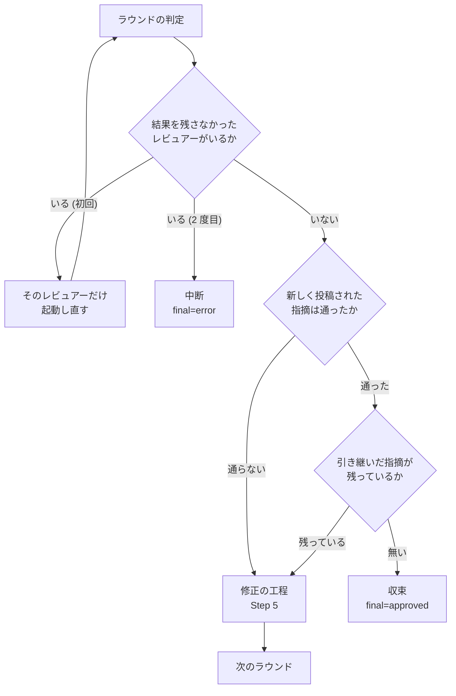

# 01: 状態管理 + レビュー実行 (Step 0〜4)

`SKILL.md` 本体から呼び出される **状態ファイル初期化 / ラウンド開始 /
並列レビュー / 判定 / 振動検知** までの詳細手順。

主要処理は `scripts/` 配下のコマンドに切り出し済み:

| script | 役割 |
|---|---|
| `scripts/state.py init` | Step 0 — state 初期化 / 再開 + プリチェック |
| `scripts/state.py start-round` | Step 1 — round 開始判定 |
| `scripts/launch-reviewer.sh` | Step 2 — レビュワー起動の入口（4 ランタイム共通） |
| `scripts/monitor.py` | Step 2 — レビュワーのプロセス多軸監視（`--agents` で担当を渡す） |
| `scripts/wait-review.sh` | Step 2 — `monitor.py` の薄ラッパ（互換用） |
| `scripts/state.py read-result` | Step 2.4 — result.json マージ |
| `scripts/state.py unresolved-threads` | PR 上の未解決の指摘を数える（順序を持たない補助） |
| `scripts/state.py judge` | Step 3 — intent + 引き継いだ指摘の判定 |
| `scripts/state.py check-oscillation` | Step 4 — 振動検知 |

このドキュメントは Step 0〜4 の**手順**を残す。状態ファイルの形式と AI への入出力の契約は
[04-contracts.md](04-contracts.md) にある。スクリプト側の挙動はソースを直接参照のこと。

## Step 0: 準備 + 既存 state 引き継ぎ

```bash
# この Skill のディレクトリを決める。候補を順に試し、最初に当たったものを絶対パスで採る。
# Claude Code は SKILL.md 内の ${CLAUDE_PLUGIN_ROOT} をプラグインルートの絶対パスへ置き換えて
# から渡す。シングルクォートで囲むのは、置き換えられなかったときにシェルへ展開させないため
# である（未定義の変数を読まないので `set -u` でも落ちない）。Codex と Kiro CLI は置き換えず、
# プラグインルートを示す環境変数も置かない（Codex は実測、Kiro CLI は未確認）。置き換えない
# runtime では、
# **この bash を実行する前に `<この Skill のディレクトリ>` をランタイムから渡された実際の
# パスへ置き換えること**。置き換えないまま実行しても、その候補が外れるだけで別の場所を
# 読むことはない。Kiro CLI は installer が `.kiro/skills/` へ symlink を張るため、置き換え
# なくてもその位置で当たる。
SKILL_NAME=cross-review
PLUGIN_ROOT='${CLAUDE_PLUGIN_ROOT}'
case "$PLUGIN_ROOT" in '$'*) PLUGIN_ROOT= ;; esac
SKILL_DIR=
# 明示的に渡されたディレクトリを `.kiro` より先に見る。逆にすると、Kiro の設定を持つ
# リポジトリで Codex や Claude Code を動かしたときに別 runtime の Skill を選ぶ。
for candidate in \
  ${PLUGIN_ROOT:+"$PLUGIN_ROOT/skills/$SKILL_NAME"} \
  "<この Skill のディレクトリ>" \
  ".kiro/skills/$SKILL_NAME" \
  "$HOME/.kiro/skills/$SKILL_NAME"
do
  [ -d "$candidate/scripts" ] || continue
  # 相対パスのまま持ち回ると、この後 worktree へ移ったときに外れる。ここで絶対パスにする。
  SKILL_DIR="$(cd "$candidate" && pwd)"
  break
done
[ -n "$SKILL_DIR" ] || { echo "この Skill のディレクトリを解決できない" >&2; exit 1; }
SCRIPTS="$SKILL_DIR/scripts"

# state 初期化 / 再開（プリチェック・worktree 作成・既存コメントスナップショットを内部実行）
# ⚠ `eval "$(スクリプト)"` は、スクリプトが異常終了しても出力が空なら終了コード 0 に
# なる。コマンド置換の終了コードは eval 自身の終了コードにならないため、止まるべき
# 場面で止まらない。**必ず変数で受け、終了コードを見てから eval する。**
INIT_VARS=$("$SCRIPTS/state.py" init "$STATE_PR" \
          --max-rounds "$MAX_ROUNDS" --rotate-after "$ROTATE_AFTER" \
          ${ONLY:+--only "$ONLY"} \
          ${FOCUS:+--focus "$FOCUS"} \
          ${EXTRA_INSTRUCTIONS_FILE:+--extra-instructions-file "$EXTRA_INSTRUCTIONS_FILE"}) || exit $?
eval "$INIT_VARS"

# eval で取り込まれる変数: PR, WORKTREE, REPO, HEAD_BRANCH, BASE_BRANCH,
#                        IS_OWN_PR, EVENT_DOWNGRADE, CARRIED_OVER_THREADS, RESUMED
cd "$WORKTREE"
```

`state.py init` が内部で行う処理:

1. 既存 state.json があり `final == null` なら再開。**再開のときは PR 上の未解決の指摘を
   数え、`carried_over` に記録する**（Step 3 の判定へ入る。取得できなければ記録は変えない）
2. 自分の PR 判定（`gh api user` と `gh pr view --json author` を比較）
3. worktree 作成（`<worktree-base>/<owner>--<repo>/pr<PR>`。`<worktree-base>` は `NDF_WORKTREE_BASE` env > `<システム tmpdir>/ndf-worktrees` の優先順で解決。既存パスが現リポジトリの登録済み worktree でなければ `.stale-<ts>` に退避して作り直す。実 path は state.json の `worktree_path` を参照）

   **既存の worktree を流用するときは、必ず PR の head へ同期する。** `git fetch origin <head>`
   の後に worktree の中で `git reset --hard origin/<head>` を実行し、
   `git clean -fd -e .cross_review` で前回の実行が残した追跡対象外のファイルを消す。
   フォーク PR で origin に head branch が無いときは `gh pr checkout <PR> --detach` へ
   落とす。同期できないときは止める。

   同期しないと、**レビュー担当は前回の実行が残した古い差分を読む**。指摘は現在の Pull Request
   に無い行へ出るか、直したはずの箇所へ再び出る。どちらも投稿されるため、読む側からは
   見分けが付かない。実測では 8 コミット古い worktree がそのまま流用された。

   追跡対象外のファイルを消すのは、fix 担当が `git add -A` を使ったときに Pull Request へ
   混ざるためである。`-x` は付けず、tmp ディレクトリは `-e` で除外する。`.gitignore` に
   `.cross_review/` を持たないリポジトリでも、state.json と result.json が残る。

   **再開の経路でも同じ同期を行う。** 中断から再開するまでの間に head が進んでいることがある。
   **ラウンドの開始時（Step 1）にも同期する。** そちらは失われるものがあるときに止める。
4. 既存コメントスナップショット (`fix/scripts/fetch-pr-comments.sh` で 3 ソース一括取得) → `$TMP_DIR/cross-review-pr<PR>-existing-comments.txt`
5. state.json 書き出し

**重要**: 以降の全ステップで `cd $WORKTREE` を強制。
サブエージェント（fix）を起動するときも、prompt 内で worktree path を明示する。

## Step 1: Round 開始判定

```bash
ROUND_VARS=$("$SCRIPTS/state.py" start-round "$STATE_PR") || {
  RC=$?
  [ "$RC" -eq 1 ] && break   # max_rounds 到達 → ループを抜けて最終スイープへ
  exit "$RC"                 # 5=後始末が未了 / 8=作業ツリーを同期できない。その場で止める
}
eval "$ROUND_VARS"
# eval で取り込まれる変数: ROUND, ROUND_IN_PR, PR, MAX_ROUNDS, ROTATE_AFTER
```

`state.py start-round` は `max_rounds` 超過なら `final=max_rounds` を書いて exit 1。
それ以外は新しい round エントリを state.rounds に push して KEY=VALUE を吐く。

前のラウンドの後始末（返信と Resolve）が終わっていなければ **exit 5** で止まる。
条件は Step 3 の「Step 1 の開始時に行う後始末の検査」にある。

### ラウンドの開始時の同期

**round エントリを開く前に、作業ツリーを PR の head へ揃える。** 修正を作業ツリーの外で
行って push すると、次のラウンドは 1 つ前の内容をレビューする。実測（PR #212）では、
ラウンド 4 で対応済みの指摘 2 件がラウンド 5 で再び投稿された。エントリを開く前に行うのは、
途中で止まったときにラウンドが半端に開かれず、原因を取り除いた後に同じ番号から再開できる
ようにするためである。

| 状態 | 扱い |
| --- | --- |
| head より古い | `git fetch` と `git reset --hard <headRefOid>` で揃える |
| head と一致していて変更が無い | 何もしない。`git clean` も発行しない |
| 追跡対象のファイルに変更がある | **exit 8** で止める |
| 基準に含まれないローカルのコミットがある | **exit 8** で止める |
| 基準を取り込めない / head を解決できない | **exit 8** で止める |
| `worktree_path` が無い、または登録済みの作業ツリーでない | 同期せず、警告して続ける |

追跡対象の変更と未 push のコミットで止めるのは、それが**修正の工程が push を終えていない
証拠**だからである。捨てると修正そのものが失われ、しかも失われたことが誰にも見えない。
`init` の側で同じものを捨てているのは、そこで見つかる残骸が前回の実行のものだからで、
意味が違う。

**同期の失敗で exit 1 を返さない。** 1 はループを抜ける値であり、返すと同期できない原因が
残ったまま最終スイープへ進む。

比較の基準は `gh pr view --json headRefOid` が返すコミットで、`origin/<head>` ではない。
フォークの PR では head branch が base のリポジトリに無く、`origin/<head>` を基準に据えると
一致判定も未 push のコミットの検出もフォークのときだけ行えない。取り込みの宛先だけを
`refs/pull/<PR>/head` へ変える。

同期先のブランチ名は毎ラウンド取り直し、`state.json` の `head_branch` へ書き戻す。
`squash` の巻き直しは `<branch>-r<HHMMSS>` を作るため、巻き直しの側でも `set-current-pr` が
`--head-branch` で受け取った値を書き戻す。ラウンドの開始時にも取り直すのは、作業ツリーの
外で行われた変更に追従するためである。

## Step 2: レビュー担当 2 者の並列レビュー（AI 直接投稿）

**要点**: メインは launcher を **並列バックグラウンド** で起動するだけ。
各 AI が `gh api` で投稿し `$TMP_DIR/<agent>-review-pr<PR>-result.json` に
サマリを書く。**ペイロード本体はメイン context に載せない**。

### 2.1 launcher 起動 + monitor

```bash
# 担当は `start-round` が $REVIEWERS / $REVIEWERS_CSV で返す。**名前で分岐しない。**
for r in $REVIEWERS; do
  [ -z "$ONLY" ] || [ "$ONLY" = "$r" ] || continue
  "$SCRIPTS/launch-reviewer.sh" "$r" "$STATE_PR" "$ROUND"
done

# monitor.py が多軸で完了判定。exit code で失敗種別を分岐。
# ⚠ 位置引数の `both` は codex / agy の 2 者だけを指す。担当の一覧は `--agents` で渡す。
if ! "$SCRIPTS/monitor.py" "$STATE_PR" --agents "${ONLY:-$REVIEWERS_CSV}"; then
  case $? in
    2) echo "❌ timeout"      ;;  # hard timeout 超過
    3) echo "❌ no result"    ;;  # プロセス終了したが result.json 未生成
    4) echo "💥 early error"  ;;  # err.log に致命的パターン
    5) echo "🛑 stalled"      ;;  # 進捗ログ更新なし
    6) echo "❓ pidfile bad"  ;;  # 起動失敗 / 不正
  esac
  # ラウンドを失敗マークしてリトライ or 中断（state.py side で判断）
fi
```

#### `monitor.py` の多軸監視

| 軸 | 内容 |
|---|---|
| pidfile + `kill -0` | プロセス生存確認。alive 確認後に `/proc/<pid>/cmdline` で agent 名一致も検証 (PID 再利用対策)。**プロセスが既に死んでいる場合は result.json の有無のみで OK 判定**する (死亡直後 cmdline 不一致で誤検知しないため) |
| codex sentinel | err.log に `^tokens used$` 出現で正常完了マーク |
| early-error | **行頭限定** で `^Error:` / `^FATAL:` / `^panic:` / `^Traceback ` / `^HTTP/1.1 401\|403\|429` / `^Approval mode overridden to "default"` / `^Authentication failed` / 「quota exceeded」「rate limit exceeded」「API key not found/missing/invalid」「sandbox error」を含む行を検出 (diff/doc 引用文中の同語句は誤検知しないよう anchor + benign フィルタ併用) |
| stall timeout | err.log + stdout.log + progress.log の合計サイズが一定時間変化しなければ STALLED で中断。既定は **agent 別** (codex=**180s** / agy=**480s**)。agy は err.log がほぼ無音のため大きめに取る。codex 側既定は不変。上書き方法: CLI `--stall-timeout` (明示優先) > env `MONITOR_STALL_<AGENT>` (per-agent) > env `MONITOR_STALL` (両 agent 共通) > agent 別ビルトイン |
| hard timeout | 既定 **7 分**。`--timeout` or `MONITOR_TIMEOUT` env で上書き |
| progress.log heartbeat | launcher が任意で `<agent>-review-pr<PR>-progress.log` への短いフェーズマーカー出力を要求し、monitor が最終行を stderr の heartbeat に表示する。内部推論ではなく `scan` / `analyze` / `post` / `done` などの監視用ステータスだけを出す |
| result.json 存在 | プロセス終了後、result.json が無ければ NO_RESULT (exit 3) |
| **result.json + age fallback** | sentinel を持たない agent (agy) 向け。プロセスが alive のまま result.json の mtime が **30 秒以上前**なら完了とみなし kill → OK。結果を書いた後にプロセスが終わらないケースに対応 (codex は sentinel チェックが先に発火するため影響なし) |
| **失敗時 kill** | TIMEOUT / STALLED / EARLY_ERROR / PIDFILE_BAD で返るときは対象プロセスに SIGTERM → 3 秒後 SIGKILL。残存プロセスが後から `gh api` 投稿や result.json 書き込みを行うのを防ぐ |

> ⚠ **罠**: `nohup ... &` でラッパーシェルは即終了し、ハーネスから
> 「タスク完了」通知が飛んでくる。これに惑わされず、`monitor.py` で
> 実プロセスの完了を pidfile / sentinel で確認すること。
>
> ⚠ **`pgrep -fa <prompt>` で完了判定しない**: agy は long `-p` プロンプトを
> 引数に持つため、`grep` のキーワード選定で誤検知する。**pidfile 必須**。
>
> ⚠ **sentinel 単独で完了判定しない**: codex がクラッシュすると `tokens used` が
> 永遠に出ない。`monitor.py` は sentinel と pidfile/result.json/err.log を併用する。
>
> ⚠ **Docker 環境ではゾンビプロセスに注意**: `nohup ... & disown` で起動した
> プロセスは、終了後にゾンビ化する (PID 1 が proper init でない場合)。
> `monitor.py` は `/proc/<pid>/status` でゾンビを検出して dead 扱いする。
> **推奨: Docker 実行時に `--init` フラグを付ける** (tini が PID 1 になりゾンビを reap する)。

AI への入出力の契約（2.2）と、AI が書き出すファイルの契約（2.3）は
[04-contracts.md](04-contracts.md) にある。

### 2.4 result.json を state にマージ

```bash
for r in $REVIEWERS; do
  [ -z "$ONLY" ] || [ "$ONLY" = "$r" ] || continue
  "$SCRIPTS/state.py" read-result "$STATE_PR" "$r"
done
```

`state.rounds[-1].<agent>` に `intent / posted_as / comments / review_url / by_severity` を分離保存する。

#### 申告されたコメント数を GitHub 側と突き合わせる

投稿は **AI 自身が `gh api` で行う**ため、失敗しても結果ファイルの申告だけは残る。
申告のまま進むと、修正担当が読むべき指摘が GitHub 上に存在しないまま収束判定まで走る。
実測では、2 件の申告に対しスレッドが 1 つも作られていなかった。

`read-result` は申告が 1 件以上のとき、`review_url` の識別子から
`repos/<repo>/pulls/<PR>/reviews/<id>/comments` を数えて突き合わせる。

| 申告 | GitHub 側 | 扱い |
| --- | --- | --- |
| 0 件 | 見に行かない | 突き合わせる相手がいない |
| n 件 | n 件以上 | 採用する。人の追記など申告以外の経路で増えうる |
| n 件 | n 件未満 | **中断する。** 投稿が届いていない |
| n 件 | 取得できない | 申告を採用し、確認できなかったことを出力へ残す |

**「取得できなかった」と「0 件」を区別する。** 取得の失敗で止めると、GitHub 側の
一時的な不調でループが進まなくなる。

**誰がレビューし、いつ止めるかは [05-pool-and-convergence.md](05-pool-and-convergence.md)
にある。** 母集合・担当の輪番・認証の確認と、終了基準の 3 つの層をそこで定める。

## Step 3: 判定（新規の指摘 + 引き継いだ指摘 + 結果なし）

```bash
JUDGE_VARS=$("$SCRIPTS/state.py" judge "$STATE_PR"); JUDGE_RC=$?
eval "$JUDGE_VARS"
# コマンド置換の終了コードは変数で受けてから読む。
# `eval "$(...)"` の形は置換の終了コードを飲むため、7 で分岐できない。
```

### 判定の出口

出口は 5 つある。**結果を取り込めていないラウンドは、収束も修正も決められない。**
そのため結果なしの検査を、通ったかどうかの判定より先に置く。

| ラウンドの状態 | 出口 | 終了コード | `verdict` |
| --- | --- | --- | --- |
| 結果なしがあり、そのレビュアーをまだ起動し直していない | 起動し直す | 7 | `no_result` |
| 結果なしがあり、既に起動し直している | 中断（`final = error`） | 1 | `no_result` |
| 通ったが、待ち行列に投稿が残っている | 流し直す | 8 | `queued` |
| 通った、かつ引き継いだ指摘なし | 収束（`final = approved`） | 0 | `approved` |
| それ以外 | 修正へ | 2 | `changes_requested` |

終了コード 8 を 2 と分けるのは、**修正するものが無い状態で修正の工程を起動すると空回り
する**ためである。呼び出し側は 8 を受けたら `flush` を試し、流し切れたら判定をもう一度
実行する（`SKILL.md` のループ）。

### 結果を残さなかったレビュアーの扱い

**起動したのに使える結果が残らなかったレビュアーは、収束の側へ数えない。** レビューが
行われていないのに、行われて承認されたのと同じ出口へ進むためである。打ち切りは負荷が
高いときや対象が大きいときに起きやすく、レビューが最も要る場面で承認が水増しされる。

`--only` で外したレビュアーと、結果を残さなかったレビュアーは別の値で持つ。

| 値 | 意味 | 収束の判定 |
| --- | --- | --- |
| `SKIP` | `--only` の指定で起動しなかった | 判定へ届かない（短絡する） |
| `NO_RESULT` | 起動したが、使える結果が残らなかった | 通らない |

`NO_RESULT` は `read-result` が書き込む。理由は `no_result_reason` に残る。

| 理由 | 何が起きたか | `read-result` の終了コード |
| --- | --- | --- |
| `missing` | 結果ファイルが無い、または空 | 1 |
| `unparsable` | JSON として読めない、または dict ではない | 3 |
| `no_verdict` | `event` も `intent` も無い | 1 |

**記録が無いラウンドも結果なしとして読む。** 骨組みが取り込みを呼び忘れても、判定は
収束しない。

終了コード 7 のとき、判定は次の 2 行を追加で出力し、対象を `rounds[-1].relaunched` へ
記録する。**2 度目の判定は記録を見て中断へ回る。**

```text
RELAUNCH_AGENTS='agy'
RELAUNCH_TARGET=agy
```

`RELAUNCH_TARGET` は `codex` / `agy` / `both` のいずれかで、`monitor.py` へそのまま
渡せる値である。起動し直しはラウンドの中で完結するため、**ラウンドの数え方と上限の
意味は変わらない。** 回数を 1 度に限るのは、待ち時間の上限をラウンドあたり 2 回分に
収めるためである。

### 判定へ入れる対象

判定は 2 つの対象を別々に見る。**投稿数と未解決の指摘の数は一致しない。**
投稿数はそのラウンドで外部の AI が新しく投稿した件数で、未解決の指摘は前のラウンドの
分も含む Pull Request 上の総数である。

| 対象 | 判定への入れ方 | 数え方 |
|---|---|---|
| そのラウンドで新しく投稿された指摘 | 外部の AI が返した `intent` と重要度で見る | `result.json` の `comments_count` |
| 引き継いだ指摘（再開の時点で残っていた未解決の指摘） | 修正の工程（Step 5）を 1 度通すまで収束させない | GraphQL の `reviewThreads` を数え直す |



すべてのラウンドで未解決の指摘が 0 件になるまで収束させる形は採らない。承認された
ラウンドに軽微な指摘が乗るのは通常の経路であり、そこを収束の条件にするとラウンドが
増え続ける。収束を止めるのは修正の工程を 1 度通すまでで、**増えるラウンドは最大 1 回**に
収まる。1 度通した後に残る指摘は最終スイープ（Step 7.5）が受け持つ。

**判定ロジック**（新しく投稿された指摘の側）:

- `APPROVE` は pass
- `COMMENT` は `by_severity.critical == 0 && major == 0` のみ pass（軽微な指摘のみなら通す）
- `NO_RESULT` は pass にしない（結果なしの検査が先に効くため、ここへは届かない）
- `--only` 指定時は反対側を SKIP 扱いとし、pass 判定を短絡する
- ループ収束判定は **必ず `intent`** を見る（`posted_as` ではない）

自分の PR で `REQUEST_CHANGES → COMMENT` にダウングレード投稿していても、
intent が `REQUEST_CHANGES` なら継続する。

### 引き継いだ指摘の記録と解除

| 段階 | 起きること |
|---|---|
| `init` の再開 | 未解決の指摘を数え、`carried_over` に件数と thread ID を記録。出力に `CARRIED_OVER_THREADS=N` |
| `judge` | `carried_over.fixed_in_round` が `null` のあいだは、両者が承認しても exit 2 |
| `merge-fix` | 修正の工程を通したラウンド番号を `carried_over.fixed_in_round` に入れる |
| 以降の `judge` | 引き継ぎは判定から外れ、収束の振る舞いは現行に戻る |

新規に開始したレビューでは記録しない。引き継ぎは**再開の時点**で決まる。
未解決の指摘を取得できなかったときは記録を書き換えない（0 件として扱わない）。

修正の工程を通した後にもう一度再開したときは、**そのとき残っている指摘が前回の記録に
無い識別子を含むかどうか**で分ける。含まなければ deferred / rejected と最終スイープ待ちの
残りなので、`fixed_in_round` をそのまま残して収束を抑止しない。含むなら再開の後に増えた
指摘があるため、それを含めて数え直し、もう 1 度修正の工程へ通す。前者を未処理として
数え直すと、収束が再開のたびに 1 ラウンドずつ先送りされる。

### 未解決の指摘を単独で数える

```bash
UNRESOLVED_VARS=$("$SCRIPTS/state.py" unresolved-threads "$STATE_PR") || exit $?
eval "$UNRESOLVED_VARS"
# UNRESOLVED_COUNT / UNRESOLVED_THREAD_IDS を取り込む。
# exit 1 = 取得できなかった（0 件と区別する）
```

### GitHub が使えないあいだの投稿（待ち行列）

GitHub の利用回数の上限に達すると投稿は失敗する。**失敗をそのまま止める側へ倒すと、
レビューを 1 巡も進められない。** 上限のときだけ投稿する内容をローカルへ積み、回復した
後に順に流す（#291）。仕組みは共通層の `post_queue.py` にある。

置き場所は状態ファイルと同じ `<作業ツリー>/.cross_review/pending/` で、1 項目 1 ファイルの
JSON である。名前は `<連番 4 桁>-<種別>-<識別子>.json` で、**順序はこの連番だけが決める**。

| 応答 | 扱い |
| --- | --- |
| HTTP 403 / 429 で `message` が上限を指す | 積む。終了コード 0 で先へ進む |
| HTTP 403 で `message` が上限を指さず、残り回数も 0 でない | 積まない。これまでどおり止める |
| HTTP 404 | 積まない。これまでどおり止める |
| HTTP の番号を伴わない失敗で、本文が上限を指す | 積む（GraphQL はこの形になる） |

**判別は標準エラーの `(HTTP <番号>)` と標準出力の `message` の両方を読む。** 403 は上限と
権限の誤りの両方で返るため、片方だけでは分けられない。なお決まらないときだけ
`gh api rate_limit` を引く（この照会そのものは上限を消費しない）。

流すきっかけは 2 つある。**自動だけにも明示だけにもしない。** 自動だけだと、回復を待つ
あいだ何もコマンドを実行していない場合に流れない。明示だけだと、進行側が忘れたときに
残ったまま収束の判定へ進む。

| きっかけ | どこで | 流せなかったとき |
| --- | --- | --- |
| 自動 | `init` / `start-round` / `judge` の入口 | 積んだまま先へ進む。工程は止めない |
| 明示 | `state.py flush <番号>` | 残った件数と理由を出力し、終了コードは 0 |

**取り込み（`read-result`）の入口では流さない。** `review-post` の書き戻し先はその
ラウンドの担当のエントリで、取り込みの前にはまだ無い。流すと書き戻せないまま項目が消え、
`queued` が真のまま待ち行列だけが空になる。判定はその状態で収束するため、投稿の存在も
参照も一度も確かめられない。**流すのは両方を取り込んだ後**（`judge` の入口）で、
取り込みは判定の直前にしかないため、流す時期が遅れるのは 1 コマンド分である。

**読めない項目はそこで止め、理由を出す。** 黙って飛ばすと、送りも失敗の報告もしない
一方で件数だけが残り、判定が終了コード 8 を返し続ける。

**流す前に、同じ内容が既に GitHub 側にあるかを種別ごとの照会で確かめる。** 2 度流しても
2 件目が作られない。1 件でも送れなければそこで止める（先を飛ばすと Pull Request 上での
順序が入れ替わる）。

**`review-post` を積むときは、そのラウンドで読んだ `rounds[-1].head_sha` を `commit_id`
として渡す。** Reviews API は `commit_id` を省くと**流した時点の head** へレビューを付ける。
積んでから流すまでに head が進むと、レビューが読んでいない commit に付き、行を指す
`comments` はその差分で解決されるためずれる。**冪等の照合には入れない**（投稿者・判定・
本文の先頭 80 文字で照合する）。head が進んだ後に commit まで比べると、既に届いている
レビューを別物と読んで二重に投稿する。

巻き直しの 3 種（`gh pr close` / `gh pr create` / `gh pr reopen`）は**積まず、回復を待って
再実行する**。作成が終わるまで新しい番号が決まらず、番号が決まらないと以降のすべての
項目の宛先が決まらない。待つあいだラウンドは進まないが、巻き直しは 8 ラウンドに 1 度である。

#### #261 の決まりとの関係

**待ち行列は、投稿が届いたことを確かめる時点を投稿の直後から流した直後へ移すだけである。**
決まりそのものは変えない。

| 段階 | 待ち行列を入れた後 |
| --- | --- |
| 結果を取り込む | `queued` が真の結果は、届いたことの照会を飛ばす（識別子がまだ無い） |
| 流した直後 | 投稿先の参照を書き戻し、存在を 1 度だけ確かめる。無ければ結果なしにする |
| 判定 | 待ち行列が空のときだけ収束する |

積んだ時点で照会すると結果なしになり、起動し直しで同じ内容が二重に積まれる。

**確かめる対象は、送った項目と既に届いていた項目の両方である。** 送信に成功した直後に
中断すると、GitHub 側には投稿があるのに項目は残る。次に流すと冪等の照会で見つかって
送らずに消えるため、ここを分けると `queued` が解除されず参照も戻らないまま待ち行列が
空になる。判定は `queued` を見て照会を飛ばすため、届いたことを一度も確かめないまま
収束することになる。照会で見つけた投稿を送った応答の代わりに渡し、同じ経路へ乗せる。

### Step 1 の開始時に行う後始末の検査

`start-round` は、前のラウンドの後始末が終わっているかを次の 2 点で確かめ、
どちらかに当たれば **exit 5** で止まる。進行側が手で修正して次のラウンドへ進めると、
Step 5 が担う返信と Resolve が飛ばされるため。

| 状態 | 扱い |
|---|---|
| 前のラウンドが修正必須の判定で、`fix` の記録が無い | exit 5 |
| 前のラウンドで Resolve したと申告された thread が GitHub 側で未解決のまま | exit 5 |
| 前のラウンドが結果なし（`verdict = no_result`）| 修正の記録を求めない |
| 未解決の指摘を取得できない | 検査を飛ばし、確認できなかったことを stderr へ残して続行 |

判定の結果（`rounds[].verdict`）を持たない古い state.json では、保存された `intent` と
重要度から判定し直して同じ検査へ通す。

## Step 4: 振動検知

```bash
if "$SCRIPTS/state.py" check-oscillation "$STATE_PR"; then
  : # ここには来ない（成功は exit 2 = continue）
elif [ $? -eq 4 ]; then
  exit 4  # final=oscillation で中断
fi
```

各ラウンドの `$TMP_DIR/<agent>-review-pr<PR>-round<R>-payload.json` から指摘を集め、
前のラウンドと**同じ箇所を指す指摘の割合**を計算する。**0.5 以上で中断**する。

同じ箇所かどうかは 3 つの一致でこの順に試し、いずれか 1 つで結びつけば同じ箇所として数える。
位置だけで測ると、趣旨が同じでも行が 1 行ずれれば別の指摘として数えてしまう。

| 一致 | 条件 | 出力での呼び名 |
| --- | --- | --- |
| 位置 | ファイルが同じで、行が同じ | `位置=` |
| 近傍 | ファイルが同じで、行の差が 3 行（`OSCILLATION_NEAR_LINES`）以内 | `近傍=` |
| 本文 | ファイルが同じで、正規化した本文（先頭 80 文字）が同じ | `本文=` |

出力は内訳を持つ（`振動検知: overlap=4/6 (67%) 位置=2 近傍=1 本文=1`）。**近傍の幅の根拠と
なる実測はまだ無いため、内訳を残して判断の材料を貯める。**

PR ローテーション直後 (`round_in_pr < 2`) と現ラウンドの payload が無いときはスキップする。
