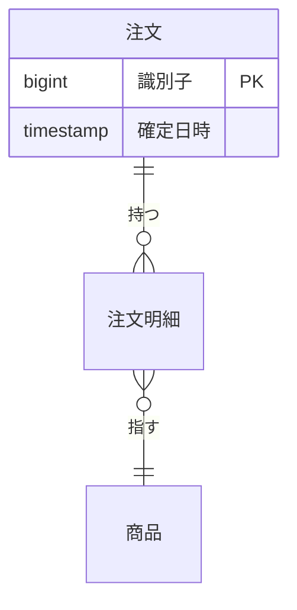

# データ構造

**永続データを持つ、またはスキーマを変える変更でだけ読む。**

## 2 つの条件

### 1. 分析の視点から適切であること

業務処理が通ることだけを条件にしない。**集計・比較・追跡の単位が取り出せる構造にする。**

| 見るところ | 満たすこと |
| --- | --- |
| 名前 | 何が入るかが名前だけで決まる。同じ語が別の意味で使われていない |
| 単位 | 集計したい単位（利用者・期間・区分）が列として取り出せる |
| 意味 | 空の値が「未入力」なのか「該当なし」なのかが区別できる |

**名前の曖昧さが、そのまま誤った集計を生む。** スキーマを読んで問い合わせ文を組み立てるのが
AI である場合、規約の問題ではなく結果の正しさの問題になる。

### 2. 時系列の記録が保護されること

**状態を上書きして過去を失う構造は、設計の時点で退ける。** 手法には確立した型がある。

| 手法 | 保護のしかた | 向くところ |
| --- | --- | --- |
| 二重時間軸 | 業務上の有効期間と、記録された時刻の 2 軸を持つ | ある時点で何が真とされていたかを再現する必要がある |
| 履歴保持型の次元 | 変更を新しい行として追加し、過去の行を書き換えない | 変更の履歴を分析の対象にする |
| 事象の記録 | 状態ではなく発生した事象を積み上げ、状態はそこから導く | 何が起きたかの順序が意味を持つ |
| 定期取得 | 一定間隔で全体を保存し、履歴を再構成する | 変更の検知ができない供給元を扱う |

**既定は置かない。** どれを採るかは対象の性質で決まる。既定を置くと、合わない対象へも同じ
手法が選ばれる。

**選ばなかった場合は理由を残す。** 状態を上書きする構造を選んだときは、過去を失ってよい理由を
決定の記録へ書く。書けないなら、その構造は採らない。

## 3 つの成果物

**表と図を分けて持つ。** 実体どうしの関係は図が、列の定義は表が、機能との対応は別の表が持つ。
1 つにまとめると、どれか 1 つを直したいときに全部を読み直すことになる。

### ER 図

**実体と関連を示す。** 変更が触る実体だけを描き、既存の実体は関連を示すために名前だけを置く
（クラス図と同じ絞り方である）。



- **多重度を書く。** 多重度が設計の判断にあたる
- 属性は、この変更で意味を持つものだけを書く

### テーブル定義

```markdown
| 列 | 型 | 空を許すか | 意味 |
| --- | --- | --- | --- |
| 識別子 | bigint | 許さない | 主キー |
| 確定日時 | timestamp | 許す | 空は「未確定」。「該当なし」ではない |
```

**空の値の意味を必ず書く。** 「未入力」なのか「該当なし」なのかが区別できないと、集計が
誤る。

### CRUD 図

**機能とデータの対応を示す。** 行を機能、列をデータにし、作る・読む・更新する・消すを
記号で書く。

```markdown
| 機能 | 注文 | 注文明細 | 在庫 |
| --- | --- | --- | --- |
| F1 下書きを作る | C | C | — |
| F2 確定する | U | R | U |
```

**書く相手が 2 つ以上ある機能を見つけるために使う。** 1 つの機能が多くのデータを更新して
いれば、責務の分かれ目を疑う。

## 設計文書に書くこと

| 項目 | 内容 |
| --- | --- |
| 保存する形 | 何を、どの単位で持つか。主キーと一意性の条件。ER 図で示す |
| 名前と意味 | 列の名前と、そこに入る値の意味。空の値の扱い。テーブル定義で示す |
| 機能との対応 | どの機能がどのデータを触るか。CRUD 図で示す |
| 時系列の扱い | 上の手法のどれを採るか。採らなかった理由 |
| 移行 | 既存データをどう移すか。移せないものをどう扱うか |
| 検査の手段 | 構造が規約を満たすことを、どのコマンドで確かめるか |

## 記述の標準を使う

機械が読める形式で契約を書くと、構造・意味・制約・品質規則を 1 つの記述にまとめられ、検査と
変換をその記述から導ける。

| 領域 | 記述 | 検査 |
| --- | --- | --- |
| データの契約 | Open Data Contract Standard | Data Contract CLI（構造の検査と、実データが契約を満たすかの試験） |
| 集計指標の定義 | 意味層の定義（YAML） | 定義から問い合わせ文を生成する時点で検査される |

**採用は各リポジトリの判断による。** この Skill が求めるのは、上の 5 項目を設計文書へ書く
ことまでである。記述の標準を使うリポジトリでは、設計文書からその記述を指す。
