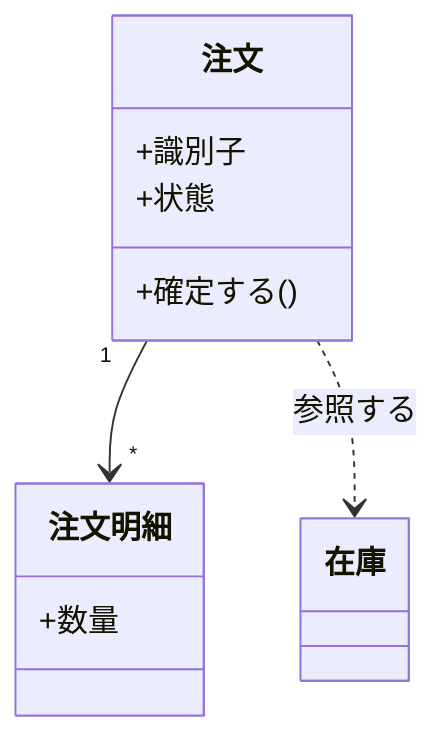
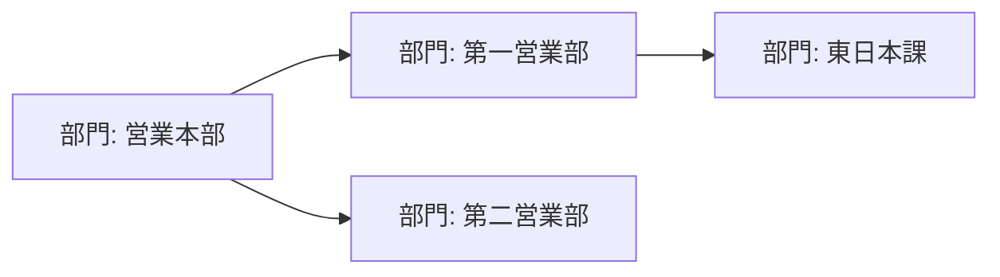
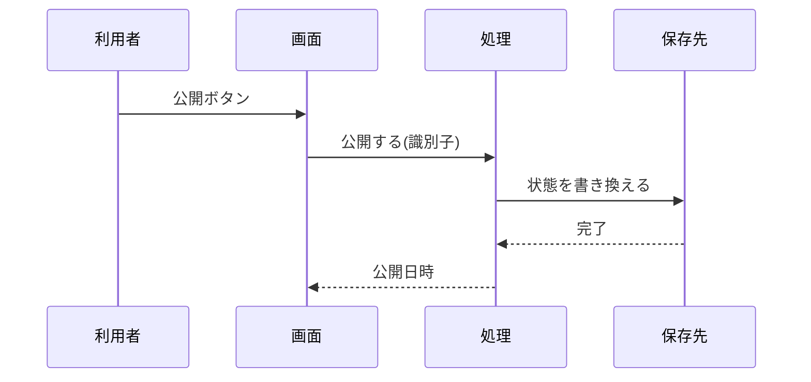
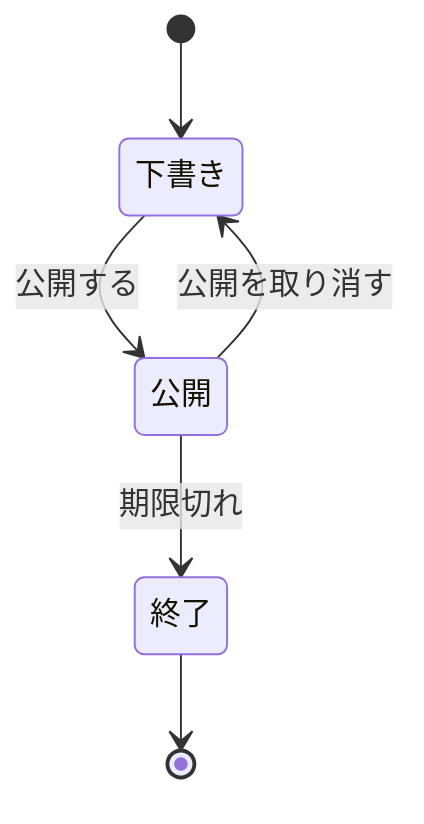

# 構造と振る舞い

**型・クラスを追加または変更する変更、または型を変えずに状態遷移か処理の順序を変える変更で
だけ読む。**

構造（何がどう組み合わさるか）と振る舞い（どういう順序と状態で動くか）を、図として確定
させる。**設計の時点の意図を示すもので、実装後に追随させる義務は負わない。**

## 4 つの図の書き分け

| 図 | 何を示すか | 記法 | いつ使うか |
| --- | --- | --- | --- |
| クラス図 | 型と、型どうしの関係 | `classDiagram` | 型を追加・変更する |
| オブジェクト図 | ある時点の実体と、その値の関係 | `graph` | 型だけでは関係の実際が伝わらない |
| 処理の流れ | 呼び出しの順序と分岐 | `sequenceDiagram` / `graph` | 複数の要素をまたいで動く |
| 状態遷移図 | 状態と、遷移の引き金 | `stateDiagram-v2` | 対象が状態を持ち、遷移に条件がある |

**4 つを全部描かない。** 何を確定させたいかで選ぶ。**同じことを 2 つの図で描くと、片方だけが
古くなる。**

## クラス図

### 載せる範囲

**変更が触る型だけを描く。** 既存の型は、関係を示すために名前だけを置く。

| 条件 | 内容 |
| --- | --- |
| 載せる範囲 | 変更が触る型だけ。既存の型は関係を示すために名前だけ置く |
| 位置づけ | 設計時点の意図を示す。**実装後の追随義務は負わない** |
| 同期の時点 | `plan-to-spec` が `docs/` へ移すときに、実装と食い違っていれば直す |
| 横幅 | 図表ガイドの基準に従い、横に並べる型は 3 個まで |

**「図は書いた時点で古くなる」は事実である。** 全ての型を描く義務にすると維持できない。触る
型だけに絞れば、**設計の差分と実装の差分が同じ範囲を指す。**

### 書き方

- **属性と操作は、この変更で意味を持つものだけを書く。** 全部を書くとコードの写しになる
- 関係の種類（保有・参照・継承）と多重度を書く。**多重度が設計の判断にあたる**
- 既存の型（上の例の `在庫`）は中身を書かず、名前だけを置く

## オブジェクト図

**型だけでは関係の実際が伝わらないときに描く。** 同じ型が役割ごとに別の実体として現れる
場合や、再帰的な構造がこれにあたる。

`classDiagram` には実体を描く記法が無いため、`graph` で書く。

**常に描くものではない。** 要否表でも 4 モードすべて「該当時」である。

## 処理の流れ

**複数の要素をまたいで動くときに描く。** 1 つの要素の中で完結する処理は、図にしない。

| 記法 | 選ぶ場面 |
| --- | --- |
| `sequenceDiagram` | 誰が誰を呼ぶかと、その順序が主題である |
| `graph` | 分岐と合流が主題で、呼び出しの相手は主題ではない |

- **失敗の経路を省かない。** 正常系だけを描くと、失敗したときの順序が実装の判断になる
- 横に並べる登場人物は、図表ガイドの上限に従う

## 状態遷移図

**対象が状態を持ち、遷移に条件があるときに描く。** 状態の名前だけを列挙した表では、
**どの遷移が起こりえないのかが表せない。**

- **遷移の引き金を辺に書く。** 引き金が無い辺は、いつ動くのかが決まらない
- **描かなかった遷移は起こらない**という約束になる。起こりうるなら描く
- 状態の数が 7 個を超えるときは、階層に分けるか、対象を分ける

## 設計文書に書くこと

| 項目 | 内容 |
| --- | --- |
| 触る型 | 追加・変更・削除する型と、その責務 |
| 型の関係 | 保有・参照・継承と多重度 |
| 処理の順序 | 要素をまたぐ呼び出しの順序。失敗の経路を含む |
| 状態 | 状態の一覧と、遷移の引き金。起こらない遷移 |
| 検査の手段 | 構造が規約を満たすことを、どのコマンドで確かめるか |

**該当しない項目の行は作らない。** 状態を持たない変更へ状態の行を求めない。
