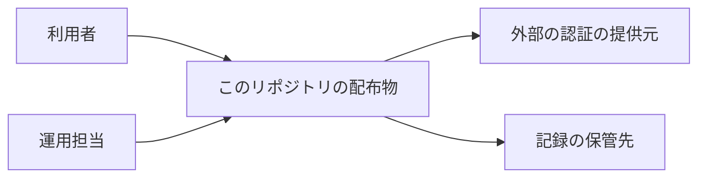
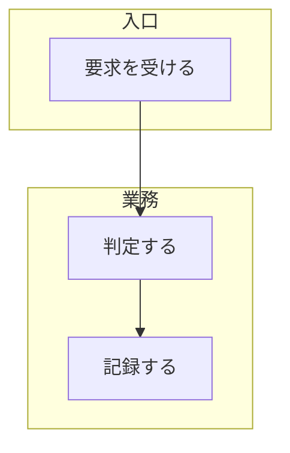
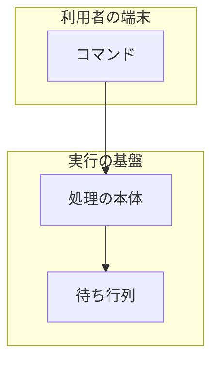

# 文脈・構成・配置

**構成要素を追加・変更する変更、または配置・依存・反映先を変える変更でだけ読む。**

**3 つの階層を分けて描く。** 1 枚に混ぜると、外部との関係と内部の分担と動く場所が同じ線で
つながり、どれが変わるのかが読めない。

| 階層 | 何を示すか | 求める水準 |
| --- | --- | --- |
| 文脈 | 外部の系との関係。誰が使い、何と話すか | `standard` で必須。他は該当時 |
| 構成要素 | 内部の要素と責務の分かれ目 | `standard` と `legacy-refactor` で必須 |
| 配置 | どこで動くか。実行の単位と境界 | `standard` で必須。他は該当時 |

**この 3 つは C4 の System Context / Container / Component におおむね対応する。** 4 つ目の
Code の階層は `structure-behavior.md` のクラス図が持つ。

## 文脈

**変更の影響が及ぶ外側を示す。** 中身は 1 つの箱にまとめ、外部との出入りだけを描く。



- **中身を割らない。** 割ると構成要素の図と同じものになる
- 外部の系は、**こちらが変えられないもの**だけを描く。同じ変更で一緒に変えるものは内部である

## 構成要素

**責務の分かれ目を示す。** 何がどこまでを引き受けるかが読めることが条件である。



- `subgraph` で層や境界をまとめる
- **`legacy-refactor` では現状と変更後の 2 枚を描く。** 1 枚では何が動いたのかが読めない
- 要素の名前は業務の言葉で書き、ファイル名やクラス名を裸で置かない
  （`markdown-writing` のルール 1）

## 配置

**どこで動くかを示す。** 実行の単位（プロセス・コンテナ・関数）と、その境界を描く。



- **境界をまたぐ線には、何が流れるかを書く。** 権限と保護の条件はここで決まる
- 冗長化と切り替えの経路を持つなら描く（`nonfunctional.md` の可用性と対応する）

## パッケージ・モジュール構成

**置き場所をツリーで書く。** 図にしない。

```text
plugins/ndf/skills/design/
├── SKILL.md
└── references/
    ├── deliverables.md
    ├── structure-behavior.md
    └── system-architecture.md
```

- **変える範囲だけを書く。** 全体を写すと、変わらない部分の差分がレビューに乗る
- 新設するものと、移すものを区別できる形にする

## 設計文書に書くこと

| 項目 | 内容 |
| --- | --- |
| 文脈 | 外部の系との出入り。変えられないものと、一緒に変えるものの区別 |
| 構成要素 | 要素と責務。`legacy-refactor` は現状と変更後の 2 枚 |
| 配置 | 実行の単位と境界。境界をまたぐものの中身 |
| 置き場所 | 変える範囲のツリー |
| 検査の手段 | 配置が規約を満たすことを、どのコマンドで確かめるか |

**該当しない項目の行は作らない。** 配置が変わらない変更へ配置の行を求めない。
