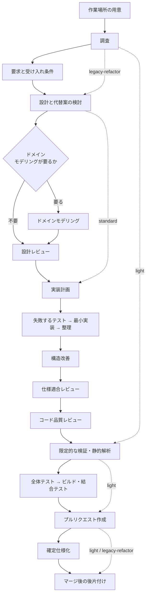

# 開発ワークフローの振り分け

変更内容を 4 つのモードへ分類し、必要な工程だけを起動する。**全変更にフル工程を課さない。**

**判定基準を持つのはこの Skill だけである。** 他の Skill とエージェント定義は判定結果を
受け取る側に徹する。同じ基準を複数箇所へ書くと、モードを追加・変更したときに片方だけが
古くなる。

## 判定の手順

### 1. 変更対象を確認する

```bash
git status --short
git diff --stat            # 変更済みなら
```

依頼文だけで判定しない。**実際に触るファイルと、触る理由**で決める。

### 2. 上から順に条件を判定する

最初に該当したモードを採る。複数に当てはまる場合は**上のモードが勝つ**。

| 順 | モード | 該当条件（いずれか 1 つで該当） |
| --- | --- | --- |
| 1 | `architecture` | 公開インタフェース（API・イベント・コマンド）の追加・変更・削除 / 既存データの移行を伴うスキーマ変更（列の削除・改名・型変更など） / 認証・認可の変更 / 複数モジュールにまたがる変更 / 重要なドメインルールの追加・変更 |
| 2 | `legacy-refactor` | 本番の振る舞いを変えず本番コードの構造を変える変更で、対象にテストがない・少ない |
| 3 | `standard` | 本番の振る舞いの追加・変更、バグ修正 / 本番の振る舞いを変えない構造変更で、対象にテストが十分にある |
| 4 | `light` | **本番の振る舞いも本番コードの構造も変えない局所変更**（文言・書式・コメント・ドキュメント・静的な設定値、テストの追加、ログ出力の追加など） |

`light` の括弧内は**例示であり限定列挙ではない**。判定の基準は「本番の振る舞いも本番コードの
構造も変えない」ことであり、例示に無い変更もこの条件を満たせば `light` として扱う。

スキーマ変更のうち、既存データの移行が不要な追加（インデックスの追加、既定値付き
NULL 許容列の追加）は `standard` として扱う。判定に迷う場合と境界事例は
[references/workflow-modes.md](references/workflow-modes.md) を参照する。

### 3. 判定結果を出力する

呼び出し側（エージェント・他の Skill・利用者）が**判定結果だけを受け取れる形式**で返す。

```text
mode: standard
根拠: 注文確定の振る舞いを変更する。公開 API とスキーマは変えない
必須工程: worktree → requirements-design → implementation-plan → tdd-cycle
  → refactoring → cross-review → quality-gates → pr
  → plan-to-spec（仕様が変わった場合） → merged
```

工程の並びは「モードごとに起動する Skill」の表から読む。この例は出力の形を示すもので、
基準ではない。

判定基準の本文を出力へ貼らない。呼び出し側が基準を写し取ると、この Skill が唯一の
置き場所である前提が崩れる。

## モードごとに起動する Skill

| 工程 | `light` | `standard` | `architecture` | `legacy-refactor` |
| --- | --- | --- | --- | --- |
| 作業場所の用意 | `worktree`（主ディレクトリで編集してよいパスだけなら不要） | `worktree` | `worktree` | `worktree` |
| 要求と受け入れ条件 | — | `requirements-design` | `requirements-design` | — |
| 設計 | — | `implementation-plan` に代替案と採否を記録 | ドメインモデリングと設計レビュー（Release 2 で有効化） | `implementation-plan` に代替案と採否を記録 |
| 計画 | — | `implementation-plan` | `implementation-plan` | `implementation-plan` |
| 実装 | 直接編集 | `tdd-cycle` | `tdd-cycle` | `refactoring` |
| 構造改善 | — | `refactoring` | `refactoring` | `refactoring` |
| レビュー | — | `cross-review` | `cross-review` | `pr-review` |
| 完了判定 | `quality-gates` | `quality-gates` | `quality-gates` | `quality-gates` |
| Pull Request | `pr` | `pr` | `pr` | `pr` |
| 確定仕様化 | — | `plan-to-spec`（仕様が変わった場合） | `plan-to-spec` | — |
| 後片付け | `merged` | `merged` | `merged` | `merged` |

**作業場所の用意は、要求を整理する前に済ませる。** 開発の変更は clone したディレクトリではなく
`.worktrees/<ブランチ名>` の作業ツリーの中で行う。後から移すと、主ディレクトリに変更が残った
まま並行作業が始まる。`light` でも、本番コードの文言やテストを触るなら作業ツリーを使う。
`issues/` `docs/` と各ランタイムの設定だけで収まる変更は、主ディレクトリのままでよい。

**後片付けは工程の一部である。** マージした作業ツリーとブランチが残ると、次の作業で
どれが生きているのか分からなくなる。`merged` は取り消しが難しい操作を含むため、削除の対象を
一覧で示して同意を取ってから消す。

「設計」行の `standard` と `legacy-refactor` は**専用の設計 Skill を起動しない**。設計と代替案の
検討そのものは行い、結果を `implementation-plan` の中に残す。

レビュー段階は**明示的に呼ぶ**。自然文で「レビューして」と依頼すると、Claude Code では
組み込みの `code-review` が起動して判定の投稿経路が変わる。

`standard` と `architecture` は `cross-review` を使う。**片側 1 回の判定では取りこぼしが残る**。
`cross-review` は 2 つの外部 AI が同じ差分を見て、両方が承認するまで修正を回す。
`legacy-refactor` が `pr-review` なのは、振る舞いを変えないことの確認が主で、判定の軸が
既存テストの通過に寄るためである。

構造改善は**レビューと同じく、通す工程であって任意ではない**。動くコードが出た時点では整理が
済んでいないことを前提に置き、見つけた兆候は直す。対象は書き換えた行だけでなく、**その
呼び出し元・呼び出し先と、同じファイル・同じモジュールの関連箇所まで**を含む（範囲と例外は
`refactoring` の `references/code-smells.md`「手を付ける範囲」）。

`light` だけが工程ごと対象外である。本番コードの構造を変えない変更に構造改善の判断は要らない。

## 標準フロー

この図は**工程の全体像**を表す。どの Skill を起動するかは前節の表が基準であり、図はその
工程が何を指すかを示す。実線は `architecture` の経路、破線は各モードが飛ばす経路である。



- `standard` は A → B → C から破線で G へ抜け、**D・E・F（ドメインモデリングと専用 Skill による
  設計レビュー）を通らない**。C の設計と代替案の検討は行うが、専用 Skill は使わず
  `implementation-plan`（G）に代替案と採否として書く
- すべてのモードが S（作業場所の用意）から始まり、P（マージ後の後片付け）で終わる
- `light` は破線の経路（S → A → K → L → P）のみを通る。**N の全体テストと結合テストは通らない**
  （K は変更箇所を 1 度実行する限定的な検証と静的解析だけを指す。依存パッケージの版更新だけは
  例外として既存テスト一式を実行する — [references/workflow-modes.md](references/workflow-modes.md)）
- `legacy-refactor` は A から C へ抜けて `standard` と同じ経路をたどり、**B（要求と受け入れ条件）と
  M（確定仕様化）は通らない**（L から P へ抜ける）。H は「現状固定テスト」、R は「段階的改善」、
  I は「本番の振る舞いが変わっていないことの確認」として読む

## `architecture` モードの現状

設計品質の 3 Skill（設計レビュー、ドメインモデリング、クラス設計）は**まだ導入されていない**。
そのため現時点の `architecture` モードは、次のように縮退した形で動く。

| 工程 | 現状 |
| --- | --- |
| ドメインモデリング | 専用 Skill なし。用語・不変条件を `requirements-design` の仕様へ書く |
| 設計判断の記録 | `implementation-plan` に代替案と採否の理由を書く |
| 設計レビュー | 専用 Skill なし。実装前に `cross-review` 相当の観点で自己点検する |
| 契約・結合テスト | `tdd-cycle` の階層の使い分けに従う |

3 Skill の導入後にこの節を差し替える。**判定基準の側は変えない**。モードの定義は確定して
おり、振り分け先だけを後から埋める。

## 途中でモードが変わったとき

判定はやり直してよい。ただし**上げる方向のみ**を既定とする。

| 状況 | 対応 |
| --- | --- |
| `light` のつもりが本番の振る舞いを変えると分かった | `standard` へ上げ、受け入れ条件を作り直す |
| `light` のつもりが本番コードの構造を変えると分かった | テストの有無で `standard` か `legacy-refactor` へ上げる |
| `standard` の途中で既存データの移行を伴うスキーマ変更が必要になった | `architecture` へ上げる。ここまでの差分を分ける |
| 工程が重いのでモードを下げたい | 下げない。重い理由が条件に該当しているため |

モードを下げたい場合は、**変更そのものを分割する**。本番の振る舞いも本番コードの構造も
変えない部分を先に `light` として出し、残りを本来のモードで進める。

## 参照

- [references/workflow-modes.md](references/workflow-modes.md) — 判定の境界事例とモード別の詳細
