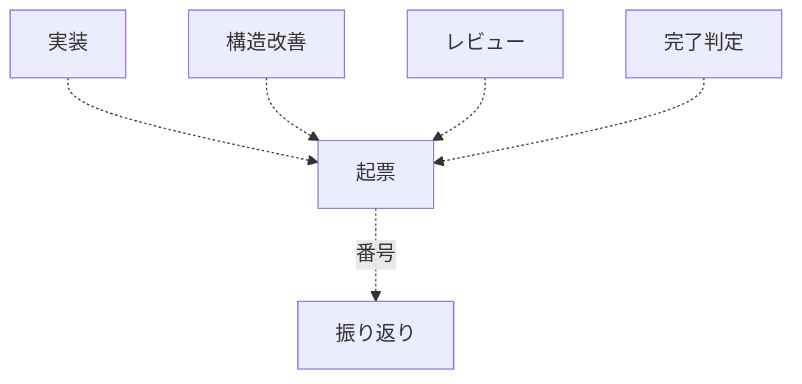
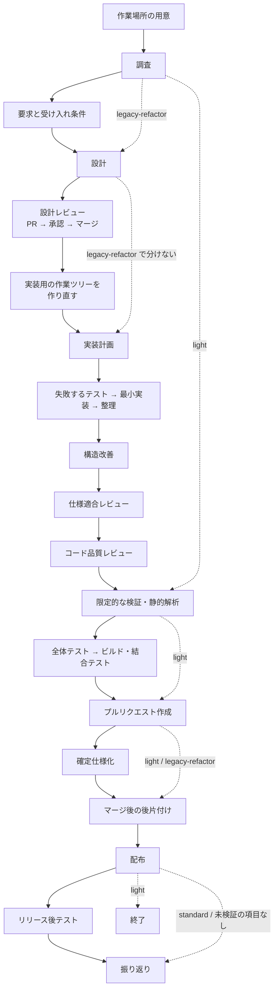

# 開発ワークフローの振り分け

変更内容を 4 つのモードへ分類し、必要な工程だけを起動する。**全変更にフル工程を課さない。**

**判定基準を持つのはこの Skill だけである。** 他の Skill とエージェント定義は判定結果を
受け取る側に徹する。同じ基準を複数箇所へ書くと、モードを追加・変更したときに片方だけが
古くなる。

## 判定の手順

### 1. 変更対象を確認する

```bash
git status --short
git diff --stat            # 変更済みなら
```

依頼文だけで判定しない。**実際に触るファイルと、触る理由**で決める。

### 2. 上から順に条件を判定する

最初に該当したモードを採る。複数に当てはまる場合は**上のモードが勝つ**。

| 順 | モード | 該当条件（いずれか 1 つで該当） |
| --- | --- | --- |
| 1 | `architecture` | 公開インタフェース（API・イベント・コマンド）の追加・変更・削除 / 既存データの移行を伴うスキーマ変更（列の削除・改名・型変更など） / 認証・認可の変更 / 複数モジュールにまたがる変更 / 重要なドメインルールの追加・変更 |
| 2 | `legacy-refactor` | 本番の振る舞いを変えず本番コードの構造を変える変更で、対象にテストがない・少ない |
| 3 | `standard` | 本番の振る舞いの追加・変更、バグ修正 / 本番の振る舞いを変えない構造変更で、対象にテストが十分にある |
| 4 | `light` | **本番の振る舞いも本番コードの構造も変えない局所変更**（文言・書式・コメント・ドキュメント・静的な設定値、テストの追加、ログ出力の追加など） |

`light` の括弧内は**例示であり限定列挙ではない**。判定の基準は「本番の振る舞いも本番コードの
構造も変えない」ことであり、例示に無い変更もこの条件を満たせば `light` として扱う。

スキーマ変更のうち、既存データの移行が不要な追加（インデックスの追加、既定値付き
NULL 許容列の追加）は `standard` として扱う。判定に迷う場合と境界事例は
[references/workflow-modes.md](references/workflow-modes.md) を参照する。

### 3. 判定結果を出力する

呼び出し側（エージェント・他の Skill・利用者）が**判定結果だけを受け取れる形式**で返す。

```text
mode: standard
根拠: 注文確定の振る舞いを変更する。公開 API とスキーマは変えない
必須工程: worktree → requirements-design → implementation-plan → tdd-cycle
  → refactoring → cross-review → quality-gates → pr
  → plan-to-spec（仕様が変わった場合） → merged → release
  → release-verification（マージ前に実施できなかった受け入れ条件がある場合）
  → retrospective
```

工程の並びは「モードごとに起動する Skill」の表から読む。この例は出力の形を示すもので、
基準ではない。

判定基準の本文を出力へ貼らない。呼び出し側が基準を写し取ると、この Skill が唯一の
置き場所である前提が崩れる。

## モードごとに起動する Skill

| 工程 | `light` | `standard` | `architecture` | `legacy-refactor` |
| --- | --- | --- | --- | --- |
| 作業場所の用意 | `worktree`（主ディレクトリで編集してよいパスだけなら不要） | `worktree` | `worktree` | `worktree` |
| 要求と受け入れ条件 | — | `requirements-design` | `requirements-design` | — |
| 設計 | — | `design` | `design` | `design` |
| 設計レビュー | — | `pr` → `cross-review` → `merged` | `pr` → `cross-review` → `merged` | 任意 |
| 計画 | — | `implementation-plan` | `implementation-plan` | `implementation-plan` |
| 実装 | 直接編集 | `tdd-cycle` | `tdd-cycle` | `refactoring` |
| 構造改善 | — | `refactoring` | `refactoring` | `refactoring` |
| レビュー | — | `cross-review` | `cross-review` | `pr-review` |
| 完了判定 | `quality-gates` | `quality-gates` | `quality-gates` | `quality-gates` |
| Pull Request | `pr` | `pr` | `pr` | `pr` |
| 確定仕様化 | — | `plan-to-spec`（仕様が変わった場合） | `plan-to-spec` | — |
| 後片付け | `merged` | `merged` | `merged` | `merged` |
| 配布 | `release` | `release` | `release` | `release` |
| リリース後テスト | — | `release-verification`（マージ前に実施できなかった受け入れ条件があるとき） | `release-verification` | `release-verification` |
| 振り返り | — | `retrospective` | `retrospective` | `retrospective` |

範囲外の課題の起票（`out-of-scope`）はこの表に載らない。工程ではないため、モードで要否を
決めない（「範囲外の課題を見つけたとき」を参照）。

**作業場所の用意は、要求を整理する前に済ませる。** 開発の変更は clone したディレクトリではなく
`.worktrees/<ブランチ名>` の作業ツリーの中で行う。後から移すと、主ディレクトリに変更が残った
まま並行作業が始まる。`light` でも、本番コードの文言やテストを触るなら作業ツリーを使う。
`issues/` `docs/` と各ランタイムの設定だけで収まる変更は、主ディレクトリのままでよい。

**後片付けは工程の一部である。** マージした作業ツリーとブランチが残ると、次の作業で
どれが生きているのか分からなくなる。`merged` は取り消しが難しい操作を含むため、削除の対象を
一覧で示して同意を取ってから消す。

**マージは取り込みであって配布ではない。** 取り込んだだけの変更は、利用者の環境では
起きていない。`release` は 4 モードすべてで通す。要否がモードで変わらないのは、配布が要るか
どうかを決めるのが**変更の中身**であってモードではないためである。配布物に差分が無ければ
`release` 自身が飛ばし、飛ばしたことを報告へ残す。`light` も例外ではない。配布物の中の
1 行を直す変更は `light` になり得る。

**何をもって配布とするかは対象で変わる。** 利用者が取得するもの（パッケージ・プラグイン）、
反映で届くもの（Web アプリ・Web API・Web フロントエンド）、審査を経るもの（モバイルアプリ）で、
公開の仕方も取り消しの手段も違う。判断は `release` が持つ。

**版を上げる担い手と時期も `release` が持つ。** 担い手はまとまりの最後のマージを行った側で、
時期はまとまり単位でマージが終わった後である。Pull Request ごとに上げると、3 件をまとめて
マージしたときに意味のない版が 2 つ増える。

**ただしマージが反映を引き起こす仕組み（継続的配布）があると、この並びは成り立たない。**
マージした瞬間に配布が済むため、承認を得る時点が後片付けの後ではなくマージの前へ移る。
工程表の順序ではなく、実際に起きる順序に合わせる（詳細は `release`）。

**この工程が自動で進めてよいのは検証への配布までである。** 検証環境への反映、または開発版と
分かる版数での公開までを指す。**本番への配布は、工程の続きとして自動で通さない。** `release`
が承認を求めて止まり、得られなければ検証への配布までで終える。前の工程（レビュー・完了判定）を
通ったことは承認の代わりにならない。それらは取り込んでよいかの判断で、利用者へ出してよいかの
判断ではない。

リリース後テストも段階ごとに行う。検証への配布の後は検証環境で、本番への配布の後は本番で
確かめる。検証で確かめたことは本番で確かめたことにならない。

設計は 4 モードのうち 3 つで `design` を通る。作る文書と必須の節はモードで変わり、その振り分けは
`design` が持つ。`light` だけが工程ごと対象外である。

**設計レビューは、設計だけを載せた Pull Request を実装より先にマージする工程である。** 新しい
Skill は使わず、`pr` → `cross-review` → `merged` の 3 つを順に呼ぶ。実装まで進んでからの指摘は
設計文書とコードの両方を書き直すことになるため、設計の段階で 1 度レビューへ通す。

**この工程のマージには人間の承認が要る。** `cross-review` が収束しても、それは 2 つの外部 AI が
取り込んでよいと判断したことであって、設計として妥当かの判断ではない。`/goal` で工程を続けて
通しているときの止まり方は「`/goal` の引数として呼ばれたとき」にある。

マージした後は、実装用の作業ツリーを新しく作る（`merged` が設計のブランチと作業ツリーを消すため)。
`legacy-refactor` で任意としたのは、このモードが要求と受け入れ条件を通らず、レビューの軸が
現状固定テストの通過に寄るためである。

レビュー段階は**明示的に呼ぶ**。自然文で「レビューして」と依頼すると、Claude Code では
組み込みの `code-review` が起動して判定の投稿経路が変わる。

`standard` と `architecture` は `cross-review` を使う。**片側 1 回の判定では取りこぼしが残る**。
`cross-review` は 2 つの外部 AI が同じ差分を見て、両方が承認するまで修正を回す。
`legacy-refactor` が `pr-review` なのは、振る舞いを変えないことの確認が主で、判定の軸が
この工程で先に置く現状固定テストの通過に寄るためである。

構造改善は**レビューと同じく、通す工程であって任意ではない**。動くコードが出た時点では整理が
済んでいないことを前提に置き、見つけた兆候は直す。対象は書き換えた行だけでなく、**その
呼び出し元・呼び出し先と、同じファイル・同じモジュールの関連箇所まで**を含む（範囲と例外は
`refactoring` の `references/code-smells.md`「手を付ける範囲」）。

`light` だけが工程ごと対象外である。本番コードの構造を変えない変更に構造改善の判断は要らない。

**リリース後テストは完了判定と重ならない。** `quality-gates` が求めるのは取り込み前の差分に
対する証跡である。リリース後テストの対象は配布された成果物と、それを受け取った利用者の環境で
あり、取り込み前には用意できない条件（実物のデータ、サービス一式、導入済みの環境、配布の
手続きそのもの）を扱う。起点は版の配布が終わった後、つまり `release` の完了後に置く。

**レビューの工程を通ったら振り返りを行う。** レビューは範囲外の課題が最も出る場である。
起票そのものはその場で済んでいても、起票し損ねたものが無いかを確かめる場が要る。この基準に
よって `light` だけが対象外になる。

## 範囲外の課題を見つけたとき

この変更の受け入れ条件にも、直す対象にも含まれない課題は、**見つけたその場で `out-of-scope` が
issue にする**。順序を持たないため、複数の工程から呼ばれる。



- 判断は 3 択に限る（起票する / 範囲内へ入れる / 起票しない）。3 つ目も理由を 1 行残す
- 迷ったら起票する側へ倒す。後で閉じるほうが、拾い直すより安い
- `retrospective` は起票された課題の一覧を作り、残っていないものを拾う

## 進行を盤面へ記録する

判定したモードと、いま何番目の工程にいるかは会話の中にしか残らない。セッションが変わると
引き継がれない。**リポジトリが `.ndf/projects.json` を持つ場合に限り**、これを GitHub Projects の
盤面へ残す。

- 判定の結果（モード）は、作業場所を用意した時点で記録する
- 工程の切れ目を持つ Skill が、自分の工程に入った時点で進行を書き込む
- 盤面の値は**この工程表の行名と一致させる**。工程を足したときは、同じ表から盤面側も更新する

**この仕組みは任意である。** 宣言が無ければ何も起きず、工程はそのまま通る。進行管理が
理由で開発が止まってはいけない。設定と値の一覧は
[references/projects-tracking.md](references/projects-tracking.md) にある。

## `/goal` の引数として呼ばれたとき

工程を続けて通す。ただし **`standard` と `architecture` は、設計レビューのマージの前で
1 度止まり、人間の承認を待つ**。

- 設計 Pull Request が `cross-review` で収束したら、`AskUserQuestion` で承認を求める
- 承認を得るまで、設計 Pull Request をマージしない。実装の工程へも進まない
- 承認が得られたら、そのまま残りの工程を通す

**止める場所を設計レビューに限るのは、そこが後から直す費用の変わり目だからである。** 実装まで
進んでからの設計の指摘は、設計文書とコードの両方を書き直すことになる。実装以降の工程は、
指摘を受けても直す対象が 1 つで済む。

`legacy-refactor` は設計 Pull Request を分けるかが任意であるため、分けたときだけ同じ扱いに
する。`light` は設計工程を通らないため対象外である。

**配布の承認はこの節では扱わない。** 本番への配布に承認が要ることは `release` が持つ
（「この工程が自動で進めてよいのは検証への配布までである」）。

### なぜ `AskUserQuestion` で止まるのか

`/goal` は停止の判定をターンの終わりに行う。**`AskUserQuestion` はツールの呼び出しであり、
ターンを終えない。** そのため判定が走らず、利用者の回答を待つ間セッションは入力待ちのまま
保たれる。

文中に「承認を待つ」と書くだけでは足りない。書いたうえでターンを終えると、判定が走って
継続を促され、承認を得ないまま次の工程へ進む。**止めるのは判定を変えることではなく、
ターンを終えないことによる。**

## 標準フロー

この図は**工程の全体像**を表す。どの Skill を起動するかは前節の表が基準であり、図はその
工程が何を指すかを示す。実線は `architecture` の経路、破線は各モードが飛ばす経路である。



- C（設計）と F（設計レビュー）は `standard` と `architecture` が必ず通る。設計だけを載せた
  Pull Request をマージしてから、W で実装用の作業ツリーを作り直して G へ進む
- `legacy-refactor` は C を通るが、F を分けるかは任意である。分けない場合は破線で G へ抜ける
- すべてのモードが S（作業場所の用意）から始まる。終わりは `light` が RL（配布）、
  他の 3 つが T（振り返り）である
- RL（配布）は 4 モードすべてが通る。配布物に差分が無ければ `release` 自身が飛ばすため、
  図では分岐させない
- Q（リリース後テスト）は `standard` では条件付きで、マージ前に実施できなかった受け入れ条件が
  あるときに通る。無ければ RL から破線で T（振り返り）へ抜ける。`architecture` と
  `legacy-refactor` は必ず通る
- `light` は破線の経路（S → A → K → L → P → RL）のみを通る。**N の全体テストと結合テストは通らない**
  （K は変更箇所を 1 度実行する限定的な検証と静的解析だけを指す。依存パッケージの版更新だけは
  例外として既存テスト一式を実行する — [references/workflow-modes.md](references/workflow-modes.md)）
- `legacy-refactor` は A から C へ抜けて `standard` と同じ経路をたどり、**B（要求と受け入れ条件）と
  M（確定仕様化）は通らない**（L から P へ抜ける）。H は「現状固定テスト」、R は「段階的改善」、
  I は「本番の振る舞いが変わっていないことの確認」として読む

## `architecture` モードで作るもの

設計工程は `design` が担う。`architecture` では次を作る。

| 工程 | 何を作るか |
| --- | --- |
| 用語と不変条件 | `requirements-design` の仕様へ書く |
| 設計文書 | `design` が独立したファイルで作る。触る領域に該当する節をすべて埋める |
| 設計判断の記録 | 設計文書の「決定の記録」の節へ書く |
| 設計レビュー | 設計だけを載せた Pull Request を `cross-review` へ通し、マージしてから実装へ進む |
| 契約・結合テスト | `tdd-cycle` の階層の使い分けに従う |

**判定基準の側は変えない。** モードの定義は確定しており、この節は振り分け先を示す。

## 途中でモードが変わったとき

判定はやり直してよい。ただし**上げる方向のみ**を既定とする。

| 状況 | 対応 |
| --- | --- |
| `light` のつもりが本番の振る舞いを変えると分かった | `standard` へ上げ、受け入れ条件を作り直す |
| `light` のつもりが本番コードの構造を変えると分かった | テストの有無で `standard` か `legacy-refactor` へ上げる |
| `standard` の途中で既存データの移行を伴うスキーマ変更が必要になった | `architecture` へ上げる。ここまでの差分を分ける |
| 工程が重いのでモードを下げたい | 下げない。重い理由が条件に該当しているため |

モードを下げたい場合は、**変更そのものを分割する**。本番の振る舞いも本番コードの構造も
変えない部分を先に `light` として出し、残りを本来のモードで進める。

## 参照

- [references/workflow-modes.md](references/workflow-modes.md) — 判定の境界事例とモード別の詳細
- [references/projects-tracking.md](references/projects-tracking.md) — 進行を GitHub Projects へ記録する設定と値の一覧
