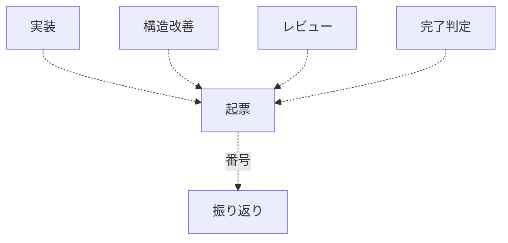
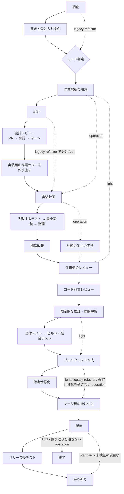

# 開発ワークフローの振り分け

変更内容を 4 つのモードへ分類し、必要な工程だけを起動する。**全変更にフル工程を課さない。**

**判定基準を持つのはこの Skill だけである。** 他の Skill とエージェント定義は判定結果を
受け取る側に徹する。同じ基準を複数箇所へ書くと、モードを追加・変更したときに片方だけが
古くなる。

## 判定する単位

**モードを判定する単位は Pull Request である。** 課題ではない。1 つの Pull Request に
対しモードは 1 つで、その Pull Request が閉じる課題すべての控えへ同じ値を書く。

**束ねたときにどのモードを採るかの規約は置かない。** 束ね方を変えるたびに同じ判断が
要るためである。**判定の単位を Pull Request にすれば、数える対象が 1 つになる。**

- **触るファイルが重ならないなら、分けてよい。** 束ねる理由は競合の回避であって、
  モードを混ぜたいからではない
- **モードの違う課題を 1 本の Pull Request へ混ぜない。** 混ざるなら高い方のモードで
  進めるか、Pull Request を分ける
- 分割の粒度・束ね方・並行度そのものは担当の判断に任せる。**複数の課題を渡されうる。**
  4 つの形（1 : 1 / 1 : N / N : 1 / N : M）と、任せるうえでの下限は
  [references/parallel-work.md](references/parallel-work.md) にある

**代わりに工程の順序が変わる。** Pull Request に何が入るかが決まらないと判定できない
ため、**要求と受け入れ条件 → モード判定 → 作業場所の用意**の順になる。`light` にも
要求と受け入れ条件が掛かる。その費用は受け入れる。判定の入力が無いまま判定する状態の
ほうが高くつく。

**モード判定は工程表の行を持たない。** 盤面へ記録する工程の値を増やさないためである。

## 判定の手順

### 1. 変更対象を確認する

```bash
git status --short
git diff --stat            # 変更済みなら
```

依頼文だけで判定しない。**実際に触るファイルと、触る理由**で決める。

### 2. 上から順に条件を判定する

最初に該当したモードを採る。複数に当てはまる場合は**上のモードが勝つ**。

| 順 | モード | 該当条件（いずれか 1 つで該当） |
| --- | --- | --- |
| 1 | `operation` | **本番コードも文書も変えず、外部の系の状態だけを変える**（権限や保護の規則の設定、反映先の構成の変更、データの投入・修正、外部サービスへの操作など） |
| 2 | `standard` | 公開インタフェース（API・イベント・コマンド）の追加・変更・削除 / 既存データの移行を伴うスキーマ変更（列の削除・改名・型変更など） / 認証・認可の変更 / 複数モジュールにまたがる変更 / 重要なドメインルールの追加・変更 / 本番の振る舞いの追加・変更、バグ修正 / 本番の振る舞いを変えない構造変更で、対象にテストが十分にある |
| 3 | `legacy-refactor` | 本番の振る舞いを変えず本番コードの構造を変える変更で、対象にテストがない・少ない |
| 4 | `light` | **本番の振る舞いも本番コードの構造も変えない局所変更**（文言・書式・コメント・ドキュメント・静的な設定値、テストの追加、ログ出力の追加など） |

`light` と `operation` の括弧内は**例示であり限定列挙ではない**。`light` の判定の基準は
「本番の振る舞いも本番コードの構造も変えない」ことであり、例示に無い変更もこの条件を
満たせば `light` として扱う。

**`operation` を 1 番に置く。** 権限の設定の変更は「誰が何をできるか」を変えるため、条件
だけを見れば `standard` に当たる。しかし変えるのは外部の系の状態であって本番コードでは
なく、**設計もテスト駆動も当たらない**。重大さは工程ではなく、**実行前の承認**で受ける
（「人手の承認を求める関門」）。

**判定の根拠に、特定のホスティングやサービスの機能名を使わない。** 使うと、その機能を
持たない対象では判定が成り立たない。機能名を出すのは例としてだけである。

**判定が見るのは変更の目的物であって、工程が生む記録ではない。** 「本番コードも文書も
変えず」は、変更しようとしている対象を指す。実行の記録・確定仕様・振り返りは工程の産物で
あり、これらを書くことで `operation` の条件を外れることはない。

スキーマ変更のうち、既存データの移行が不要な追加（インデックスの追加、既定値付き
NULL 許容列の追加）は `standard` として扱う。判定に迷う場合と境界事例は
[references/workflow-modes.md](references/workflow-modes.md) を参照する。

### 3. 判定結果を出力する

呼び出し側（エージェント・他の Skill・利用者）が**判定結果だけを受け取れる形式**で返す。

```text
mode: standard
根拠: 注文確定の振る舞いを変更する。公開 API とスキーマは変えない
必須工程: worktree → requirements-design → implementation-plan → tdd-cycle
  → refactoring → cross-review → quality-gates → pr
  → plan-to-spec（仕様が変わった場合） → merged → release
  → release-verification（マージ前に実施できなかった受け入れ条件がある場合）
  → retrospective
```

工程の並びは「モードごとに起動する Skill」の表から読む。この例は出力の形を示すもので、
基準ではない。

判定基準の本文を出力へ貼らない。呼び出し側が基準を写し取ると、この Skill が唯一の
置き場所である前提が崩れる。

## モードごとに起動する Skill

| 工程 | `light` | `operation` | `legacy-refactor` | `standard` |
| --- | --- | --- | --- | --- |
| 要求と受け入れ条件 | `requirements-design` | `requirements-design` | — | `requirements-design` |
| 作業場所の用意 | `worktree`（主ディレクトリで編集してよいパスだけなら不要） | `worktree`（主ディレクトリで編集してよいパスだけなら不要） | `worktree` | `worktree` |
| 設計 | — | — | `design` | `design` |
| 設計レビュー | — | — | 任意 | `pr` → `cross-review` → `merged` |
| 計画 | — | `implementation-plan` | `implementation-plan` | `implementation-plan` |
| 実装 | 直接編集 | 実行 → [operation-run.md](references/operation-run.md) | `refactoring` | `tdd-cycle` |
| 構造改善 | — | — | `cross-refactoring` | `cross-refactoring` |
| レビュー | `cross-review` | `cross-review` | `pr-review` | `cross-review` |
| 完了判定 | `quality-gates` | `quality-gates` | `quality-gates` | `quality-gates` |
| Pull Request | `pr` | `pr` | `pr` | `pr` |
| 確定仕様化 | — | `plan-to-spec`（実行で決まった設定が以後の判断の前提になる場合） | — | `plan-to-spec` |
| 後片付け | `merged` | `merged` | `merged` | `merged` |
| 配布 | `release` | `release` | `release` | `release` |
| リリース後テスト | — | `release-verification`（実行した経路とは別の経路で確かめられる場合） | `release-verification` | `release-verification` |
| 振り返り | — | `retrospective`（実行の手順そのものを変えた場合） | `retrospective` | `retrospective` |

範囲外の課題の起票（`out-of-scope`）はこの表に載らない。工程ではないため、モードで要否を
決めない（「範囲外の課題を見つけたとき」を参照）。

**`operation` の「実装」は実行そのものを指す。** 行は増やさない。呼ぶのは `tdd-cycle` でも
`refactoring` でもなく、[references/operation-run.md](references/operation-run.md) が定める
手順である。実行の範囲・記録・失敗したときの止め方はそちらが持つ。**この工程は「本番の系へ
届く操作」の関門に当たる**（「人手の承認を求める関門」）。

**作業場所の用意は、モードを判定した後に行う。** 要求と受け入れ条件は `issues/` に書く
ため、主ディレクトリのままで済む。開発の変更は clone したディレクトリではなく
`.worktrees/<ブランチ名>` の作業ツリーの中で行い、判定が済んでから用意する。後から移すと、
主ディレクトリに変更が残ったまま並行作業が始まる。`light` でも、本番コードの文言やテストを
触るなら作業ツリーを使う。`issues/` `docs/` と各ランタイムの設定だけで収まる変更は、
主ディレクトリのままでよい。

**設計レビューは、設計だけを載せた Pull Request を実装より先にマージする工程である。** 新しい
Skill は使わず `pr` → `cross-review` → `merged` を順に呼ぶ。**この工程のマージには人間の承認が
要る**（止まり方は「`/goal` の引数として呼ばれたとき」）。head のブランチ名は `design/` で始め、
マージした後は実装用の作業ツリーを作り直す。

**構造改善とレビューは、通す工程であって任意ではない。** `standard` と `legacy-refactor` の
構造改善は `cross-refactoring` を通す。
**レビューは 4 モードとも通す。** Pull Request を出す以上、その差分は誰かがレビューする。
`light` は「本番の振る舞いも本番コードの構造も変えない」変更だが、**変えないことの確認**が
要る。レビュー段階は**明示的に呼ぶ**（自然文で「レビューして」と依頼すると、Claude Code では組み込みの
`code-review` が起動して判定の投稿経路が変わる）。

**マージは取り込みであって配布ではない。** `release` は 4 モードすべてで通す。**自動で進めて
よいのは検証への配布までで、本番への配布は承認を得るまで進めない。**

工程ごとの理由・条件・例外は
[references/stage-notes.md](references/stage-notes.md) にある。**起動のたびに読むのは判定の
基準と工程表で、そちらは条件に当たったときだけ読む。**

## 範囲外の課題を見つけたとき

この変更の受け入れ条件にも、直す対象にも含まれない課題は、**見つけたその場で `out-of-scope` が
issue にする**。順序を持たないため、複数の工程から呼ばれる。



- 判断は 3 択に限る（起票する / 範囲内へ入れる / 起票しない）。3 つ目も理由を 1 行残す
- 迷ったら起票する側へ倒す。後で閉じるほうが、拾い直すより安い
- `retrospective` は起票された課題の一覧を作り、残っていないものを拾う

## 進行を盤面へ記録する

判定したモードと、いま何番目の工程にいるかは会話の中にしか残らない。セッションが変わると
引き継がれない。**リポジトリが `.ndf/projects.json` を持つ場合に限り**、これを GitHub Projects の
盤面へ残す。

- 判定の結果（モード）は、作業場所を用意した時点で記録する
- 工程の切れ目を持つ Skill が、自分の工程に入った時点で進行を書き込む
- 盤面の値は**この工程表の行名と一致させる**。工程を足したときは、同じ表から盤面側も更新する

**この仕組みは任意である。** 宣言が無ければ何も起きず、工程はそのまま通る。進行管理が
理由で開発が止まってはいけない。設定と値の一覧は
[references/projects-tracking.md](references/projects-tracking.md) にある。

## 工程の飛ばしとマージを機械で見る

この Skill が呼ばれた会話の単位に、tool 実行前の判定が 1 つ登録される（frontmatter の
`hooks`）。判定は 2 つで、どちらも進行の記録のコマンドとマージのコマンドを読むだけである。

| 何を見るか | 何をするか |
| --- | --- |
| 進行の記録のコマンド | 通過工程として積む。配布の記録へ進んだ時点で、記録の無い必須の工程を案内する |
| 設計 Pull Request のマージ | 承認の印（ラベル `design-approved`）が無ければ拒否する |

**記録の無い工程は拒否しない。** 記録されていないことは、その工程を通っていないことと
同じではない。記録の側が遅れているだけの状態でマージや配布が止まると、正当な操作が止まる。

**設計 Pull Request のマージだけは拒否へ踏み込む。** 引き金は接頭辞と承認の印の 2 つが
そろったときに限られ、印が付けば同じコマンドがそのまま通る。編集は続けても元へ戻せるが、
マージは戻せない。設計を実装より先に確定させる工程は、マージが済んだ時点で意味を失う。

**承認の印がリポジトリに定義されていること自体が、この仕組みの宣言である。** 定義される
までは拒否が働かない。有効にする操作と控えの読み方は
[references/stage-completeness.md](references/stage-completeness.md) にある。

## 人手の承認を求める関門

**関門は 2 つで、増やさない。** どちらも取り消せない操作である。設計はマージが済んだ時点で
実装の前提になり、本番の系へ届く操作は反映した瞬間に効く。

**増やさないのは、増やすほど「承認したこと」の意味が薄れるためである。** 通過の回数が
増えると、内容を読まずに通す動きが入る。

| 関門 | いつ | 要否の決まり方 |
| --- | --- | --- |
| 設計 Pull Request のマージ | 設計レビューの工程 | **マージ先のチャネルによらず要る** |
| 本番の系へ届く操作 | 配布の工程、および `operation` の実装の工程 | **届く先が本番の系かどうかで決まる** |

**2 つは要否の決まり方が違う。** 並べて書くと片方に掛かる規則が両方に掛かって読めるため、
節を分ける。

### 設計 Pull Request のマージ

**承認するのは配布の可否ではなく、この設計で実装へ進んでよいかである。** マージ先が開発の
起点ブランチであっても要る。マージした時点で設計は実装の前提になり、後から直すと設計文書と
コードの両方を書き直すことになる。この費用はマージ先のチャネルで変わらない。

対象は `standard` である。`legacy-refactor` は設計 Pull Request を分けた
ときだけ同じ扱いにする。`light` は設計工程を通らないため対象外である。

**止める場所を設計レビューに限るのは、そこが後から直す費用の変わり目だからである。**

### 本番の系へ届く操作

**要否は、届く先が本番の系かどうかで決まる。** 本番の系とは、利用者が現に使っている
配布のチャネル・環境・外部サービスを指す。**配布はその一例であり、`operation` の実行も
同じ性質を持つ。** どちらも反映した瞬間に効き、取り消しても「その状態を見た人」は戻らない。
**性質が同じものを別の関門として数えない。**

| 何が届くか | 何で判定するか |
| --- | --- |
| 配布（マージと公開） | マージ先が本番のチャネルか。**チャネルは系の一種である** |
| `operation` の実行 | 操作する先が本番の系か。検証用の系への操作は承認を求めない |

**検証環境や開発版のチャネルへ入れるマージは取り消せるため、承認を求めない。**
**実装 Pull Request のマージは、それ自体では関門にならない。** 一律で止めると検証への
反映まで止まる。

**配布の規則は `release` が持つ。** 検証への配布は提示して進めてよく、本番への配布は承認を
得るまで進めない。実装 Pull Request をマージする時点で読むのは `merged` と `pr` であるため、
そちらからこの規則へ辿れるようにしてある。

**`operation` の実行の規則は
[references/operation-run.md](references/operation-run.md) が持つ。** 承認を求めるのは
実行の前で、単位ごとの取り消しの手段を添える。**取り消せない単位を含むときは、そのことを
先に示す。**

**どのブランチが本番のチャネルかは、リポジトリが宣言する。** 読み取りの順序は次の 2 段である。

1. `.ndf/worktree.json` の `production_branch`
2. **宣言が無ければ既定ブランチ**（`origin` の HEAD が指すもの）

**`base_branch` は流用しない。** そちらは開発の起点で、作業ツリーの分岐元と主ディレクトリの
追従先を決める。このリポジトリの値は `develop` であり、本番のチャネルと定める `main` とは
別のブランチである。流用すると、開発版のチャネルへのマージが本番の扱いになる。

### 提示するもの

**止まる手段と、そのとき提示するものは
[references/approval-request.md](references/approval-request.md) が定める。** 提示物は
2 層に分かれ、対象を開くためのもの（URL・ブランチ・変更量）だけでは足りない。**承認するのは
中身であって、Pull Request の形ではない。**

**並行して走った Pull Request は、関門でまとめて 1 回の承認へ載せる。** 1 本ずつ求めない。

## `/goal` の引数として呼ばれたとき

工程を続けて通す。ただし**上の 2 つの関門の前では 1 度止まり、`AskUserQuestion` で人間の
承認を待つ**。承認を得るまでマージせず、次の工程へも進まない。

- 設計 Pull Request のマージ（`standard`）— 承認を得るまで実装の工程へ
  進まない
- 本番の系へ届く操作 — 承認を得るまで進めない。**検証への配布までは自動で進めてよい**。
  `operation` の実行も同じで、本番の系へ届く単位は承認を得るまで実行しない

### 他者の承認が要るときは、到達点を置き直す

**ゴール条件が Pull Request より後の工程を含むとき**（確定仕様化・後片付け・配布・リリース後
テスト・振り返り）、マージに他者の承認が要るリポジトリでは工程がそこで止まる。**他者の承認は
この会話の外にある。** ruleset の必須レビュー・CODEOWNERS・チームのレビュー担当が承認するまで、
会話の中でできることが無い。

**着手の時点で判定する。** Pull Request を出してから気づくと、そこまでの工程を進めた後で
待ち方を決めることになる。

```bash
gh api "repos/<所有者>/<リポジトリ>/rules/branches/<起点>" --jq '[.[] | select(.type == "pull_request")]'
gh api "repos/<所有者>/<リポジトリ>/branches/<起点>/protection" --jq '.required_pull_request_reviews'
```

| 結果 | 到達点 |
| --- | --- |
| 承認が要る | **Pull Request の提出とレビューの収束**へ置き直す |
| 要らない | ゴール条件が指す工程まで |
| 判定できない | ゴール条件が指す工程まで進み、マージが拒否された時点で置き直す |

**判定できないことを理由に待ち続けない。** 判定の手段が無いリポジトリでも、マージの拒否は
観測できる。

置き直したときは、収束まで進めた時点で**ゴールに到達したものとして報告する**。完了報告に
**止まった理由**（マージに他者の承認が要る）と、**承認が付いた後に再開する手順**（残りの工程の
名前と、それを呼ぶコマンド）を書く。残りの工程は、承認が付いた後の別の起動で行う。

**待ち続けることと、自分でマージすることのどちらも採らない。** 前者は工程が進まないまま
時間と実行の費用を消費する。後者は他者の承認を経ない変更が起点ブランチへ入り、必須レビューを
置いた意味が失われる。

## 標準フロー

この図は**工程の全体像**を表す。どの Skill を起動するかは前節の表が基準であり、図はその
工程が何を指すかを示す。実線は `standard` の経路、破線は各モードが飛ばす経路である。



- すべてのモードが A（調査）から始まり、D（モード判定）を経て S（作業場所の用意）へ進む。
  B（要求と受け入れ条件）を経るのは `light` と `operation` と `standard` の 3 つで、
  `legacy-refactor` は A から D へ抜ける。終わりは `light` が RL（配布）、
  `legacy-refactor` と `standard` が T（振り返り）、`operation` は条件に当たれば
  T、当たらなければ RL である
- **`operation` は C（設計）・F（設計レビュー）・R（構造改善）を通らない。** S から
  G（実装計画）へ抜け、X（外部の系への実行）が H の位置に立つ。X の手順は
  [references/operation-run.md](references/operation-run.md) が持ち、**実行の前に
  承認を得る**
- **`light` は破線の経路（A → B → D → S → I → J → K → L → P → RL）を通る。** I と J の
  レビューは通り、K は変更箇所を 1 度実行する限定的な検証と静的解析だけを指す。N の全体
  テストと結合テストは通らない
- `legacy-refactor` は A から D へ抜け、B（要求と受け入れ条件）と M（確定仕様化）を通らない。
  H は「現状固定テスト」、R は「段階的改善」、I は「本番の振る舞いが変わっていないことの確認」
  として読む

モードごとの経路の詳細と、図から読み取れない条件は
[references/workflow-modes.md](references/workflow-modes.md) にある。

## `standard` モードで作るもの

設計工程は `design` が担う。`standard` では次を作る。

| 工程 | 何を作るか |
| --- | --- |
| 用語と不変条件 | `requirements-design` の仕様へ書く |
| 設計文書 | `design` が独立したファイルで作る。触る領域に該当する節をすべて埋める |
| 設計判断の記録 | 設計文書の「決定の記録」の節へ書く |
| 設計レビュー | 設計だけを載せた Pull Request を `cross-review` へ通し、マージしてから実装へ進む |
| 契約・結合テスト | `tdd-cycle` の階層の使い分けに従う |

**判定基準の側は変えない。** モードの定義は確定しており、この節は振り分け先を示す。

## 途中でモードが変わったとき

判定はやり直してよい。ただし**上げる方向のみ**を既定とする。

| 状況 | 対応 |
| --- | --- |
| `light` のつもりが外部の系を触ると分かった | `operation` へ上げる |
| `operation` のつもりが本番コードも触ると分かった | `standard` へ上げる。実行と差分を分ける |
| `light` のつもりが本番の振る舞いを変えると分かった | `standard` へ上げ、受け入れ条件を作り直す |
| `light` のつもりが本番コードの構造を変えると分かった | テストの有無で `standard` か `legacy-refactor` へ上げる |
| `legacy-refactor` の途中で公開インタフェースが変わると分かった | `standard` へ上げる。ここまでの差分を分ける |
| 工程が重いのでモードを下げたい | 下げない。重い理由が条件に該当しているため |

モードを下げたい場合は、**変更そのものを分割する**。本番の振る舞いも本番コードの構造も
変えない部分を先に `light` として出し、残りを本来のモードで進める。

## 参照

- [references/workflow-modes.md](references/workflow-modes.md) — 判定の境界事例とモード別の詳細
- [references/projects-tracking.md](references/projects-tracking.md) — 進行を GitHub Projects へ記録する設定と値の一覧
- [references/stage-completeness.md](references/stage-completeness.md) — 通過工程の控えと報告、承認の印の作り方
- [references/parallel-work.md](references/parallel-work.md) — 並行開発の 4 つの形、工程が動く単位、任せるうえでの下限
- [references/approval-request.md](references/approval-request.md) — 承認を求めるときに提示するもの
- [references/operation-run.md](references/operation-run.md) — `operation` の実行の範囲・記録・失敗したときの扱い
