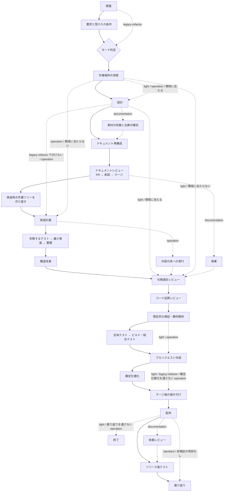

# 開発ワークフローの振り分け

変更内容をモードへ分類し、必要な工程だけを起動する。**全変更にフル工程を課さない。** ステップ・チェイン・区間などの語の意味は [references/glossary.md](references/glossary.md) にある。

**判定基準を持つのはこの Skill だけである。** 他の Skill とエージェント定義は判定結果を
受け取る側に徹する。同じ基準を複数箇所へ書くと、モードを追加・変更したときに片方だけが
古くなる。

## 判定する単位

**工程はミッション単位で 1 回ずつ通す。** ミッションは 1 つの版として出す課題と Pull Request の束で、複数の設計と実装を含む。
**モードを判定する単位は、ミッションの develop 宛て Pull Request である。** モードは 1 つで、ミッションが閉じる
課題すべての通過記録へ同じ値を書く。数える対象が 1 つになる。

- **ミッションのブランチ（`mission/<名前>`）を develop から切り、課題ごとの作業ツリーはそこから切る。**
  課題の Pull Request はミッションのブランチへ集め、develop への Pull Request はミッションで 1 本にする
- **モードの違う課題を 1 つのミッションへ混ぜない。** 混ざるなら高い方のモードで進めるか、ミッションを分ける
- **ミッションの大きさは、同時に回せる本数（フェーズは 3 本まで）と配布の間隔（1 版を 1〜2 日）で切る。**
  並列の形と下限は [references/parallel-work.md](references/parallel-work.md) にある
- **`pace: fast` では、判定する単位は実装の Pull Request 1 本になる。** ミッションのブランチを作らず、
  実装の Pull Request が develop へ直接入る（「進め方」の節）

**代わりに工程の順序が変わる。** ミッションに何が入るかが決まらないと判定できない
ため、**要求と受け入れ条件 → モード判定 → 作業場所の用意**の順になる。`light` にも
要求と受け入れ条件が掛かる。その費用は受け入れる。判定の入力が無いまま判定する状態の
ほうが高くつく。

**モード判定は工程表の行を持たない。** ボードへ記録する工程の値を増やさないためである。

## この文書が受け取る値

| 変数 | 値 | 決め方 |
| --- | --- | --- |
| `$SCRIPTS` | プラグインの `scripts/` の絶対パス | [references/scripts-lookup.md](references/scripts-lookup.md)。シェルが変わったら決め直す |

## 判定の手順

### 0. 作業ツリーの宣言を確かめる

```bash
# 起動したら手順 1 より先に実行する。$SCRIPTS を決めてから。決められなくても止めない
if [ -n "${SCRIPTS:-}" ]; then bash "$SCRIPTS/worktree-setup.sh" check; echo "exit=$?"
else echo "exit=判定できない（scripts を解決できない）"; fi
```

| 終了コード | 次に行うこと | 判定結果の出力の `宣言:` の行 |
| --- | --- | --- |
| 0 | 手順 1 へ進む | `宣言: あり` |
| 2 | `worktree` の「0. 宣言ファイルを用意する」を通し、`check` が 0 を返してから手順 1 へ進む | `宣言: 作成した（起点 <名前> / 本番 <名前>。未宣言なら既定ブランチ）` |
| 3 | **先へ進まない。** `init --force` を実行せず、`check` の出力を示して利用者に直してもらう | 出さない（判定まで進まない） |
| 1、または `$SCRIPTS` を決められない | 止めずに手順 1 へ進む | `宣言: 判定できない（<理由>）` |

**拒否しない。** 起動の時点に止める引き金が無く（hook は次のコマンドでしか働かない）、4 ランタイムで
同じに働かせるには本文に置くしかない。frontmatter の `hooks` は発火していない疑いもある（#565）。

### 1. 変更対象を確認する

```bash
git status --short
git diff --stat            # 変更済みなら
```

依頼文だけで判定しない。**実際に触るファイルと、触る理由**で決める。

### 2. 上から順に条件を判定する

最初に該当したモードを採る。複数に当てはまる場合は**上のモードが勝つ**。

| 順 | モード | 該当条件（いずれか 1 つで該当） |
| --- | --- | --- |
| 1 | `operation` | **本番コードも文書も変えず、外部の系の状態だけを変える**（権限や保護の規則の設定、反映先の構成の変更、データの投入・修正、外部サービスへの操作など） |
| 2 | **`documentation`** | **読み手へ渡すビジネス文書を作る・改訂する**（提案資料・稟議書・定例報告・指標の定義・運用マニュアル・説明資料など）。リポジトリの説明文書はこれに当たらない |
| 3 | `standard` | 公開インタフェース（API・イベント・コマンド）の追加・変更・削除 / 既存データの移行を伴うスキーマ変更（列の削除・改名・型変更など） / 認証・認可の変更 / 複数モジュールにまたがる変更 / 重要なドメインルールの追加・変更 / 本番の振る舞いの追加・変更、バグ修正 / 本番の振る舞いを変えない構造変更で、対象にテストが十分にある |
| 4 | `legacy-refactor` | 本番の振る舞いを変えず本番コードの構造を変える変更で、対象にテストがない・少ない |
| 5 | `light` | **本番の振る舞いも本番コードの構造も変えない局所変更**（文言・書式・コメント・ドキュメント・静的な設定値、テストの追加、ログ出力の追加など） |

`light` と `operation` の括弧内は**例示であり限定列挙ではない**。`light` の判定の基準は
「本番の振る舞いも本番コードの構造も変えない」ことであり、例示に無い変更もこの条件を
満たせば `light` として扱う。

**`operation` を 1 番に置く。** 権限の設定の変更は「誰が何をできるか」を変えるため、条件
だけを見れば `standard` に当たる。しかし変えるのは外部の系の状態であって本番コードでは
なく、**テスト駆動は当たらない**（**設計は触る領域に当たるときだけ通る**。条件は `design` の
「触る領域を決める」の表が持つ）。重大さは工程ではなく、**実行前の承認**で受ける
（「人手の承認を求める関門」）。

**判定の根拠に、特定のホスティングやサービスの機能名を使わない。** 使うと、その機能を
持たない対象では判定が成り立たない。機能名を出すのは例としてだけである。

**判定が見るのは変更の目的物であって、工程が生む記録ではない。** 「本番コードも文書も
変えず」は、変更しようとしている対象を指す。実行の記録・確定仕様・振り返りは工程の産物で
あり、これらを書くことで `operation` の条件を外れることはない。

スキーマ変更のうち、既存データの移行が不要な追加（インデックスの追加、既定値付き
NULL 許容列の追加）は `standard` として扱う。判定に迷う場合と境界事例は
[references/workflow-modes.md](references/workflow-modes.md) を参照する。

**`documentation` に決まったら、続けて 6 つのタイプのうち 1 つを選ぶ。** 判定の条件と
境界事例は [references/document-types.md](references/document-types.md) にある。**`README.md`
と `docs/` の変更はこのモードに当たらない**（判定を分けるのは読み手で、リポジトリの外にいる
人へ渡すものだけが当たる）。

### 3. 判定結果を出力する

呼び出し側（エージェント・他の Skill・利用者）が**判定結果だけを受け取れる形式**で返す。

```text
mode: standard
pace: fast
根拠: 注文確定の振る舞いを変更する。公開 API とスキーマは変えない
宣言: あり
必須工程: worktree → requirements-design → implementation-plan → tdd-cycle
  → refactoring → cross-review → quality-gates → pr
  → plan-to-spec（仕様が変わった場合） → merged → release
  → release-verification（マージ前に実施できなかった受け入れ条件がある場合）
  → retrospective
```

工程の並びは「モードごとに起動する Skill」の表から読む。この例は出力の形を示すもので、
基準ではない。
`pace:` の行は `fast` を指定したときだけ出す（既定の `normal` では出さない）。

判定基準の本文を出力へ貼らない。呼び出し側が基準を写し取ると、この Skill が唯一の
置き場所である前提が崩れる。

## モードごとに起動する Skill

| 工程 | `light` | `operation` | `legacy-refactor` | `standard` | `documentation` |
| --- | --- | --- | --- | --- | --- |
| 要求と受け入れ条件 | `requirements-design` | `requirements-design` | — | `requirements-design` | `requirements-design` |
| 作業場所の用意 | `worktree`（主ディレクトリで編集してよいパスだけなら不要） | `worktree`（主ディレクトリで編集してよいパスだけなら不要） | `worktree` | `worktree` | `worktree` |
| 設計 | `design`（該当時） | `design`（該当時） | `design` | `design` | `design` |
| 素材の収集と出典の確定 | — | — | — | — | `document-sources` |
| ドキュメント再構成 | — | — | `document-restructuring`（設計 Pull Request を分けた場合） | `document-restructuring` | `document-restructuring` |
| ドキュメントレビュー | — | — | `pr` → `cross-review` → `merged`（設計 Pull Request を分けた場合） | `pr` → `cross-review` → `merged` | `pr` → `cross-review` → `merged` |
| 計画 | — | `implementation-plan` | `implementation-plan` | `implementation-plan` | `implementation-plan`（執筆を分担する場合） |
| 実装 | 直接編集 | 実行 → [operation-run.md](references/operation-run.md) | `refactoring` | `tdd-cycle` | `document-drafting` |
| 構造改善 | — | — | `cross-refactoring` | `cross-refactoring` | — |
| 実装レビュー | `cross-review` | `cross-review` | `pr-review` | `cross-review` | `cross-review` |
| 完了判定 | `quality-gates` | `quality-gates` | `quality-gates` | `quality-gates` | `quality-gates` |
| Pull Request | `pr` | `pr` | `pr` | `pr` | `pr` |
| 確定仕様化 | — | `plan-to-spec`（実行で決まった設定が以後の判断の前提になる場合） | — | `plan-to-spec` | `plan-to-spec`（確定版を残す場合） |
| 後片付け | `merged` | `merged` | `merged` | `merged` | `merged` |
| 配布 | `release` | `release` | `release` | `release` | `release` |
| 体裁レビュー | — | — | — | — | `layout-review` |
| リリース後テスト | — | `release-verification`（実行した経路とは別の経路で確かめられる場合） | `release-verification` | `release-verification` | `release-verification`（提出の後に確かめる経路がある場合） |
| 振り返り | — | `retrospective`（実行の手順そのものを変えた場合） | `retrospective` | `retrospective` | `retrospective` |

範囲外の課題の起票（`out-of-scope`）はこの表に載らない。工程ではないため、モードで要否を
決めない（「範囲外の課題を見つけたとき」を参照）。

**表の工程はミッションの中で 1 回ずつ動き、中は並列にする。** 設計 Pull Request は主題ごとに同時に開いて
並列で回し（1 本の設計文書は 1,000 行以下）、関門 1 でまとめて 1 回承認する。実装は課題ごとの作業ツリーで並列に
進めてミッションのブランチへ集め、構造改善・実装レビュー・完了判定はミッションの develop 宛て Pull Request で
1 回通す。`fast` では完了判定は課題ごと、構造改善と実装レビューはトリガーの範囲で通す。工程ごとの単位は
[references/parallel-work.md](references/parallel-work.md) の「工程が動く単位」にある。

**`operation` の「実装」は実行そのものを指す。** 行は増やさない。呼ぶのは `tdd-cycle` でも
`refactoring` でもなく、[references/operation-run.md](references/operation-run.md) が定める
手順である。実行の範囲・記録・失敗したときの止め方はそちらが持つ。**この工程は「本番の系へ
届く操作」の関門に当たる**（「人手の承認を求める関門」）。

**作業場所の用意は、モードを判定した後に行う。** 要求と受け入れ条件は `issues/` に書く
ため、主ディレクトリのままで済む。開発の変更は clone したディレクトリではなく
`.worktrees/<ブランチ名>` の作業ツリーの中で行い、判定が済んでから用意する。後から移すと、
主ディレクトリに変更が残ったまま並行作業が始まる。`light` でも、本番コードの文言やテストを
触るなら作業ツリーを使う。`issues/` `docs/` と各ランタイムの設定だけで収まる変更は、
主ディレクトリのままでよい。

**ドキュメント再構成は、書き上げた設計文書を章立てから組み直す工程である。**
`document-restructuring` が測る・並べ替える・整える・測り直すの 4 つの手順を持つ。**レビューの前に
置く。** 後に置くと、レビュー担当が構成の指摘と内容の指摘を同時に出すことになり、どちらの
指摘なのかが混ざる。

**ドキュメントレビューは、設計だけを載せた Pull Request を実装より先にマージする工程である。**
新しい Skill は使わず `pr` → `cross-review` → `merged` を順に呼ぶ。**この工程のマージには
人間の承認が要る**（止まり方は「自走で工程を通す」）。head のブランチ名は
`design/` で始め、マージした後は実装用の作業ツリーを作り直す。

**構造改善と実装レビューは、通す工程であって任意ではない。** `standard` と `legacy-refactor` の
構造改善は `cross-refactoring` を通す。`fast` でも通し、時機だけをトリガーへ移す。
**実装レビューは 5 つのモードとも通す。** Pull Request を出す以上、その差分は誰かがレビューする。
`light` は「本番の振る舞いも本番コードの構造も変えない」変更だが、**変えないことの確認**が
要る。実装レビューの工程は**明示的に呼ぶ**（自然文で「レビューして」と依頼すると、Claude Code では組み込みの
`code-review` が起動して判定の投稿経路が変わる）。

**マージは取り込みであって配布ではない。** `release` は 5 つのモードすべてで通す。**自動で進めて
よいのは検証への配布までで、本番への配布は承認を得るまで進めない。**

工程ごとの理由・条件・例外は
[references/stage-notes.md](references/stage-notes.md) にある。**起動のたびに読むのは判定の
基準と工程表で、そちらは条件に当たったときだけ読む。**

**工程は 1 つの context window で通し切らなくてよい。** 判定したモードと通った工程は会話の
外へ残るため、文脈を捨てても現在地から続けられる。**長い文脈のまま進めると、記録は
残っているのに後の工程の判断だけが悪くなる。** カットポイント・委譲してよい対象・残量の見方は
[references/context-window.md](references/context-window.md) にある。

**conductor は、`context-window.md` の 4 つのカットポイントと文脈量の hook（`token-guard.sh`）に止められたときに、
次の工程を始める引継ぎの 1 行（`/ndf:development-workflow #<課題>`。今の区間を `/goal` で始めていたときだけ先頭に `/goal `）を、
情報文字列 `ndf-next` の囲みのコードブロック 1 つで出す。** 3 層では conductor が `## フェーズの報告` を
受け取った時点で出し（supervisor は出さない）、`結果: 関門` なら関門の承認と取り込みの後に出す。
出す時点・告知・新しい会話が状態を戻す手順は `context-window.md` の「新しい会話で戻す」にある。

## 範囲外の課題を見つけたとき

この変更の受け入れ条件にも、直す対象にも含まれない課題は、**見つけたその場で `out-of-scope` が
issue にする**。呼び出し元・3 択の判断・振り返りでの拾い方は `out-of-scope` の SKILL.md にある。

## 進行をボードへ記録する

判定したモードと、いま何番目の工程にいるかは会話の中にしか残らない。セッションが変わると
引き継がれない。**リポジトリが `.ndf/projects.json` を持つ場合に限り**、これを GitHub Projects の
ボードへ残す。

- 判定の結果（モード）は、作業場所を用意した時点で記録する
- カットポイントを持つ Skill が、自分の工程に入った時点で進行を書き込む
- ボードの値は**この工程表の行名と一致させる**。工程を足したときは、同じ表からボード側も更新する

**この仕組みは任意である。** 宣言が無ければ何も起きず、工程はそのまま通る。進行管理が
理由で開発が止まってはいけない。設定と値の一覧は
[references/projects-tracking.md](references/projects-tracking.md) にある。

## 工程の飛ばしとマージを機械で見る

この Skill の frontmatter の `hooks` が、進行の記録のコマンドを通過工程として積み（記録の無い工程は案内するだけで
拒否しない）、承認ラベル（ラベル `design-approved`）の無い設計 Pull Request のマージだけを拒否する。判定の 2 つ・
有効にする操作・通過記録の読み方・`fast` の工程の出し方は [references/stage-completeness.md](references/stage-completeness.md) にある。

## 進め方（`pace`）

**`pace` はモードとは別の軸で、「どう通すか」を決める。** 既定の `normal` は上の工程表のとおりに動く。
`fast` を指定したときだけ工程が次の区分に分かれ、モードが対象外（—）とする工程は対象外のままである。

| 区分 | 工程表の行 | いつ通すか |
| --- | --- | --- |
| その場で通す | 作業場所の用意 / 計画 / 実装 / 完了判定 / Pull Request / 後片付け / 配布 / リリース後テスト | 課題ごと。実装の計画が範囲テスト → Draft の Pull Request（CI と並べる）→ 全体テスト → doc-lint → マージまでを通す。配布は開発版と verify-install まで。本番は下の関門 2 に従う |
| トリガーで通す | 構造改善 / 実装レビュー | 検査のトリガーが立ったとき、次の開発版の前に 1 回。範囲は前回の検査からの差分 |
| ミッションの終わりにまとめる | 確定仕様化 / 振り返り（受け入れ条件の確認と課題を閉じる作業を含む） | ミッションの終わりに 1 回ずつ |
| 省かない | 要求と受け入れ条件 / 設計 / ドキュメント再構成 / ドキュメントレビュー | モードの定めどおり。設計の承認が要る変更は設計 Pull Request を出す。200 行以内の不具合はその場で直す |

| 関門 | `normal` | `fast` |
| --- | --- | --- |
| 関門 1（設計 Pull Request のマージ） | 利用者が承認する | `mvv-gate.py` が「従う」と判定し、越えない線に当たらなければ省く。ほかは利用者が承認する |
| 関門 2（本番の系へ届く操作） | 利用者が承認する | 同上 |

**`fast` は `supervise.py new mission --pace fast` が使ってよい条件（開発版のチャネル・導入の確認・`.ndf/pace.json`
の許可・モード・MVV の承認）を機械で確かめ、1 つでも欠ければ断る。** そのときは `normal` で進める。条件・
トリガー・MVV の承認と判定・越えない線・記録の読み方は [references/pace.md](references/pace.md) にある。

## 人手の承認を求める関門

**関門は 2 つで、増やさない。** どちらも取り消せない操作である。増やすほど「承認したこと」の
意味が薄れ、通過の回数が増えるほど内容を読まずに通す動きが入る。`fast` でも数は変えず、MVV の承認を 2 つの関門の
事前の許可として扱う（条件は `AGENTS.md` と [references/pace.md](references/pace.md)）。

**関門の外で工程の側が実行前確認を足さない。** 取り消せる操作は止めずに行い、消した対象と
戻し方を報告する（例外の基準は `AUTHORING.md` の「実行前確認の要否を決める 3 つの問い」）。
**カットポイントの再起動も関門ではなく、`ndf-next` のブロックの前に承認・確認（`AskUserQuestion` を含む）を
挟まない。`/goal` の文面が「承認を求める」と書いていても、指すのはこの 2 つの関門だけである。**

| 関門 | いつ | 文書での意味 | 要否の決まり方 |
| --- | --- | --- | --- |
| 設計 Pull Request のマージ | ドキュメントレビューの工程 | **企画承認** | **マージ先のチャネルによらず要る** |
| 本番の系へ届く操作 | 配布の工程、および `operation` の実装の工程 | **制作物承認** | **届く先が本番の系かどうかで決まる** |

**`documentation` でも関門は 2 つのままである。** 企画承認は構成案と体裁設計を載せた設計
Pull Request のマージ、制作物承認は本番の提出先への操作にそのまま当たる。**新しい関門を
作らない。**

**2 つは要否の決まり方が違う。** 並べて書くと片方に掛かる規則が両方に掛かって読めるため、
節を分ける。

### 設計 Pull Request のマージ

**承認するのは配布の可否ではなく、この設計で実装へ進んでよいかである。** マージ先が開発の
起点ブランチであっても要る。マージした時点で設計は実装の前提になり、後から直すと設計文書と
コードの両方を書き直すことになる。この費用はマージ先のチャネルで変わらない。

対象は `standard` と `documentation` である。`legacy-refactor` は設計 Pull Request を分けた
ときだけ同じ扱いにする。**`light` と `operation` は、設計工程を条件付きで通る場合でも
対象外である。** どちらも独立した設計文書を作らず、設計 Pull Request を出さない。関門が
掛かるのは設計だけを載せた Pull Request のマージであって、設計を書くこと自体ではない。

**止める場所をドキュメントレビューに限るのは、そこが後から直す費用の変わり目だからである。**

### 本番の系へ届く操作

**要否は、届く先が本番の系かどうかで決まる。** 本番の系とは、利用者が現に使っている
配布のチャネル・環境・外部サービスを指す。**配布はその一例であり、`operation` の実行も
同じ性質を持つ。** どちらも反映した瞬間に効き、取り消しても「その状態を見た人」は戻らない。
**性質が同じものを別の関門として数えない。**

| 何が届くか | 何で判定するか |
| --- | --- |
| 配布（マージと公開） | マージ先が本番のチャネルか。**チャネルは系の一種である** |
| `operation` の実行 | 操作する先が本番の系か。検証用の系への操作は承認を求めない |
| **文書の提出** | 提出先の `production` が真か。宣言は [references/document-destinations.md](references/document-destinations.md) が定める |

**検証環境や開発版のチャネルへ入れるマージは取り消せるため、承認を求めない。**
**実装 Pull Request のマージは、それ自体では関門にならない。** 一律で止めると検証への
反映まで止まる。

**配布の規則は `release` が持つ。** 検証への配布は提示して進めてよく、本番への配布は承認を
得るまで進めない。実装 Pull Request をマージする時点で読むのは `merged` と `pr` であるため、
そちらからこの規則へ辿れるようにしてある。

**`operation` の実行の規則は
[references/operation-run.md](references/operation-run.md) が持つ。** 承認を求めるのは
実行の前で、単位ごとの取り消しの手段を添える。**取り消せない単位を含むときは、そのことを
先に示す。**

**どのブランチが本番のチャネルかは、リポジトリが宣言する。** 読み取りの順序は次の 2 つである。

1. `.ndf/worktree.json` の `production_branch`
2. **宣言が無ければ既定ブランチ**（`origin` の HEAD が指すもの）

**`base_branch` は流用しない。** そちらは開発の起点で、作業ツリーの分岐元を決める（`follow_branch: true`
のときは主ディレクトリの追従先にもなる）。このリポジトリの値は `develop` であり、本番のチャネルと
定める `main` とは別のブランチである。流用すると、開発版のチャネルへのマージが本番の扱いになる。

### 提示するもの

**止まる手段と、そのとき提示するものは
[references/approval-request.md](references/approval-request.md) が定める。** 提示物は
2 層に分かれ、対象を開くためのもの（URL・ブランチ・変更量）だけでは足りない。**承認するのは
中身であって、Pull Request の形ではない。**

**並行して走った Pull Request は、関門でまとめて 1 回の承認へ載せる。** 1 本ずつ求めない。

## 自走で工程を通す

**工程を続けて通す。** ただし**上の 2 つの関門の前では 1 度止まり、`AskUserQuestion` で人間の
承認を待つ**。承認を得るまでマージせず、次の工程へも進まない。`fast` では MVV 判定が「従う」を返した関門だけ止まらない。

- 設計 Pull Request のマージ（`standard`）— 承認を得るまで実装の工程へ
  進まない
- 本番の系へ届く操作 — 承認を得るまで進めない。**検証への配布までは自動で進めてよい**。
  `operation` の実行も同じで、本番の系へ届く単位は承認を得るまで実行しない

**工程は 3 層（conductor / supervisor / worker）へ出す。** 人間と対話しているセッション
（conductor）がフェーズごとに supervisor を起動し、supervisor が 1 つの作業を worker へ出す。
**関門で止まれるのは conductor だけである。** フェーズの表・起動の指示・報告の形・モデルの
基準・他者の承認が要るときの到達点の置き直しは
[references/agent-layers.md](references/agent-layers.md) にある。

**conductor は `$SCRIPTS` を解いてから supervisor を起動し、起動指示の「記録のコマンド」へ
絶対パスで書く。** supervisor はこの 1 行で進行を記録し、この Skill も `progress-tracking` も
起動しない（形とキーごとの打つ時点は `agent-layers.md` の「conductor → supervisor」）。

**カットポイントの再起動はラッパーが自動で行う（Claude Code だけ）。** 利用者が `claude` と打つと
alias がラッパーを挟み、conductor が出した `ndf-next` のブロックを拾って、`/exit`・プラグインの更新・
次の区間の起動を行う（始め方・止め方・上限は [references/relay.md](references/relay.md)）。
**ブロックの前に次の Bash を 1 回実行し、2 行目（告知）をブロックの直前へそのまま写す**（1 行目が `outside` か失敗ならラッパーの外。書き方は `context-window.md` の「新しい会話で戻す」）。

```bash
PLUGIN_ROOT='${CLAUDE_PLUGIN_ROOT}'; case "$PLUGIN_ROOT" in '$'*) PLUGIN_ROOT= ;; esac
[ -n "$PLUGIN_ROOT" ] && python3 "$PLUGIN_ROOT/scripts/relay.py" notice || echo outside
```

**人がその場にいて指示を変えたいときは、conductor へ伝える。** 次のフェーズから反映する。

## 標準フロー

この図は**工程の全体像**を表す。どの Skill を起動するかは前節の表が基準であり、図はその
工程が何を指すかを示す。実線は `standard` の経路、破線は各モードが飛ばす経路である。



- すべてのモードが A（調査）から始まり、D（モード判定）を経て S（作業場所の用意）へ進む。
  B（要求と受け入れ条件）を経るのは `light` と `operation` と `standard` の 3 つで、
  `legacy-refactor` は A から D へ抜ける。終わりは `light` が RL（配布）、
  `legacy-refactor` と `standard` が T（振り返り）、`operation` は条件に当たれば
  T、当たらなければ RL である
- **`documentation` は破線の経路（A → B → D → S → C → SR → DR → F → DW → I → J → K → L
  → P → RL → LR → Q → T）を通る。** SR（素材の収集と出典の確定）が C（設計）の後、
  LR（体裁レビュー）が RL（配布）の後に立ち、DW（執筆）が H の位置に立つ。R（構造改善）は
  通らない
- **`operation` は N（全体テスト → ビルド・結合テスト）を通らない。** `quality-gates` が
  この モードへ課す段階は 3 までである。K の限定的な検証で、**実行そのものの結果**を確かめる
- **`operation` は DR（ドキュメント再構成）・F（ドキュメントレビュー）・R（構造改善）を
  通らない。** S から G（実装計画）へ抜け、X（外部の系への実行）が H の位置に立つ。X の手順は
  [references/operation-run.md](references/operation-run.md) が持ち、**実行の前に承認を得る**
- **`light` は破線の経路（A → B → D → S → I → J → K → L → P → RL）を通る。** I と J の
  レビューは通り、K は変更箇所を 1 度実行する限定的な検証と静的解析だけを指す。N の全体
  テストと結合テストは通らない
- **`light` と `operation` は C（設計）を条件付きで通る。** `design` の「触る領域を決める」の
  表で、「すべての変更」以外の領域が 1 つ以上該当するときだけ通る。1 つも当たらなければ
  通さない。**通る場合も独立した設計文書は作らず**、`light` は受け入れ条件を書いたファイルの
  節へ、`operation` は実行の記録と同じファイルの節へ書く。**DR と F は通らない**（どちらも
  独立した設計文書と設計 Pull Request を前提とする工程である）。**C を出た先は、通らなかった
  場合と同じ位置である。** `light` は C から I（仕様適合レビュー）へ、`operation` は C から
  G（実装計画）へ進む
- `legacy-refactor` は A から D へ抜け、B（要求と受け入れ条件）と M（確定仕様化）を通らない。
  DR（ドキュメント再構成）と F（ドキュメントレビュー）は、**設計 Pull Request を分けたときだけ**
  通る。H は「現状固定テスト」、R は「段階的改善」、I は「本番の振る舞いが変わっていないことの
  確認」として読む

モードごとの経路の詳細と、図から読み取れない条件は
[references/workflow-modes.md](references/workflow-modes.md) にある。

## `standard` モードで作るもの

設計工程は `design` が担う。`standard` では次を作る。

| 工程 | 何を作るか |
| --- | --- |
| 用語と不変条件 | `requirements-design` の仕様へ書く |
| 設計文書 | `design` が独立したファイルで作る。触る領域に該当する節をすべて埋める |
| 設計判断の記録 | 設計文書の「決定の記録」の節へ書く |
| ドキュメント再構成 | `document-restructuring` が章立てを読み手の問う順へ組み直し、前後の値を並べる |
| ドキュメントレビュー | 設計だけを載せた Pull Request を `cross-review` へ通し、マージしてから実装へ進む |
| 契約・結合テスト | `tdd-cycle` の階層の使い分けに従う |

**判定基準の側は変えない。** モードの定義は確定しており、この節は振り分け先を示す。

## 途中でモードが変わったとき

判定はやり直してよい。ただし**上げる方向のみ**を既定とする。

| 状況 | 対応 |
| --- | --- |
| `light` のつもりが外部の系を触ると分かった | `operation` へ上げる |
| `operation` のつもりが本番コードも触ると分かった | `standard` へ上げる。実行と差分を分ける |
| `light` のつもりが本番の振る舞いを変えると分かった | `standard` へ上げ、受け入れ条件を作り直す |
| `light` のつもりが本番コードの構造を変えると分かった | テストの有無で `standard` か `legacy-refactor` へ上げる |
| `legacy-refactor` の途中で公開インタフェースが変わると分かった | `standard` へ上げる。ここまでの差分を分ける |
| `light` のつもりが読み手へ渡す文書だと分かった | `documentation` へ上げる |
| `documentation` の途中で本番コードも触ると分かった | **上げ下げではなく分ける。** 文書とコードを別の Pull Request にする |
| 工程が重いのでモードを下げたい | 下げない。重い理由が条件に該当しているため |

**`documentation` と他のモードの間だけは上げ下げにしない。** 対象が変わったのであって重く
なったのではない。本番コードを触ると分かった変更を文書のモードへ移すのは誤りである。

モードを下げたい場合は、**変更そのものを分割する**。本番の振る舞いも本番コードの構造も
変えない部分を先に `light` として出し、残りを本来のモードで進める。

## 参照

- [references/workflow-modes.md](references/workflow-modes.md) — 判定の境界事例とモード別の詳細
- [references/projects-tracking.md](references/projects-tracking.md) — 進行を GitHub Projects へ記録する設定と値の一覧
- [references/stage-completeness.md](references/stage-completeness.md) — 通過記録と報告、承認ラベルの作り方
- [references/parallel-work.md](references/parallel-work.md) — 並行開発の 4 つの形、工程が動く単位、任せるうえでの下限
- [references/pace.md](references/pace.md) — 進め方 `pace: fast` の条件・宣言・計画のステージ・検査のトリガー・MVV 判定
- [references/approval-request.md](references/approval-request.md) — 承認を求めるときに提示するもの
- [references/operation-run.md](references/operation-run.md) — `operation` の実行の範囲・記録・失敗したときの扱い
- [references/context-window.md](references/context-window.md) — context window のカットポイント、委譲する対象としない対象、残量の見方
- [references/agent-layers.md](references/agent-layers.md) — 3 層（conductor / supervisor / worker）の責務、フェーズ、報告の形
