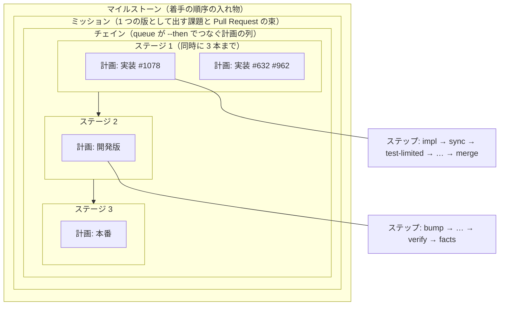

# 開発ワークフローの用語集

`development-workflow` と、そこから呼ぶ Skill・スクリプトで使う語を集める。**定義は各語の正本が持ち、
この文書は 1 行の要約と正本への案内だけを持つ。** 食い違ったときは正本を正とする。

**1 語には 1 つの意味だけを持たせる。** 正本がまだ旧称で書かれている語は、表の「旧称」の欄に添える。

## 例: 2026-09-25 のミッション

【】で囲んだ語が下の表にある。

1. 【ラッパー】が【区間】8 を起動し、【conductor】が【引継ぎ文書】の【ndf-next】から入り直した。【ミッション】は
   「pace: fast の実装・cross-review の空回りと詰まり・配布の待ちの修正」で、課題は #1078 と #632 #962 だった
2. 【pace】は `fast` である。利用者は始めに【MVV】を 1 回承認し、conductor が `mission-state.py gate <状態> MVV` で記録した
3. conductor は実装の【計画】を 2 本（`plan-1078.json`・`plan-632-962.json`）と開発版の計画を 1 本作り、
   【queue】へ実装を先に、開発版を `--then` で後ろに渡した。この計画の列が【チェイン】で、列の 1 つ分が【ステージ】である
4. 実装の計画は【ステップ】を `impl → sync → test-limited → judge → pr → test-all → doc-lint → ready → merge` の順に流した。
   `test-limited` が【範囲テスト】、`test-all` が【全体テスト】で、落ちたときだけ `fix` のステップへ回る
5. 2 本が完了すると、queue がチェインの次のステージとして【開発版】の計画（`bump → changelog → notes → sync → release → verify → facts`）を流した
6. `verify` のステップが【導入確認】を行い、`facts` のステップが【提示物】を書いて【関門】を返した。`progress.jsonl` に【attention】の行が載った
7. 配布の Pull Request の待ちが【取り残されたチェック】で止まる不具合は、起票せず【その場で直す】と決めた。
   修正の Pull Request #1101 を足して、開発版を `10.17.22-dev.2` として出し直した
8. 【関門 2】で【MVV 判定】は【越えない線】（`.github/workflows/` を触った）に当たり、利用者の承認へ戻った。利用者が承認した
9. conductor は本番の queue と `mission-state.py update → render → next` を 1 本の背景の Bash で流し、【本番】へ【正式版】 `10.17.22` を配った
10. 最後に `relay.py notice` の【告知】と ndf-next を出して応答を終え、ラッパーが次の区間を起動した

## 大きさの関係

- **計画 1 本がフェーズ 1 つに当たる。** フェーズは工程表の行（工程）を束ねたもので、計画はその手順をステップの列として持つ
- **ステップとステージは大きさが違う。** ステップは計画の中の 1 要素、ステージはチェインの中の計画のまとまりである
- **区間はミッションと入れ子にならない。** 区間は 1 回の claude の起動で、1 つの区間で 1 つの
  ミッションを通すことも、1 つのミッションが複数の区間にまたがることもある

## 進行の単位

| 語 | 意味 | 英語や識別子 | 旧称 | 正本 |
| --- | --- | --- | --- | --- |
| マイルストーン | 着手の順序を表す入れ物。ミッションはこの中から切り出す | GitHub の milestone。open は `<2 桁の連番> <主題>`、closed は `v<版数>` | — | [parallel-work.md](parallel-work.md) の「用語」 |
| ミッション | 1 つの版として出す課題と Pull Request の束。工程はミッション単位で 1 回ずつ通し、モードもミッションで 1 つにする | ブランチ `mission/<名前>`、状態のファイル `mission.json` | — | [parallel-work.md](parallel-work.md) の「用語」 |
| 工程 | 工程表（モードごとに起動する Skill の表）の 1 行。要求と受け入れ条件・設計・実装・配布など | 進行の記録の `stage` | — | [../SKILL.md](../SKILL.md) の「モードごとに起動する Skill」 |
| フェーズ | supervisor 1 つ（または計画 1 本）が通す、連続する工程の束。設計・実装・検査・取り込み・仕上げ・配布の 6 つ | 計画の `"フェーズ"`、Agent の `description` の先頭語 | — | [agent-layers.md](agent-layers.md) の「フェーズ」 |
| 計画 | `supervise.py` が流す 1 本の JSON。フェーズの手順をステップの列として持つ | `plan.json`、`supervise.py new impl` / `check` / `release` / `mission` / `close` | — | [supervise.py](../../../scripts/supervise.py) の docstring |
| ステップ | 計画の `steps` の 1 要素。型は run / work / drive / judge / pr の 5 つ | `"id"`・`"type"`・`"next"`、`supervise.py run <計画> --from <ステップの id>` | 段 | [supervise.py](../../../scripts/supervise.py) の docstring |
| queue | 計画を空いた枠へ順に流す副命令。同時に `--max` 本まで流し、終わると結果を done へ書く | `supervise.py queue <plan.json>... --max 3 --then <plan.json>... --done <パス>` | — | [supervise.py](../../../scripts/supervise.py) の docstring |
| チェイン | queue が `--then` でつないだ計画の列（実装 → 開発版 → 本番） | `--then`、`new release --prs-from-queue` | 鎖 | [relay.md](relay.md) の「切れ目の引継ぎ文書と ndf-next はスクリプトで作る」 |
| ステージ | チェインの中の計画のまとまり 1 つ。中は queue で並列に流し、前のステージがすべて完了したときだけ次のステージが流れる。`new mission` はステージごとに計画を書き出す（設計・関門 1・実装・検査・開発版・本番） | `--then` の 1 回分、`then_of` | 波・段 | [pace.md](pace.md) の「計画の波」 |
| 区間 | ラッパーが起動する claude の 1 回の起動（1 つの会話）。ndf-next のブロックで次の区間へ切り替わる | 区間の境の行 `── ndf-relay: 区間 2 ──`、`log.jsonl` の `section` | — | [relay.md](relay.md) |
| context window | 1 回の会話が保持する文脈の全体と、その量 | `NDF_CONTEXT_LIMIT`（既定 200,000） | — | [context-window.md](context-window.md) の「用語」 |
| カットポイント | context window を切ってよい 4 点。3 層ではフェーズの境になる | — | 切れ目 | [context-window.md](context-window.md) の「切ってよい点は 4 つある」 |
| スイッチポイント | フェーズの中で supervisor を替える点。収束ループの前で hook が決める | 報告の `結果: 区切り`、`NDF_SUPERVISOR_CUT_RATIO` | 区切り | [context-window.md](context-window.md) の「フェーズの中の区切り」 |
| 範囲 | 版と版の間（タグからタグまで）の変更 | `ndf--v10.17.10..ndf--v10.17.18` | 区間 | [pace.md](pace.md) の「具体例」 |

## 役割

| 語 | 意味 | 英語や識別子 | 旧称 | 正本 |
| --- | --- | --- | --- | --- |
| 3 層 | 工程を conductor → supervisor → worker の順に起動して通す形 | — | — | [agent-layers.md](agent-layers.md) |
| conductor | 人間と対話しているセッション。ミッションを持ち、関門で人間へ問えるのはこの層だけ | `AskUserQuestion` | — | [agent-layers.md](agent-layers.md) の「3 層の責務」 |
| supervisor | 1 つのフェーズを通すサブエージェント。人間へ問わない | `ndf:supervisor`（キャッシュの寿命 5 分）/ `ndf:supervisor-waits`（1 時間） | — | [agent-layers.md](agent-layers.md) の「3 層の責務」 |
| worker | 1 つの作業（調査・修正・検証・集計）を行うサブエージェント。別のサブエージェントを起動しない | `ndf:worker`、計画の work のステップ | — | [agent-layers.md](agent-layers.md) の「3 層の責務」 |
| ラッパー | 利用者の `claude` を包んで常駐し、ndf-next のブロックを拾って `/exit`・プラグインの更新・次の区間の起動を行う（Claude Code だけ） | `relay.py run`、`/ndf:install-wrapper`、`NDF_RELAY_DIR` | 中継 | [relay.md](relay.md) |
| 最小構成の `claude -p` | Tool と指示を絞った 1 回の判断。judge のステップと MVV 判定が使う | — | — | [work-vessels.md](work-vessels.md) の「比べる器」 |
| レベル | 仕事を渡す器の LLM の使い方の水準。レベル 1 = スクリプト、レベル 2 = 分類の判断、レベル 3 = 会話の中の LLM | — | 段 | [work-vessels.md](work-vessels.md) の「比べる器」 |
| 会話の中 | 仕事を渡す器の 1 つ。いまの会話の文脈で行う | — | その場 | [work-vessels.md](work-vessels.md) |
| 実装担当 / 進行側 | `cross-refactoring` で、改修計画以降を通す 1 ランタイムと、公開・生成物の同期を持つ側 | `--implementer` | — | [cross-refactoring](../../cross-refactoring/SKILL.md) の「この Skill で使う語」 |

## 進め方と判定

| 語 | 意味 | 英語や識別子 | 旧称 | 正本 |
| --- | --- | --- | --- | --- |
| モード | 変更の目的物で決める工程の振り分け。上から `operation` / `documentation` / `standard` / `legacy-refactor` / `light` | モード判定の結果の `mode:` | — | [../SKILL.md](../SKILL.md) の「判定の手順」、[workflow-modes.md](workflow-modes.md) |
| pace | モードとは別の軸で、工程をどう通すかを決める。既定の `normal` と、関門と検査の時機を変える `fast` | `pace:`、`supervise.py new mission --pace fast`、`.ndf/pace.json` | — | [pace.md](pace.md) |
| MVV | ミッションの Mission / Vision / Value。マイルストーンの説明から複製し、利用者が 1 回承認する。`fast` で関門 1・2 の事前の許可になる | `mvv.md`、`mvv.sha256`、関門の記録 `MVV` | — | [pace.md](pace.md) の「ミッションを始める」 |
| MVV 判定 | 関門の材料が MVV に従うかの判定。「従う」で越えない線が無いときだけ関門を省き、記録を残す | `mvv-gate.py check`、`verdict`（follow / not_follow / unknown）、終了コード 0 / 10 | MVV の判定 | [pace.md](pace.md) の「MVV の判定」 |
| 越えない線 | 当たれば MVV 判定が「従う」でも利用者の承認を求める範囲。秘密・認証認可・利用者のデータ・戻せない操作・他のリポジトリへの公開・対象外のモード・承認後に変わった MVV | `.ndf/pace.json` の `boundary_paths`、`boundary` | — | [pace.md](pace.md) の「越えない線」 |
| トリガー | `fast` で構造改善と実装レビューを流す条件。点数・行数・逃げた不具合・経過時間・最終の 5 つ | `check-trigger.py eval`（立つ 0 / 立たない 3 / 読めない 2）、`triggers.*` | — | [pace.md](pace.md) の「検査のトリガー」 |
| 実行の条件 | 計画を流す前に打つコマンド。`skip_code` を返せば作業ツリーを作らずに完了とする | 計画の `"実行の条件"` | — | [supervise.py](../../../scripts/supervise.py) の docstring |
| 逃げた不具合 | マージ済みの変更に見つかった不具合。直した Pull Request が触った領域を記録し、トリガーに数える | `new impl --escape-of <PR>`、記録の `kind: escape` | — | [pace.md](pace.md) の「逃げた不具合の記録」 |
| 共通層 | 領域のうち、触った Pull Request の点数を重くするもの | `areas[].common`、`common_weight` | — | [pace.md](pace.md) の「宣言」 |
| 階層 | パスの区切り 1 つ分の深さ。どの領域にも当たらないファイルは、ディレクトリの先頭 3 階層を領域の名前にする | — | 段 | [pace.md](pace.md) の「宣言」 |
| judge のステップ | 結果ファイルと規則の抜粋だけを渡し、次のステップを LLM に決めさせるステップ。Tool を持たない | `"type": "judge"` | judge の段 | [supervise.py](../../../scripts/supervise.py) の docstring |
| 決定 | judge のステップが返す、次に取る手 | `decision`（`choices` のどれか） | 判定 | [supervise.py](../../../scripts/supervise.py) の docstring |
| 区分 | `issue-upkeep` が課題ごとに決める 8 つ（そのまま・追記が要る・書き直しが要る・閉じてよい・やらない・重複・ルートコーズ・要判断） | `plan.json` の `verdict` | 判定 | [issue-upkeep](../../issue-upkeep/SKILL.md) の「用語」 |

## 関門と承認

| 語 | 意味 | 英語や識別子 | 旧称 | 正本 |
| --- | --- | --- | --- | --- |
| 関門 | 人手の承認を求める点。取り消せない操作の前の 2 つだけで、増やさない | 報告の `結果: 関門`、結果 JSON の `status: gate`、終了コード 10〜19 | — | [../SKILL.md](../SKILL.md) の「人手の承認を求める関門」 |
| 関門 1 | 設計 Pull Request のマージ。文書では企画承認に当たる | 承認ラベル `design-approved` | — | [../SKILL.md](../SKILL.md) の「設計 Pull Request のマージ」 |
| 関門 2 | 本番の系へ届く操作（本番への配布と `operation` の実行）。文書では制作物承認に当たる | `mission-state.py gate <状態> "関門 2"` | — | [../SKILL.md](../SKILL.md) の「本番の系へ届く操作」 |
| 承認ラベル | 人間が設計を承認したことを表す Pull Request のラベル。無ければ hook が設計 Pull Request のマージを拒む | `design-approved` | 承認の印 | [stage-completeness.md](stage-completeness.md) の「用語」 |
| 提示物 | 承認を求めるときに示すもの。対象を開くためのものと、承認の判断に使うものの 2 層を持つ | 報告の `提示物:`、結果 JSON の `presentation_path`、`issues/approval-<plugin>-v<正式版>.md`（提示物の複製） | — | [approval-request.md](approval-request.md) |
| 事実の材料 | 提示物のうち機械で作れる部分と、conductor が確かめて足した事実。MVV 判定へ材料として渡す | `release-steps.py approval-facts`、計画の `facts` のステップ、`mvv-gate.py --material` | — | [release-steps.md](../../release/references/release-steps.md)、[pace.md](pace.md) の「MVV の判定」 |

## 配布

| 語 | 意味 | 英語や識別子 | 旧称 | 正本 |
| --- | --- | --- | --- | --- |
| 開発版 | 起点のブランチ（`develop`）に載るチャネルと、そこへ出す接尾辞付きの版。マージされた変更がそのまま載る | `<版>-dev.<n>`、`new release --channel dev` | — | [release](../../release/SKILL.md) の「配布の段階」 |
| 本番 | 利用者が現に使っているチャネル・環境・外部サービス（本番の系）。プラグインの配布では本番のブランチ | `.ndf/worktree.json` の `production_branch`（無ければ既定ブランチ）、`--channel prod` | — | [../SKILL.md](../SKILL.md) の「本番の系へ届く操作」 |
| 正式版 | 本番のチャネルへ出す、接尾辞の無い版。出したらリリースタグを打つ | タグ `<plugin>--v<版>` | — | [release](../../release/SKILL.md) の「配布の段階」 |
| 検証への配布 | 開発版と分かる版数での公開か、検証環境への反映。提示して進めてよい | — | — | [release](../../release/SKILL.md) の「配布の段階」 |
| 導入確認 | 隔離した HOME で ref からプラグインを導入し、版と中身が ref と一致するかを確かめる | `release-verification-steps.py verify-install --ref <ブランチ> --expect <版>`、計画の `verify` のステップ、`fast.verify` | — | [release-verification-steps.py](../../../scripts/release-verification-steps.py) の docstring |
| 完了の事実 | 公開が済んだことを、配布先の状態から読み取れる値 | `release` の結果 JSON の `items[]` | — | [completion-check.md](../../release/references/completion-check.md) の「用語」 |
| 取り残されたチェック | 実行が終わったのに pending のまま残った CI のチェック。1 度だけ再実行し、再び残れば止まる | `merged-steps.py merge-when-green --stale-after <秒>`、`items` の `rerun` / `stuck` | 取り残された検査 | [merged](../../merged/SKILL.md) の `merge-when-green` |
| 複製 | 元のファイルをそのまま別の場所へ置いたもの。ラッパーの `relay.py`（版は横の `relay.version`。新しい版を古い版で置き直さない）・マイルストーンの説明から作る `mvv.md`・提示物の `issues/approval-*.md` | `~/.claude/ndf/relay.py`、`relay.version` | 写し | [relay.md](relay.md) の「始め方」 |
| 抜粋 | 呼ぶ側が要る部分だけを Skill の本文から取り出したもの | `EXCERPTS.md` | 写し | [EXCERPTS.md](../../EXCERPTS.md) |

## 検査とテスト

| 語 | 意味 | 英語や識別子 | 旧称 | 正本 |
| --- | --- | --- | --- | --- |
| 検査 | 構造改善・実装レビュー・完了判定・Pull Request を通すフェーズ。`fast` ではトリガーが立ったときだけ、前回の検査からの差分に流す | `new check`、`new check --since-last --id <名>` | — | [agent-layers.md](agent-layers.md) の「フェーズ」、[pace.md](pace.md) の「検査の計画」 |
| チェック | 機械が合否を返すもの。CI のジョブと、`mvv-gate.py`・`doc-lint.py` などのスクリプト | CI の checks、結果 JSON の `status` | 検査 | [merged](../../merged/SKILL.md) の `merge-when-green`、各スクリプトの docstring |
| 構造改善 | 振る舞いを変えずに構造を直す工程 | `/ndf:cross-refactoring`、計画の `refactor` のステップ | — | [../SKILL.md](../SKILL.md) の「モードごとに起動する Skill」 |
| 実装レビュー | 実装の差分をレビューし、新しい指摘が出なくなるまで直す工程 | `/ndf:cross-review`（`legacy-refactor` は `pr-review`）、計画の `review` のステップ | — | [../SKILL.md](../SKILL.md) の「モードごとに起動する Skill」 |
| 収束ループ | 新しい指摘が出なくなるまで回すレビューと修正。構造改善・実装レビュー・ドキュメントレビューが持つ | drive のステップ | — | [context-window.md](context-window.md) の「フェーズの中の区切り」 |
| 手順 | 1 つの Skill の中で順に通す作業のまとまり。`cross-refactoring` の提案・改修計画・テスト追加・実装・検証/修正の 5 つ、`document-restructuring` の測る・並べ替える・整える・測り直すの 4 つ | — | フェーズ・段 | [cross-refactoring](../../cross-refactoring/SKILL.md)、[document-restructuring](../../document-restructuring/SKILL.md) |
| 改修計画 | `cross-refactoring` が採る改善項目を決め、見送った提案と理由を残す出力 | — | 計画 | [cross-refactoring](../../cross-refactoring/SKILL.md) の「この Skill で使う語」 |
| 予備時間 | `cross-refactoring` の見積りで、想定最大時間から経過を引いた後に残しておく時間 | 「想定最大時間 − 経過 − 予備時間」 | 控え | [cross-refactoring](../../cross-refactoring/SKILL.md) の「この Skill で使う語」 |
| 完了判定 | コマンドの証跡で完了を判定する工程 | `/ndf:quality-gates` | — | [quality-gates](../../quality-gates/SKILL.md) |
| 範囲テスト | 変更が触った範囲に限って走らせるテスト | `new impl --tests`、計画の `test-limited` のステップ、`cross-refactoring` の `test_targets` | 限ったテスト | [supervise.py](../../../scripts/supervise.py) の docstring、[cross-refactoring](../../cross-refactoring/SKILL.md) の「この Skill で使う語」 |
| 全体テスト | リポジトリ全体を範囲にするテスト | 計画の `test-all` のステップ、`.ndf/supervise.json` の `test.all` | — | [supervise.py](../../../scripts/supervise.py) の docstring |
| 危険フラグ | `cross-refactoring` で、範囲テストでは覆えない変更（D1〜D5）。立てば全体テストを 1 度走らせる | D1〜D5 | 危険の印 | [cross-refactoring](../../cross-refactoring/SKILL.md) の「この Skill で使う語」 |
| コメントのスナップショット | `cross-review` が取る既存コメントの一覧。2 ラウンド目以降は取り直す | `state.py init` | 控え | [cross-review](../../cross-review/SKILL.md) |
| doc-lint | 追加した Markdown の行に、検討の痕跡・課題番号の由来・比較の語が無いかを見るチェック | `doc-lint.py`、計画の `doc-lint` のステップ | — | [doc-lint.py](../../../scripts/doc-lint.py) の docstring |

## 記録と状態

| 語 | 意味 | 英語や識別子 | 旧称 | 正本 |
| --- | --- | --- | --- | --- |
| 進行の記録 | 工程に入った時点で 1 回打つ記録。課題の本文の `## 進行` も同じ 1 回で更新される | `projects-sync.sh` | — | [stage-completeness.md](stage-completeness.md) の「用語」 |
| ボード | 進行を記録する GitHub Projects のプロジェクト 1 つ。宣言が無ければ何も動かない | `.ndf/projects.json` | 盤面 | [projects-tracking.md](projects-tracking.md) の「用語」 |
| 通過工程 | ある課題について、進行の記録が実際に書かれた工程の集合 | — | — | [stage-completeness.md](stage-completeness.md) の「用語」 |
| 通過記録 | 通過工程を課題ごとに残したファイル | `stage-check.sh report <番号>` | 控え | [stage-completeness.md](stage-completeness.md) の「用語」 |
| ミッションの状態 | ミッションの計画・done・関門の記録・MVV・版を持つファイル。引継ぎ文書の表と ndf-next をここから作る | `mission.json`、`mission-state.py init` / `update` / `gate` / `render` / `next` / `status` | — | [mission-state.py](../../../scripts/mission-state.py) の docstring |
| 引継ぎ文書 | 会話を切って再開するための文書。「今の会話の進み」（計画ごとの行の表）と「次に実行するコマンド」の節をスクリプトが書く | `issues/handoff-<名>.md`、`supervise.py note` | — | [relay.md](relay.md) の「切れ目の引継ぎ文書と ndf-next はスクリプトで作る」 |
| ndf-next | 次の区間の最初の入力を入れる、情報文字列 `ndf-next` の囲みのコードブロック。最後の応答に 1 つだけ置く | 囲みの情報文字列 `ndf-next` | — | [context-window.md](context-window.md) の「新しい会話で戻す」 |
| 合図 | ラッパーへ知らせるファイル。Stop hook が最後の応答の ndf-next を移した `next.json` と、止める `stop`。ラッパーはこれを受けて区間を切り替える | `next.json`、`stop`、`relay.py mark` | 印 | [relay.md](relay.md) の「関門を越えない守り」 |
| 告知 | ndf-next のブロックの直前にそのまま置く 1 文。1 行目がラッパーの内か外かを示す | `relay.py notice`（1 行目 `relay` / `outside`、2 行目が告知） | — | [context-window.md](context-window.md) の「新しい会話で戻す」 |
| 静止 | 合図・会話の記録・利用者の入力が動かない秒数。この秒数がたつまでラッパーは `/exit` を入力しない | `NDF_RELAY_QUIET`（既定 5） | 静まり | [relay.md](relay.md) の「上限」 |
| 素通し | ラッパーを挟まず、本物の claude をそのまま起動すること | `NDF_RELAY=0`、`claude -p` | — | [relay.md](relay.md) の「ラッパーを挟まない起動」 |
| 途中の報告 | 計画の実行中に 1 行 1 つの JSON で追記する記録。LLM を使わない | `<state-dir>/progress.jsonl` | — | [supervise.py](../../../scripts/supervise.py) の docstring |
| step / alive / worker / attention | 途中の報告の行の種類。ステップの切り替わり・動きの無い間の生存・worker の進み・conductor の判断が要る出来事（止まった・関門・同じ失敗の繰り返し・judge のステップで stop が出そう） | `"kind"`、`alive` の間隔は `report_interval`（既定 600 秒） | — | [supervise.py](../../../scripts/supervise.py) の docstring |
| done | queue が終わったときに書く結果の JSON。`wait` は done か attention の行まで待つ | `queue-done.json`、`wait` の終了コード done = 0 / attention = 20 / 上限 = 3 | — | [supervise.py](../../../scripts/supervise.py) の docstring |
| フェーズの報告 | supervisor（または計画）が最後に返す報告。conductor は見出しの有無と `結果` だけを見る | `## フェーズの報告`、`report.md`、`結果` は 完了 / 関門 / 止まった / 区切り | — | [agent-layers.md](agent-layers.md) の「フェーズの報告」 |
| 結果 JSON | 手順のスクリプトが返す 1 行の JSON。`status` で読む | `status` は ok / gate / stopped | — | [lib/README.md](../../../scripts/lib/README.md) |

## 作業場所と経路

| 語 | 意味 | 英語や識別子 | 旧称 | 正本 |
| --- | --- | --- | --- | --- |
| 作業ツリー | 開発の変更を行う git worktree。課題ごとに 1 つ切る | `.worktrees/<ブランチ名>`、`/ndf:worktree` | — | [worktree](../../worktree/SKILL.md) |
| 主ディレクトリ | リポジトリを clone したディレクトリ。`issues/` `docs/` と各ランタイムの設定は、ここで編集してよい | `git rev-parse --git-common-dir` の親 | — | [worktree](../../worktree/SKILL.md) の用語の表 |
| 起点のブランチ | 作業ツリーの分岐元と Pull Request の宛先 | `.ndf/worktree.json` の `base_branch` | — | [../SKILL.md](../SKILL.md) の「本番の系へ届く操作」 |
| ミッションのブランチ | 課題の Pull Request を集め、起点のブランチへの Pull Request をミッションで 1 本にするブランチ。`fast` では作らない | `mission/<名前>` | — | [parallel-work.md](parallel-work.md) の「ミッションの中の並列の 4 つの形」 |
| 安定と試行 | NDF の変更の 2 つの経路。既定で働くもの（安定）は工程どおりに、呼んだときだけ働くもの（試行）はその場で実装して使ってから入れる | 台帳 `docs/ndf-experiments.md` | — | ai-plugins の `AGENTS.md` の「安定と試行」 |
| その場で直す | `fast` で、200 行以内の不具合を起票せず、その場の計画で直すこと。マージ済みの変更の不具合なら逃げた不具合として記録する | `new impl --escape-of <PR>` | — | [../SKILL.md](../SKILL.md) の「進め方」、[pace.md](pace.md) の「逃げた不具合の記録」 |
| 範囲外の課題 | この変更の受け入れ条件にも直す対象にも入らない課題。見つけたその場で issue にする | `/ndf:out-of-scope` | — | [out-of-scope](../../out-of-scope/SKILL.md) |
| 手入れ | 既存の課題の本文・マイルストーン・ラベルを現状に合わせること | `/ndf:issue-upkeep`、`upkeep.py` | — | [issue-upkeep](../../issue-upkeep/SKILL.md) の「用語」 |
| 実装計画 | `implementation-plan` が `issues/` に書く、実装の前の計画 | `issues/{feature-name}.md`（タスク ID があれば `issues/TASK-1234_<説明>.md`） | 計画 | [implementation-plan](../../implementation-plan/SKILL.md) |
| 確定仕様化 | 完了した実装計画を `docs/` の確定仕様へ書き直す工程 | `/ndf:plan-to-spec` | — | [plan-to-spec](../../plan-to-spec/SKILL.md) |
| 振り返り | 進め方で変えることを記録し、起票の取りこぼしを拾う工程 | `/ndf:retrospective` | — | [retrospective](../../retrospective/SKILL.md) |

## 語を足すときの規則

- **足す前にこの用語集と突き合わせる。** 同じ字が別の意味で載っていれば、別の語を選ぶ
- **裸の語は 1 つの意味だけに使う。** 意味を足したくなったら複合語にする（モード判定・MVV 判定・進行の記録など）。複合語は別の語として表に載せる
- **一般語はそのまま使ってよい。** 段階・手段・区切り文字のように、用語として定めていない語は対象にしない
- **足した語はこの表に 1 行を加える。** 正本の文書は、その語の定義を持つ 1 か所に決める
