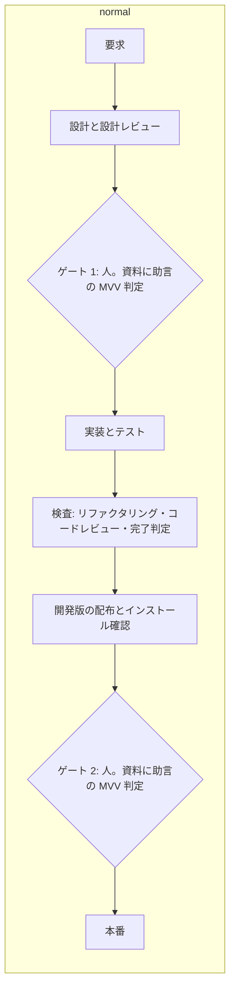
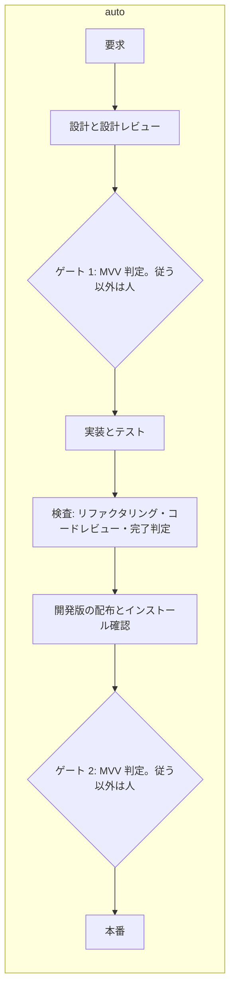
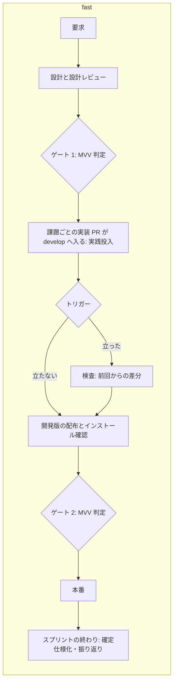

# 進め方（`pace`）

SKILL.md の「進め方（`pace`）」の続きである。3 つの進め方の定義の表は SKILL.md にあり、この文書は
進め方ごとのフロー・`fast` の工程の区分・`fast` と `auto` の使ってよい条件・設定の形・プランのステージ・
承認ゲートで止まった後の続け方・検査のトリガー・MVV 判定・記録の読み方を持つ。

## 具体例: マイルストーン 26 の 2026-09-25 のリリース差分

タグ `ndf--v10.17.10` から `ndf--v10.17.18` までに、リリースを除く Pull Request 41 本を develop へマージし、本番へ
8 回リリースした。検査は Pull Request ごとに通さず、確定仕様化と振り返りは課題ごとに行わず、後で棚卸しを 55 件
まとめて行った。同じリリース差分を 3 つの進め方で回すと、次のように動く。

| 何が | `normal` | `auto` | `fast` |
| --- | --- | --- | --- |
| 承認 | ゲート 1・2 を利用者が承認する（8 版なら 16 回） | 各回を `mvv-gate.py` が判定し、「従う」なら通す。ほかは利用者が承認する | `auto` と同じ。利用者が承認するのはスプリントの開始時の MVV 1 回だけのこともある |
| リファクタリングとコードレビュー | スプリントの develop 宛 Pull Request で 1 回ずつ、配布の前に | `normal` と同じ | `check-trigger.py eval` が点数 15・変更量 5,000 行・流出不具合の重なり・期限 24 時間を見て、立ったときだけ次の開発版の前に検査のプラン 1 本が入る。このリリース差分なら約 4 回（PR 約 10 本・約 2 時間に 1 回） |
| 単位 | スプリントブランチへ集めて 1 版 | `normal` と同じ | 課題ごとの Pull Request が develop へ入り、開発版も課題ごと |
| 確定仕様化・受け入れ条件の確認・振り返り | 課題ごとに本番の後で | `normal` と同じ | `supervise.py new close` のプランが、スプリントの終わりに 1 回ずつ流す |
| 工程の飛ばしの案内 | 全工程の記録を求める | `normal` と同じ | `構造改善`・`実装レビュー` を `トリガー:`、確定仕様化・振り返りを `まとめる:` の行に出し、記録を求めない |

## フロー

3 つとも左から右へ時間が進む。菱形は承認ゲートで、担い手を中に書く。`normal` と `auto` はノードの並びが同じで、
菱形の中だけが違う。検証（設計レビュー・テスト・検査）は配布の前に各工程で行う。





`fast` は実践投入（実装の Pull Request が develop へ入り、開発版として配布され使われること）が検査より前に来る。
検査はトリガーが立ったときだけ、配布の後にまとめて通る。



`normal` と `auto` の確定仕様化と振り返りは、工程表どおり課題ごとに本番の後で行うため図に入れない。

## 工程の区分（`fast`）

**`fast` を指定したときだけ工程が次の区分に分かれる。** モードが対象外（—）とする工程は対象外のままである。
`auto` は `normal` と同じく全工程を工程表のとおりに通す。

| 区分 | 工程表の行 | いつ通すか |
| --- | --- | --- |
| その場で通す | 作業場所の用意 / 計画 / 実装 / 完了判定 / Pull Request / 後片付け / 配布 / リリース後テスト | 課題ごと。実装のプランが範囲テスト → Draft の Pull Request（CI と並べる）→ 全体テスト → doc-lint → マージまでを通す。リリースは開発版と verify-install まで。本番は下のゲート 2 に従う |
| トリガーで通す | リファクタリング / コードレビュー | 検査のトリガーが立ったとき、次の開発版の前に 1 回。範囲は前回の検査からの差分 |
| スプリントの終わりにまとめる | 確定仕様化 / 振り返り（受け入れ条件の確認と課題を閉じる作業を含む） | スプリントの終わりに 1 回ずつ |
| 省かない | 要求と受け入れ条件 / 設計 / ドキュメント再構成 / ドキュメントレビュー | モードの定めどおり。設計の承認が要る変更は設計 Pull Request を出す |

| 承認ゲート | `normal` | `auto` | `fast` |
| --- | --- | --- | --- |
| ゲート 1（設計 Pull Request のマージ） | 利用者が承認する。`--state` を渡したスプリントでは、助言の MVV 判定（`mvv-gate.py check --advise`）の判定・理由・根拠を承認資料に載せる（どの判定でも人が承認する） | `mvv-gate.py` が「従う」と判定し、レッドラインに当たらなければ通す。ほかは利用者が承認する | `auto` と同じ |
| ゲート 2（本番系へ届く操作） | 同上 | 同上 | 同上 |

## 使ってよい条件

**`supervise.py new sprint --pace fast|auto --state <スプリント状態ファイル>` が機械で確かめる。** 1 つでも欠ければ
`stopped`（終了コード 1）でプランを書かず、`next` に `normal` の起動の形（`--pace` と `--state` を外した同じコマンド）を示す。
conductor は `normal` で進める。`fast` と `auto` の条件は同じで、読む `.ndf/pace.json` の節（`<節>` は `fast` か `auto`）
だけが違う。ほかの節の値は使わない（`fast` だけを許した宣言では `auto` を断る）。

| 条件 | 確かめ方 |
| --- | --- |
| 開発版のチャネルがある | `.ndf/worktree.json` の `base_branch` が `production_branch`（無ければ既定ブランチ）と違う。同じなら、手動反映の本番系の形（下）であること |
| インストール確認がある | `.ndf/pace.json` の `<節>.verify` にコマンドが書かれている |
| リポジトリが許している | `.ndf/pace.json` の `<節>.enabled` が `true`。節が無ければ許さない |
| モードが対象に入る | `--mode` が `<節>.modes`（既定 `light` / `standard` / `legacy-refactor`）に入る。`operation` と `documentation` は書いても入らない |
| MVV が承認済み | スプリント状態ファイルに承認ゲート `MVV` の記録があり、その `sha256` が今の `mvv.md` と一致する。スプリント MVV が無いスプリントは、承認済みのプロジェクト MVV（[project-mvv.md](project-mvv.md)）と状態に残した参照（`project_mvv.sha256`）が一致する |
| プロジェクト MVV が改訂されていない | 状態の `project_mvv.sha256` が今の `.ndf/mvv.md` と一致する。宣言が 未承認・承認と一致しない・壊れている なら断る |

**手動反映の本番系の形。** 起点と本番チャネルが同じ（例 carmo-cdk: どちらも `main`。本番へは手で打つ `cdk deploy` で届く）でも、
`.ndf/project.json` の `delivery` が次をすべて満たせば開発版のチャネルがあると数える（判定は `lib/delivery.py` の `dev_channel`）。

- 読めて、`production: true`（本番系へ届く）の行が 1 つ以上ある。`production` は利用者が書く（解析は書かない）
- `production: true` の行がすべて `kind: manual`
- 本番チャネルへのマージで自動で反映する行（`kind: auto`・`branch` が本番チャネル・`production` が `false` でない）が無い

`delivery` が無い・不明・読めない、`production: true` の行が無いときは断る。この形では本番チャネルへのマージは本番系へ届かず、
`merge-gate` も承認ゲート 2 に数えない。承認ゲート 2 は手で行う本番のデプロイの前に掛かる（下の「リリースの経路からステージを組む」）。

**使ってはいけない場面:** 開発版のチャネルが無いリポジトリ（マージがそのまま本番に届く・本番系の行を宣言していない）、
インストールを確かめる手段が無いリリース、戻すのが高い変更（利用者のデータの移行など。下の「レッドライン」に当たるものは承認ゲートを省かない）。

## 設定（`.ndf/pace.json`）

**プロジェクトごとに違うものはこの設定で受け、スクリプトに埋め込まない。** 利用者が変える設定であり、
リポジトリに置いてレビューを通す。

| 項目 | 型 | 空・無いとき | 意味 |
| --- | --- | --- | --- |
| `version` | 数 | 許さない（`1` だけ。必須） | 宣言の形の版。無い・`1` 以外なら `check-trigger` / `mvv-gate` / `supervise.py new sprint --pace fast|auto` が止まる |
| `fast.enabled` | bool | 偽 | `fast` を許すか |
| `fast.modes` | 文字列の配列 | 既定の 3 つ | `fast` を使ってよいモード |
| `fast.verify` | 文字列 | `fast` を断る | インストール確認のコマンド |
| `auto.enabled` | bool | 偽 | `auto` を許すか |
| `auto.modes` | 文字列の配列 | 既定の 3 つ | `auto` を使ってよいモード |
| `auto.verify` | 文字列 | `auto` を断る | インストール確認のコマンド（`fast.verify` と共有しない） |
| `areas[].name` / `common` / `paths` | 文字列 / bool / glob の配列 | name と paths は許さない | 領域。`common` が真なら重点領域で、触った Pull Request は `common_weight` 点。流出不具合の重なりはこの単位で数える |
| `boundary_paths` | glob の配列 | 機械のチェックは無し | レッドラインに当たるファイル |
| `triggers.score` / `common_weight` / `lines` / `escapes` / `hours` | 数 | 15 / 2 / 5000 / 2 / 24 | トリガーの閾値 |

glob の `**` は区切りをまたぎ、`*` と `?` はまたがない。どの領域にも当たらないファイルは、ディレクトリの
先頭 3 階層（例 `plugins/ndf/skills`）を領域の名前にする。

## スプリントを始める

**承認の記録が無いうちは `new sprint --pace fast|auto` がプランを書かないため、設計は始まらない。** 手順は
`fast` と `auto` で同じで、`<値>` に進め方を入れる。

| 順 | 打つもの | 失敗・未承認のとき |
| --- | --- | --- |
| 1 | `sprint-state.py init <状態> --name <名> --pace <値> --milestone <M>` | 終了コード 3（説明に `## Mission` / `## Vision` / `## Value` がそろわない・読めない）: 利用者に説明を直してもらい打ち直す |
| 2 | conductor が `mvv.md`（スプリント状態ファイルの隣）を利用者へ示し、承認を得る | 承認されない: 説明を直して 1 から。`normal` で進めてもよい |
| 3 | `sprint-state.py gate <状態> MVV --what <要約>` | — |
| 4 | `supervise.py new sprint ... --pace <値> --state <状態>` | 終了コード 1（承認の記録が無い・ハッシュ不一致・宣言が許していない）: 2 へ戻るか `normal` で進める |

`--mvv <ファイル>` を渡すと、マイルストーンからコピーせずにそのファイルを使う。承認済みのプロジェクト MVV がある
リポジトリ（`--root`）では、`init` がその参照（版・sha256）を状態に書き、スプリント MVV を `project-mvv.py vet --kind sprint` に
通す。プロジェクト MVV のレッドラインを緩める・Value を打ち消すスプリント MVV は、状態を書かずに箇所を示して止まる（終了コード 1）。
`--milestone` も `--mvv` も渡さなければ、プロジェクト MVV だけで判定する（承認ゲート `MVV` の記録は要らない）。**承認の後に MVV を書き換えると
ハッシュが食い違い、判定は利用者の承認へ戻る。**

## プランのステージ

### `auto`

**並びは `normal` と同じで、設計のステージの queue が後ろのステージを `--then` で本番まで流す。** 前のステージの
プランがすべて `完了` のときだけ後ろが流れ、1 本でも `関門` なら queue は後ろを流さずに `gate` を返す。
`check-trigger.py` は呼ばれない。マニフェスト（`<out>/sprint.json`）は `進め方: auto`・`状態`・`ブランチ` を持つ。

| ステージ | プラン | 流し方 |
| --- | --- | --- |
| 設計 | `design-<N>`（review と用語チェックの後に `mvv` → `approve`（ラベル `design-approved` と判定のコメント）→ `merge`） | `command`: `queue <設計>... --max 3 --then <スプリントブランチ> --then <実装>... --then <検査> --then <開発版> --then <本番>` |
| ゲート 1 | 無し。設計のプランの MVV 判定が通せばマージ済みで通過する | — |
| スプリントブランチ | `sprint-branch` | 1 つ目の `--then` |
| 実装 | `impl-<N>`（起点と宛先はスプリントブランチ） | 2 つ目の `--then` |
| 検査 | `check`（スプリントの develop 宛 Pull Request を 1 本出し、構造改善・コードレビュー・完了判定を 1 回通す） | 3 つ目の `--then` |
| 開発版 | `release`（`facts` は `gate_as_ok`。出す版の Pull Request は検査のプランの PR） | 4 つ目の `--then` |
| 本番 | `release-prod`（先頭が `mvv` → `note`（判定のコメントを検査の PR へ）→ `bump`） | 5 つ目の `--then` |

`--design` を省くと設計とゲート 1 が無く、スプリントブランチのステージが `command` を持つ。リリースの経路が雛形で
組むもの（`release.form` に雛形がある）でなければ、開発版と本番の代わりに下の「リリースの経路からステージを組む」のステージが入る。
`then_of` のステージはマニフェストに `resume`（そのステージから最後までを流す queue のコマンド）を持つ。

**MVV 判定の後のステップ（`approve`・`merge`・本番の `note`）が落ちたら、`handoff` のステップが承認ゲートへ落とす。**
`sprint-state.py gate <状態> "関門 N" --withdraw` で `mvv` のステップが書いた `by: mvv` の記録を外し、理由を 1 行出して
終了コード 10 を返す。プランの結果は `関門` になり、状態は「自動で通していない」に戻る（`fast` の設計と本番も同じ）。

### `fast`

`normal` のスプリントとの違いは 4 点である。スプリントブランチを作らない。実装の Pull Request が develop へ
直接入る（閉じる語を書かない）。検査に実行条件が付く。承認ゲートのステージが MVV 判定のステップへ入る。

| ステージ | プラン | 流し方 |
| --- | --- | --- |
| 設計 | `design-<N>`（review の後に `mvv` → `approve`（ラベル `design-approved` と判定のコメント）→ `merge`） | `queue --max 3` |
| ゲート 1 | 無し。設計のプランがすべて `完了` なら通過し、`関門` を返したプランの Pull Request だけ利用者の承認を取ってマージする | conductor |
| 実装 | `impl-<N>`（`base` は develop） | `queue <実装>... --max 3 --then <検査> --then <コードレビュー> --then <開発版> --then <本番>` |
| 検査 | `check`（実行条件 `check-trigger.py eval --id <スプリント>-1`） | 1 つ目の `--then` |
| コードレビュー | `review`（`new check --since-last --review-only`。実行条件 `eval --id <スプリント>-review --review`） | 2 つ目の `--then`。検査が立った回は範囲が空になり流れない |
| 開発版 | `release`（`facts` は `gate_as_ok`） | 3 つ目の `--then` |
| 本番 | `release-prod`（先頭が `mvv` のステップ） | 4 つ目の `--then`。`関門` ならキューの結果が `gate` になり、承認の後に `run <プラン> --from bump` で続ける |

**スプリントの終わり**は `supervise.py new close --name M --worktree <根> --issue N... --version <開発版> --prod <正式版>
--state <状態>` が組む。最終の検査（実行条件 `eval --final`）→ 開発版と本番（実行条件 `changed --id <M>-final`。
最終の検査で変更があったときだけ）→ まとめ（`spec` 確定仕様化 → Pull Request → `close` 後片付け → `retro` 振り返り）
を `--then` のステージで流す。`close` のステップは `sprint-close.py --record-pr {queue_pr:release-prod} --issues <課題>
--with-verification` で、本番が飛ばされたときは `--record-pr 0`（本番の記録なし）になる。まとめのプランは課題すべてへ
工程を記録するため、通過記録の報告が `まとめる:` から `記録あり:` へ移る。
リリースの経路が雛形で組むものでなければ `--version`・`--prod` は要らず、開発版と本番の代わりに下の経路のステージが入り、
`close` のステップは `--record-pr 0` になる。

## リリースの経路からステージを組む

**`new sprint` / `new close` は、リリースの経路（`lib/delivery.py` の `routes`）から検査の後のステージを組む。**
`.ndf/supervise.json` に `release.form` があれば経路は雛形（`template`）で、今の開発版と本番のステージを置き、版数
（`--version`、`close` は `--prod` も）が要る。無ければ `.ndf/project.json` の `delivery` の行ごとに経路を決め、版数は要らない。
選んだ経路は `sprint.json` の `リリースの経路` に並ぶ。

| `delivery` の行 | 経路 | 検査の後に置くステージ |
| --- | --- | --- |
| `kind: auto`・`branch` がベースブランチ | `merge` | 置かない。検査の Pull Request のマージが反映で、宛先が自動反映の本番チャネルならそこで承認ゲート 2 に当たる |
| `kind: auto`・`branch` が本番チャネル（ベースブランチと違う） | `merge` | 「本番」: 昇格のプラン（ベースブランチ → 本番チャネルの Pull Request を `merged-steps.py promote` が作り、承認ゲート 2 の後にマージする。後片付けはしない） |
| `kind: auto`・`branch` が無いか別のブランチ、`kind: manual`、`versioned: true` | `manual` | 「リリース」: 手で行うステージ（`/ndf:release`。note に `target` と `trigger`） |
| `delivery: []` | `none` | 置かない |
| `delivery` が無い・不明（`{"unknown": ...}`） | `manual` | 「リリース」: 手で行うステージ。note に経路を決められない理由 |

「本番」と「リリース」が両方あれば、この順に置く。昇格のプランは `normal` では `promote`（承認の引数無し。承認ゲート 2 で
終える）→ 承認の後に `run <プラン> --from promote-approved`、`fast` / `auto` では `prepare`（Pull Request と承認資料）→
`mvv`（承認ゲート 2 の MVV 判定）→ `note` → `promote`（`--gate-approved mvv`）で、`note` か `promote` が落ちたら `handoff` が
承認ゲートへ落とす。`fast` / `auto` の `merge` の経路では開発版のステージを置かない（ベースブランチへのマージが検証への反映である）。

**手動反映の本番系の形の `fast` / `auto` は、手で届ける経路を 3 つのステージに分ける。** `normal` は上の「リリース」1 つのまま。

| ステージ | 中身 | 流し方 |
| --- | --- | --- |
| 開発版 | 手で行う（`/ndf:release`）。`production: false` の行（検証の環境）へ届ける。承認は要らない。行が無ければ置かない | conductor が検査の後に行い、済んだら承認ゲート 2 の `command` を打つ |
| 承認ゲート 2 | プラン `gate-2`: `facts`（`release-steps.py deploy-facts` が `<節>.verify` を走らせ、承認資料 `{state_dir}/work/approval-deploy.md` に本番系の行・ベースブランチの先頭のコミット・確認の出力を書く。非 0 なら止まる）→ `mvv`（承認ゲート 2 の MVV 判定）→ `note`。`note` が落ちたら `handoff` | 開発版があれば単独の queue（`command`）、無ければ検査に `--then` で続く |
| 本番 | 手で行う（`/ndf:release`）。`production: true` の行と、`production` を書いていない手動の行 | 承認ゲート 2 の通過（関門 2 の記録）の後に、承認資料のコミットを checkout して `trigger` を打つ。ベースブランチの先頭が違えば承認ゲート 2 からやり直す |

`mvv` の `--pr` は、`auto` では検査のスプリントの Pull Request（`{queue_pr:check}`）、検査に続く `fast` では前のステージの Pull Request の
すべて（`{queue_prs}`）である。単独の queue の `fast` は Pull Request を集められないため、MVV 判定を打たずに承認ゲート（10）を返し、
利用者が承認する。

## 承認ゲートで止まった後の続け方

**queue が `gate` を返したら、conductor は承認資料（`approval-request.md` の形）に判定・理由・根拠の項目（`mvv-gate.py` の結果の
`items`）を添えて利用者へ示す。** `auto` の続け方は次のとおりで、`fast` は上の表の「流し方」に従う。

| 答え | 打つもの |
| --- | --- |
| 承認（ゲート 1） | `sprint-state.py gate <状態> "関門 1" --what <要約> --by user --outcome approved` → `supervise.py run <設計のプラン> --from approve` → マニフェストのスプリントブランチのステージの `resume` |
| 承認（ゲート 2） | `sprint-state.py gate <状態> "関門 2" --what <要約> --by user --outcome approved` → `supervise.py run <本番のプラン> --from bump`（昇格のプランは `--from promote-approved`、マージの `merge-gate` で止まったプランは `--from merge-approved`。`gate-2` のプランは続きを流さず、手で行う「本番」のステージへ進む） |
| 差し戻し | `sprint-state.py gate <状態> "関門 N" --what <要約> --by user --outcome rejected`。続きは流さない |

**判定と食い違う答えは覆しとして残る。** 「従う」で自動に通った後の差し戻しは `override_reject`、「従わない」「判定できない」で
止まった後の承認は `override_pass` になる（[project-mvv.md](project-mvv.md) の「改訂の兆候」）。`handoff` で止まった後は
`by: mvv` の記録が外れているため、承認も差し戻しも覆しとして書かれない。マージ済みの変更を戻す操作そのものは、取り消しの
Pull Request で行う。

## 検査のトリガー

**検査のトリガーは `fast` だけが使う。** トリガーの判定はスクリプトが行い（`check-trigger.py eval`）、通信しない**（git の履歴だけを読む）。立てば
終了コード 0、立たなければ 3、設定が読めない・git が無い・範囲を決められないときは 2。**読めないのに黙って飛ばすと
検査が永久に立たなくなるため、2 と 3 を混ぜない。**

| トリガー | 立つ条件 | 数え方 |
| --- | --- | --- |
| `score` | 点数 ≥ `triggers.score` | 範囲の `Merge pull request #N from <所有者>/<ブランチ>`（`release/` と `check/` を除く）を 1 本とし、重点領域を触れば `common_weight` 点、ほかは 1 点 |
| `lines` | 行数 > `triggers.lines` | `git diff --shortstat <from> <to>` の追加 + 削除 |
| `escapes` | ある領域の流出不具合 ≥ `triggers.escapes` | 前回の検査の後の記録を領域ごとに数える。1 件の領域は検査の範囲の 2 番目の群へ入れるだけ |
| `hours` | 経過 ≥ `triggers.hours` かつ PR ≥ 1 | 前回の検査の時刻から今まで |
| `final` | `--final` を渡し、PR ≥ 1 | 範囲が空なら立たない（最終の検査を飛ばす） |
| `review` | `--review` を渡し、PR ≥ 1 | 範囲の起点は、レビューだけの回を含む前回の検査。ほかのトリガーは見ない |

**コードレビューは開発版ごとに 1 回通し、リファクタリングはトリガーが立ったときだけ通す。** 実装の Pull Request は
レビューを通らずに develop へ入るため、トリガーだけに頼るとレビューの無いリリースが続く。レビューだけの回の記録は
`only: review` を持ち、リファクタリングを含む検査の範囲の起点にならない（レビューを通すたびにリファクタリングのトリガーが
数え直しにならない）。

**重点領域を触ったことは単独のトリガーにしない。** 2026-09-25 のリリース差分では 41 本のうち 31 本（76%）が重点領域を触っており、
単独で立てると PR ごとの検査と変わらない。点数の重みと、検査の中で先に見る範囲にだけ使う。

**前回の検査は、origin のブランチ `check-done/review`（コードレビュー）と `check-done/check`（リファクタリングを含む
検査）が持つ。** `record` は結果が `merged` か `no_change` のとき、見終えた位置（`to`）をこのブランチへ送る
（リファクタリングを含む検査は両方、`--review-only` は `check-done/review` だけ）。その位置が次の範囲の `from` になり、
時刻が期限の起点になる。ブランチが無ければ、手元の記録の最新の行、`--since <ref>`、リリースの設定（`.ndf/supervise.json`
の `release`。`package-plugin` なら `<plugin>--v*`）が決める最新の正式版のタグ、ベースブランチとの分岐点の順に使う。

**見終えた位置を origin に置くのは、検査を通らずにリリースされた変更を次の検査で必ず見るためである。** 手元の記録は
置き場が消えれば失われ、別のマシンからは見えない。失われたまま正式版のタグへ戻ると、トリガーが立たずにリリースされた
Pull Request が範囲から外れる。ブランチはリポジトリにあるため、PR のマージの仕方（merge / squash）にも依らない。
**初めて使うリポジトリでは、どこまで見たかを渡す**（プランは `new check --since-last --since-ref <ref>`、直接なら `eval --since <ref>`。渡さなければ最新の正式版のタグから）。

### 検査のプラン（`new check --since-last --id <名>`）

範囲は**前回の検査の時点（`check-base/<名>`）を宛先にした Pull Request** で表す。`cross-refactoring` と
`cross-review` は Pull Request 1 本を入力に取るため、駆動を変えずに差分全体を見られる。

| ステップ | 内容 |
| --- | --- |
| `prepare` | `check-trigger.py prepare`: `check-base/<名>` を `from` に作って送る（残っていれば付け直す）。範囲を状態ディレクトリの `check.json` へ |
| `pr` → `assess` → `refactor` → `review` → `test-all` | いつもの検査と同じ。`refactor` の範囲は `check-trigger.py scope`（重点領域 → 流出不具合の領域 → その他）。`--review-only` は `assess` と `refactor` を持たず、`pr` → `review` と進む |
| `finish` | 宛先をベースブランチへ付け替える。検査で変更が無ければ Pull Request を閉じて `record` へ飛ぶ |
| `ready` → `merge` → `record` | マージして検査の記録を足し、`check-base/<名>` を消す |
| `abort` / `abort-before-pr` | 落ちた run のステップの行き先。`result: failed` と落ちたステップを記録し、`check-base/<名>` を消し、Pull Request を閉じて止まる |

**`failed` の後の次の評価は同じ `from` から数え直すため、範囲を取りこぼさない。**

## 流出不具合の記録

流出不具合の記録は `fast` の検査のトリガーの材料である。**マージ済みの変更の不具合を即時修正すると決めたら、`new fix --escape-of <持ち込んだ PR>` でプランを組む**
（直した作業場所を テスト → Pull Request → `merge-when-green` で流す。worker に直させるなら `new impl --escape-of`）。
即時修正にする条件はどの `pace` でも同じで、[../SKILL.md](../SKILL.md) の「即時修正」にある。
マージの後に `check-trigger.py escape` のステップが入り、直した Pull Request が触った領域を記録する。持ち込んだ
Pull Request が分からなければ `0`（不明）を渡す。`fix/` のブランチの本数では数えない。
前から起票されていた不具合が大半で、題名で数えると重なりのトリガーが毎回立つ。

## MVV 判定（`mvv-gate.py check`）

```text
mvv-gate.py check --sprint <状態> --gate design|release [--material F...] [--pr N...] [--mode M] [--root DIR] [--note F]
```

**機械のチェックを LLM の判定より先に通し、1 つでも外れれば LLM を呼ばずに承認ゲート（終了コード 10）へ戻す。**

1. プロジェクト MVV が 未承認・承認と一致しない・壊れている のどれでもない
2. MVV の承認の記録があり、今の `mvv.md` のハッシュ・状態の `mvv.sha256`・承認の記録の `sha256` が一致する（スプリント MVV が
   無ければ、承認済みのプロジェクト MVV と状態の参照が一致する）
3. `--mode` が `operation` でも `documentation` でもない
4. `--pr` の変更したファイルが `boundary_paths` に当たらない
5. `--pr` が `.ndf/mvv.md`・`.ndf/mvv.json` を変えない（共通原則の C7。宣言では外せない）

通れば最小構成の `claude -p` に MVV の節（NDF の共通原則 → プロジェクト MVV → スプリント MVV → 判断の決まり）とエビデンスを
渡し、`verdict`（follow / not_follow / unknown）・`reasons`・`boundary`・`basis`（根拠の項目）を JSON で返させる。**「従う」で `boundary` が空のときだけ** `sprint-state.py gate` で承認ゲートの記録（`by: mvv`・判定・
理由・ログのパス）を書いて 0 を返す。ほか（従わない・判定できない・読めない・エビデンスが無い・記録を書けない）は 10 で、
利用者の承認へ戻る。判定はすべて `mvv-gate.jsonl` へ 1 行ずつ残る（`project_mvv` の参照と `basis` を含む）。
利用者が承認ゲートで答えたら `sprint-state.py gate <状態> <承認ゲート> --what <要約> --by user [--pr <設計 PR>] --outcome approved|rejected` を打つ。
答えが直前の MVV 判定と食い違えば改訂の兆候（覆し）が残る（[project-mvv.md](project-mvv.md) の「改訂の兆候」）。**リリースの前に取れない実測（リリースした後の効果）は
判定の対象にせず、リリースの後の測定へ回す。**

### 助言の MVV 判定（`normal`）

**`pace: normal` でも、`supervise.py new sprint --state <状態>` で組んだスプリントは承認ゲート 1・2 の前に `--advise` で判定する。**
判定の規則・機械のチェック・レッドラインは上と同じで、違いは次の 4 点である。

| 違い | `--advise` の扱い |
| --- | --- |
| 承認ゲートの記録 | 書かない（`by: mvv` は無い）。プランはどの判定でも承認ゲートで止まり、利用者が承認する |
| 終了コード | どの判定でも 0。機械のチェックで外れたときも、外れた理由を判定の記録の理由の欄に載せて 0 |
| プロジェクト MVV が承認済みでない | LLM も `mvv-gate.jsonl` の行も判定の記録も出さず、`verdict: none` を返す。承認資料には「MVV なし」と書く |
| スプリント MVV・進め方の宣言 | スプリント MVV の承認の記録（承認ゲート `MVV`）を求めず、ファイルと状態の sha256 の一致だけを見る。`.ndf/pace.json` が無ければ越えない線のパスを空とする |

| 承認ゲート | プランのステップ | 判定の記録の置き場 |
| --- | --- | --- |
| ゲート 1 | 設計のプランの用語チェックの後の push → `mvv` → `mvv-note` → 関門 1 の judge | 設計 PR のコメント |
| ゲート 2 | 開発版のプランの `explain` → `mvv` → `mvv-note`（プランの結果は `facts` の関門のまま） | 承認資料（`issues/approval-<プラグイン>-v<版>.md`）の末尾 |

判定の行は `mvv-gate.jsonl` に `pace: normal` として残り、改訂の兆候は `auto` / `fast` と分けずに数える。`sprint-state.py init` は
どの進め方でも承認済みのプロジェクト MVV の参照を状態へ書き、`normal` でも `--mvv` か `--milestone` からスプリント MVV を写す
（写せなくても止めず、照合もしない）。この参照を持たない `normal` の状態では、判定が「機械のチェックで外れた」になる。
`--state` を省いた `normal` のスプリントのプランは変わらない。

### レッドライン

**次のどれかに当たれば、判定が「従う」でも利用者の承認を求める。**

| 種類 | 機械で見る所 | LLM で見る所 |
| --- | --- | --- |
| 秘密（トークン・鍵・認証情報）・認証認可・利用者のデータ | `boundary_paths` に当たるファイルを変えた | `boundary` 欄 |
| 戻せない操作（履歴の書き換え・強制 push・データの削除。本番へのリリースの定型の手順が打つマージとタグは含めない） | — | 同上 |
| 他のリポジトリへの公開 | — | 同上 |
| `operation` / `documentation` のモード | プランの `モード` | — |
| MVV が承認されていない、または承認の後に変わった | `mvv.sha256` と承認の記録の `sha256` | — |

**MVV の承認をゲート 1・2 の事前の許可として扱うのは、承認の記録・ハッシュの一致・判定の記録（スプリント状態ファイルと
Pull Request のコメント）の 3 つがそろったときに限る。** レビューの approve（`gh pr review --approve`）は `fast`
と `auto` でもしない（`AGENTS.md`）。

## 記録の読み方と閾値の見直し

**自動で通した承認ゲートは 3 か所に残る。** スプリント状態ファイルの `gates[]` に `by: mvv`（`verdict`・`reasons`・`log`）の行、
`mvv-gate.jsonl` に同じ `gate` の判定の 1 行（`at` で状態の行と対応する）、Pull Request に判定のコメント（ゲート 1 は設計 PR、
ゲート 2 は出す版の PR。`auto` では検査のスプリントの PR）。`handoff` で自動の通過を取り消すと、`gates[]` の行が消えて
`withdrawals[]` に承認ゲートの名前と時刻が残る。どの進め方で通ったかは、状態とマニフェストの `進め方` と、課題の本文の
見出し行の `進め方: <値>`（`normal` 以外で書く）で読む。

以下は `fast` の検査の記録である。
検査の記録は通過記録と同じ置き場（`${CLAUDE_PLUGIN_DATA}` → `${XDG_STATE_HOME:-~/.local/state}/ndf` →
`${TMPDIR:-/tmp}/ndf-checks`）の `checks/<所有者>__<リポジトリ>.jsonl` に、事象を追記するだけで持つ。

| `kind` | いつ足すか | 主な列 |
| --- | --- | --- |
| `eval` | 評価のたび（立たなかった回も） | `id`・`from`・`to`・`fired`・`metrics`（`prs`・`score`・`lines`・`hours`・`escapes`） |
| `check` | 検査の終わり | `result`（`merged` / `no_change` / `failed`）・`failed_at`・`pr`・`findings`（`applied`・`reverted`・`findings`・`unresolved`） |
| `escape` | 流出不具合を直したマージの後 | `pr`・`of`（0 は不明）・`areas` |

**`check-trigger.py stats` が集計する**（評価の回数と立った回数・トリガーごとの回数・検査ごとの指摘の件数・検査の後に
流出した不具合の件数）。スプリントの終わりの振り返りはこの出力を材料にし、検査を 5 回回した後に閾値を見直す。
別の端末では記録が無く、最新の正式版のタグから数え直す（範囲が広がる側に倒れ、取りこぼしは起きない）。
