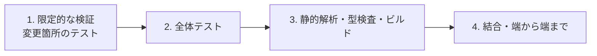

# 完了判定と検証の証跡

**完了は宣言ではなく証跡で示す。** 実行したコマンドとその結果がなければ、完了していない
ものとして扱う。

## 証跡として必要なもの

| 記録 | 目的 |
| --- | --- |
| 実行したコマンド | 第三者が再現できる |
| 終了コード | 成功・失敗の機械的な判定 |
| 実行時刻 | どの版に対する結果か |
| 対象範囲 | 全体か、絞り込みか（絞り込みなら条件） |

```text
$ pytest tests/orders -q          # 2026-08-13 10:21
42 passed in 3.51s                # exit=0

$ ruff check .                    # 2026-08-13 10:22
All checks passed!                # exit=0
```

出力をそのまま貼る。要約だけを書かない。長い出力は失敗部分と末尾の集計行を残す。

## 禁止

- **実行していないテストを「通った」と書かない。** 実行していないなら、実行していないと書く
- 失敗を「既存の失敗」として黙って除外しない。除外するなら、失敗の内容と既存であることの
  根拠（変更前でも同じ失敗が出ること）を示す
- 「おそらく通る」「問題ないはず」で完了扱いにしない
- 一部だけ実行して全体が通ったように書かない

## 検証の段階

上から順に実行する。前の段階が失敗している状態で次へ進まない。



| 段階 | 内容 | いつ行うか |
| --- | --- | --- |
| 1. 限定的な検証 | 変更した振る舞いのテストだけを絞り込んで実行 | 実装サイクル中（`tdd-cycle`） |
| 2. 全体テスト | 変更範囲外を含む全テスト | 完了宣言の前 |
| 3. 静的解析・型検査・ビルド | リンタ、型検査、ビルド | 完了宣言の前 |
| 4. 結合・端から端まで | 外部依存を含む経路 | 継続的インテグレーション、または高リスク変更のとき |

段階 1 だけで完了報告をしない。**変更箇所のテストが通っても、他を壊していないことは
示せない。**

4 つの段階はいずれも**取り込み前**の検証である。配布された成果物を利用者の環境で確かめる
のは `release-verification`（リリース後テスト）の担当で、この Skill は扱わない。段階 4 の
結合・端から端までも、対象は取り込み前の差分である。

## モード別の完了の定義

必要な段階は変更の性質によって変わる。判定（モード）の基準は `development-workflow` が
持ち、この Skill は判定結果を受け取って段階を決める。

| モード | 必須の段階 | 追加で要るもの |
| --- | --- | --- |
| `light` | 3 | 変更箇所が読み込まれる経路を 1 度実行する |
| `standard` | 1 → 2 → 3 | 受け入れ条件ごとの合否 |
| `architecture` | 1 → 2 → 3 → 4 | 契約・結合の結果、移行手順の実行確認 |
| `legacy-refactor` | 1 → 2 → 3 | 現状固定テストの結果、公開インタフェースが不変であること |

`light` は振る舞いを変えない変更なので、段階 1 と 2 を必須にしない。代わりに変更箇所が
読み込まれる経路を 1 度実行し、壊れていないことを示す。振る舞いを変えるなら `light`
ではない。

各モードの詳しい完了の定義は
[references/definition-of-done.md](references/definition-of-done.md) に置く。

## 受け入れ条件との対応

完了判定は、受け入れ条件（`requirements-design`）1 つずつに対して行う。

```markdown
- [x] 未ログインで `/orders` を開くと `/login` へ 302 で遷移する
      → tests/test_auth.py::test_redirects_anonymous（pytest -k redirects_anonymous / exit=0）
- [x] 期限切れトークンで 401 と `token_expired` が返る
      → tests/test_auth.py::test_expired_token（同上）
- [ ] 一覧は更新日時の降順で並ぶ
      → **未検証**。並び順のテストが未実装
```

条件ごとに検証手段を書く。手段を書けない条件は満たしたと言えない。

## カバレッジの扱い

**閾値をこの Skill に持たない。** 対象プロジェクトが持つカバレッジツールの設定を唯一の
基準とする。

| 対象 | 参照する設定 |
| --- | --- |
| Python | `pyproject.toml` の `[tool.coverage.report]` の `fail_under`、または `.coveragerc` |
| JavaScript / TypeScript | `jest.config.*` の `coverageThreshold`、または `vitest.config.*` の `test.coverage.thresholds` |
| その他 | 各言語のカバレッジツールの設定ファイル |

手順:

1. 上記の設定ファイルを探す
2. **閾値の記載があれば**、その値でのみ合否を判断する
3. **記載がなければ閾値による判定を行わない。** 測定値を証跡に記録するだけにとどめる

閾値を新しく決める必要がある場合は、Skill ではなくプロジェクト側の設定ファイルへ追加する。
Skill 側に既定値を持たせると、プロジェクトの方針と食い違ったまま判定が走る。

## 失敗したときの扱い

| 状況 | 対応 |
| --- | --- |
| 変更が原因の失敗 | 直す。直せないなら完了報告しない |
| 変更前から失敗していた | 変更前でも失敗することを示し、既存の失敗として明記する |
| 環境の問題で実行できない | 実行できないことを書く。「通った」に丸めない |
| 実行に時間がかかり全体を回せない | どこまで実行したかを明示し、残りを未検証として書く |

## 完了報告の形式

```markdown
## 検証結果

| 段階 | コマンド | 対象範囲 | 実行時刻 | 結果 |
| --- | --- | --- | --- | --- |
| 限定的な検証 | `pytest -k orders` | 注文まわりのみ | 2026-08-13 10:21 | 12 passed / exit=0 |
| 全体テスト | `pytest` | 全体 | 2026-08-13 10:24 | 318 passed, 2 skipped / exit=0 |
| 静的解析 | `ruff check .` | 全体 | 2026-08-13 10:25 | exit=0 |
| 型検査 | `mypy src` | `src` 以下 | 2026-08-13 10:25 | exit=0 |
| カバレッジ | `pytest --cov=src` | 全体 | 2026-08-13 10:24 | 87.4% / 閾値 85% を満たす / exit=0 |

受け入れ条件: 3/3 満たす（対応は上記の条件別リストを参照）
未検証の項目: なし
既存の失敗: なし
範囲外と判断したもの: なし
```

列は「証跡として必要なもの」の 4 項目に対応する。実行時刻と対象範囲を空欄にしない。

カバレッジの行は「カバレッジの扱い」に従う。閾値の記載があればその合否を、記載がなければ
測定値だけを結果欄に書く。カバレッジツールがない場合は行を省き、無い旨を表の下に書く。

表の下の「未検証の項目」「既存の失敗」「範囲外と判断したもの」の 3 項目は、
該当がなければ「なし」と書く。該当するものは項目ごとに列挙し、
未検証の項目と範囲外と判断したものには理由を、既存の失敗には変更前でも失敗する根拠を
添える。**空欄にして触れないことを禁じる。**

このうち 2 項目は報告文で終わらせず、引き継ぎ先を持つ。

| 項目 | 引き継ぎ先 | 何をするか |
| --- | --- | --- |
| 未検証の項目 | `release-verification` | 配布後に実施するか、実施しない理由を残す |
| 範囲外と判断したもの | `out-of-scope` | 見つけた時点で issue にする。報告を書く時点で残っていれば、ここで起票する |

範囲外と判断したものに issue の番号が付いていない項目は、まだ拾われる場所に無い。
`/ndf:out-of-scope` を呼んで起票し、番号を報告へ書く。

## 参照

- [references/definition-of-done.md](references/definition-of-done.md) — モード別の完了の定義
- `/ndf:release-verification` — 配布された成果物を利用者の環境で確かめる工程
- `/ndf:out-of-scope` — 範囲外と判断したものの起票

この工程に入ったら `/ndf:progress-tracking <issue番号> "完了判定"` を呼ぶ（記録の手順はその Skill が持つ）。

