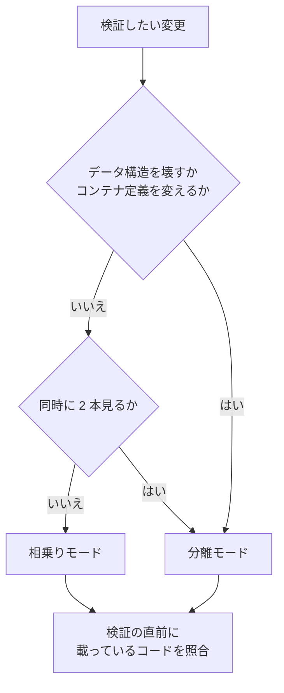

# 作業ツリーでのローカル動作検証

画面を触って動作を確かめるサービス一式（ローカル環境）を持つリポジトリで、作業ツリーの
変更を検証する手順である。

作業ツリーは**追跡されているファイルしか持たない**。依存物も環境ファイルも無いため、
作っただけでは動かない。またコンテナのプロジェクト名は起動ディレクトリ名から決まるため、
2 本目を同じ定義で起動すると、明示されたコンテナ名とホストポートで衝突する。

この文書が前提にするのは git・コンテナ実行系と Compose 相当の定義・POSIX シェルまでで、
ホストの種類・言語・フレームワークには依存しない。リポジトリごとの差は
[`declaration.md`](declaration.md) の宣言ファイルが持つ。

## 2 つのモード



| モード | いつ使うか | 環境の数 | リポジトリ側の変更 |
| --- | --- | --- | --- |
| 相乗り | 既定。コマンドで完結する検証、1 本だけの画面確認 | 主ディレクトリの 1 セットを共有 | 不要 |
| 分離 | データの構造を壊す変更、2 本の同時比較、コンテナ定義そのものの変更 | 作業ツリーごとに 1 セット | 並行起動用の定義の追加 |

判定は変更ファイルの一覧を宣言の条件へ当てて提示する。

```bash
bash "$NDF_SCRIPTS/worktree-localenv.sh" mode   # 0 相乗り / 1 分離
```

既存の定義の書き換えやコードの中に直接書かれた操作は条件で拾えない。**最終判断は
人が行う。**

## 型を見分ける

環境の作り方によって切り替えの手順が変わる。運用を始める前に 1 度だけ判定し、結果を
宣言の `localenv.layout` へ書く。

```bash
MAIN=$(dirname "$(cd "$(git rev-parse --git-common-dir)" && pwd -P)")
PROJ=$(basename "$MAIN")
APP=$(docker ps -q \
  --filter "label=com.docker.compose.project=$PROJ" \
  --filter "label=com.docker.compose.service=$APP_SERVICE")
docker inspect "$APP" --format '{{range .Mounts}}{{.Source}} -> {{.Destination}}{{println}}{{end}}'
docker exec "$APP" sh -lc "readlink '$SRC_TARGET' || echo 'symlink ではない'"
```

| 型 | 見分け方 | 相乗りモードでの切り替え |
| --- | --- | --- |
| `indirect` | コンテナ内のコード位置が symlink で、その先がホストと同じ絶対パスを指す | リンクの張り替えで切り替わる。再作成は不要 |
| `direct` | コンテナ内のコード位置がマウントの到達点そのもの | 切り替えにはサービスの再作成が要る。定義側でマウント元を変数にする |
| `host` | コンテナを使わず、ホストのプロセスがコードを直接読む | 起動時の作業ディレクトリで決まる。切り替えは再起動 |

**ホストとコンテナでパスが一致しない環境がある。** コンテナを操作する場所とコンテナ
実行系の動く場所が異なると、相対パスで書かれたマウント元は存在しないパスを指す。この
場合は定義を叩く操作をコンテナ実行系と同じ場所で行う。

## 作業ツリーを用意する

作った直後に、追跡されない設定と依存物を持ち込む。

```bash
bash "$NDF_SCRIPTS/worktree-localenv.sh" setup "$MAIN/.worktrees/feature/x"
```

複製対象は宣言の `copy_from_main` と `copy_as_real` が持つ。

- **依存物は複製する。主ディレクトリへの symlink は使わない。** 読み込み定義が親
  ディレクトリを実体解決する構成があり、リンクにすると作業ツリーで起動した処理が
  主ディレクトリのコードを読む。失敗として現れないまま別のコードを検証することになる
- 複製はハードリンクで行う（実測 0.55 秒 / 54,180 ファイル / 実容量の増加なし）。
  ハードリンクは同じ実体を共有するため、**書き換えられるパスだけは実体を複製する**
  （`copy_as_real`）
- ハードリンクが使えない配置ではファイル複製へ退避する
- 既に同じパスがあり、内容が主ディレクトリと食い違う場合は**上書きせず中断する**

## 相乗りモード

### コマンドで完結する検証

```bash
WT="$MAIN/.worktrees/feature/x"
docker exec -w "$WT" "$APP" <検証コマンド>
```

**作業ディレクトリの指定を落とすと主ディレクトリのコードが検証される。** データベースは
共有のままなので、同じ接続先を使うテストは同時に 1 本だけ走らせる。分離して走らせる
手順は、テスト実行の分離を扱う別の文書が担う。

### 画面で確認するとき

コードの位置を作業ツリーへ向ける。**同時に 1 本だけで、その間は主ディレクトリの
コードが画面に出ない。**

```bash
bash "$NDF_SCRIPTS/worktree-localenv.sh" aim "$WT"
```

このコマンドは宣言に従って、資産のビルド → コードの位置の切り替え → 再読み込みの
合図を順に行う。`indirect` 型では、コードの位置を指しているコンテナだけを対象に
リンクを張り替える。

実行中のプロセスがコードの位置を保持している場合は、再読み込みを促す合図を送る
（`reload_signal`）。コンテナの最初のプロセスと再読み込みを受け取るプロセスが別の
構成があるため、送り先はプロセス名で指定する。

`direct` 型ではマウント元を変数にした定義を用意し、その変数を作業ツリーへ向けて対象
サービスだけを作り直す。`host` 型では作業ツリーを作業ディレクトリにして起動し直す。

### 切り替えたことを確かめる

```bash
bash "$NDF_SCRIPTS/worktree-localenv.sh" verify; echo $?
```

| 終了コード | 意味 | 次の手 |
| --- | --- | --- |
| 0 | 一致。環境に対象のコードが載っている | 検証へ進む |
| 1 | 不一致。別のコードが載っている | `aim` で切り替える |
| 2 | 未起動、または適用外 | 環境を起動する。宣言に `branch_probe` があるかを見る |

**「未起動」と「不一致」を同じ値にしない。** 環境が動いていないことと、別のコードが
載っていることは、次の手が違う。

宣言した動作確認コマンドまで通すなら `healthcheck` を使う。照合を先に行い、一致した
ときだけコマンドを実行して、その終了コードをそのまま返す。

### 戻す

作業ツリーを削除する前に、同じ手順で主ディレクトリを指し直す。

## 分離モード

1. **定義を叩く場所を確かめる。** コンテナ実行系と同じ場所から操作する
2. **並行起動用の定義を追加する。** 明示されたコンテナ名を外し、ホストポートを変数へ
   逃がし、検証に要らないサービスを既定の起動集合から外す。変数を与えなければ現状と
   同じ値に解決されることを、定義の出力で確認してから取り込む
3. **番号を採番し、作業ツリーの環境ファイルへ書く。** 既存の行があれば置換し、無ければ
   追記する。**末尾への追記では上書きできない構成がある**（環境ファイルを先勝ちで読む）。
   採番の手順はテスト実行の分離と共有する
4. **データは基準からの複製で用意する。** 停止した状態のデータ領域を 1 度だけ複製して
   基準とし、以後はそこから流し込む。基準はプロジェクト名の外側に置く
5. **起動して検証する。** 定義に無いコンテナを削除する指定を付けない。稼働中の
   プロジェクトに定義外のコンテナが属していることがある
6. **撤収は環境の破棄を先、作業ツリーの削除を後にする。** 順序を逆にすると定義と環境
   ファイルを失い、プロジェクト名を手で復元することになる

コンテナ名を外す指定は実行系の版で異なる。空文字や null では外れない実行系がある。
ポートも上書きの指定を付けないと追記になる。取り込む前に定義の出力で確かめる。

## 手元で確かめたこと

| 項目 | 結果 |
| --- | --- |
| 依存物の複製 | ハードリンクで 0.55 秒 / 54,180 ファイル / 実容量の増加なし |
| 依存物のサイズ | 498 MB / 54,180 ファイル、フロントエンドの依存物が 59 MB / 6,099 ファイル |
| プロジェクト名による分離 | 名前付きボリューム・ネットワーク・ビルド成果物は分離される。明示されたコンテナ名・ホストポート・ホストのパスを直接指すマウント元は分離されない |

## 未確認のまま残ること

- 起動を伴う検証。マウント元の変更で対象サービスだけが作り直され、名前付きボリュームの
  データが保たれることは未確認
- 基準データの複製時間とサイズ。軽量な複製が使えないファイルシステムでは、複製が数十分に
  及ぶと分離モードの利点が薄れる
- 停止したデータ領域を複製して同じイメージで起動できること
- コードの位置の切り替えは、同じ環境を共有する他のセッションにも及ぶ。排他の仕組みは持たない
- `direct` 型と `host` 型は、確認に使った構成に存在しなかったため実測していない
