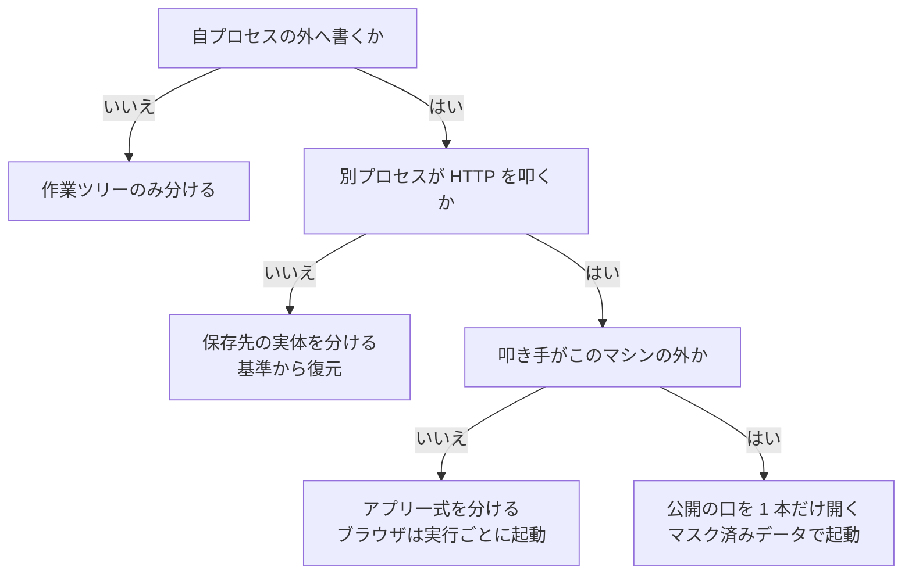

# 作業ツリーでのテスト実行

必要な分離の範囲は、テストが自プロセスの外へ何を書き、誰がそれを叩くかで決まる。
外部依存が無ければ作業ツリーのファイルだけ、データ保存先へ書くならその実体ごと、画面を
開くならアプリ一式、外から到達させるなら公開の口を分ける。

## この文書での「テスト環境」

**1 つの作業ツリーに対応して立ち上げる、テスト実行に必要なサービスの一式**を指す。
番号で識別され、他の作業ツリーのものとポート・データ保存先・ネットワークを共有しない。

[`local-environment.md`](local-environment.md) が扱う「ローカル環境」とは用途が異なる。
ローカル環境は人が画面を触って確かめるためのもので、主ディレクトリの 1 セットを共有する
ことが既定である。テスト環境は自動テストのために作業ツリーごとに立て、使い終えたら破棄する。

## 分離の範囲を決める



| 種類 | 外部依存 | 分離の範囲 | 同時実行 |
| --- | --- | --- | --- |
| 単体（外部依存なし） | なし | 作業ツリーのファイルと依存物 | 可 |
| データ保存先を要する | データベース・キャッシュ | 保存先の実体とアプリのプロセス | 可（メモリ上限まで） |
| ブラウザを使う | 上記 + HTTP 入口 + ブラウザ | アプリ一式・ブラウザ・証跡の出力先 | 可（同上） |
| 実機・外部サービス受信 | 上記 + 外部からの到達 | 公開ホスト名と折り返し先 | 折り返しを使う検証は 1 本のみ |

**テストの置き場所やスイート名で判定しない。** 確認した構成では、外部依存が無いはずの区分に
置かれた 839 件のうち 511 件が、データベースを使う仕組みを取り込んでいた。判定は依存を
持ち込む記述の有無で行い、判定コマンドは宣言の `testenv.test_kinds.<種類>.select` が持つ。

この判定でも取りこぼしは残る。初回は 1 度走らせ、落ちたものを外部依存ありへ移す。

## 採番

```bash
bash "$NDF_SCRIPTS/worktree-testenv.sh" env "$WT"
```

環境名・スロット・ポートを出力し、台帳へ記録する。**同じ作業ツリーには常に同じ値が返る。**

| 対象 | 規則 |
| --- | --- |
| 環境名 | `<リポジトリ>-wt-<ブランチ>-<ブランチの要約値 6 桁>`（小文字英数と `-`、40 文字で切る） |
| スロット | 台帳が 0〜63 の最小空き番号を割り当て、以後同じ番号を返す |
| ポート | `<帯の下限> + スロット*20 + 役割番号`。帯と役割番号は宣言が持つ |
| 保存先の名前 | 変えない。実体が別なので衝突しない |
| 公開ホスト名 | `wt<スロット>.<公開の基底名>` |

台帳は共通の git ディレクトリ配下（`.git/ndf/worktree-registry.json`）に置く。作業ツリーの
中に置くと、その作業ツリーを削除した時点で割り当ての記録が消える。

**割り当てを解放しても行は消さず、解放の時刻を書き込む。** 同じ番号を別の作業ツリーが
使った履歴と、外部公開の記録が残る。空きの判定は解放時刻が空の行だけを見るため、履歴は
判定に影響しない。定義は [`../schemas/registry.schema.json`](../schemas/registry.schema.json)。

## データ保存先を要するテスト

**分離は名前の付け替えではなく、保存先の実体を分けることで行う。** 初期化の処理が接続先を
記述の中に固定していると、名前を変える方式は成立しない。実測では、副系統を指す記述を含む
スクリプトが 109 本と 15 本存在した。実体を分ければ名前を変えずに済む。

1. **採番する** — `worktree-testenv.sh env "$WT"`

2. **依存物を持ち込む** — 手順は [`local-environment.md`](local-environment.md) と共通。
   ハードリンク複製を使い、書き換えられるディレクトリだけ実体を複製する。**symlink は
   使わない**（作業ツリーのテストが主ディレクトリのコードを読む）

3. **環境ファイルを置く** — 追跡外のため作業ツリーへは複製されず、読み込み処理は例外を
   出さずに既定値へ落ちる。置き忘れは接続先の取り違えとして現れる。スロット固有の上書き値は
   共通の git ディレクトリ配下へ所有者のみ読み書きできる権限で置く。**作業ツリーの中には
   資格情報を増やさない**

4. **基準を焼く（初回とデータ構造の変更時のみ）** — タグはデータ構造を定める資産の内容から
   決まる。同じ内容なら焼き直しは発生しない

   ```bash
   TAG=$(bash "$NDF_SCRIPTS/worktree-testenv.sh" tag "$WT")
   bash "$NDF_SCRIPTS/worktree-testenv.sh" bake --tag "$TAG"   # 2 なら同じタグの基準が既にある
   ```

5. **復元して起動する** — `worktree-testenv.sh up "$WT" --profile core`。ホストポートは
   公開しない。**定義に無いコンテナを削除する指定を付けない**（稼働中のプロジェクトに定義外の
   コンテナが属していることがある）

6. **差分を当てる** — ブランチがデータ構造の変更を追加していれば、更新を 1 回だけ流す

7. **実行する** — 初期化を抑止する指定は宣言の `skip_reset` が持ち、実行時に渡る。渡らないと
   最初のテストが全体を作り直す構成がある（実測では 1,790 本の定義を流し直した）

   ```bash
   bash "$NDF_SCRIPTS/worktree-testenv.sh" test "$WT" --kind stateful
   ```

`test` は**実行したコマンドの終了コードをそのまま返す**。テストの成否を包み隠さないためである。

保存先へ管理権限で接続するときは、資格情報をコマンドの引数に置かない。引数はプロセス一覧から
読める。対象コンテナ自身が持つ環境変数をその場で参照する。

## ブラウザを使うテスト

1. 上の手順 1〜6 を済ませ、画面の配信に要るサービスまで含めて起動する
   （`up "$WT" --profile browser`）

2. **入口はコンテナ間の名前で指し、ホストポートを使わない。** HTTP を配信するサービスを、
   テストを実行する場所から届くネットワークへ参加させる。ネットワーク名は宣言の
   `shared_network` が持ち、無ければ作る。テストの実行がホストで行われる構成では、代わりに
   採番したポートを 1 つ公開する

3. アプリが組み立てる絶対 URL を到達先へ揃える

4. **ブラウザは実行ごとに起動する構成を選ぶ。** 常駐しているブラウザへ接続する構成は、
   接続先が 1 つで既存のタブをそのまま操作するため、2 本の実行が同じタブを奪い合う

5. 接続先と出力先は環境変数で外から与える（`base_url_env` / `out_env`）。入口の役割名は
   `port_role` で指定する（既定は `http`）

   ```bash
   bash "$NDF_SCRIPTS/worktree-testenv.sh" test "$WT" --kind browser
   ```

**証跡は作業ツリー配下へ固定する。** 既定の出力先が秒単位の識別子しか持たない場合、同じ
ディレクトリで同時に開始した 2 本が同じ場所へ書き合う。環境名を出力先に含めて避ける。
共有の保管先へは送らない。

## 実機や外部サービスからの通信を受ける検証

**公開するのは、マスク済みデータで焼いた基準を載せたテスト環境だけとする。**

```bash
bash "$NDF_SCRIPTS/worktree-testenv.sh" expose "$WT"     # 0 完了 / 1 条件を満たさず拒否
bash "$NDF_SCRIPTS/worktree-testenv.sh" unexpose "$WT"
```

拒否する条件は次の 3 つで、1 つでも該当すれば公開しない。どれに当たったかは標準エラーへ出る。

1. 宣言の `testenv.expose.enabled` が偽（**既定**）
2. 載っている基準の識別子が `testenv.expose.public_tag` と一致しない
3. 折り返しを使う公開が既に別のテスト環境で開いている

あわせて次を満たさない限り公開しない。仕組みで判定できないため、手順として置く。

- デバッグ用の表示を止める。例外の画面が環境変数を、計測用の表示が発行済みの問い合わせを
  見せる経路が実在する
- **公開の口はホストポート 1 本に集約する。** 共有の入口が要求先の名前で振り分け、既定は
  全拒否とする
- 画面を開く経路には認証を前置する。外すのは、署名の検証を自前で行う経路に限る
- 折り返しの中継では要求先の名前を保ち、圧縮や本文の書き換えを挟まない。署名の検証対象が壊れる
- 公開するのは HTTP を配信するサービスだけとする。保存先・オブジェクトストレージ・
  メール受信・検索は公開しない
- 公開中に取った証跡には利用者の入力と資格情報が含まれる。共有の保管先へ送らず作業ツリー内に
  留める

同一ネットワーク内の実機からは、採番したポートを 1 つだけ公開して
`http://<ホストの LAN IP>:<ポート>` で開く。**安全な文脈を要する機能（カメラ取得・
常駐ワーカー・端末認証）は、暗号化されていない経路では確認できない。** その場合は固定の
ホスト名を持つ中継を使う。

切り分けは、コンテナから入口、ホストから公開ポート、同一ネットワークから公開ポート、実機の
順に行う。

## 後片付け

| 目的 | コマンド | 残るもの |
| --- | --- | --- |
| 作業を止める | `stop "$WT"` | データ。再開は保存先の再構築を伴わない |
| 使われていないものを止める | `reap --idle 45m` | 同上 |
| 公開を閉じる | `unexpose "$WT"` | 台帳の行と URL（`expose.closed_at` に終了の時刻） |
| 破棄する | `down "$WT" --volumes` | 台帳の行（`released_at` に解放の時刻） |

`reap` は、最後に使った時刻が `--idle` の期間より古い割り当てだけを対象にする。時刻は
`up` と `test` が台帳へ記録する。**実行中の作業ツリーはロックを握るため対象から外れる。**

**作業ツリーを消す前に `down "$WT" --volumes` を実行する。** データ領域（実測でテスト環境
1 つあたり約 400 MB）とスロットを返してから作業ツリーを削除する。順序を逆にすると台帳から
実体を引けなくなる。

依存物のハードリンク複製は作業ツリーの削除で消える。実体は主ディレクトリ側に残る。

## 手元で確かめたこと

| 項目 | 結果 |
| --- | --- |
| テストの区分と実際の依存 | 外部依存なしの区分 839 件のうち 511 件がデータベースを使う仕組みを取り込んでいた |
| 初期化の抑止 | 渡さないと最初のテストが全テーブルを削除し、1,790 本の定義を流し直した |
| テスト環境 1 つのメモリ | 中核サービス合計で約 753 MiB（保存先 475.6 / アプリ 250.2 / 入口 11.3 / キャッシュ 15.9） |

## 未確認のまま残ること

- テスト環境の起動時間。保存先の健全性確認の間隔が未指定で既定値が適用され、アプリの起動が
  それを待つ設定になっていた構成がある。停止と再開を繰り返す運用ではこの待ちを毎回払う
- 同時に立てられるテスト環境数。測定時のホストは確保できる量が 9,758 MB ある一方、退避領域が
  2,047 MB 中 1,731 MB（85%）使用済みだった。**確保できる量の側で見れば 3 本は収まるが、
  その大半は再利用可能な内部の控えである。** 各サービスへメモリ上限を置き、同時稼働数の
  上限を設ける
- 基準の初回作成コスト。導入初日は数分規模の待ちが発生する
- データ領域の複製手段。使えない場合は正常停止後のファイル複製へ切り替える
- マスク済みのデータセットは未整備。整うまで外部への公開を伴う検証は実行できない
- 実機からの到達性。無線側の端末間分離、ローカル名の解決、アドレスの固定はいずれも未確認
- **作業ツリーは、コンテナから見える領域に置く必要がある。** 既定の一時ディレクトリが
  コンテナの外にある構成では、そこに作った作業ツリーはアプリのコンテナから見えない
- レビュー用の一時作業ツリーはこの手順の対象外とする。読み取り用で寿命が短く、一式を立てる
  利点が無い
